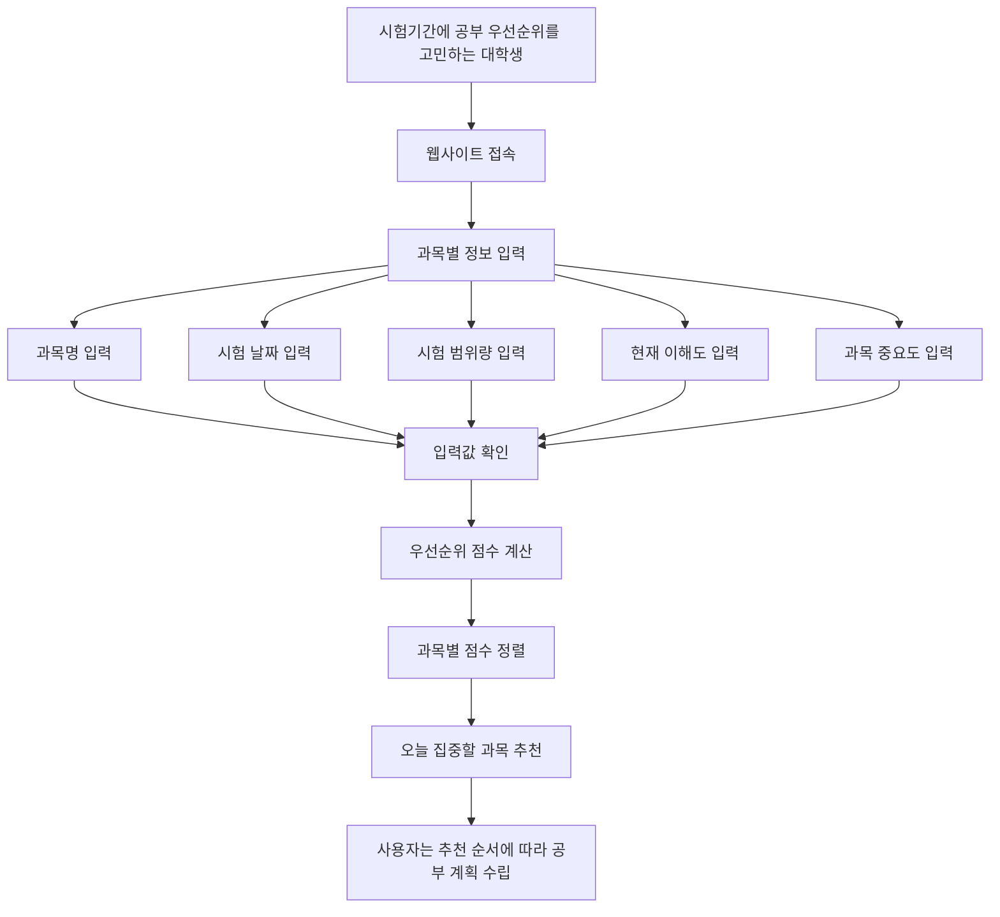

## 문제 정의 한 문장  

여러 과목을 동시에 준비해야 하는 대학생이 시험기간에 과목별 우선순위를 판단하기 어려워 제한된 공부 시간을 비효율적으로 쓰게 된다.

---

## 사용자 시나리오

시험기간이 다가온 대학생은 여러 과목을 동시에 준비해야 하지만, 어떤 과목부터 공부해야 할지 쉽게 결정하지 못한다.  
학생은 웹사이트에 접속해 과목명, 시험 날짜, 시험 범위량, 현재 이해도, 과목 중요도 등을 입력한다.  
서비스는 입력된 정보를 바탕으로 각 과목의 우선순위 점수를 계산한다.  
학생은 점수가 높은 과목부터 정렬된 결과를 확인하고, 오늘 집중해야 할 과목을 추천받는다.  
이를 통해 학생은 막연한 불안감 대신 구체적인 기준에 따라 공부 순서를 정할 수 있다.

---

## 사용자 흐름

## 핵심 기능 2개
  1. 과목별 정보 입력 기능
  2. 공부 우선순위 계산 및 추천 기능