## 이번 주 개발 계획 (Week 3)

실데이터를 기반으로 데이터 모델을 구축하고, 해당 DB를 서버와 연결하여 화면에 나타냅니다. 학과에 맞게 졸업요건을 조정하고, 남은 학기 시간표를 시뮬레이션 해볼 수 있는 서비스를 구현합니다.

👉 [작업 목록 확인(GitHub Issues)](https://github.com/zlnzzaro/hub/issues)

### 주요 작업
1. Express 서버 기본 세팅
2. Supabase user_records 테이블 설계 및 생성
3. React 이수내역 입력 폼 (mock)
4. POST /api/records 구현
5. GET /api/records/:userId 구현
6. React-Express 연결 (수직 슬라이스 완성)

# ConGraduation

ConGraduation은 복잡한 졸업요건을 가진 대학생이 자신의 졸업 가능 여부를 쉽게 확인하고, 남은 학기 동안의 수강 계획을 세울 수 있도록 돕는 AI 기반 졸업 플래닝 서비스입니다.

## 문제 정의

저희 과(컴퓨터학부 글로벌SW융합전공)를 졸업하기 위해서는 전공, 교양, 다중전공, 창업교과목, 현장실습, 해외대학 인정학점, 종합설계 등 다양한 졸업요건을 충족해야 합니다. 이 과정이 복잡해 학생들은 현재 이수 현황, 부족 학점, 필수 과목 이수 여부를 한눈에 파악하기 어렵습니다.

## 주요 기능

- 졸업요건 충족 현황 대시보드
- 과목 수강 바구니
- 부족 학점 자동 계산
- AI 기반 수강 계획 추천
- 미래 학기 수강 계획 시뮬레이션

## 대상 사용자

- 졸업요건을 점검해야 하는 3, 4학년 학생
- 복수전공, 부전공, 다중전공을 이수 중인 학생
- 수강신청 전 졸업 가능 여부를 미리 확인하고 싶은 학생

## MVP 범위

초기 버전에서는 컴퓨터학부 단일 전공 기준으로 사용자의 이수 과목을 입력받아 졸업요건 충족 여부를 계산합니다. 또한 수강 후보 과목을 바구니에 담고, 미래 학기 계획을 시뮬레이션하며, 부족 요건을 기반으로 간단한 AI 추천을 제공합니다.

## 기대 효과

- 졸업 가능 여부를 빠르게 확인
- 부족한 학점과 필수 과목을 명확히 파악
- 수강신청 전 안정적인 학업 계획 수립
- 졸업 직전 요건 미충족 위험 감소

# 📄 문서 모음
- 📘 [프로젝트 기획서 (Wiki)](https://github.com/zlnzzaro/hub/wiki/AI-%EA%B8%B0%EB%B0%98-%EC%A1%B8%EC%97%85-%ED%94%8C%EB%9E%98%EB%84%88-%EA%B8%B0%ED%9A%8D%EC%84%9C)
- 🎨 [Figma로 디자인한 기획서](https://www.figma.com/make/1NPfTNkS2et79zArWZtfEp/Modern-Presentation-Landing-Page?code-node-id=0-9&p=f&t=b8ilbpssH4uMvK8p-0&fullscreen=1)

## 아키텍처

client(React) / server(Express) / Supabase 사이의 전체 데이터 흐름이다. 점선 화살표(`-.->`)와 옅은 스타일로 표시된 노드는 **코드는 존재하지만 실제로는 연결되어 있지 않은 부분**이다.

```mermaid
flowchart TD
    %% ================= CLIENT (React) =================
    subgraph CLIENT["Client (React) — client/src"]
        direction TB
        AppJsx["App.jsx<br/>(gradInfo, progressSubmitted,<br/>selectedIds, basketCourses, activeTab)"]
        Submitted["submitted<br/>(gradInfo에서 파생 — 별도 저장 없음, 매 렌더마다 계산)"]
        NavBar["NavBar.jsx"]
        MajorModal["MajorSelectModal.jsx"]
        ReqModal["RequirementModal.jsx<br/>(이수학점 입력 모달)"]
        Basket["CourseBasketSection.jsx"]
        Dashboard["DashboardSection.jsx"]
        Sim["SimulationPage.jsx<br/>(currentSemester, result,<br/>scenarios, activeIndex)"]
        ScenarioCard["ScenarioCard.jsx"]
        Placeholder["PlaceholderPage.jsx<br/>(홈 / 챗봇 탭)"]
        RecordForm["RecordForm.jsx"]

        MajorData["data/majorData.js<br/>(단과대/학부/전공/트랙 목데이터)"]
        GradReqUtil["utils/gradRequirements.js<br/>evaluateTrackRequirements()"]
        SemesterUtil["utils/semesterPlan.js<br/>calculateSemesterPlan()"]
    end

    %% ================= LOCAL STORAGE =================
    subgraph LOCALSTORAGE["localStorage — 서버를 거치지 않는 저장"]
        direction TB
        LS_gradInfo[("gradInfo")]
        LS_progress[("progressSubmitted")]
        LS_scenarios[("scenarios")]
        LS_activeIndex[("scenarioActiveIndex")]
    end

    %% ================= SERVER (Express) =================
    subgraph SERVER["Server (Express) — server/src"]
        direction TB
        RootRoute["GET /"]
        PostRecords["POST /api/records"]
        GetRecords["GET /api/records/:userId"]
        PostBasket["POST /api/basket"]
        GetBasket["GET /api/basket"]
        ServerGradReq["utils/gradRequirements.js<br/>evaluateTrackRequirements()<br/>(어떤 라우트/컨트롤러도 호출하지 않음,<br/>테스트에서만 사용됨)"]
    end

    %% ================= SUPABASE =================
    subgraph SUPABASE["Supabase"]
        direction TB
        T_records[("user_records")]
        T_basket[("basket_items")]
    end

    %% ---------- 실제 연결된 흐름 ----------
    AppJsx --> Submitted
    MajorModal --> MajorData
    MajorModal -->|"onConfirm(info)"| AppJsx
    AppJsx -->|"저장"| LS_gradInfo
    LS_gradInfo -.->|"새로고침 시 초기값 복원"| AppJsx

    AppJsx -->|"입력값 props"| ReqModal
    ReqModal -->|"onSubmit"| AppJsx
    AppJsx -->|"저장"| LS_progress
    LS_progress -.->|"새로고침 시 초기값 복원"| AppJsx

    AppJsx --> NavBar
    NavBar -->|"activeTab 변경"| AppJsx
    AppJsx --> Placeholder

    AppJsx -->|"courses, selectedIds"| Basket
    Basket -->|"onToggle(courseId)"| AppJsx
    AppJsx -->|"toggleCourse(): fetch POST"| PostBasket
    PostBasket --> T_basket

    AppJsx -->|"completedCourses"| GradReqUtil
    GradReqUtil --> MajorData
    GradReqUtil -->|"requirementResults → badges"| AppJsx
    AppJsx -->|"requirementRows, badges, gapList"| Dashboard

    AppJsx -->|"combinedTotal/Major/General,<br/>goalTotal/Major/General,<br/>basketCourses"| Sim
    Sim -->|"계산하기"| SemesterUtil
    SemesterUtil -->|"perSemester.needed"| Sim
    Sim -->|"과목 담기 모달 안에서 재사용"| Basket
    Sim -->|"subtotal, needed"| ScenarioCard
    Sim -->|"저장"| LS_scenarios
    LS_scenarios -.->|"새로고침 시 초기값 복원"| Sim
    Sim -->|"저장"| LS_activeIndex
    LS_activeIndex -.->|"새로고침 시 초기값 복원"| Sim

    %% ---------- 아직 연결 안 됨 / 죽은 코드 ----------
    AppJsx -.->|"RecordForm은 App.jsx에서 렌더링되지 않음 (미사용 컴포넌트)"| RecordForm
    RecordForm --> PostRecords
    RecordForm --> GetRecords
    PostRecords --> T_records
    GetRecords --> T_records

    AppJsx -.->|"구현되어 있지만 클라이언트가 호출하지 않음<br/>(담은 과목을 서버에서 다시 불러오는 흐름 없음)"| GetBasket
    GetBasket --> T_basket

    %% ---------- 스타일 ----------
    classDef notConnected stroke-dasharray: 4 3,opacity:0.55;
    class RecordForm,GetBasket,ServerGradReq,PostRecords,GetRecords,T_records notConnected;

    classDef storage fill:#FFF7E6,stroke:#FF9800,color:#7A4A00;
    class LS_gradInfo,LS_progress,LS_scenarios,LS_activeIndex,Submitted storage;

    classDef db fill:#E8F3FF,stroke:#3182F6,color:#1B3A66;
    class T_records,T_basket db;
```

**아직 실제로 연결되지 않은 부분 (옅게 표시된 노드 + 점선 화살표)**
- `RecordForm.jsx` — `POST/GET /api/records`를 호출하는 코드는 완성돼 있지만, `App.jsx`가 이 컴포넌트를 import/렌더링하지 않아 화면에 노출되지 않는다. 따라서 `/api/records`와 `user_records` 테이블 전체가 지금 UI에서는 도달 불가능한 상태다.
- `GET /api/basket` — 컨트롤러 구현은 있지만 클라이언트 어디서도 호출하지 않는다. `POST /api/basket`으로 담은 과목이 Supabase에는 저장되지만, 새로고침해도 다시 불러오지 않아 `selectedIds`는 매번 초기화된다.
- `server/src/utils/gradRequirements.js` — `client/src/utils/gradRequirements.js`와 동일한 로직의 서버 사본이지만, 어떤 라우트/컨트롤러에서도 import되지 않는다(자체 Jest 테스트에서만 실행됨). 실제 요건 판정은 전부 클라이언트에서 `completedCourses`를 계산해 클라이언트 로직으로만 처리된다 — 서버 왕복이 없다.
