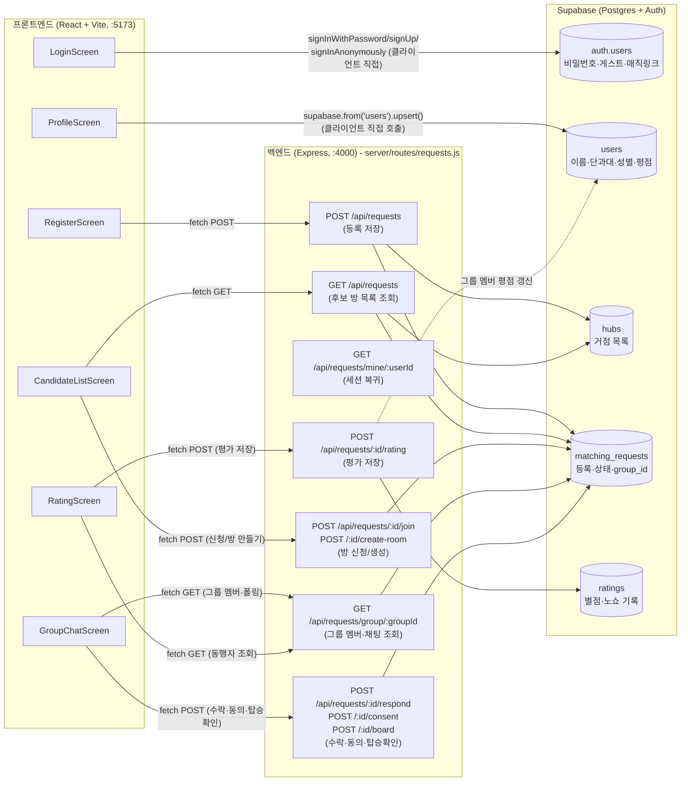

# hub
## 문서
- [기획서](https://github.com/gyu-young-04/hub/wiki/plan.md)
- [작업 체크리스트 (백로그)](https://github.com/gyu-young-04/hub/wiki/checklist.md)
- [주간 계획](docs/weekly-plan.md)
- [디자인 시스템](design_handoff_ridesplit/README.md)
- [백로그(체크리스트)](https://github.com/gyu-young-04/hub/wiki/checklist.md)
- [프로젝트 보드 url](https://github.com/users/gyu-young-04/projects/3)

## 아키텍처 (데이터 흐름)
화면(React) · 서버(Express) · DB(Supabase)가 어떻게 연결되는지 코드 기준으로 그린 다이어그램.

### 그리면서 보인 어색한 구조
1. **경로 이원화** — `Login`/`Profile`은 Express 없이 브라우저에서 Supabase에 직접 연결하는데, `Register`/`Candidates`/`Chat`/`Rating`은 Express를 거침. 이 경계 기준이 문서화돼 있지 않음.
2. ~~**`RatingScreen` 미연결** — 별점/노쇼 체크가 어떤 테이블에도 저장되지 않음.~~ (해결됨: `ratings` 테이블에 저장되고, 같은 그룹 멤버들의 프로필 평점에 가중 평균으로 반영되도록 구현함. 노쇼 신고 시 1점 강제 반영 + 노쇼 횟수 누적. 탑승 후 1시간 내 미평가 시 자동 5점 처리.)
3. **실시간성 부재** — DB로 가는 화살표가 전부 단방향 요청·응답이고, 새 신청 확인도 폴링(새로고침 버튼)에 의존.

### 알려진 운영 제약
- **인증 메일 발신 도메인 미인증** — Supabase Auth의 Custom SMTP(Resend)를 연결했지만, 발신 주소가 아직 Resend의 공용 테스트 주소(`onboarding@resend.dev`)라서 Resend 정책상 계정 소유자 본인 이메일 외의 수신자에게는 발송이 차단됨. 회원가입 확인 메일과 로그인 매직링크 메일 모두 동일하게 적용되며(가짜 도메인뿐 아니라 실제 대학 이메일 주소도 막힘 — 2026-07-29 재확인), 코드 로직 문제는 아님(본인 계정 이메일로는 정상 발송됨). 실제로 여러 학생이 각자의 `.ac.kr` 메일로 로그인하려면, 본인 소유 도메인을 하나 구매해 Resend에 인증(DNS TXT/DKIM 등록)하고 그 도메인 주소를 발신자로 지정해야 함. 현재는 본인 계정 이메일로만 로그인 데모가 가능한 상태.
- **평가 점수 차등 차감 미구현** — `docs/checklist.md` 4주차 항목 중 노쇼 페널티(1점 강제 반영)만 구현됨. "지각 소폭 차감"은 `classifyBoarding`이 on_time/late를 판정해 화면 문구에만 반영할 뿐 실제 평점엔 영향을 주지 않고, "임박 취소 대폭 차감"도 `/leave`(방 나가기)에 페널티 로직이 전혀 없음. 4주차 마지막 날 데모 준비를 우선하기로 하고 이번엔 보류.
- **마이페이지 이용 이력 화면 없음** — `ratings` 테이블에 평가 기록은 쌓이지만, 이를 조회하는 화면(`docs/plan.md`의 IA에 있는 "마이페이지 · 이용 이력")은 아직 없음. 위와 같은 이유로 보류.
