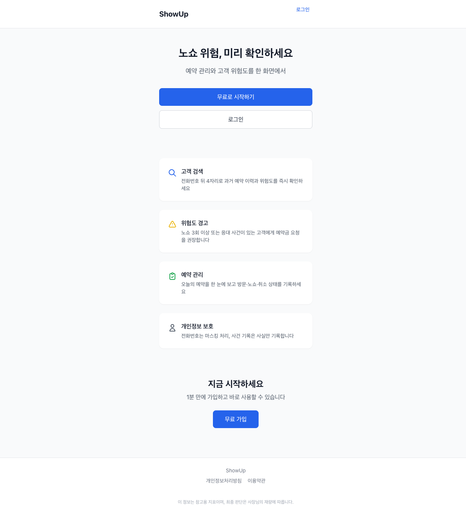
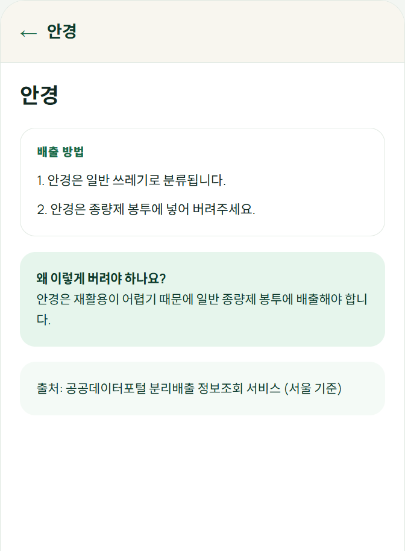
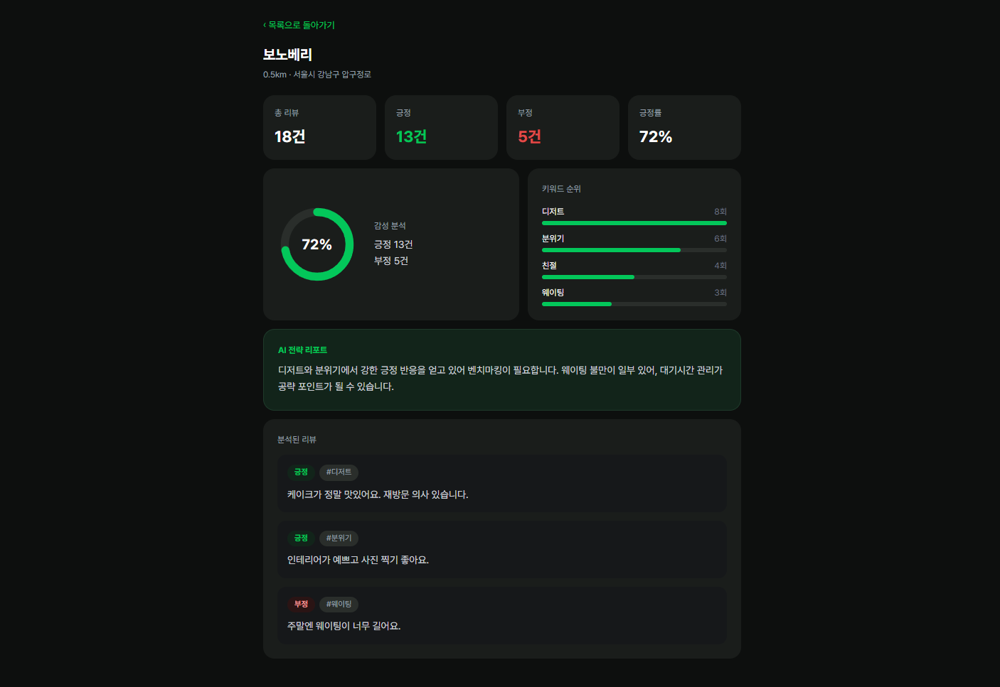
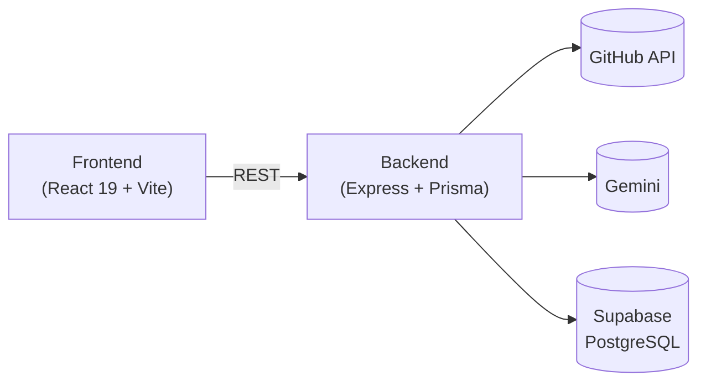

# FirstPR

첫 오픈소스 기여, 어디서부터 시작해야 할지 막막한 사람들을 위한 서비스입니다.
GitHub 아이디만 입력하면 그동안의 활동을 분석해서 실력 수준과 주로 쓰는 언어를 파악하고, 원하는 조건(언어·난이도·관심 분야)에 맞는 레포지토리와 이슈를 추천해줍니다.

**바로 써보기**: https://kimsunho2000.github.io/hub/#/
백엔드는 [Render 무료 플랜](https://firstpr-backend.onrender.com)에 떠 있어서 한동안 요청이 없으면 잠들어 있을 수 있습니다. 첫 요청이 좀 느리다면 그 때문이니 몇 초 기다렸다가 다시 시도해주세요.

## 이런 흐름으로 동작합니다

1. GitHub 아이디 입력
2. 언어 비율·커밋/PR 이력을 분석해 실력 수준(초급/중급/고급) 판단
3. 분석 결과에 맞춰 언어·난이도·관심 분야 조건을 미리 골라주고, 원하면 직접 조정
4. 조건에 맞는 레포/이슈를 검색하고 점수를 매겨 추천 목록 생성
5. 목록에서 이슈를 고르면 상세 설명과 기여 가이드까지 보여줌

즐겨찾기, 검색 이력 조회, 같은 조건으로 다시 찾아보는 재검색 기능도 있습니다.

기획 배경이나 페르소나 등 더 자세한 내용은 [Notion 기획 문서](https://app.notion.com/p/396d15ed99be80299fddee75a63e8867?source=copy_link)와 [`docs/plan.md`](docs/plan.md)에 정리해뒀습니다.

## 화면

| 랜딩 | 추천 결과 | 상세 |
| --- | --- | --- |
|  |  |  |

ID 입력·분석 결과·조건 선택 화면 등 전체 흐름은 [`showcase/screenshots/`](showcase/screenshots/)에서 볼 수 있습니다.

## 기술 스택

| 구분 | 스택 |
| --- | --- |
| Frontend | React 19, Vite, React Router, TanStack Query, axios |
| Backend | Node.js, Express, Prisma |
| DB | Supabase (PostgreSQL) |
| 외부 API | GitHub GraphQL/REST (`@octokit/graphql`, `@octokit/rest`), Google Gemini (이슈 분석·재순위) |
| 테스트 | Vitest + Supertest(백엔드), Playwright(E2E) |
| 배포 | GitHub Pages(프론트), Render(백엔드) |

## 아키텍처



레포 검색은 GitHub API로, 검색 후보 레포·이슈는 규칙 기반 점수(언어 일치·난이도·활동성 등)로 1차 정렬하고 Gemini로 한 번 더 재순위합니다. 이슈 상세 화면에 들어갈 때는 그 이슈 하나만 LLM으로 분석해 캐시에 저장해두고 재사용합니다. API 경로와 DB 테이블 구성은 [`docs/architecture.md`](docs/architecture.md)에 더 자세히 있습니다.

## 로컬에서 실행하기

### 필요한 것
- Node.js LTS
- Supabase 프로젝트 (PostgreSQL 연결 문자열)
- GitHub Personal Access Token (`public_repo`, `read:user`, `read:org` 스코프)
- Google Gemini API 키 — 없어도 동작은 하고, 이슈 LLM 분석만 조용히 비활성화됩니다

### 프론트엔드
```bash
npm install
npm run dev       # http://localhost:5173
```

### 백엔드
`backend/.env.example`을 복사해 `backend/.env`를 만들고 `DATABASE_URL`, `GITHUB_TOKEN`, `GEMINI_API_KEY`를 채운 뒤 실행합니다.

```bash
npm run dev:backend   # http://localhost:3000, /health·/api-docs 제공
```

### 그 외 명령어
```bash
npm run build          # 프론트 프로덕션 빌드
npm run test:backend   # 백엔드 유닛·통합 테스트 (Vitest)
npm run test:e2e       # 전체 화면 흐름 E2E (Playwright, 실제 GitHub/Gemini 호출)
npm run lint           # 프론트/백엔드 전체 린트 (oxlint)
```

## 태스크 관리

Week 단위로 프론트/백엔드 작업을 나눠서 진행했습니다. 원본은 [`docs/checklist.md`](docs/checklist.md)이고, Notion에도 같은 내용을 보드로 정리해뒀습니다.

- [개발 Task 관리 보드](https://app.notion.com/p/a6b24df210c142798f852c67eaafae73) (상위: [Naver AI Agent Challenge](https://app.notion.com/p/395d15ed99be8029a792d34ec343ee9c))
- [GitHub 이슈 트래커](https://github.com/kimsunho2000/hub/issues)

## 프로젝트 문서

| 문서 | 설명 |
| --- | --- |
| [docs/plan.md](docs/plan.md) | 기획서 요약 |
| [docs/checklist.md](docs/checklist.md) | 주차별 작업 체크리스트 |
| [docs/architecture.md](docs/architecture.md) | 아키텍처 설계 |
| [docs/decisions.md](docs/decisions.md) | 주요 기술·기획 의사결정 기록 |
| [docs/log.md](docs/log.md) | 날짜별 작업 로그 |
| [docs/design.md](docs/design.md) | 디자인 시스템 |
| [docs/conventions.md](docs/conventions.md) | 코드 컨벤션 |
| [docs/testing.md](docs/testing.md) | 테스트 작성 규칙 |
| [docs/security.md](docs/security.md) | 보안 규칙 |
