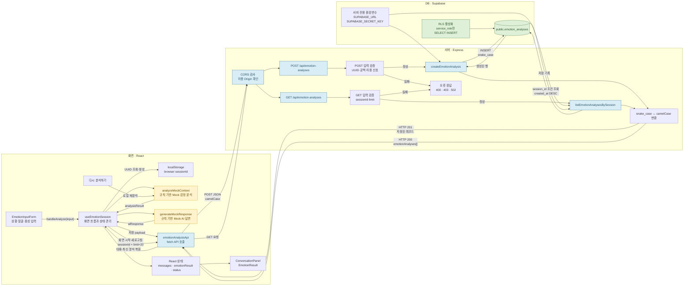
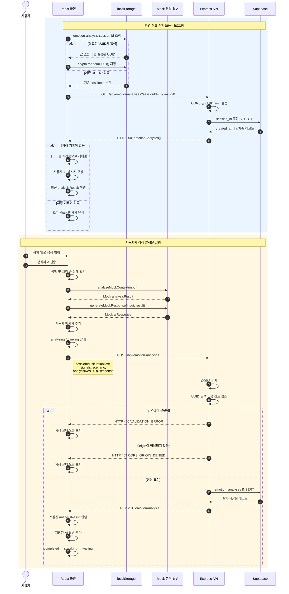

# 관계형 AI

관계형 AI는 사용자가 자신의 상황과 감정을 입력하면 AI가 공감형 반응이나 후속 질문을 제공하는 웹서비스입니다.

## 해결하려는 문제

사용자는 감정을 표현할 때 공감과 다음 단계를 원하는데, 기존 시스템은 단순한 자동 응답이나 챗봇형 인터페이스로 감정적 연결을 제공하지 못합니다.

## 핵심 사용자 시나리오

1. 사용자가 상황을 입력한다.
2. 사용자가 현재 감정을 선택한다.
3. React 앱이 Express API에 요청을 보낸다.
4. Express 서버가 입력값을 검증한다.
5. 규칙 기반 Mock AI가 공감형 응답과 후속 질문을 생성한다.
6. Supabase에 사용자 입력과 AI 응답을 저장한다.
7. 저장된 결과가 React 대화 화면에 표시된다.

## 핵심 수직 슬라이스

* 사용자 상황 입력
* 감정 선택
* React에서 Express API 호출
* Express에서 입력값 검증
* 규칙 기반 Mock AI 응답 생성
* Supabase에 사용자 입력과 AI 응답 저장
* 저장 결과 반환
* React 대화 화면 갱신

## 기술 스택

* Frontend: React
* Backend: Express
* Database: Supabase
* Supabase SDK: @supabase/supabase-js
* HTTP 요청: fetch
* React 상태 관리: useState
* 초기 AI 응답: 규칙 기반 Mock 응답

## 프로젝트 폴더 구조

```
App
├─ analysisStatus
├─ emotionResult
│
├─ ServiceHeader
├─ EmotionInputForm
│  ├─ situationText
│  ├─ faceSignal
│  ├─ voiceSignal
│  ├─ validationError
│  │
│  ├─ SituationInput
│  ├─ memo(FaceSignalSelector)
│  └─ memo(VoiceSignalSelector)
│
├─ AnalysisStatus
└─ EmotionResult
   ├─ EmotionScoreBar
   ├─ EvidenceList
   └─ AnalysisDisclaimer
```

## 문서 링크
* [Mock 데이터 사용 및 화면 표시 현황](https://github.com/studentnoname/hub/wiki/Mock-%EB%8D%B0%EC%9D%B4%ED%84%B0-%EC%82%AC%EC%9A%A9-%EB%B0%8F-%ED%99%94%EB%A9%B4-%ED%91%9C%EC%8B%9C-%ED%98%84%ED%99%A9)

## 현재 개발 상태
* [개발일지 - 1] (https://github.com/studentnoname/hub/wiki/%5B%EA%B0%9C%EB%B0%9C%EC%9D%BC%EC%A7%80-%E2%80%90-1-%5D-%E2%80%90-2026%EB%85%84-7%EC%9B%94-21%EC%9D%BC-(%ED%98%84%EC%9E%AC-%EC%83%81%ED%99%A9-%EC%9A%94%EC%95%BD))

## 전체 데이터의 흐름


## 분석 저장과 새로고침의 복원 순서

