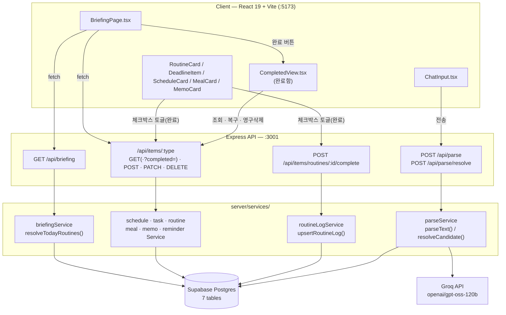
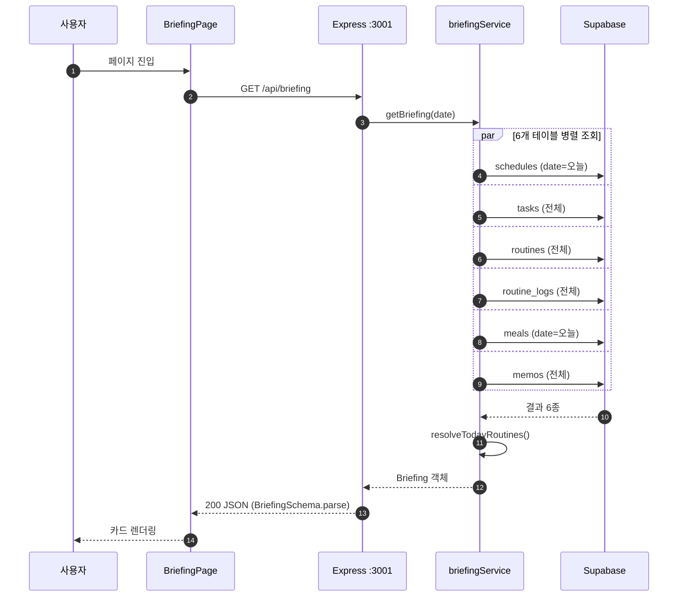
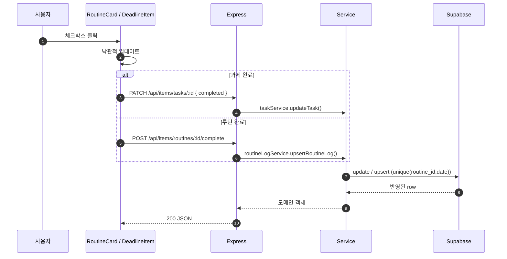
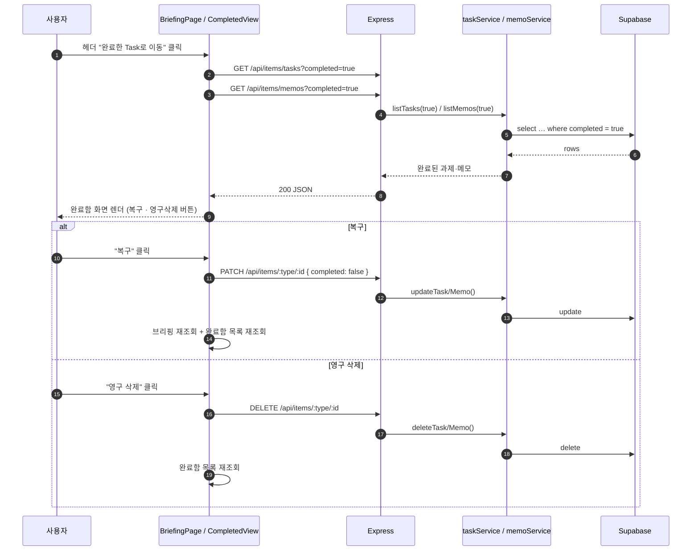
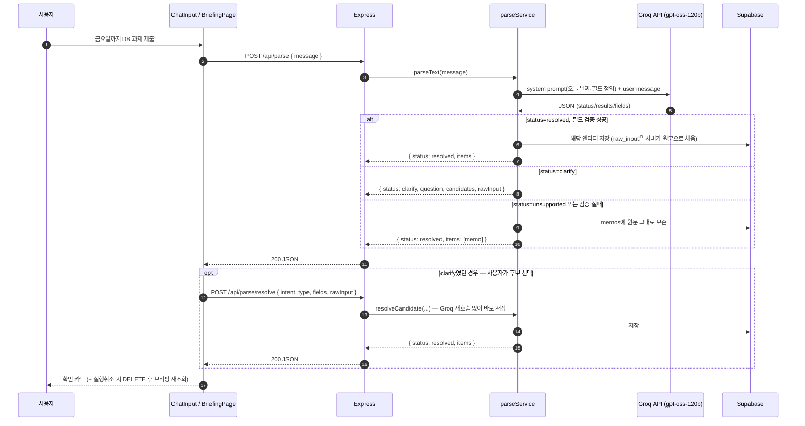

# Briefy

> **"한 문장으로 관리하는 하루"** — 자연어 한 줄로 적어내면 스케줄과 루틴이 정리되고, 브리핑까지 해주는 자연어 라이프 매니저

"금요일까지 데이터베이스 과제 제출"이라고 적으면 AI가 마감일 있는 과제로 분류해 저장합니다. 폼 입력도, 앱 전환도 없습니다. 그리고 아침에 앱을 열면 오늘의 일정·운동 루틴(오늘이 상체 day인지까지)·식단·마감 임박 과제가 **하루 브리핑 한 화면**에 모입니다.

## 핵심 기능

**A. 자연어 CRUD 파이프라인** — 단일 입력창에 자유로운 한국어 문장을 입력하면 Groq API가 의도(create/update/delete/query/complete)와 항목 유형(일정/과제/루틴/식단/메모)을 파싱해 처리합니다.

| 입력 예시 | 동작 |
| --- | --- |
| "금요일까지 데이터베이스 과제 제출" | 마감일 있는 과제로 저장 |
| "다음주 화요일 오후 3시 팀플 회의, 전날 알려줘" | 일정 + 리마인더 동시 생성 |
| "오늘 운동 다 함" | 오늘 루틴 완료 처리 |
| "치과 4시로 바꿔줘" | (준비 중) 아직 지원 안 함 — 원문을 메모로 안전하게 보존 |
| "이번 주 마감 뭐 있어?" | (준비 중) 아직 지원 안 함 — 원문을 메모로 안전하게 보존 |

모호한 입력("운동")은 임의 저장하지 않고 선택지를 되묻고, 파싱에 실패하거나 아직 지원하지 않는 요청(수정/삭제/조회)이 들어와도 원문을 메모로 보존합니다 — **사용자 입력은 절대 유실되지 않습니다.**

**B. 오늘의 브리핑 대시보드** — 앱을 열면 오늘의 일정(시간순), 루틴(시간이 아니라 "상체 day · 벤치프레스, 러닝 3km"라는 내용까지), 식단, 마감 임박 과제(D-day), 메모가 한 화면에 표시됩니다. 루틴을 완료하면 다음 운동일에 순환의 다음 단계(하체 day)가 자동으로 표시됩니다.

과제와 메모는 체크박스로 완료 처리하며, 완료 즉시 브리핑에서 사라집니다. 헤더의 "완료한 Task로 이동" 버튼을 누르면 완료된 과제·메모만 모아 보는 별도 화면(완료함)으로 전환되고, 각 항목을 **복구**(다시 브리핑에 표시) 또는 **영구 삭제**할 수 있습니다.

## 아키텍처

브라우저는 Supabase에 직접 접근하지 않고 모든 데이터는 Express API를 거칩니다.



<details>
<summary>데이터 흐름 — 브리핑 조회 (구현·검증됨)</summary>



</details>

<details>
<summary>데이터 흐름 — 완료 체크 (구현·검증됨)</summary>



</details>

<details>
<summary>데이터 흐름 — 완료함(아카이브) (구현·검증됨)</summary>



브리핑(`GET /api/briefing`)은 `tasks`·`memos` 모두 `completed=false`인 항목만 반환하므로, 체크박스로 완료 처리한 항목은 완료함에서 복구하기 전까지 브리핑에 다시 나타나지 않습니다.

</details>

<details>
<summary>데이터 흐름 — 자연어 저장</summary>



</details>

## 기술 스택

- **Frontend**: React + TypeScript (Vite, Tailwind CSS) — 모바일(390px) 기준 반응형
- **Backend**: Express — 자연어 파싱 엔드포인트(Groq API) + 엔티티 CRUD API
- **Database**: Supabase (Postgres)
- **AI**: Groq API (`openai/gpt-oss-120b`, 자연어 파싱 전용)

## 시작하기

### 요구 사항

- Node.js 20+
- Supabase 프로젝트 (URL, service role key)
- Groq API key

### 설치 및 실행

```bash
# 의존성 설치
npm install

# 환경변수 설정
cp .env.example .env
# .env에 GROQ_API_KEY, SUPABASE_URL, SUPABASE_SERVICE_ROLE_KEY 입력

# supabase/migrations/ 안의 SQL 파일을 번호 순서대로(0001, 0002, ...) Supabase SQL Editor에서 실행한 뒤,
# 개발용 샘플 데이터 채우기 (오늘 날짜 기준 상대값이라 언제 실행해도 오늘 데이터로 채워짐)
npm run seed

# 개발 서버 실행 (FE + BE)
npm run dev
```

> ⚠️ Groq/Supabase API 키는 서버 환경변수로만 관리합니다. `VITE_*` 클라이언트 노출 변수에는 절대 넣지 마세요. (`VITE_API_BASE_URL`은 비밀값이 아닌 BE 주소 설정이라 예외 — 아래 "배포" 참고)

### 테스트

```bash
npm run test        # 1회 실행
npm run test:watch  # 감시 모드
```

Vitest 기반. 순수 함수는 소스 파일과 같은 디렉토리에 `*.test.ts`로 colocate합니다 (예: `server/services/queryService.ts` + `queryService.test.ts`). 새 순수 함수를 테스트 먼저 작성해서 만들 때는 `tdd-workflow` 스킬을 참고하세요.

## 배포

FE(Vercel)와 BE(Render)를 **서로 다른 도메인**에 나눠 배포합니다. FE는 개발 중엔 Vite 프록시로 `/api/*`를 BE로 상대 경로 호출하지만, 배포 시엔 도메인이 갈리므로 `VITE_API_BASE_URL`로 BE 절대 주소를 지정해야 합니다(`src/api/http.ts`의 `apiFetch`가 이 값을 모든 요청 앞에 붙입니다).

### BE — Render

- **Root Directory**: 저장소 루트 (`server/`가 서브패키지가 아니라 루트에서 바로 실행됨)
- **Build Command**: `npm install`
- **Start Command**: `npm start` (`tsx server/index.ts` — 별도 컴파일 없이 TS를 직접 실행)
- **환경변수**: `GROQ_API_KEY`, `SUPABASE_URL`, `SUPABASE_SERVICE_ROLE_KEY`, `PORT`(Render가 자동 주입하면 생략 가능), `CORS_ORIGIN`(Vercel 배포 도메인으로 설정 — 비워두면 전체 origin 허용)

### FE — Vercel

- **Framework Preset**: Vite (자동 감지)
- **Build Command**: `npm run build`
- **Output Directory**: `dist`
- **환경변수**: `VITE_API_BASE_URL` = Render에 배포된 BE 주소(예: `https://briefy-api.onrender.com`) — 빌드 시점에 번들에 포함되므로 반드시 배포 전에 설정

### 배포 전 확인

```bash
npm run build   # FE 프로덕션 빌드 확인
npm start       # BE 프로덕션 실행 방식(tsx) 로컬 검증
```

Supabase 마이그레이션(`supabase/migrations/`)은 배포 파이프라인에 포함되지 않습니다 — 새 마이그레이션이 추가되면 Supabase SQL Editor에서 수동 실행합니다.

## 프로젝트 구조

```
briefy/
├─ CLAUDE.md                  # AI 협업 규칙 (Claude Code용)
├─ .claude/skills/briefy-ui/  # 디자인 스킬 (토큰·컴포넌트 규칙)
├─ docs/
│  ├─ plan.md                 # 서비스 기획서
│  ├─ design.md               # 디자인 방향 및 참조
│  └─ wireframes/             # 화면 와이어프레임 (S1, S2-b, S2-c, S3)
├─ src/                       # Frontend (React)
└─ server/                    # Backend (Express)
```

## 로드맵

| Phase | 범위 |
| --- | --- |
| **Phase 1 (MVP)** | 자연어 파이프라인(저장·조회·수정·삭제) + 오늘의 브리핑, 웹 |
| **Phase 2** | 로그인/계정, 푸시 알림, 주간 뷰, 음성 입력(STT) |
| **Phase 3** | React Native 모바일 앱, 음성 대화(TTS), 외부 캘린더 동기화 |

상세한 문제 정의, 사용자 시나리오, 데이터 모델, 리스크 분석은 [docs/plan.md](./docs/plan.md)를 참고하세요.

## 문서

- [기획서 (plan.md)](./docs/plan.md)
- [디자인 (design.md)](./docs/design.md)
- [AI 협업 규칙 (CLAUDE.md)](./CLAUDE.md)

## 일정 및 프로젝트 관리

- **칸반 보드:** [Briefy MVP 개발 보드](https://github.com/uncledrew-sr/hub/issues)
