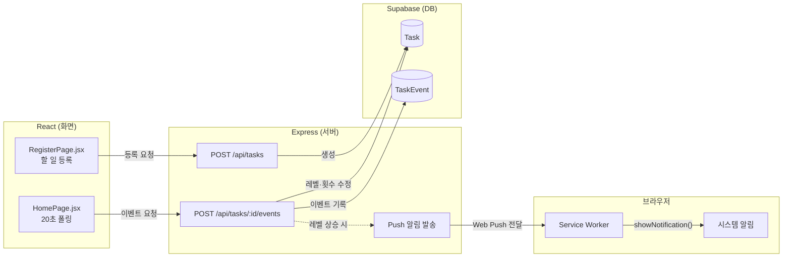

# 🤖 잔소리봇 (Nagging-bot)

> "미루지 마" — 이유를 알아채고, 첫 걸음을 제안하는 AI

대학생은 학업(과제·시험공부·프로젝트 등)을 시작하려는 순간마다
막막함, 하기 싫음, 놀고 싶음 같은 서로 다른 이유로 미루게 됩니다.
잔소리봇은 단순히 "시간 됐어요" 알림을 보내는 대신, 왜 시작하지
못하는지 파악하고 그 이유에 맞는 첫 행동(마이크로태스크)을
제안해 실제로 시작할 수 있도록 돕는 AI입니다.

> 현재 1~3주차 개발 완료, 4주차(통합·배포·발표 준비) 진행 중입니다.

## 기획 문서

- [기획서 (Wiki)](https://github.com/minsss42/hub/wiki)
- [기획서 원본 (plan.md)](./docs/plan.md)
- [화면 단위 와이어프레임 (wireframe.md)](./docs/wireframe.md)
- [디자인 컨셉 (design-concept.md)](./docs/design-concept.md)
- [유사 서비스 리서치 (design-research.md)](./docs/design-research.md)

## 이번 주 계획

- [GitHub 이슈](https://github.com/minsss42/hub/issues)
- [GitHub Project 보드](https://github.com/users/minsss42/projects/1)

## 프로토타입

- [프로토타입 코드 보기](./docs/prototype.html)

## 개발 Task / 백로그

우선순위(P0/P1/보류)와 4주차 로드맵 기준으로 작업을 관리하고 있습니다.

- [작업 분해 (checklist.md)](./docs/checklist.md)

## 기술 스택

- 프로토타입 데모: 순수 HTML / CSS / JS (`docs/prototype.html`)
- 실제 앱: Vite + React
- 백엔드: Express (`server/`) — 할일/회피이유/이벤트/Push 구독 라우트 구현 중(그룹3까지 진행, Push 구독 스키마+등록 API 포함)
- DB: Supabase(Postgres) + Prisma

## 아키텍처

화면 · 서버 · DB로 이어지는 대표 흐름 2가지 (할일 등록 / 레벨 상승 감지 → 알림 발송)



## 개발 환경 실행

### 프론트

```bash
npm install
npm run dev
```

### 서버

```bash
cd server
npm install
cp .env.example .env
npm run dev
```
