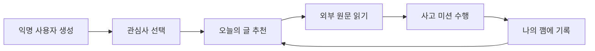
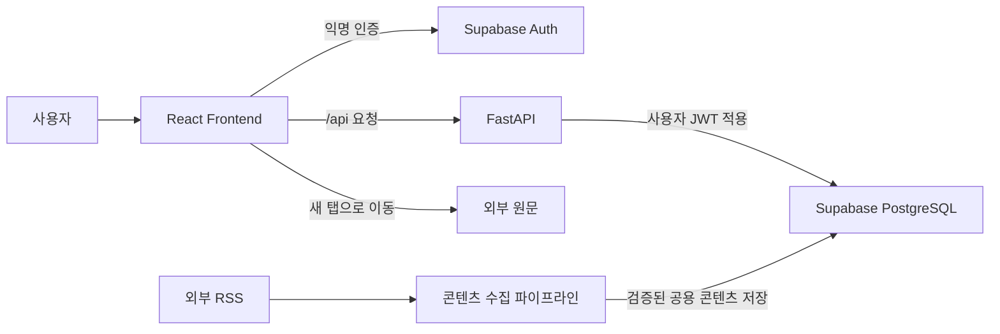
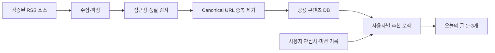
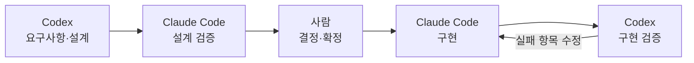

<div align="center">

# AI 시대 사고력 서비스, 깸

### 🔔 내 생각을 깨우자

관심 있는 글을 읽고 질문·반박·연결·표현을 더해,<br/>
AI 시대에 잃기 쉬운 비판적 사고 습관을 만드는 서비스

[](https://react.dev)
[](https://fastapi.tiangolo.com)
[](https://supabase.com)
[]()

</div>

---

## 목차

- [프로젝트 소개](#프로젝트-소개)
- [핵심 사용자 흐름](#핵심-사용자-흐름)
- [주요 기능](#주요-기능)
- [기술 스택](#기술-스택)
- [시스템 아키텍처](#시스템-아키텍처)
- [콘텐츠 수집 및 추천 파이프라인](#콘텐츠-수집-및-추천-파이프라인)
- [AI 협업 개발 방식](#ai-협업-개발-방식)
- [프로젝트 구조](#프로젝트-구조)
- [로컬 개발 환경](#로컬-개발-환경)
- [검증](#검증)
- [프로젝트 문서](#프로젝트-문서)

## 프로젝트 소개

**깸**은 관심사 기반 콘텐츠를 추천하고, 사용자가 원문을 읽은 뒤 짧은 사고 미션으로 자기 생각을 기록하게 하는 서비스다.

생성형 AI가 검색·요약·글쓰기의 많은 과정을 대신하면서 정보를 빠르게 얻을 수 있게 됐지만, 그 결과를 검토하고 자기 생각으로 다시 구성하는 과정은 줄어들기 쉽다. 깸은 AI가 정답을 대신 만들어주는 서비스가 아니라, 사용자가 직접 읽고 한 번 더 생각하도록 돕는 도구를 지향한다.

그래서 깸은 원문을 대신하는 AI 요약을 제공하지 않는다. 사용자는 외부 원문을 직접 읽고, 질문·반박·연결·표현 중 하나의 미션에 답하며 생각을 남긴다.

| 일반 콘텐츠·AI 서비스 | 깸 |
| --- | --- |
| 더 많은 정보를 빠르게 소비하게 한다 | 하나의 글을 읽고 생각을 남기게 한다 |
| 요약이나 답을 제공한다 | 사용자가 직접 판단할 질문을 제공한다 |
| 소비한 콘텐츠가 중심이다 | 사용자가 남긴 생각이 중심이다 |

## 핵심 사용자 흐름

현재 구현된 핵심 사용자 흐름은 다음과 같다.



1. **관심사 선택** — 관심사 1~3개를 선택한다.
2. **오늘의 글** — 공용 콘텐츠 풀에서 관심사에 맞는 글을 최대 3개 추천받는다.
3. **원문 읽기** — 깸이 본문을 복제하지 않고 외부 원문으로 연결한다.
4. **사고 미션** — 글 전체를 대상으로 질문·반박·연결·표현 중 하나를 수행한다.
5. **나의 깸** — 한 줄 생각을 저장하고 월별 캘린더에서 다시 확인한다.

## 주요 기능

| 기능 | 설명 | 현재 상태 |
| --- | --- | --- |
| 관심사 설정 | 사용자가 관심사 1~3개를 선택하고 다시 변경한다 | 구현됨 |
| 오늘의 글 | 관심사, 최신성, 콘텐츠·소스 품질과 최근 기록을 조합해 글을 추천한다 | 구현됨 |
| 사고 미션 | 질문·반박·연결·표현 중 하나로 글 전체에 대한 생각을 작성한다 | 구현됨 |
| 나의 깸 | 월별 캘린더와 날짜별 목록으로 과거 사고 기록을 확인한다 | 구현됨 |
| 콘텐츠 수집 | 검증된 RSS 소스에서 글을 수집하고 품질·접근성·중복을 검사한다 | 수동 CLI 구현됨 |

### 네 가지 사고 행동

| 행동 | 질문 예시 |
| --- | --- |
| 🟡 질문 | 이 글의 핵심 주장은 뭐지? |
| 🔴 반박 | 이 주장에 반대한다면? |
| 🟢 연결 | 내 상황이나 프로젝트와 연결해보면? |
| 🔵 표현 | 이 글이 놓친 관점은 뭐지? |

## 기술 스택

| 영역 | 기술 | 책임 |
| --- | --- | --- |
| Frontend | React, TypeScript, Vite | 화면과 사용자 흐름 |
| Backend | FastAPI, Pydantic | 인증 확인, API 계약, 서비스 규칙 |
| Database & Auth | Supabase, PostgreSQL | 익명 인증, RLS, 데이터와 RPC |
| Content Pipeline | feedparser, HTTPX | RSS 수집·파싱·검증 |
| Test & Verification | Vitest, Pytest, PostgreSQL 통합 테스트 | 프론트엔드·API·DB 검증 |

## 시스템 아키텍처



아키텍처는 다음 원칙을 따른다.

- **Auth만 직접 연결한다.** 프론트엔드는 익명 세션을 만들기 위해서만 Supabase Auth에 직접 연결한다.
- **데이터는 FastAPI를 거친다.** 관심사·기사·미션 기록 요청은 모두 `/api`를 통해 처리한다.
- **사용자 ID를 신뢰하지 않는다.** FastAPI가 access token을 검증하고 사용자 ID를 추출한다.
- **사용자 데이터에는 RLS를 적용한다.** 사용자 JWT가 적용된 Supabase client로 본인의 관심사와 기록에만 접근한다.
- **수집 경로를 분리한다.** RSS 수집기는 사용자 API와 별도로 실행되며, 검증된 콘텐츠만 공용 DB에 저장한다.
- **원문을 대체하지 않는다.** 기사 본문을 저장·재게시하지 않고 사용자를 원문 사이트로 연결한다.

자세한 API·인증·키 사용 규칙은 [`docs/DEVELOPMENT.md`](docs/DEVELOPMENT.md)와 [`docs/plan/engineering/api-spec.md`](docs/plan/engineering/api-spec.md)를 따른다.

## 콘텐츠 수집 및 추천 파이프라인

사용자마다 별도의 콘텐츠 DB를 만들지 않는다. RSS에서 수집한 글을 하나의 **공용 콘텐츠 풀**에 저장한 뒤 사용자별 관심사와 완료 기록에 따라 추천 결과만 다르게 만든다.



### 수집

1. `sources`와 `source_interests`에서 수집 설정과 관심사를 읽는다.
2. 활성 상태, 수집 방식, 언어, 신뢰도, 노출 정책과 paywall 위험을 검사한다.
3. RSS 또는 Atom 응답을 가져와 제목·URL·발행일·저자·공식 소개문을 파싱한다.
4. HTML과 불필요한 공백을 정리하되 원문 전문은 저장하지 않는다.
5. 무료 접근 가능성과 품질 점수를 평가한다.
6. URL에서 추적 파라미터 등을 제거해 canonical URL을 만든다.
7. feed 내부 중복과 DB에 이미 저장된 URL을 건너뛴다.
8. 신규 기사와 관심사 태그를 하나의 DB 트랜잭션으로 저장한다.

수집기는 `dry-run`과 `save` 모드를 제공한다. 현재 자동 수집 주기나 실행 스케줄러는 없으며 소스별 CLI로 실행한다.

```bash
cd backend

# 저장 없이 수집 결과 검토
uv run python -m app.jobs.collect_feed --source-id <SOURCE_UUID> --dry-run

# 검증을 통과한 신규 글 저장
uv run python -m app.jobs.collect_feed --source-id <SOURCE_UUID> --save
```

### 추천

추천 함수는 다음 조건으로 공용 콘텐츠 풀의 후보를 찾는다.

- 사용자의 관심사 태그와 일치
- 무료로 접근 가능하고 URL 상태가 정상
- 콘텐츠 품질 기준 통과
- 신뢰할 수 있고 기본 노출이 허용된 소스
- 사용자가 아직 미션을 완료하지 않은 글

후보는 관심사 일치도, 최신성, 소스 품질을 더하고 최근 동일 소스·동일 논쟁 입장의 반복을 감점해 정렬한다. 추천 결과와 이유 문구는 생성형 AI가 아니라 결정적인 규칙으로 만든다.

상세 계약은 [`docs/plan/engineering/content-pipeline.md`](docs/plan/engineering/content-pipeline.md), [`docs/plan/engineering/db-schema.md`](docs/plan/engineering/db-schema.md), [`docs/quality/rss-dry-run.md`](docs/quality/rss-dry-run.md)에서 확인할 수 있다.

## AI 협업 개발 방식

깸은 Codex와 Claude Code의 역할을 단계별로 분리해 사용한다. 한 AI가 설계·구현·최종 검증을 모두 담당하지 않게 하고, 다른 관점의 검토와 실행 결과를 통해 판단한다.



| 단계 | 담당 | 목적 |
| --- | --- | --- |
| 설계 | Codex | 요구사항, API, DB, 화면 흐름과 완료 기준 정리 |
| 설계 검증 | Claude Code | 누락 조건, 과한 복잡도, 엣지 케이스와 보안 경계 검토 |
| 결정 | 사람 | 검토 결과를 바탕으로 MVP 범위와 계약 확정 |
| 구현 | Claude Code | 확정된 설계에 따라 코드 작성 |
| 구현 검증 | Codex | 설계 일치 여부와 하네스 실행 결과 확인 |

AI 협업에서 다음 원칙을 사용한다.

- AI의 설명이 아니라 테스트·하네스의 실제 결과로 완료를 판단한다.
- 구현 담당이 설계를 바꾸면 변경 이유를 문서에 남긴다.
- 요청받지 않은 기능과 추상화를 미리 추가하지 않는다.
- 정상 성공뿐 아니라 `401`, `422`, RLS 차단처럼 실패해야 정상인 경우도 검증한다.
- Git·코딩·검증 규칙은 한 문서에서 관리해 도구별 지침이 달라지는 것을 막는다.

### AI 설정 구조

| 파일·디렉터리 | 역할 |
| --- | --- |
| `AGENTS.md` | Codex와 Claude Code가 공유하는 프로젝트 작업 규칙 |
| `CLAUDE.md` | Claude Code가 공통 규칙을 읽도록 연결하고 Claude 전용 위치를 안내 |
| `.agents/templates/` | 도구 공통 협업 사이클과 요청 템플릿 설명 |
| `.codex/agents/` | 스프린트·태스크 계획을 위한 Codex 전문 에이전트 설정 |
| `.codex/prompts/` | Codex 설계 요청·구현 검증 프롬프트 |
| `.claude/commands/` | Claude Code 설계 검토·구현 요청 명령 |
| `.claude/rules/` | 경로별 Claude Code 규칙을 추가하기 위한 위치 |
| `.claude/skills/` | 반복 작업 절차를 추가하기 위한 위치 |
| `.claude/agents/` | Claude Code 전문 에이전트를 추가하기 위한 위치 |
| `.claude/hooks/` | 자동 검증 훅을 추가하기 위한 위치 |

현재 `.claude/rules/`, `.claude/skills/`, `.claude/agents/`, `.claude/hooks/`와 일부 `.codex/` 확장 디렉터리는 향후 설정을 위한 위치만 마련되어 있다. 실제 협업 사이클과 사용법은 [`.agents/templates/README.md`](.agents/templates/README.md), 공통 작업 규칙은 [`AGENTS.md`](AGENTS.md)에서 확인할 수 있다.

## 프로젝트 구조

```text
hub-clone/
├── frontend/                  # React 프론트엔드
│   ├── public/
│   └── src/
│       ├── api/               # FastAPI 요청과 응답 타입
│       ├── components/        # 공통 UI 컴포넌트
│       ├── lib/               # Supabase Auth 연결
│       └── screens/           # 관심사·오늘의 글·미션·나의 깸 화면
├── backend/                   # FastAPI API와 RSS 수집기
│   ├── app/
│   │   ├── api/               # 인증 의존성과 API 라우트
│   │   ├── content/           # RSS 수집·파싱·평가·저장 계획
│   │   ├── core/              # 설정과 공통 오류
│   │   ├── db/                # Supabase client
│   │   ├── jobs/              # 콘텐츠 수집 CLI
│   │   └── schemas/           # API 요청·응답 스키마
│   └── tests/                 # 백엔드 테스트
├── supabase/
│   ├── migrations/            # DB 스키마와 RPC 변경 이력
│   ├── seeds/                 # 콘텐츠 소스 seed
│   └── tests/                 # PostgreSQL 통합 테스트
├── scripts/                   # API·Supabase 반복 검증 스크립트
├── docs/
│   ├── plan/
│   │   ├── product/           # 문제·서비스·사용자 흐름
│   │   ├── design/            # 디자인 시스템·프로토타이핑
│   │   ├── engineering/       # API·DB·콘텐츠 파이프라인
│   │   ├── implementation/    # 작업별 설계·구현 계획
│   │   └── process/           # AI 협업·개발 프로세스
│   ├── quality/               # 구현 완료 판정 기준
│   ├── notes/                 # 결정과 설계 변경 사유
│   └── prototype/             # 참고용 HTML 프로토타입
├── .agents/templates/         # AI 공통 협업 흐름
├── .codex/                    # Codex 에이전트·프롬프트 설정
├── .claude/                   # Claude Code 명령·확장 설정
├── AGENTS.md                  # AI 공통 작업 규칙
├── CLAUDE.md                  # Claude Code 진입 문서
└── docs/DEVELOPMENT.md        # Git·코딩·검증 규칙의 단일 원본
```

`docs/prototype/`은 구현 전 화면 검토를 위한 참고 자료이며 실제 빌드 대상이 아니다.

## 로컬 개발 환경

### 요구 사항

- Node.js
- Python
- [uv](https://docs.astral.sh/uv/)
- 로컬 또는 원격 Supabase 프로젝트

필요한 환경변수 이름은 [`.env.example`](.env.example)을 참고한다. 실제 키나 DB 접속 정보가 담긴 `.env`는 커밋하지 않는다.

### 프론트엔드

```bash
cd frontend
npm install
npm run dev
```

개발 서버는 `http://localhost:5173`에서 실행된다.

### 백엔드

```bash
cd backend
uv sync
uv run fastapi dev app/main.py
```

API 서버는 `http://localhost:8000`에서 실행된다. 프론트엔드의 `/api` 요청은 Vite proxy를 통해 백엔드로 전달된다.

## 검증

### 프론트엔드

```bash
cd frontend
npm run typecheck
npm run lint
npm test
```

### 백엔드

```bash
cd backend
uv run pytest
```

API·DB·RSS 파이프라인의 완료 판정은 [`docs/quality/`](docs/quality/)의 하네스를 따른다.

주요 검증 스크립트:

```bash
uv run scripts/smoke_api.py
uv run scripts/verify_supabase.py
```

## 프로젝트 문서

### 제품과 사용자 흐름

- [문제 정의 및 인사이트](docs/plan/product/problem-insight.md)
- [서비스 정의와 MVP 범위](docs/plan/product/service-mvp.md)
- [핵심 기능](docs/plan/product/feature-details.md)
- [사용자 시나리오와 화면 구조](docs/plan/product/scenario-ia.md)

### 엔지니어링

- [개발 규칙](docs/DEVELOPMENT.md)
- [기술 스택](docs/plan/engineering/tech-stack.md)
- [API 명세](docs/plan/engineering/api-spec.md)
- [DB 설계](docs/plan/engineering/db-schema.md)
- [콘텐츠 수집 파이프라인](docs/plan/engineering/content-pipeline.md)
- [콘텐츠 운영 전략](docs/plan/engineering/content-strategy.md)

### 품질과 협업

- [구현 완료 판정 기준](docs/quality/README.md)
- [RSS 수집 검증 기준](docs/quality/rss-dry-run.md)
- [AI 에이전트 운영 전략](docs/plan/process/agent-strategy.md)
- [AI 협업 요청 사이클](.agents/templates/README.md)
