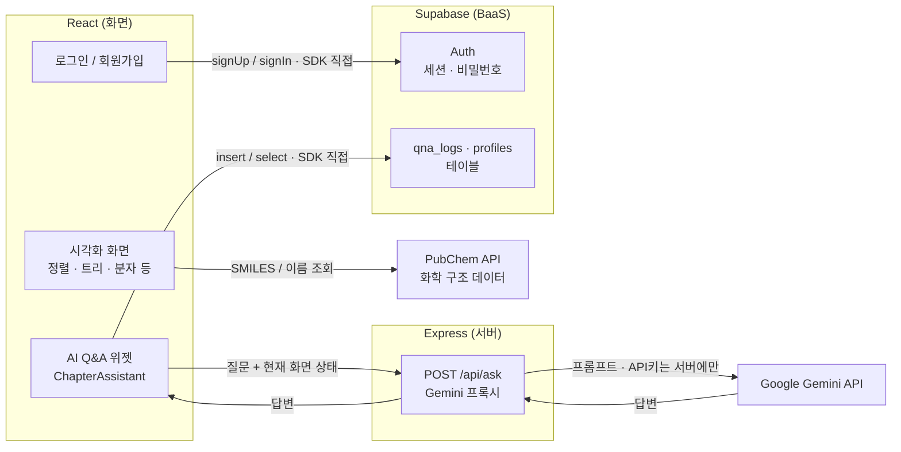
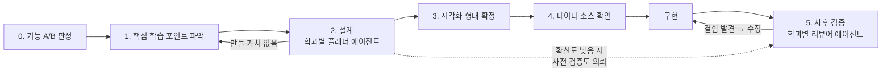

# 전공 시각화 학습실

각 대학 전공 수업 자료를 시각적으로 보여주는 학습 플랫폼입니다. React + TypeScript + Vite + Tailwind CSS 기반이며, 다크 IDE 스타일 레이아웃(상단 네비게이션 + 사이드바 + 메인 패널)을 사용합니다.

## 아키텍처

화면(React) · 서버(Express) · DB(Supabase)가 어떻게 연결되고 데이터가 어디로 흐르는지 나타냅니다.
로그인·Q&A 저장은 Supabase SDK로 프론트에서 직접 처리하고, Express는 API 키를 서버에만 두기 위한
**Gemini 프록시(`POST /api/ask`) 역할만** 맡습니다.



- **로그인 · DB**: `supabase.auth`(회원가입/로그인/세션)와 `supabase.from('qna_logs')`(대화 기록 저장/조회)를 프론트에서 직접 호출 — Express를 거치지 않습니다(Supabase가 BaaS로 인증·DB·API를 함께 제공).
- **AI Q&A**: 사용자의 질문과 **현재 보고 있는 화면 상태**를 함께 Express 프록시로 보내고, 프록시가 Gemini API를 호출해 답변을 돌려줍니다. Gemini API 키는 서버 환경 변수에만 있고 클라이언트 번들에는 포함되지 않습니다.
- **화학 구조 데이터**: 분자 뷰어 등은 PubChem API를 프론트에서 직접 조회해 2D/3D 구조를 그립니다.

## AI Agent Workflow

새 학습 화면은 사람이 임의로 만들지 않고, 아래 파이프라인을 따라 **학과별 에이전트 한 쌍**(플래너 + 리뷰어)이 설계와 검증을 분담합니다. 두 에이전트는 같은 3가지 렌즈(①내용이 정확한가 ②그 학과 학생에게 실제로 필요한가 ③화면이 개념을 오해 없이 전달하는가)를 계약으로 공유합니다.



- **플래너**(설계): 렌더링 형식이 아니라 "학생이 무엇을 어려워하는가"에서 출발해 계획을 생성합니다. 화학적 함정 체크리스트·데이터 소스 확인·확신도가 계획에 포함되고, "만들지 말자"도 정당한 결론입니다.
- **리뷰어**(사후 검증): 계획자·구현자와 **다른 눈**으로 완성된 화면을 독립 검증합니다 — "에러 없이 렌더됨"과 "학생이 오해 없이 이해함"은 별개이기 때문입니다.
- 현재 화학과(`chemistry-planner`·`chemistry-reviewer`)와 컴퓨터공학과(`cs-planner`·`cs-reviewer`) 두 쌍이 가동 중이고(`.claude/agents/`), 학과가 늘어나면 같은 템플릿으로 쌍을 추가합니다. 상세 규칙은 [CLAUDE.md](./CLAUDE.md) 참고.

## 배포

- **프론트엔드**: [Vercel](https://hub-tau-seven.vercel.app)
- **백엔드(Gemini 프록시)**: Render
- 프론트/백엔드를 분리 배포하고, 하드코딩 대신 환경변수(`VITE_API_BASE_URL`, `FRONTEND_ORIGIN`)로 서로의 주소를 주고받습니다. 필요한 환경변수 목록은 [.env.example](./.env.example) 참고.

## 실행 방법

```bash
npm install
npm run dev
```

## 산출물
- [기획서](./기획서.md)
- [개발 Task](./TASK.md)
- [노션 링크] https://app.notion.com/p/3a59f8714c9c806ab8b9f7021473127c