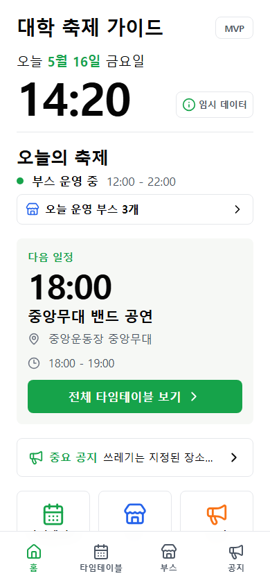
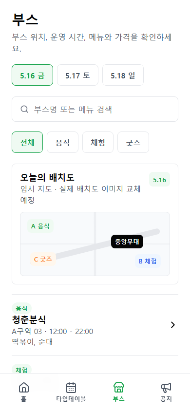

# 대학 축제 가이드

대학 축제 당일 방문객이 흩어진 일정, 부스, 공지 정보를 모바일에서 빠르게 확인할 수 있도록 만든 프론트엔드 MVP 프로토타입입니다. Naver Connect AI Agent Challenge Week 1 작업물입니다.

## 기획서

이 프로젝트는 [기획서 v1.0.0](./docs/plan/v1.0.0.md)을 기준으로 구현했습니다.

- 문제 정의: 축제 정보가 여러 채널과 이미지에 흩어져 있어 현장에서 필요한 정보를 빠르게 찾기 어렵다.
- MVP 범위: 홈, 타임테이블, 부스 목록/상세, 공지 목록/상세 화면을 정적 데이터 기반으로 제공한다.
- 제외 범위: 백엔드, 인증/인가, 관리자 페이지, 운영진용 CRUD 기능.

## UI/UX 미리보기

### 홈



### 부스



## 주요 기능

- 오늘의 주요 일정과 운영 중인 부스를 홈에서 요약
- 날짜와 카테고리 기준으로 타임테이블 탐색
- 부스 검색, 카테고리 필터, 부스 상세 정보 확인
- 중요 공지와 일반 공지를 구분한 공지 목록/상세 화면
- 모바일 우선 하단 내비게이션과 간결한 카드형 정보 구조

## 문서

- [기획서 v1.0.0](./docs/plan/v1.0.0.md)
- [디자인 시스템](./docs/design/DESIGN.md)
- [후속 작업 우선순위](./docs/roadmap/NEXT_STEPS.md)
- [MVP 평가 기록](./audit/mvp-evaluation/notes.md)
- [UI/UX 감사 리포트](./audit/ui-ux-review/report.md)

## 기술 스택

- React 19
- TypeScript
- Vite
- ESLint
- lucide-react

## 개발

```bash
pnpm install
pnpm dev
```

## 검증

```bash
pnpm lint
pnpm build
```
