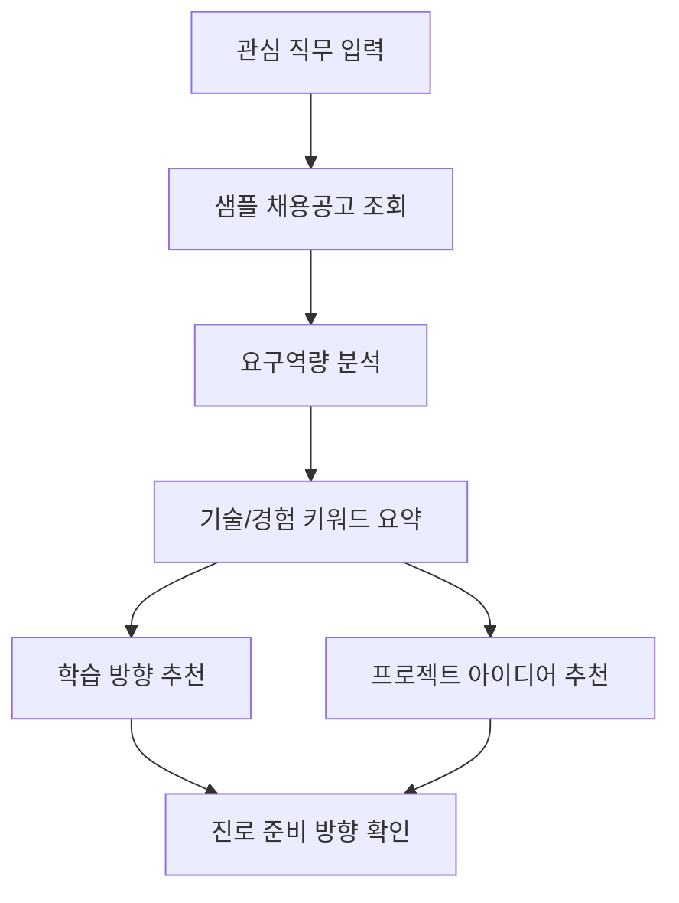

# 채용공고 기반 대학생 진로탐색 리서치 에이전트

대학생이 관심 직무를 준비할 때, 샘플 채용공고 데이터를 기반으로 요구 역량을 파악하고 학습 방향과 프로젝트 방향을 정리하도록 돕는 AI Agent 프로젝트입니다.

## 프로젝트 소개

이 프로젝트는 채용공고에 흩어져 있는 기술 스택, 자격요건, 우대사항, 업무 키워드를 대학생이 이해하기 쉬운 진로 준비 정보로 바꾸는 것을 목표로 합니다.

1주차에는 실제 채용공고 수집이나 LLM API 연동보다 사용자 흐름 검증에 집중합니다. 따라서 React 내부 mock data와 rule 기반 로직으로 직무 입력, 요구역량 요약, 학습 방향 추천, 프로젝트 아이디어 추천 흐름을 먼저 확인합니다.

## 문제 정의

대학생은 관심 직무를 준비하고 싶어도 실제 채용공고에 담긴 시장 요구사항을 구조화해서 이해하기 어렵습니다. 그 결과 무엇을 먼저 학습해야 하는지, 어떤 프로젝트를 준비해야 하는지 구체적으로 결정하기 어렵습니다.

이 프로젝트의 핵심 문제 정의는 다음과 같습니다.

> 채용공고에 흩어진 직무 요구사항을 대학생이 실행할 수 있는 진로 준비 정보로 바꾸는 것

## 1주차 목표

1주차 목표는 완성된 AI Agent가 아니라, 핵심 사용자 흐름을 확인할 수 있는 React 프로토타입을 만드는 것입니다.

- 관심 직무 입력
- 샘플 채용공고 데이터 조회
- 요구역량 요약
- 분석 근거 표시
- 학습 방향 추천
- 프로젝트 아이디어 추천

## MVP 범위

1차 MVP는 핵심 기능을 3개로 제한합니다.

1. 관심 직무 입력
2. 샘플 채용공고 기반 요구역량 요약
3. 학습 방향 및 프로젝트 아이디어 추천

사용자 현재 역량 입력과 Gap 분석은 2차 MVP로 분리합니다.

## 서비스 흐름



상세 화면 흐름, Agent 구조, 시스템 흐름은 [기획서](docs/plan.md)에서 확인할 수 있습니다.

## 문서

- [기획서](docs/plan.md)
- [작업 체크리스트](docs/checklist.md)
- [Wiki](https://github.com/joo-hyun/hub/wiki)

## 프로젝트 구조

```text
hub/
  docs/
    plan.md
    checklist.md
    images/

  src/
    internal/
      project-intro/
      prototype/

    product/
      components/
      data/
      pages/
      services/

    shared/
      components/
      utils/

    assets/
    App.jsx
    App.css
    index.css
    main.jsx
```

## 실행 방법

의존성 설치:

```bash
npm install
```

개발 서버 실행:

```bash
npm.cmd run dev
```

빌드 확인:

```bash
npm.cmd run build
```

린트 확인:

```bash
npm.cmd run lint
```

PowerShell 실행 정책 때문에 `npm run dev`가 막히는 경우 `npm.cmd run dev`처럼 실행합니다.

## 현재 구현 상태

- 프로젝트 소개 React 화면 구현
- 기획서 작성
- 1주차 React 프로토타입 작업 체크리스트 작성
- 최종 서비스 영역과 내부 산출물 영역 분리

아직 구현하지 않은 범위:

- Express 서버
- 실제 LLM API 호출
- 실시간 채용공고 크롤링
- DB 저장
- 로그인
- 사용자 역량 기반 Gap 분석

## 향후 계획

- React 기반 1주차 프로토타입 구현
- mock job data 작성
- rule 기반 요구역량 분석 로직 구현
- 학습 방향 및 프로젝트 추천 로직 구현
- Verifier 검토 문구 구현
- 이후 Express API와 LLM API 연동

