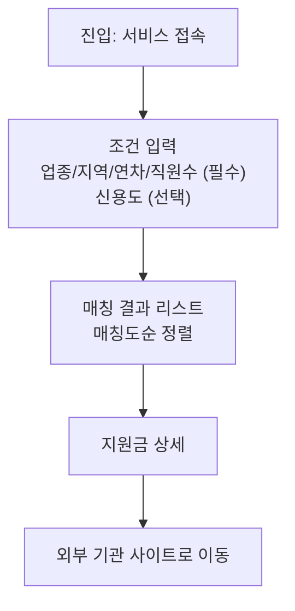

# 소상공인 정부 지원금 큐레이터

정부 지원금 정보가 여러 기관 사이트에 흩어져 있어, 소상공인이 자신에게 맞는
지원금을 한눈에 파악하기 어려운 문제를 해결하는 서비스입니다.

## 문제 정의

> 소상공인이 정부 지원금을 찾을 때, 정보가 각 기관·사이트에 흩어져 있어
> 내게 맞는 지원금을 한눈에 파악하기 어렵다.

## 핵심 기능

- **조건 매칭 + 정렬 추천**: 업종/지역/업력/직원수(필수) + 신용도(선택)를
  입력하면 매칭도순 · 마감임박순 · 지원금액순으로 지원금을 추천
- **지원금 상세정보 및 신청 연결**: 상세 조건·필요 서류 확인 후 실제 신청은
  해당 기관 사이트로 연결

## 화면 흐름



## 기술 스택

| 영역 | 사용 기술 |
|---|---|
| 프론트엔드 | Next.js (React + TypeScript) |
| 백엔드 / API | Next.js API Routes |
| 데이터 저장 | Supabase (Postgres) |
| 크롤러 | Node.js + Cheerio (TypeScript) |
| 데이터 수집 스케줄링 | GitHub Actions (cron) |
| 배포 | Vercel |

## 데이터 출처

- [기업마당](https://www.bizinfo.go.kr) — 중앙정부·지자체 소상공인 지원사업 통합 공고

## 현재 범위 (MVP)

- ✅ 조건 기반 지원금 매칭·정렬
- ✅ 지원금 상세 정보 + 외부 신청 링크 연결
- ❌ 관심 지원금 저장 / 마감 알림 (추후 확장 예정)
- ❌ 서비스 내 신청서 작성 (현재는 외부 사이트로 이동)

## 문서

- [`docs/plan.md`](./docs/plan.md) — 기획서 (문제 정의, 시나리오, 핵심 기능, 화면 흐름)
- [`docs/checklist.md`](./docs/checklist.md) — 3주 개발 작업 체크리스트

## 로컬 실행 방법

```bash
git clone <repo-url>
cd <repo-name>
npm install
cp .env.example .env.local   # Supabase URL/Key 입력
npm run dev
```

## 크롤러 수동 실행

```bash
npm run crawl
```