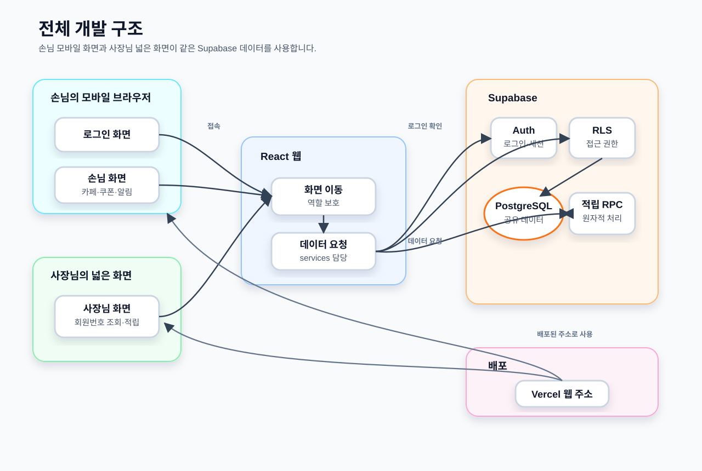
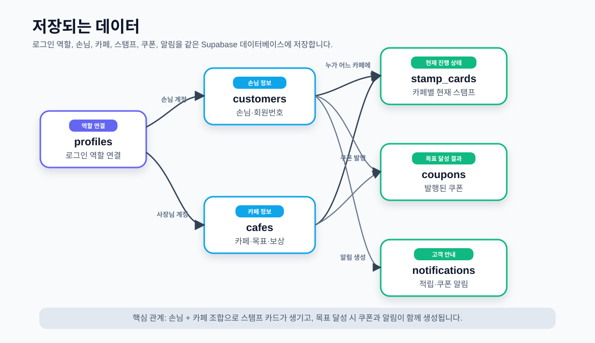

# 개인 카페 스탬프 MVP

여러 개인 카페의 스탬프, 쿠폰, 알림을 손님과 사장님이 같은 데이터로 공유하는 3주 MVP입니다. 손님은 모바일 웹에서 확인하고, 사장님은 매장 컴퓨터나 태블릿의 넓은 화면 웹에서 회원번호로 적립을 처리합니다.

## 핵심 시연

1. 손님과 사장님이 각자의 고정 데모 계정으로 로그인합니다.
2. 손님 화면에는 서로 다른 목표와 보상을 가진 여러 카페가 표시됩니다.
3. 사장님은 자신의 담당 카페에서 손님 회원번호를 입력합니다.
4. 고객과 현재 스탬프를 확인하고 스탬프 1개를 적립합니다.
5. 카페별 목표에 도달하면 해당 카페 쿠폰이 자동 발행되고 스탬프는 0개가 됩니다.
6. 손님 화면을 새로고침하면 변경된 스탬프, 쿠폰, 알림을 확인할 수 있습니다.

## MVP 기능

### 손님

- 이메일·비밀번호 고정 계정 로그인
- 고유 회원번호 확인
- 여러 카페의 현재 스탬프, 목표, 보상 확인
- 발행된 쿠폰 확인
- 적립 및 쿠폰 발행 알림 확인

### 사장님

- 이메일·비밀번호 고정 계정 로그인
- 자신의 담당 카페 확인
- 회원번호로 고객 조회
- 담당 카페의 고객 스탬프 확인
- 스탬프 1개 적립
- 일반 적립 또는 쿠폰 자동 발행 결과 확인

## 적립 규칙

- 카페마다 목표 스탬프 수와 보상이 다를 수 있습니다.
- 한 번의 요청으로 스탬프 1개만 적립합니다.
- 현재 스탬프가 `카페 목표 - 1`이면 적립과 동시에 해당 카페 쿠폰 1장을 발행합니다.
- 쿠폰 발행 후 해당 카페의 스탬프를 0개로 초기화합니다.
- 일반 적립에는 적립 알림, 쿠폰 발행에는 적립·쿠폰 알림을 생성합니다.

## 기술 구성

- React + Vite
- React Router
- Supabase Auth
- Supabase PostgreSQL
- Supabase RLS
- PostgreSQL 함수와 Supabase RPC
- 반응형 CSS
- Vercel 배포

별도 Express 서버는 사용하지 않습니다.

## 제외 기능

- 실제 QR 카메라와 외부 스캐너 연동
- 결제와 POS 연동
- 문자·카카오톡·이메일·브라우저 푸시 알림
- 위치 기반 탐색과 카페 검색
- 쿠폰 사용·승인·만료 처리
- 카페 등록과 규칙 편집 화면
- 운영 통계와 관리자 화면
- 실제 회원가입, 비밀번호 찾기, 소셜 로그인
- 부정 적립 방지와 네이티브 앱

## 주요 문서

- [서비스 기획](docs/service-plan.md)
- [3주 구현 체크리스트](checklist.md)
- [비전공자용 개발 로드맵](docs/beginner-development-roadmap.md)
- [Codex 작업 지침](AGENTS.md)
- [프로젝트 파일 안내](START_HERE.md)

## 프로토타입

- [손님 프로토타입](https://seongha-h.github.io/user_screen_real.html)
- [사장님 프로토타입](https://seongha-h.github.io/owner-prototype.html)

손님 프로토타입은 모바일 화면 참고 자료, 사장님 프로토타입은 넓은 화면 운영 화면 참고 자료입니다. 프로토타입의 QR, 쿠폰 만료, 마이페이지 수정 등은 디자인 참고 요소이며 확정된 MVP 기능은 서비스 기획과 체크리스트를 기준으로 합니다.

## 3주 개발 계획

### 1주차: 기반 만들기
- React/Vite 화면 구조 정리
- 로그인과 역할 구분
- Supabase 데이터 구조와 권한 설정
- 데모 계정과 시연 데이터 준비

손님과 사장님이 각각 로그인할 수 있고, 로그인 후 각자 역할에 맞는 화면으로 이동 가능. 새로고침해도 로그인 상태가 유지되며, 손님·카페·스탬프·쿠폰·알림을 저장할 기본 데이터 구조가 준비됨. 손님은 여러 카페의 기본 스탬프 데이터를 조회할 수 있는 상태까지 완성된다.

### 2주차: 핵심 기능 완성
- 손님 화면에서 여러 카페 스탬프 확인
- 사장님 화면에서 회원번호로 고객 조회
- 스탬프 1개 적립
- 목표 달성 시 쿠폰 자동 발행
- 손님 화면 새로고침 반영 확인

손님이 자기 회원번호와 카페별 스탬프 현황을 볼 수 있고, 사장님은 회원번호로 고객을 조회할 수 있음. 사장님은 자신의 카페에서만 스탬프를 1개 적립할 수 있으며, 목표 직전 상태에서 적립하면 쿠폰이 자동 발행되고 스탬프가 0개로 초기화된다. 손님 화면을 새로고침하면 사장님이 처리한 결과가 그대로 반영됩니다.

### 3주차: 시연 준비
- 쿠폰과 알림 화면 연결
- 모바일 손님 화면, 넓은 사장님 화면 보정
- 오류, 로딩, 버튼 비활성화 정리
- 배포와 시연 데이터 복구 준비

3주차 후에는 손님이 발행된 쿠폰과 적립/쿠폰 알림을 확인할 수 있다. 손님 화면은 모바일에서, 사장님 화면은 넓은 화면에서 사용하기 좋게 정리된다. 잘못된 회원번호, 요청 중 상태, 오류 상황도 자연스럽게 표시되며, 배포 주소에서 손님/사장님 계정으로 전체 시연을 반복할 수 있다.

