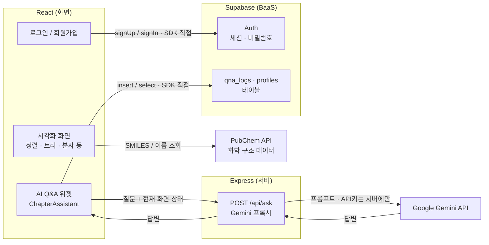

# 전공 시각화 학습실

각 대학 전공 수업 자료를 시각적으로 보여주는 학습 플랫폼입니다. React + TypeScript + Vite + Tailwind CSS 기반이며, 다크 IDE 스타일 레이아웃(상단 네비게이션 + 사이드바 + 메인 패널)을 사용합니다.

## 아키텍처

화면(React) · 서버(Express) · DB(Supabase)가 어떻게 연결되고 데이터가 어디로 흐르는지 나타냅니다.
로그인·Q&A 저장은 Supabase SDK로 프론트에서 직접 처리하고, Express는 API 키를 서버에만 두기 위한
**Gemini 프록시(`POST /api/ask`) 역할만** 맡습니다.



- **로그인 · DB**: `supabase.auth`(회원가입/로그인/세션)와 `supabase.from('qna_logs')`(대화 기록 저장/조회)를 프론트에서 직접 호출 — Express를 거치지 않습니다(Supabase가 BaaS로 인증·DB·API를 함께 제공).
- **AI Q&A**: 사용자의 질문과 **현재 보고 있는 화면 상태**를 함께 Express 프록시로 보내고, 프록시가 Gemini API를 호출해 답변을 돌려줍니다. Gemini API 키는 서버 환경 변수에만 있고 클라이언트 번들에는 포함되지 않습니다.
- **화학 구조 데이터**: 분자 뷰어 등은 PubChem API를 프론트에서 직접 조회해 2D/3D 구조를 그립니다.

## 실행 방법

```bash
npm install
npm run dev
```

## 산출물
- [기획서](./기획서.md)
- [개발 Task](./TASK.md)
