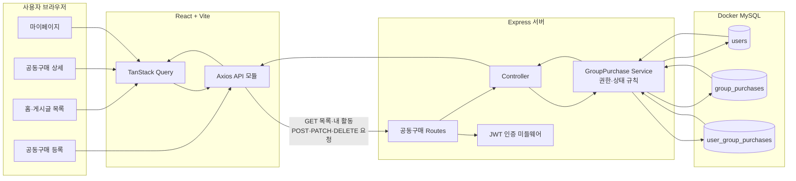
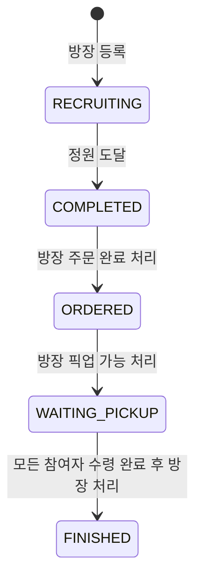

# ThingDong (띵동)

이웃과 식품·생활용품을 함께 구매하고 수령할 수 있는 공동구매 MVP입니다.

## 실제 기술 구성

- Frontend: React 19, Vite, Axios, TanStack Query
- Backend: Node.js, Express, Sequelize
- Database: MySQL 8 (Docker Compose)
- Authentication: 개발용 JWT 로그인

## 주요 기능

- 공동구매 목록·상세 조회 및 카테고리 필터링
- 인증 사용자만 공동구매 글 등록 및 참여
- 트랜잭션 잠금으로 정원 초과 참여 방지
- 모집 완료까지의 5단계 상태 모델

## 실행

```bash
cd Project
docker compose up -d

cd backend
copy .env.example .env
npm install
npm run db:sync
npm run dev

cd ../frontend
copy .env.example .env
npm install
npm run dev
```

프론트엔드는 기본적으로 Vite 프록시를 통해 `http://localhost:4000` 백엔드에 연결합니다. 별도 배포 시 `frontend/.env`의 `VITE_API_BASE_URL`과 `backend/.env`의 `CORS_ORIGINS`를 실제 주소로 설정하세요.

## 품질 확인

```bash
cd Project/frontend && npm run lint && npm run build
cd ../backend && npm run check && npm test
```

백엔드 테스트는 MySQL이 실행 중이어야 합니다.

## 서비스 구조와 데이터 흐름



### 내 말로 설명하기

ThingDong은 여러 사람이 하나의 상품을 함께 구매하고 픽업하는 서비스다. 사용자가 홈, 상세, 등록, 마이페이지에서 버튼을 누르면 React가 API 요청을 보낸다. Express 서버는 로그인한 사용자인지, 방장인지, 지금 바꿔도 되는 상태인지 먼저 확인한다. 통과한 요청만 Docker 안의 MySQL에 저장하고, 저장된 결과를 화면에 다시 보여 준다. 그래서 공동구매 글과 참여 기록은 브라우저를 새로고침해도 남는다.

### 구조를 보고 발견한 다음 작업

- 현재 결제 완료 여부는 기록만 하며 실제 결제 수단과 연결되어 있지 않다.
- 픽업 시간·장소가 바뀌어도 참여자에게 알려 주는 알림 기능이 없다.
- 위 두 항목 중 다음 우선순위 기능은 `픽업 정보 변경 알림`이다. 방장이 정보를 수정하면 참여자 화면에서 바로 확인할 수 있게 한다.

## 공동구매 상태 흐름



- 방장은 `주문 완료 처리`, `픽업 가능 처리`, `공구 완료 처리`를 순서대로 실행한다.
- 참여자는 `픽업 대기` 상태가 되면 `수령 완료`를 기록한다.
- 방장은 모든 참여자의 수령 기록이 있어야 공구를 완료할 수 있다.
