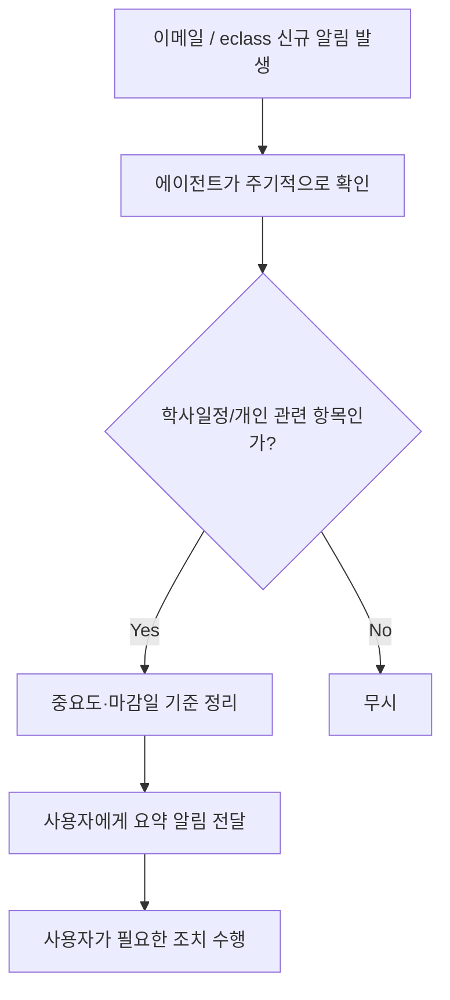

# 학교생활 알림 에이전트 (가칭)

AI Agent Challenge — 1주차 기획

> 참여자 코드: N146 · GitHub: Urindo-do

---

## 문제 정의

대학 생활 시스템에 아직 익숙하지 않은 신입생이, 등록금 납부·수강신청·자기개발 프로그램 신청처럼 시기별로 챙겨야 할 정보가 학교 이메일·eclass·포털에 흩어져 있어서, 정작 본인에게 필요한 정보를 제때 찾지 못하고 놓친다.

## 사용자 시나리오

1. 신입생 B씨가 개강 후 처음으로 등록금 납부, 수강신청 안내를 받는다.
2. 학교 이메일, eclass, 포털에 흩어진 공지 중 지금 자신에게 필요한 게 뭔지 한눈에 알기 어렵다.
3. 에이전트가 이메일과 eclass 알림을 주기적으로 확인해, 학사일정 관련 항목만 골라낸다.
4. 마감이 임박한 항목(수강신청, 등록금 납부, 자기개발 프로그램 신청 등)을 우선순위로 정리해 알려준다.
5. B씨는 원문 전체를 일일이 찾아보지 않고, 정리된 알림만 확인해 필요한 조치를 취한다.
6. (선택, 확장) 필요 시 보호자에게도 요약된 알림을 공유할 수 있다.

## 핵심 기능 (2개)

- **기능 A: 다중 소스 알림 통합 수집** — 학교 이메일, eclass(가능하다면) 등 흩어진 채널의 알림을 한 곳에서 주기적으로 수집
- **기능 B: 개인 맥락 기반 우선순위 필터링 및 요약** — 수집된 알림 중 사용자에게 실제로 관련 있고 마감이 임박한 항목만 골라 요약 전달

> 포털(교내 시스템) 공지는 OTP·이중인증으로 자동 수집이 어려워 이번 스코프에서 제외. 이메일을 우선 채널로 삼고, eclass는 API 접근 가능 여부 확인 후 포함 여부 결정.

## 화면 흐름 (초안)

## 향후 확인 사항 (리스크)

- [ ] eclass Open API 또는 개발자 접근 방법 존재 여부 확인
- [ ] Gmail API OAuth 연동 방식 확정 (읽기 전용 스코프, 개인정보 최소 수집 원칙)
- [ ] 알림 판단 기준(무엇이 "중요"한지) 구체적인 룰/프롬프트 설계