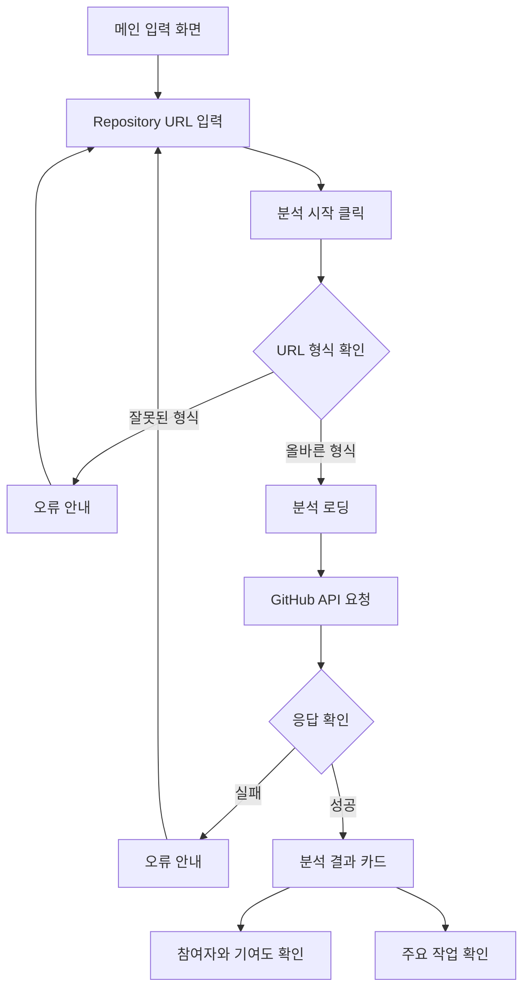

# PtoP(Project to Portfolio)

PtoP는 GitHub Repository를 분석해 대학생 개발자가 프로젝트 경험을 다시 복기하고, 포트폴리오와 회고로 확장할 수 있는 작업 단서를 정리해주는 서비스입니다.

## 문제 정의

프로젝트 경험을 쌓는 대학생 개발자는 프로젝트가 끝난 뒤 시간이 지나면 자신이 맡은 역할, 기여도, 핵심 구현 내용, 문제 해결 과정을 정확히 기억하고 정리하기 어렵습니다.

## 서비스 목표

PtoP는 Repository를 입력하면 참여자, 커밋 기준 활동 비중, 주요 커밋 흐름을 확인하고, 사용자가 “내가 어떤 작업을 했는지” 설명할 수 있는 단서를 제공하는 것을 목표로 합니다.

현재 MVP는 기능을 넓히기보다 다음 흐름을 탄탄하게 만드는 데 집중했습니다.

- GitHub Repository URL 입력
- Repository URL 입력과 형식 검증
- 분석 대기, 성공, 실패 상태를 구분한 화면 흐름
- commit 수 기준 활동 비중과 주요 작업을 보여주는 mock 결과
- React와 Nest가 공유할 분석 결과 타입

현재 React 화면은 Nest API 연동 전 흐름을 확인하기 위한 mock 결과를 사용합니다. 실제 GitHub API 호출과 Supabase 저장은 다음 수직 슬라이스에서 연결합니다.

## 핵심 기능

### 1. Repository 분석 기능

GitHub Repository URL을 입력하면 URL을 검증하고, 이후 Nest API가 Repository 기본 정보, 참여자, commit 수, 최근 commit message를 분석할 수 있도록 요청 형태를 구성합니다.

### 2. 작업 내용 정리 기능

사용자가 선택한 GitHub 계정의 활동 근거를 바탕으로 자신이 주로 어떤 작업을 했는지 빠르게 복기할 수 있게 합니다. Repository owner를 사용자 본인으로 단정하지 않습니다.

## 화면 흐름



## 실행 방법

프로젝트는 npm workspaces 기반 모노레포로 구성되어 있습니다.

```text
apps/web             React + Vite 프론트엔드
apps/api             Nest API
packages/contracts   웹과 API가 공유하는 분석 타입
```

의존성을 설치합니다.

```bash
npm install
```

두 개의 터미널에서 웹과 API를 각각 실행합니다.

```bash
npm run dev:web
```

```bash
npm run dev:api
```

실행 주소:

```text
Web:    http://localhost:5173/hub/
Health: http://localhost:3000/api/v1/health
```

전체 workspace를 검증합니다.

```bash
npm test
npm run typecheck
npm run build
```

## 프로토타입 확인

React 메인 페이지와 동일한 흐름을 HTML/CSS/Vanilla JavaScript로도 확인할 수 있습니다.

- [HTML/CSS 프로토타입](./prototype/index.html)

정적 파일로 확인하려면 프로젝트 루트에서 간단한 서버를 실행합니다.

```bash
python3 -m http.server 4177
```

브라우저에서 아래 주소로 접속합니다.

```text
http://127.0.0.1:4177/prototype/index.html
```

## 문서

- [GitHub Wiki](https://github.com/SubJeeLee/hub/wiki)
- [문서 구조](./docs/document-map.md)
- [PtoP 기획서](./docs/plans/plan.md)
- [Wiki용 기획서](./docs/wiki/wiki-home.md)
- [프로젝트 기록](./docs/records/agent-record.md)
- [개발 가이드](./docs/development/development-guide.md)
- [Day4 작업 계획](./docs/plans/day4-plan.md)
- [전체 개발 일정 및 백로그 계획](./docs/plans/development-tasks.md)
- [Week2 주간 계획](./docs/plans/week2-plan.md)
- [Week Planning Agent](./docs/agents/week-planning-agent.md)
- [Feature Verification Agent](./docs/agents/feature-verification-agent.md)
- [Agent RULES 학습 노트](./docs/agents/agent-rules-study.md)
- [PtoP 디자인 시스템](./docs/design/design-system.md)
- [PtoP 디자인 Skill](./docs/design/ptop-design-skill.md)
- [1주차 작업 체크리스트](./docs/plans/checklist.md)
- [Git Repository 분석 학습 노트](./docs/research/repo-analysis-study.md)
- [PtoP 설문 생성 스크립트](./docs/research/ptop-survey-google-form.gs)
- [PtoP 테스트 케이스](./docs/testing/test-cases.md)
- [기획하기 with AI 가이드](./docs/guides/planning-tip.md)
- [PR 작성 템플릿](./docs/templates/pr-template.md)
- [Nest 모노레포 전환 설계](./docs/superpowers/specs/2026-07-15-nest-monorepo-design.md)
- [Nest 모노레포 구현 계획](./docs/superpowers/plans/2026-07-15-nest-monorepo-implementation.md)

## 기술 스택

- React
- Vite
- NestJS
- npm workspaces
- TypeScript
- HTML
- CSS
- Vanilla JavaScript
- GitHub REST API
- Supabase 예정

## 현재 MVP에서 제외한 것

- 프로젝트 폴더 업로드
- README 전체 분석
- 코드 파일 내용 분석
- PR/Issue 분석
- AI 기반 회고 문장 자동 생성
- Notion, GitHub Pages 내보내기
- 여러 프로젝트 비교
