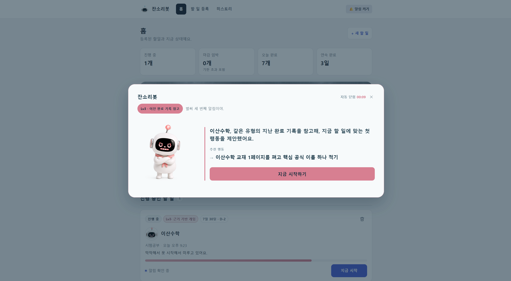
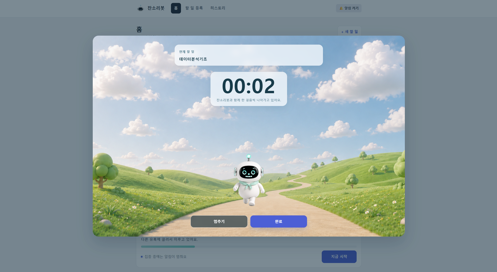
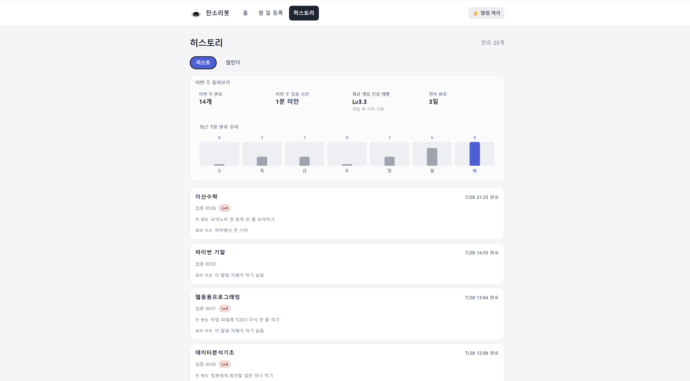
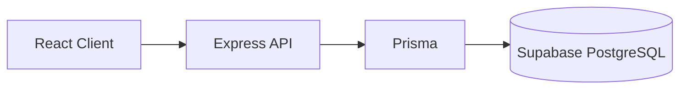
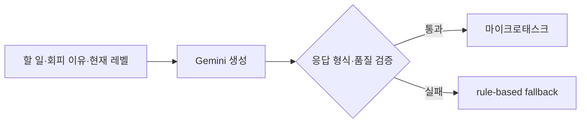
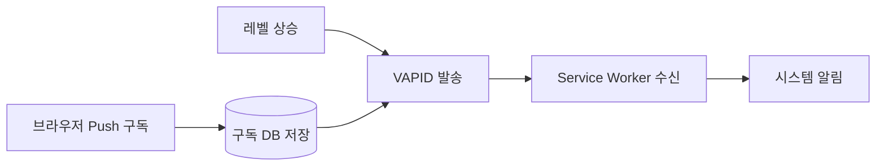

# 잔소리봇

> **회피 이유를 파악하고, 지금 바로 시작할 수 있는 첫 행동을 제안하는 AI 학업 실행 도우미**

잔소리봇은 계획을 세우는 데서 끝나지 않고, 사용자가 실제로 공부를
시작하도록 돕습니다. 할 일과 회피 이유를 확인하고, 상황에 맞는 작은 첫
행동을 제안한 뒤 Focus Mode와 완료 기록까지 연결합니다.

## 문제 정의

대학생은 과제, 시험공부, 발표 준비처럼 해야 할 일을 알고 계획도 세우지만
막상 시작하는 순간에 미루곤 합니다. 이는 단순한 의지 부족만의 문제가
아니라 막막함, 부담감, 피로, 다른 유혹, 완벽하게 해내고 싶은 마음처럼
상황마다 다른 회피 이유에서 시작될 수 있습니다.

잔소리봇은 긴 계획을 다시 제시하는 대신, 회피 이유를 먼저 확인하고
**지금 실행할 수 있는 가장 작은 첫 행동**으로 연결합니다.

## 대상 사용자

- 과제, 시험공부, 발표 준비 등을 자주 미루는 대학생
- 계획은 세우지만 실제 시작이 어려운 사용자
- 부담이 적은 작은 행동부터 시작하고 싶은 사용자

## 핵심 사용자 흐름

```text
Landing
  → 할 일 등록
  → Home에서 상태 확인
  → Lv1~Lv4 개입
  → 첫 행동 제안
  → Focus Mode
  → 완료
  → Completion과 피드백
  → History 확인
```

## 핵심 기능

| 기능                | 현재 구현                                                                                             |
| ------------------- | ----------------------------------------------------------------------------------------------------- |
| 회피 이유 기반 등록 | 할 일 제목·유형·시작 예정 시간·마감 D-day와 예상 회피 이유를 함께 등록합니다.                         |
| 단계별 개입         | 무응답 횟수와 마감 긴급도를 반영해 Lv0~Lv4 개입 단계와 다음 알림 간격을 결정합니다.                   |
| AI 첫 행동 제안     | Lv2·Lv3에서 Gemini로 마이크로태스크를 생성하고 응답 형식과 품질을 검증합니다.                         |
| 안전한 fallback     | Gemini API 오류, timeout, 비정상 응답 또는 품질 검사 실패 시 rule-based 행동을 제공합니다.            |
| Focus Mode          | 직접 시작과 개입 후 시작을 구분하고, 진입 레벨에 맞는 Shared Journey 화면에서 집중 시간을 기록합니다. |
| 세션 복구           | 진행 중인 Focus 세션을 저장하고 새로고침 후 복구합니다.                                               |
| 완료와 History      | 완료 기록을 리스트·캘린더로 확인하고, 이번 주 요약과 최근 7일 완료 추이를 제공합니다.                 |
| 연속 완료           | Asia/Seoul 기준 완료 이벤트로 날짜 기반 연속 완료일을 계산합니다.                                     |
| Web Push            | 레벨 상승 시 VAPID Web Push를 발송하고 Service Worker가 브라우저 알림을 표시합니다.                   |
| Shared Journey UI   | 개입 레벨에 따라 캐릭터 표정과 날씨 배경이 달라지며, Focus와 Completion까지 여정을 이어갑니다.        |
| 완료 피드백         | 완료 후 `도움됐어요` 또는 `아쉬웠어요`를 선택해 저장합니다. 현재 자동 개인화에는 사용하지 않습니다.   |

## 화면

### Lv3 첫 행동 제안



### Shared Journey Focus Mode



### History



구현 화면은 다음 일곱 영역으로 구성됩니다.

- **Landing**: 문제와 서비스 사용 흐름 소개
- **Register**: 할 일, 일정, 예상 회피 이유 등록
- **Home**: 현재 통계, Journey Hero, 상태별 Task 확인
- **Nudge Modal**: Lv1~Lv4 개입과 첫 행동 제안
- **Focus Mode**: 진입 레벨별 Shared Journey와 집중 시간 기록
- **Completion**: 완료 결과와 피드백
- **History**: 완료 리스트·캘린더·최근 Insight

## 기술 스택

| 영역     | 기술                                                 |
| -------- | ---------------------------------------------------- |
| Frontend | React, Vite, React Router                            |
| Backend  | Node.js, Express, TypeScript                         |
| Database | Supabase PostgreSQL, Prisma                          |
| AI       | Gemini API, rule-based fallback                      |
| PWA·알림 | Web Push, VAPID, Service Worker, Web App Manifest    |
| Test     | Vitest, React Testing Library, Supertest, Playwright |
| Deploy   | Vercel                                               |

## 시스템 구조

### 애플리케이션과 데이터



### 첫 행동 생성



### Web Push



현재 다음 알림 시각은 프런트에서 계산합니다. `nextNudgeAt` 영속화와 외부
Cron 기반 서버 스케줄러는 아직 구현되지 않았습니다.

## 로컬 실행

### Quick Start

**아래의 환경변수 설정을 먼저 완료한 후** 루트에서 실행합니다.

```bash
npm install
npm run dev:all
```

환경변수와 개별 실행 명령은 아래에서 확인할 수 있습니다.

### 요구 사항

- Node.js `>=24.11.1`
- Supabase PostgreSQL 프로젝트
- Web Push 또는 Gemini 기능을 사용할 경우 해당 서비스의 키

### 1. 의존성 설치

루트에서 실행하면 npm workspace에 포함된 서버 의존성도 함께 설치됩니다.

```bash
npm install
```

### 2. 환경변수 설정

루트의 `.env.example`을 `.env`로, `server/.env.example`을
`server/.env`로 복사한 뒤 필요한 값을 입력합니다.

프런트 환경변수:

```text
VITE_API_BASE_URL
VITE_VAPID_PUBLIC_KEY
VITE_NUDGE_MODE
```

서버 환경변수:

```text
DATABASE_URL
DIRECT_URL
PORT
VAPID_PUBLIC_KEY
VAPID_PRIVATE_KEY
VAPID_SUBJECT
GEMINI_API_KEY
GEMINI_MODEL
```

- `VITE_NUDGE_MODE`는 `demo` 또는 `production`을 사용합니다.
- VAPID private key와 Gemini API key는 서버 환경변수에만 둡니다.
- 실제 키와 DB 접속 문자열을 저장소에 커밋하지 마세요.

### 3. 실행

프런트만 실행:

```bash
npm run dev
```

Express 서버만 실행:

```bash
npm run dev:server
```

프런트와 서버를 함께 실행:

```bash
npm run dev:all
```

로컬에서 프런트는 `/api` 요청을 Vite proxy를 통해 Express 서버로
전달합니다.

## 테스트

| 명령                  | 역할                                                                  |
| --------------------- | --------------------------------------------------------------------- |
| `npm test`            | 프런트 순수 함수와 React 컴포넌트 회귀 테스트를 실행합니다.           |
| `npm run test:server` | 서버 순수 함수와 Express API 테스트를 실행합니다.                     |
| `npm run test:all`    | 프런트와 서버 Vitest를 차례로 실행합니다.                             |
| `npm run test:e2e`    | Playwright로 로컬 프런트·서버를 실행해 핵심 사용자 흐름을 검증합니다. |
| `npm run typecheck`   | TypeScript와 `checkJs` 대상의 타입 오류를 검사합니다.                 |
| `npm run lint`        | oxlint로 코드 규칙을 검사합니다.                                      |

서버 라우트 테스트와 Playwright fixture는 데이터를 생성할 수 있습니다.
개발·운영 DB가 아닌 **격리된 테스트 DB**를 사용해야 합니다. 서버 테스트에는
테스트 DB가 아니면 실행을 막는 가드가 적용돼 있습니다.

현재 Playwright 자동화 범위:

- Landing 페이지 스모크 테스트
- 등록 폼의 제목·D-day 빈 값 검증
- 할 일 생성 → Home → Focus 완료 → History 핵심 흐름

아직 E2E로 자동화하지 않은 범위:

- 등록 폼 새로고침 동작
- Focus 세션 새로고침 복구
- API 실패 시 오류 UI와 재시도

## 배포와 데모

- **배포**: Vercel Production에서 프런트와 Express serverless API를 제공합니다.
- **데모 영상**: [잔소리봇 시연 영상](https://drive.google.com/file/d/16sl1Tjt1vYiOhui5PHGLSIc_a8QaJ4ze/view?usp=sharing)

저장소에 최종 Production URL이 확정된 형태로 기록돼 있지 않아 Preview 또는
추정 주소를 대표 데모 링크로 싣지 않았습니다.

## AI와 함께한 개발

- 사용자가 문제, 핵심 기능, 우선순위와 최종 제품 판단을 정의했습니다.
- **Claude Code**와 **OpenAI Codex**는 요구사항 분해, 저장소 조사, 설계 검토와
  구현 보조, 테스트, 코드·디자인·문서 검토에 활용했습니다.
- **Gemini**는 서비스 내부에서 사용자의 상황에 맞는 마이크로태스크를 생성합니다.
- AI의 완료 보고와 생성 결과를 그대로 사용하지 않고 실제 코드, 테스트와
  브라우저 동작을 직접 대조하며 수정했습니다.

## 현재 검증 상태

- Vercel Production 배포와 주요 라우팅 검증
- Lv1~Lv4 Nudge → Focus → Completion 흐름 수동 검증
- Desktop Chrome·Edge Web Push 수신
- iPhone 홈 화면에 추가한 PWA의 Web Push 수신
- 주요 화면의 데스크톱·태블릿·모바일 반응형 검토
- Vitest·React Testing Library·Supertest·Playwright 테스트 구성

## 알려진 제한 사항

- Task별 `nextNudgeAt` 서버 저장과 새로고침 후 예약 복구가 아직 없습니다.
- 외부 Cron 기반 서버 알림 스케줄러가 아직 없습니다.
- 저장된 완료 피드백은 다음 개입을 자동 개인화하는 데 사용하지 않습니다.
- Android Chrome 실기기의 Web Push는 아직 검증하지 않았습니다.
- 로그인, 사용자별 데이터 분리와 다중 기기 구독 관리 UI가 없습니다.
- 일부 API 실패 UI와 새로고침 시나리오는 E2E 보강이 필요합니다.

## 상세 문서

- [기획서](./docs/plan.md)
- [화면 단위 와이어프레임](./docs/wireframe.md)
- [현재 상태와 개발 기록](./docs/checklist.md)
- [Shared Journey 디자인 컨셉](./docs/design-concept.md)
- [AI Agent 협업 워크플로우](./docs/workflow.md)
- [위키]
