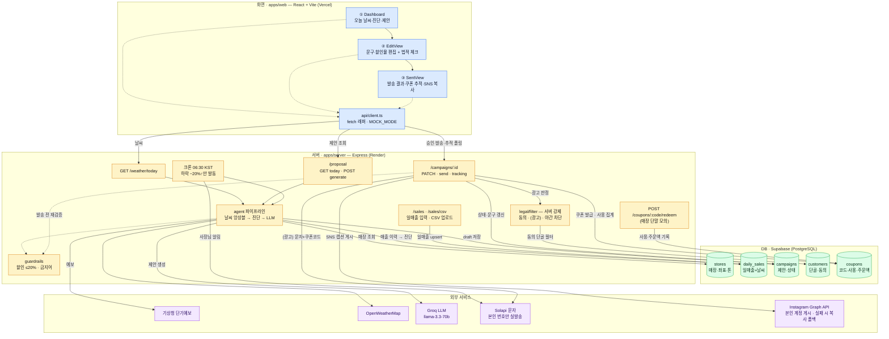

<div align="center">

# ⛅ WeatherPilot

**날씨 데이터로 소상공인의 매출을 지키는 자율 마케팅 에이전트**

에이전트가 날씨·매출을 분석해 마케팅 문구·쿠폰을 미리 만들어 두고,
사장님은 **검토·승인만** 합니다. 발송 후 쿠폰 사용을 추적해 캠페인 효과를 실측합니다.


[📋 프로젝트 보드](https://github.com/users/shyang0319/projects/2) ·
[📖 기획서 Wiki](https://github.com/shyang0319/hub/wiki/%5BN111_%EC%96%91%EC%84%9C%ED%98%95%5D-WeatherPilot(%EC%9B%A8%EB%8D%94%ED%8C%8C%EC%9D%BC%EB%9F%BF)-%EC%84%9C%EB%B9%84%EC%8A%A4-%EA%B8%B0%ED%9A%8D%EC%95%88) ·
[🗂 백로그](docs/WeatherPilot_백로그.md)

</div>

---

## ✨ 주요 기능

- 🌦️ **다중 소스 날씨 앙상블** — 기상청 + OpenWeatherMap을 가중 병합, 한쪽 장애 시 폴백
- 📊 **실매출 기반 진단** — 매출 이력으로 "이 가게는 비 오는 날 −22%"를 실계산
- 🤖 **LLM 마케팅 제안 생성** — 날씨·진단·매장 프로필로 문구·쿠폰 초안 자동 작성
- 🛡️ **법적 필터 서버 강제** — 정보통신망법 `(광고)` 표기·수신동의·야간 차단을 서버에서 보장
- 🎟️ **쿠폰 사용 추적** — 쿠폰 코드 기반 귀속 매출 실측, 캠페인 성과 리포트
- 📷 **SNS 자동 게시** — 인스타그램 본인 계정에 캡션 게시, 미설정·실패 시 "문구 복사" 폴백

```
날씨 수집 → 매출 진단 → LLM 제안 → 검토·승인 → 발송(법적 필터·SNS 게시) → 쿠폰 추적
```

## 🗺 아키텍처

**파랑 = 화면(React) · 주황 = 서버(Express) · 초록 = DB(Supabase) · 보라 = 외부 서비스.** 데이터 흐름 상세는 [아키텍처 문서](docs/아키텍처.md).



## 🛠 기술 스택

| 영역 | 사용 |
|---|---|
| 모노레포 | npm workspaces (`apps/*`, `packages/*`) |
| 프론트 | React + TypeScript (Vite) — 인라인 스타일만 |
| 백엔드 | Node + Express + TypeScript |
| DB | Supabase (PostgreSQL) |
| LLM | Groq (`llama-3.3-70b`, 무료·OpenAI 호환) — 원안 Claude, provider 교체 가능 |
| 외부 연동 | 기상청·OpenWeatherMap(날씨) · Solapi(문자) · Instagram Graph API(본인 계정 게시) |
| 테스트/품질 | Vitest · ESLint · `tsc --noEmit` (GitHub Actions CI) |

## 📁 프로젝트 구조

```
apps/web         프론트 (React, App.tsx 진입)
apps/server      백엔드 — agent(날씨·진단·생성) / routes(API) / db(Supabase)
packages/shared  FE·BE 공용 타입 (날씨·진단·제안)
docs             기획·설계 문서
```

## 🚀 시작하기

> 전제: Node 20+, Supabase 프로젝트

```bash
# 1. 의존성 설치
npm install

# 2. 환경변수 — apps/server/.env 에 작성 (.env.example 참고)
#    KMA_SERVICE_KEY / OWM_API_KEY / SUPABASE_URL / SUPABASE_SECRET_KEY / GROQ_API_KEY

# 3. DB 스키마 — Supabase SQL Editor 에서 apps/server/src/db/schema.sql 실행 후 시드
npm run db:seed -w apps/server

# 4. 개발 서버 (web :5173 + server :4000 동시 기동)
npm run dev
```

빠른 확인:

```bash
curl http://localhost:4000/weather/today   # 오늘 매장 앙상블 날씨
```

## 🎯 구현 스코프 (챌린지 기준)

| 영역 | 처리 |
|---|---|
| 날씨(기상청+OWM) · LLM(Groq) · DB · 문자(Solapi 본인 번호) · Instagram(본인 계정 게시) | ✅ **실연동** |
| POS 연동 | 🔁 수동 일매출 입력 + CSV 업로드로 **대체** |
| 080 수신거부 실회선 · 카카오 알림톡 · 타인 계정 SNS 게시(App Review 필요) | 🎭 **모의** |

> 데모의 "쿠폰 실시간 추적"은 연출이며, 실제로는 쿠폰 코드 기반 누적 집계입니다.
> Instagram·Solapi 모두 **본인 계정/번호에만** 실동작하고, 타인 대상은 모의로 둡니다.

## 📚 문서

- **설계**: [아키텍처](docs/아키텍처.md) · [기획안](docs/WeatherPilot_기획안.md) · [기술 로드맵](docs/WeatherPilot_기술로드맵.md) · [개발 백로그](docs/WeatherPilot_백로그.md)
- **발표**: [1~3주차 발표 자료](docs/WeatherPilot_데모발표_0724.pptx) · [발표 대본](docs/발표대본_1-3주차.md)
