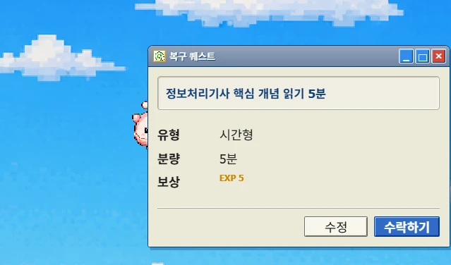
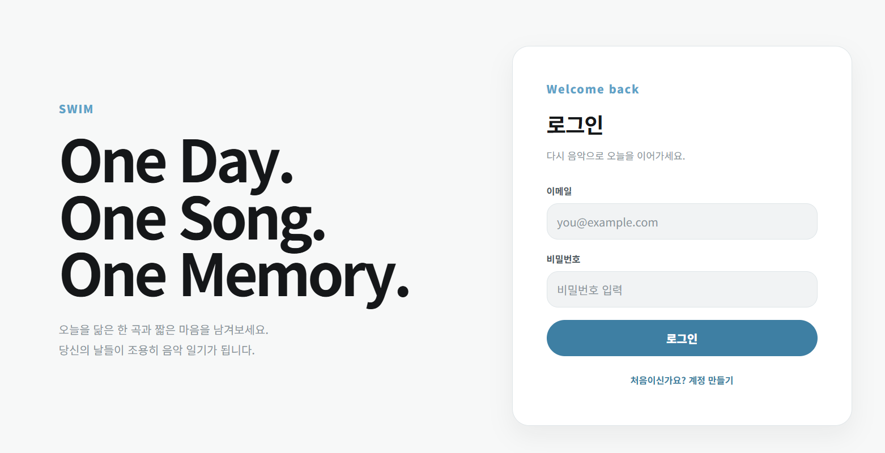
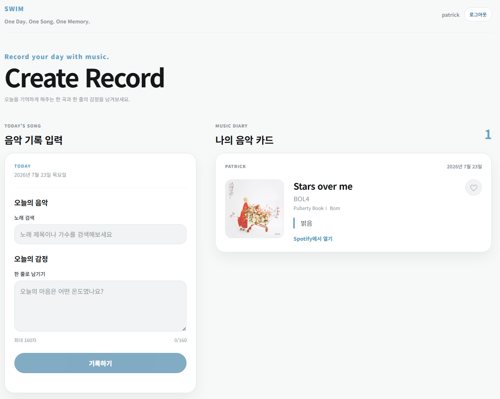

# SWIM

> **One Day. One Song. One Memory.**

SWIM은 하루를 대표하는 음악 한 곡과 짧은 감정을 기록하고, 음악을 통해 다른 사람의 하루를 알아가는 **음악 다이어리 SNS**입니다.

음악 추천이나 스트리밍보다 사람의 기억과 감정에 집중합니다. Spotify는 음악 검색과 외부 감상, 월간 기록의 플레이리스트 내보내기를 위한 도구로 사용합니다.



## 배포 및 시연

| 구분 | 주소·상태 |
|---|---|
| Frontend | Vercel 배포 설정 문서화 — 공개 URL 및 배포 상태 확인 필요 |
| Backend | [Render API](https://swim-scy0.onrender.com) |
| Health Check | [`GET /health`](https://swim-scy0.onrender.com/health) 응답 확인 |
| Demo Video | [Google Drive에서 보기](https://drive.google.com/file/d/1MmuMuZEwLBEagwL7WjqxmIBOhFn5Ak8E/view?usp=drive_link) |

현재 저장소에서 확인할 수 있는 배포 검증 근거는 Render의 `/health` 응답입니다. 타입 검사, 자동 테스트와 프로덕션 빌드는 로컬에서 통과했습니다.

Vercel 공개 URL은 아직 저장소에 기록하지 않았으며, 배포 환경의 브라우저 전체 흐름도 최종 검증 전입니다. URL을 공개할 때는 `showcase/showcase.json`의 `demoUrl`과 위 표에 같은 주소를 추가하고 다음 항목을 실제 환경에서 확인해야 합니다.

- 회원가입·로그인·세션 유지와 음악 기록 저장·조회
- 두 계정의 사용자 검색·팔로우·피드·좋아요 상태 분리
- 원격 Supabase RLS의 다른 사용자 데이터 쓰기 차단
- Spotify 계정 연결과 Monthly Recap 플레이리스트 내보내기
- 라이트·다크·시스템 테마와 데스크톱·모바일 화면
- 브라우저 Console·Network 오류와 민감정보 비노출

## 프로젝트가 해결하는 문제

기존 SNS는 사진이나 긴 글을 중심으로 하루를 기록하기 때문에 꾸준히 작성하기 어렵고, 다른 사람에게 보여주기 위한 표현에 부담을 느끼기 쉽습니다.

SWIM은 기록 단위를 **하루 한 곡과 한 줄의 감정**으로 줄였습니다. 사용자는 오늘을 가장 잘 표현하는 노래를 선택하고, 시간이 지난 뒤 날짜순 음악 다이어리와 Monthly Recap으로 자신의 하루를 다시 돌아볼 수 있습니다.

## 핵심 사용자 흐름

```text
회원가입·로그인
→ Spotify 음악 검색
→ 오늘의 음악 선택
→ 감정 한 줄 작성
→ 음악 기록 저장
→ 내 음악 다이어리 확인
→ 닉네임으로 사용자 검색
→ 공개 프로필과 음악 다이어리 확인
→ 팔로우·좋아요
→ 팔로잉 피드 확인
→ Monthly Recap
→ Spotify 비공개 플레이리스트 내보내기
```

## 주요 기능

### 하루 한 곡 기록

- Spotify 트랙 검색과 선택
- 앨범 이미지, 곡명, 아티스트, 앨범 정보 저장
- 짧은 감정 기록
- 사용자별 하루 한 건 중복 방지
- Spotify 외부 감상 링크

### 사람을 중심으로 한 음악 SNS

- 고유 닉네임 기반 사용자 검색
- 공개 프로필과 오늘의 기록
- 날짜순 공개 음악 다이어리
- 팔로우·언팔로우
- 팔로잉 사용자의 최신 음악 기록 피드
- 음악 기록을 함께 기억한 인원과 닉네임 목록

### Monthly Recap과 Spotify

- 월별 기록 일수와 음악 타임라인
- 자주 함께한 아티스트
- 그달의 첫 음악과 마지막 음악
- Spotify 사용자 계정 연결
- 해당 월의 기록을 Spotify 비공개 플레이리스트로 내보내기
- 같은 연월의 플레이리스트 중복 생성 방지

### 사용자 경험

- 라이트·다크·시스템 테마
- 테마 선택값의 브라우저 저장
- 로딩·빈 상태·오류·재시도 상태 구분
- 공개 프로필 URL 직접 접근, 새로고침과 뒤로 가기 지원
- 앨범 이미지와 감정 기록을 중심으로 한 카드 기반 UI

## 화면

| 로그인 | 메인 |
|---|---|
|  |  |

## 기술 스택

| 영역 | 기술 |
|---|---|
| Frontend | React 19, TypeScript, Vite, CSS |
| Backend | Node.js, Express 5, REST API |
| Database·Auth | Supabase, PostgreSQL, Supabase Auth, RLS |
| Music API | Spotify Web API |
| Test | Vitest, Testing Library, Node Test Runner |
| Deploy | Vercel, Render |
| Version Control | Git, GitHub |

## 아키텍처

```text
Browser
├─ Supabase Auth ───────────────→ 회원가입·로그인·세션
└─ React on Vercel
   └─ Bearer Token
      └─ Express on Render
         ├─ Supabase PostgreSQL → 기록·프로필·관계·Recap
         └─ Spotify Web API
            ├─ Client Credentials → 음악 검색
            └─ User OAuth         → 비공개 플레이리스트
```

Express 내부에서는 다음 책임 분리를 유지합니다.

```text
Route
→ Controller
→ Service
→ Supabase 또는 Spotify Web API
```

React는 Spotify Web API를 직접 호출하지 않습니다. Spotify Client ID, Client Secret, 사용자 OAuth token과 Supabase Service Role Key는 Render 서버 환경에서만 사용합니다.

### 인증 구분

| 목적 | 인증 방식 |
|---|---|
| SWIM 회원가입·로그인 | Supabase Auth |
| Spotify 음악 검색 | Express의 Client Credentials Flow |
| Spotify 플레이리스트 생성 | Authorization Code Flow |

Spotify 사용자 token은 AES-256-GCM으로 암호화해 서버 전용 테이블에 저장합니다. 브라우저와 일반 Supabase 사용자는 OAuth state, access token과 refresh token을 직접 읽을 수 없습니다.

### 데이터 모델

| 테이블 | 역할 | 주요 제약 |
|---|---|---|
| `profiles` | 공개 닉네임·소개·아바타 | Auth 사용자와 1:1, 정규화 닉네임 고유 |
| `music_records` | 하루 음악 기록 | `(user_id, record_date)` 고유 |
| `follows` | 사용자 팔로우 관계 | `(follower_id, following_id)` 복합 키, 자기 팔로우 방지 |
| `likes` | 사용자별 음악 기록 좋아요 | `(user_id, record_id)` 복합 키 |
| `spotify_oauth_states` | 일회용 OAuth state hash | 10분 만료, 서버 전용 |
| `spotify_connections` | 암호화된 Spotify 사용자 token | 사용자별 한 건, 서버 전용 |
| `spotify_playlist_exports` | 월별 플레이리스트 내보내기 | 사용자·연·월 복합 키 |

### 보안 원칙

- Express가 Supabase access token을 검증하고 요청 사용자를 확정합니다.
- 음악 기록의 `user_id`, 팔로우의 `follower_id`, 좋아요의 `user_id`를 요청 본문에서 신뢰하지 않습니다.
- RLS로 자신의 기록 생성·수정·삭제와 자신의 관계 변경만 허용합니다.
- 공개 API에는 다른 사용자의 이메일과 Auth UUID를 반환하지 않습니다.
- 좋아요 전체 수는 원본 관계를 노출하지 않는 제한된 RPC로 집계합니다.
- Spotify OAuth 테이블은 `anon`, `authenticated` 권한을 회수하고 Service Role만 사용합니다.

상세 구조는 [Architecture 문서](docs/architecture.md)에서 확인할 수 있습니다.

## 로컬 실행

### 1. 저장소와 의존성 준비

```bash
git clone https://github.com/lkslks4511/SWIM.git
cd SWIM
npm install
```

### 2. 환경변수 설정

루트의 `.env.example`을 참고해 `.env`를 생성합니다.

Frontend:

```env
VITE_API_BASE_URL=http://localhost:3000
VITE_SUPABASE_URL=https://your-project.supabase.co
VITE_SUPABASE_ANON_KEY=your-public-anon-key
```

Backend:

```env
SUPABASE_URL=https://your-project.supabase.co
SUPABASE_ANON_KEY=your-public-anon-key
SUPABASE_SERVICE_ROLE_KEY=server-only-service-role-key

SPOTIFY_CLIENT_ID=spotify-client-id
SPOTIFY_CLIENT_SECRET=server-only-spotify-client-secret
SPOTIFY_REDIRECT_URI=http://127.0.0.1:3000/api/spotify/callback
SPOTIFY_TOKEN_ENCRYPTION_KEY=base64-encoded-32-byte-key

APP_FRONTEND_URL=http://localhost:5173
APP_TIME_ZONE=Asia/Seoul
```

`APP_TIME_ZONE`은 선택 항목이며, 설정하지 않으면 서버가 `Asia/Seoul`을 기본값으로 사용합니다.

`VITE_SUPABASE_ANON_KEY`는 브라우저에서 사용하는 공개 anon key입니다. `SUPABASE_SERVICE_ROLE_KEY`, `SPOTIFY_CLIENT_SECRET`, `SPOTIFY_TOKEN_ENCRYPTION_KEY`는 `VITE_` 환경변수로 만들거나 Git에 커밋하면 안 됩니다.

`SPOTIFY_TOKEN_ENCRYPTION_KEY`는 32바이트 base64 값이어야 합니다. 예:

```bash
openssl rand -base64 32
```

Spotify Developer Dashboard에는 `SPOTIFY_REDIRECT_URI`와 완전히 같은 callback URL을 등록해야 합니다.

### 3. Supabase SQL 적용

Supabase SQL Editor에서 다음 순서로 적용합니다.

```text
server/supabase/profiles.sql
→ server/supabase/migrations/20260724_nickname_identity.sql
→ server/supabase/follows.sql
→ server/supabase/music_records.sql
→ server/supabase/likes.sql
→ server/supabase/spotify_connections.sql
```

닉네임 마이그레이션과 음악 기록 고유 제약을 적용하기 전에는 기존 중복 데이터를 확인해야 합니다. SQL은 기존 중복 데이터를 임의로 삭제하지 않습니다.

### 4. 애플리케이션 실행

터미널 두 개에서 각각 실행합니다.

```bash
npm run server
```

```bash
npm run dev
```

| 서비스 | 로컬 주소 |
|---|---|
| Frontend | `http://localhost:5173` |
| Backend | `http://localhost:3000` |
| Health Check | `http://localhost:3000/health` |

## 배포

### Vercel Frontend

| 설정 | 값 |
|---|---|
| Framework Preset | Vite |
| Build Command | `npm run build` |
| Output Directory | `dist` |
| Install Command | `npm install` |
| Production Branch | `main` |

Vercel 환경변수:

```env
VITE_API_BASE_URL=https://swim-scy0.onrender.com
VITE_SUPABASE_URL=https://your-project.supabase.co
VITE_SUPABASE_ANON_KEY=your-public-anon-key
```

### Render Backend

| 설정 | 값 |
|---|---|
| Service Type | Web Service |
| Build Command | `npm install` |
| Start Command | `npm run server` |
| Production Branch | `main` |
| Health Check Path | `/health` |

Render에는 앞에서 설명한 Backend 환경변수를 모두 등록하고, 다음 항목은 운영 주소와 값으로 설정합니다.

```env
SPOTIFY_REDIRECT_URI=https://swim-scy0.onrender.com/api/spotify/callback
APP_FRONTEND_URL=https://your-vercel-domain.vercel.app
APP_TIME_ZONE=Asia/Seoul
```

환경변수를 변경하면 해당 서비스를 다시 배포해야 합니다. Spotify Developer Dashboard의 Redirect URI도 Render callback 주소와 일치해야 합니다.

### 현재 배포 제한사항

- Express는 아직 `cors()` 기본 설정을 사용하므로 배포 환경의 CORS origin allowlist가 적용되지 않았습니다.
- 최신 SQL과 RLS가 원격 Supabase에서 실제로 동작하는지 두 계정으로 검증해야 합니다.
- Vercel 공개 URL에서 회원가입부터 Spotify 플레이리스트 내보내기까지 브라우저 E2E 검증이 필요합니다.
- 데스크톱·모바일의 라이트·다크·시스템 테마와 Console·Network 결과가 아직 수동 검증되지 않았습니다.

## API 요약

모든 보호 API는 다음 헤더를 사용합니다.

```http
Authorization: Bearer <supabase-access-token>
```

| Method | Path | 역할 | 인증 |
|---|---|---|---|
| GET | `/health` | 서버 상태 확인 | 불필요 |
| GET | `/api/spotify/search?q=` | Spotify 트랙 검색 | 불필요 |
| GET | `/api/music-records` | 내 음악 기록 조회 | 필요 |
| POST | `/api/music-records` | 오늘의 음악 기록 생성 | 필요 |
| GET | `/api/users?q=` | 닉네임 기반 사용자 검색 | 필요 |
| GET | `/api/users/{nickname}` | 공개 프로필 조회 | 필요 |
| GET | `/api/users/{nickname}/music-records?cursor=` | 공개 음악 다이어리 조회 | 필요 |
| POST | `/api/follows` | 팔로우 | 필요 |
| DELETE | `/api/follows/{nickname}` | 언팔로우 | 필요 |
| GET | `/api/feed` | 팔로잉 음악 피드 | 필요 |
| GET | `/api/music-records/{id}/likes?cursor=` | 함께 기억한 사용자 조회 | 필요 |
| POST | `/api/music-records/{id}/likes` | 좋아요 | 필요 |
| DELETE | `/api/music-records/{id}/likes` | 좋아요 취소 | 필요 |
| GET | `/api/recaps/monthly?year=&month=` | Monthly Recap | 필요 |
| GET | `/api/spotify/connect` | Spotify 연결 URL 생성 | 필요 |
| GET | `/api/spotify/callback` | Spotify OAuth callback | 일회용 state |
| GET | `/api/spotify/connection` | Spotify 연결 상태 | 필요 |
| DELETE | `/api/spotify/connection` | Spotify 연결 해제 | 필요 |
| POST | `/api/spotify/playlists` | 월간 비공개 플레이리스트 내보내기 | 필요 |

## 프로젝트 구조

```text
SWIM
├─ config/                 # Vite·TypeScript 설정
├─ docs/                   # Architecture·QA 문서
├─ server/
│  ├─ controllers/        # HTTP 입력·응답
│  ├─ lib/                # Supabase 클라이언트
│  ├─ middleware/         # Bearer token 인증
│  ├─ routes/             # Express API 경로
│  ├─ services/           # DB·Spotify 비즈니스 로직
│  ├─ supabase/           # 테이블·RLS·마이그레이션 SQL
│  ├─ app.js
│  └─ server.js
├─ showcase/              # 썸네일·화면·포트폴리오 메타데이터
├─ src/
│  ├─ components/         # React 화면 컴포넌트
│  ├─ lib/                # 브라우저 Supabase 클라이언트
│  ├─ services/           # 프론트 API·인증 서비스
│  ├─ styles/             # 전역 CSS와 테마 토큰
│  ├─ types/              # 공유 TypeScript 타입
│  ├─ utils/              # 날짜 유틸리티
│  └─ validation/         # 입력 검증
├─ .env.example
├─ AGENTS.md
├─ package.json
└─ README.md
```

## 테스트와 검증

```bash
npm run typecheck
npm test
npm run build
```

2026-07-30 기준:

- TypeScript 타입 검사 통과
- Vitest 프론트엔드 테스트 143개 통과
- Node 서버 테스트 98개 통과
- Vite 프로덕션 빌드 통과
- Render `/health` 응답 확인

자동 테스트는 인증, 입력 검증, 하루 한 기록, 닉네임 검색, 팔로우, 피드, 좋아요, 공개 프로필, Monthly Recap, Spotify OAuth, 플레이리스트 복구·중복 방지와 테마 저장·전환을 포함합니다.

배포 환경의 두 계정 사용자 흐름, 원격 RLS, Spotify 실제 플레이리스트, 테마 시각 검증은 아직 완료되지 않았습니다. 상세 재현 절차와 `BLOCKED` 상태는 [QA 문서](docs/qa-report.md)에 기록되어 있습니다.

## MVP 범위

### 구현

- 회원가입·로그인·로그아웃·세션 유지
- 음악 검색·선택·기록·조회
- 공개 프로필·사용자 검색
- 팔로우·언팔로우·팔로잉 피드
- 좋아요·좋아요 사용자 목록
- Monthly Recap
- Spotify 비공개 플레이리스트 내보내기
- 라이트·다크·시스템 테마

### 제외

- 댓글
- 알림
- DM과 실시간 채팅
- 공개·협업 Spotify 플레이리스트
- AI 감정 분석과 복잡한 추천 알고리즘
- 관리자 페이지

## 문서

- [Architecture](docs/architecture.md)
- [Integration QA](docs/qa-report.md)
- [Weekly Plan](weekly-plan.md)
