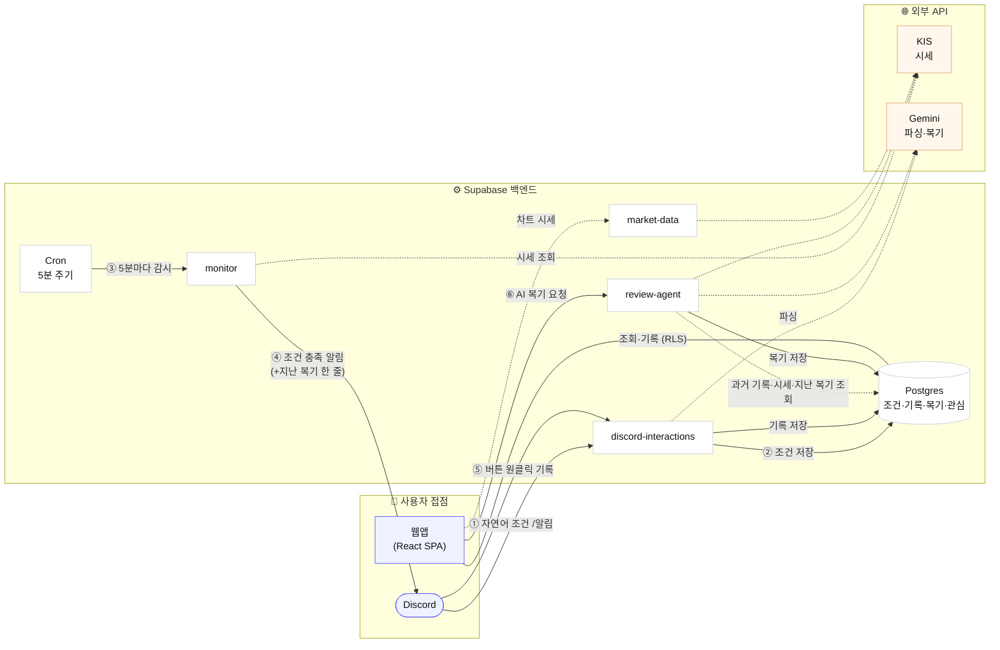

# Beacon

> 말을 걸면 지켜보고, **내 기록을 기억해 코치하는** AI 투자 에이전트

**Beacon**은 복잡한 설정 화면이나 명령어 대신 *대화*로 움직이는 투자 코치입니다. "삼성전자가 8만 원이 되면 알려줘"처럼 평소 말투로 조건을 걸면 시장을 대신 지켜보다 Discord로 알려주고, 그렇게 실행한 매매를 AI가 **과거 기록까지 끌어와** 복기해 투자 습관을 돌아보게 합니다. 복기는 단순 분석이 아니라, 과거 매매·주가 흐름·지난 복기를 도구로 직접 조회해 판단하는 **코칭 에이전트**입니다.

서비스는 **통합 웹앱을 본체**로 하고, Discord는 자연어 조건 입력과 알림 수신 채널로 사용합니다. Supabase 기반 다중 사용자 구조로, 각 사용자의 Discord와 투자 저널이 같은 계정 아래에서 데이터를 공유합니다. 구현은 1단계(1인용 MVP로 감시→기록→복기 루프 완성) → 2단계(다중 사용자 확장) 순서로 진행합니다. 기존 두 프로젝트를 하나의 서비스로 결합합니다.

**기술 스택**: Vite + React (웹) · Supabase (DB·Auth·Edge Functions·Cron) · Gemini (자연어 파싱·복기 에이전트) · KIS Open API · Discord

- [KIS_openapi](https://github.com/gyuwonlee1/KIS_openapi) — 감시하는 눈 · 자연어 입력
- [investment_journal](https://github.com/gyuwonlee1/investment_journal) — 복기하는 코치 · 차트 기록

## 아키텍처

화면(웹앱·Discord) · 백엔드(Supabase) · 외부 API(KIS·Gemini)가 **감시 → 기록 → 복기** 루프로 이어집니다. 번호(①~⑥)가 데이터가 흐르는 순서입니다.



1. **감시 조건 등록** — Discord에 "삼성전자가 8만 원이 되면 알려줘"처럼 말하면 `discord-interactions`가 Gemini로 파싱해 `conditions`에 저장합니다.
2. **감시** — `Cron`이 5분마다 `monitor`를 깨우고, `monitor`가 KIS 시세로 조건을 평가합니다.
3. **알림** — 조건이 충족되면 그 사용자의 Discord 채널로 알림을 보냅니다(같은 종목의 지난 복기 한 줄을 함께).
4. **원클릭 기록** — 알림의 매수/매도/관망 버튼을 누르면 `discord-interactions`가 `trades`에 바로 기록합니다.
5. **웹앱** — 대시보드·차트·히스토리는 Supabase DB를 직접 읽고 쓰며(RLS로 사용자별 격리), 차트 시세는 `market-data`가 KIS에서 가져옵니다.
6. **AI 복기(거울 프레임)** — "AI 복기"를 누르면 `review-agent`가 과거 기록·시세·지난 복기를 도구로 조회해, 매매를 *추천*하지 않고 **내 행동을 되비추는** 복기를 만들어 `reviews`에 저장합니다.

## 문서

- [기획서 (docs/plan.md)](docs/plan.md) — 문제·페르소나·차별점·에이전트다움·핵심 기능·아키텍처·KPI·일정
- [상세 구현 스펙 (docs/prd.md)](docs/prd.md) — DB 스키마·에이전트 도구 계약·화면 스펙·수용 기준
- [디자인 시스템 (docs/design.md)](docs/design.md) — 색·타이포·간격·컴포넌트 토큰의 단일 원천
- [개발 로드맵 (docs/roadmap.md)](docs/roadmap.md) — 현재 상태 스냅샷과 작업 백로그
- [기술 조사 (docs/research.md)](docs/research.md) — 원본 레포 포팅 참조
- [Discord 계정 연동 설계 (docs/discord-linking.md)](docs/discord-linking.md)
- [태스크 보드 (Notion)](https://app.notion.com/p/c70d4abe279049b193ced8b118663de3?v=39c581f4e3758160868f000c2b977634&source=copy_link)

## 폴더 구조

- `src/`, `public/` — Vite+React 웹앱
- `supabase/` — Edge Functions·마이그레이션·종목 seed
- `scripts/` — 로컬 초기화·운영 스크립트
- `docs/` — 기획·디자인·개발 문서

## 실행

저장소 루트에서 설치하고 실행합니다.

```bash
npm install
npm run dev             # http://localhost:5173
npm run lint
npm run build
```
