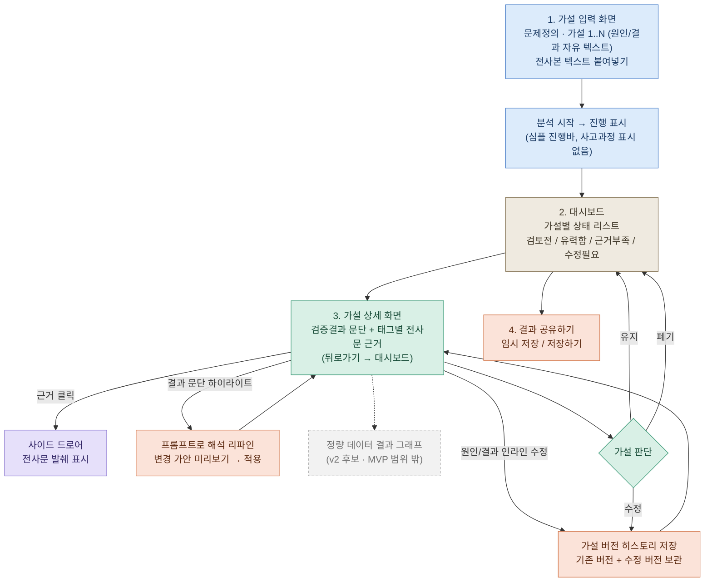

# hub

# 가설 검증 인터뷰 분석 도구 기획서

## 문제 정의

PM이 유저 인터뷰를 진행한 뒤, 가설 대비 답변을 정리하고 결론을 도출하는 데 시간이 너무 많이 든다.

## 핵심 가치: 판단 근거가 사슬로 남는다

Claude 같은 범용 AI 스킬로 인터뷰를 분석해도, 그 판단의 근거는 대화가 끝나는 순간 함께 휘발된다. 나중에 "그 결론 왜 그렇게 냈어?"라는 질문을 받으면 대화 기록을 처음부터 다시 훑어야 한다 — 이건 스킬이라는 형태가 구조적으로 못 하는 일이다.

이 도구는 판단이 나온 경로를 지우지 않는다. **가설 → 검증결과 문단 → 근거 번호 → 원문 발췌(드로어) → 수정 이력(버전 히스토리) → 최종 판단(유지/수정/폐기)**이 하나의 사슬로 DB에 남는다. 리서치 결론에 대한 질문을 받는 순간, 이 근거 사슬을 바로 되짚어 보여줄 수 있다는 것 자체가 이 도구의 실질 가치이자 범용 AI 스킬 대비 명확한 방어선이다.

이건 새로 만들 기능이 아니라, 아래 핵심 기능과 화면 흐름에 이미 설계돼 있는 것들 — ② 가설별 답변 분석(태깅), 검증결과 근거 참조, 가설 버전 히스토리, 유지/수정/폐기 상태 — 에 이름을 붙이는 작업이다.

## 사용자 시나리오

1. 인터뷰이와 만나기 전, 검증하고 싶은 가설을 원인/결과 형태로 입력한다.
2. 인터뷰 전사본 텍스트를 업로드/붙여넣고 분석을 시작한다.
3. 대시보드에서 가설별 검증 상태(검토 전 / 유력함 / 근거 부족 / 수정 필요)를 한눈에 확인한다.
4. 특정 가설을 눌러 상세 화면으로 들어가면, AI가 정리한 검증결과 문단과 태그별 인터뷰 근거를 확인한다.
5. 근거를 클릭하면 사이드 드로어로 해당 전사문 발췌를 확인한다.
6. 결과 문단 중 동의하지 않는 부분을 하이라이트하고, 프롬프트로 대화하며 해석을 리파인한다. 변경 가안을 미리보고 적용 여부를 결정한다.
7. 가설 자체가 틀렸다고 판단되면 상세 화면에서 원인/결과 필드를 인라인으로 수정한다. 기존 버전과 수정 버전이 모두 히스토리로 남는다.
8. 가설별로 유지 / 수정 / 폐기 상태를 지정한다.
9. 전체 결과를 저장하거나 팀에 공유한다.

## 핵심 기능

우선순위 판단 기준: **필수성**(없으면 서비스가 안 돌아가는가) / **적합성**(문제정의를 정확히 해결하는가)

| 기능 | 설명 | 비고 |
|---|---|---|
| **① 가설 입력** | 원인/결과를 자유 텍스트 필드로 분리 입력. 드롭다운 미사용(초기 옵션셋 설계 오버엔지니어링 방지) | 상세화면 인라인 수정과 동일 구조, 버전 히스토리 저장 |
| **② 가설별 답변 분석(태깅)** | 전사본을 가설 단위로 재배열. AI는 발언을 가설에 분류(classification)만 하고, 최종 해석·검증 판단은 사람이 함 | **MVP 필수 기능** — 문제정의(정리 시간 단축)와 정확히 일치 |

## 화면 흐름

- 파란색: 가설 입력 · 진행 표시
- 베이지색: 대시보드 (가설 간 이동 지점)
- 초록색: 가설 상세 화면 · 판단
- 보라색: 사이드 드로어
- 코랄색: 리파인 · 버전 관리 · 저장/공유 루프
- 회색 점선: MVP 범위 밖(v2 후보)

## 5. 4주 개발 계획 (한눈에 보기)

| 주차 | 핵심 키워드 |
|---|---|
| **2주차** | 가설 입력 화면 구현 — 원인·결과 단답식, 가설 추가, 문제정의 장문 입력, 분석 요청 MD 전송 |
| **3주차** | 대시보드 구현 — 상태 리스트, 유지·수정·폐기, 공유/임시저장/저장, 버전 히스토리 DB 설계 |
| **4주차** | AI 분석 로직 구현 — 검증결과 생성, 근거-전사문 참조 시스템, 반박 프롬프트 연동 |

> 세부 체크리스트는 원본 4주 계획 문서를 그대로 유지하며, 진행 중 불명확한 항목은 그때그때 확인이 필요합니다.