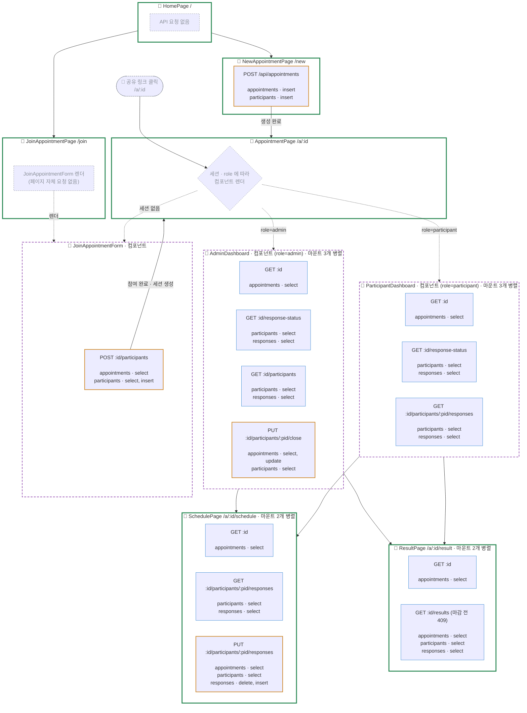
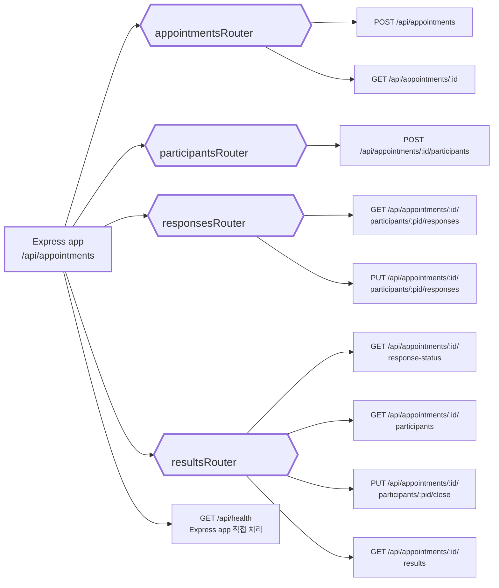

# 문서

[기획](https://github.com/Ladea1224/hub/wiki/%EA%B8%B0%ED%9A%8D_%EC%B5%9C%EC%A2%85)

[개발 테스크](https://fish-quark-a38.notion.site/81045f08993647048109a5d222ae4e25?v=8c8e2fea06f04edb8508e3d632f3b8c3&source=copy_link)

# FlowChart

## FE-BE-DB

## Routers

## API별 DB 접근 매트릭스
DB는 서버의 Supabase 클라이언트를 통해 PostgreSQL에 접근한다.

### `appointmentsRouter`

| API | `appointments` | `participants` | `responses` |
|---|---|---|---|
| `POST /api/appointments` | INSERT<br>관리자 생성 실패 시 DELETE | INSERT (`role=admin`) | — |
| `GET /api/appointments/:id` | SELECT | — | — |

### `participantsRouter`

| API | `appointments` | `participants` | `responses` |
|---|---|---|---|
| `POST /api/appointments/:id/participants` | SELECT<br>약속 존재 및 정원 확인 | SELECT<br>기존 참여자 확인<br>신규이면 INSERT | — |

### `responsesRouter`

| API | `appointments` | `participants` | `responses` |
|---|---|---|---|
| `GET /api/appointments/:id/participants/:pid/responses` | — | SELECT<br>소속 참여자 확인 | SELECT<br>기존 응답 조회 |
| `PUT /api/appointments/:id/participants/:pid/responses` | SELECT<br>시간 범위 및 마감 확인 | SELECT<br>소속 참여자 확인 | DELETE<br>새 응답 INSERT |

### `resultsRouter`

| API | `appointments` | `participants` | `responses` |
|---|---|---|---|
| `GET /api/appointments/:id/response-status` | — | SELECT<br>약속 참여자 ID 조회 | SELECT<br>응답 완료 인원 집계 |
| `GET /api/appointments/:id/participants` | — | SELECT<br>참여자 ID 및 이름 조회 | SELECT<br>참여자별 응답 여부 확인 |
| `PUT /api/appointments/:id/participants/:pid/close` | SELECT<br>미마감이면 `closed_at` UPDATE | SELECT<br>관리자 역할 확인 | — |
| `GET /api/appointments/:id/results` | SELECT<br>마감 여부 확인 | 마감된 경우 SELECT | 마감된 경우 SELECT<br>슬롯별 결과 집계 |

### DB 테이블 관계

```text
appointments
  └── participants
        └── responses