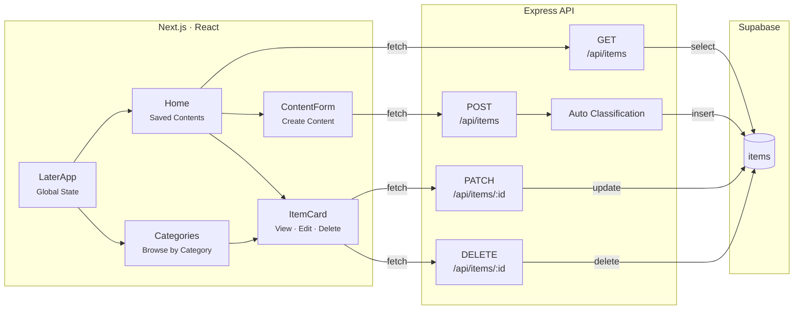

## System Architecture

```mermaid
flowchart LR

%% =======================
%% React
%% =======================

subgraph FE["Next.js · React"]
direction TB

APP["LaterApp<br/><small>Global State</small>"]

HOME["Home<br/><small>Saved Contents</small>"]

CATEGORY["Categories<br/><small>Browse by Category</small>"]

FORM["ContentForm<br/><small>Create Content</small>"]

CARD["ItemCard<br/><small>View · Edit · Delete</small>"]

APP --> HOME
APP --> CATEGORY
HOME --> FORM
HOME --> CARD
CATEGORY --> CARD

end

%% =======================
%% Express
%% =======================

subgraph BE["Express API"]
direction TB

GET["GET<br/>/api/items"]

POST["POST<br/>/api/items"]

PATCH["PATCH<br/>/api/items/:id"]

DELETE["DELETE<br/>/api/items/:id"]

CLASSIFY["Auto Classification"]

end

%% =======================
%% Supabase
%% =======================

subgraph DB["Supabase"]
direction TB

TABLE[("items")]

end

%% =======================
%% React → API
%% =======================

HOME -->|fetch| GET

FORM -->|fetch| POST

CARD -->|fetch| PATCH

CARD -->|fetch| DELETE

%% =======================
%% API
%% =======================

POST --> CLASSIFY

%% =======================
%% API → DB
%% =======================

GET -->|select| TABLE

CLASSIFY -->|insert| TABLE

PATCH -->|update| TABLE

DELETE -->|delete| TABLE
```
