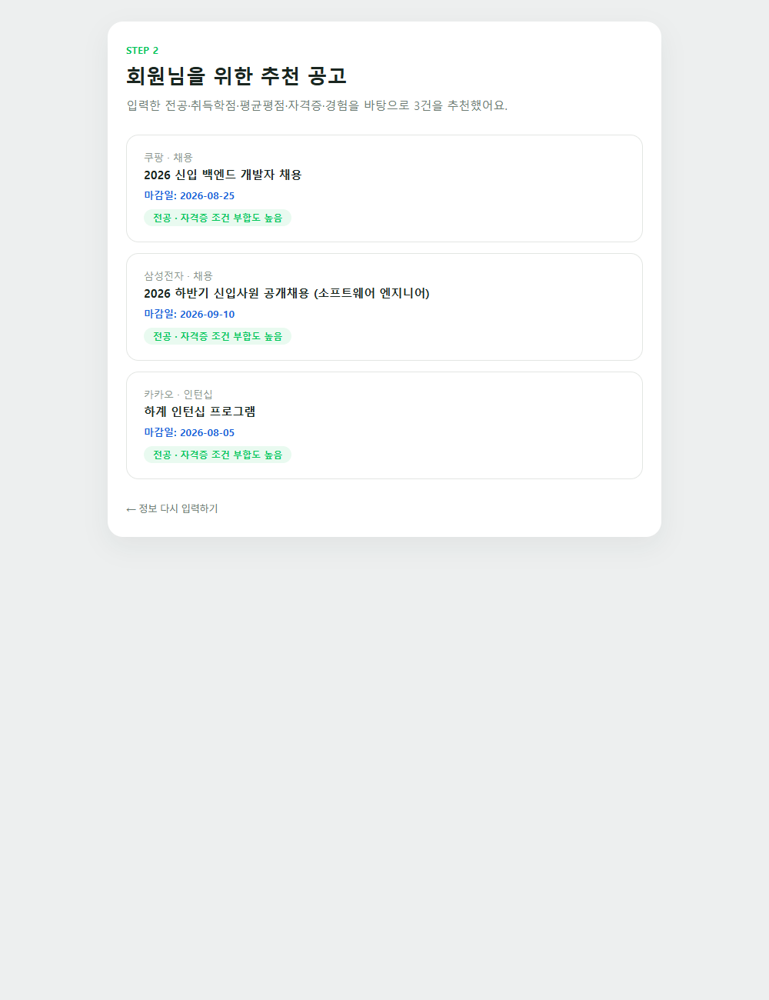
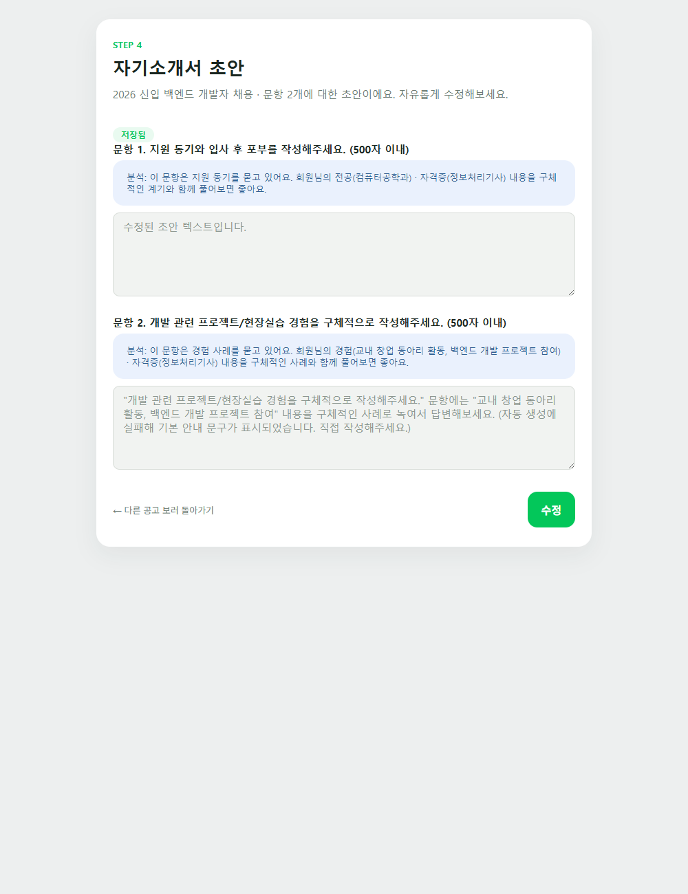
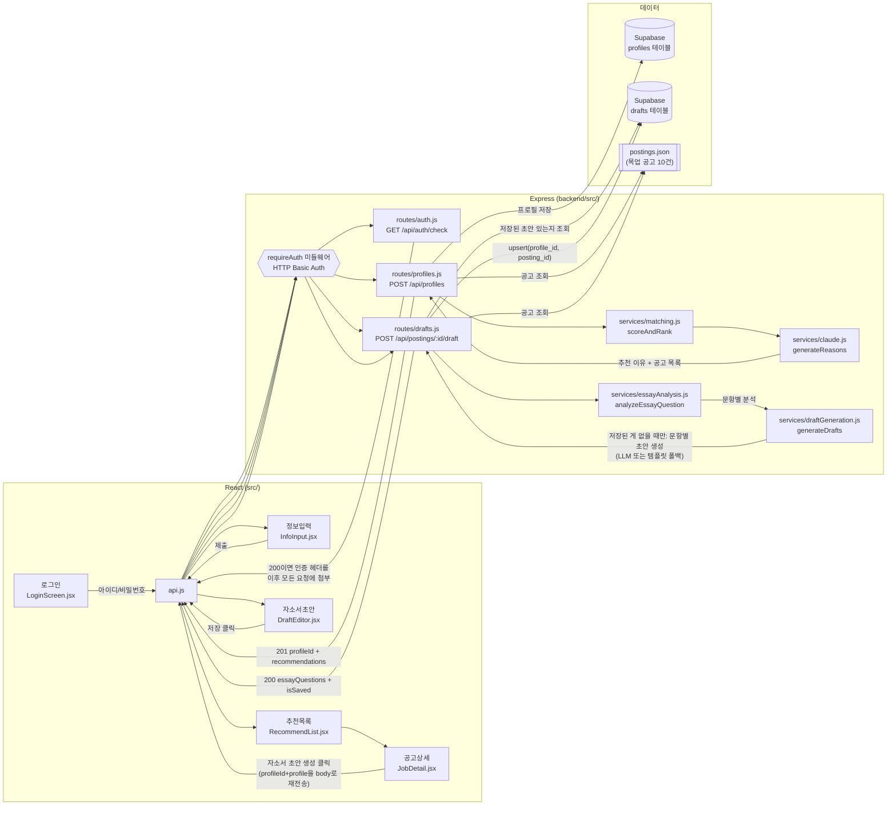
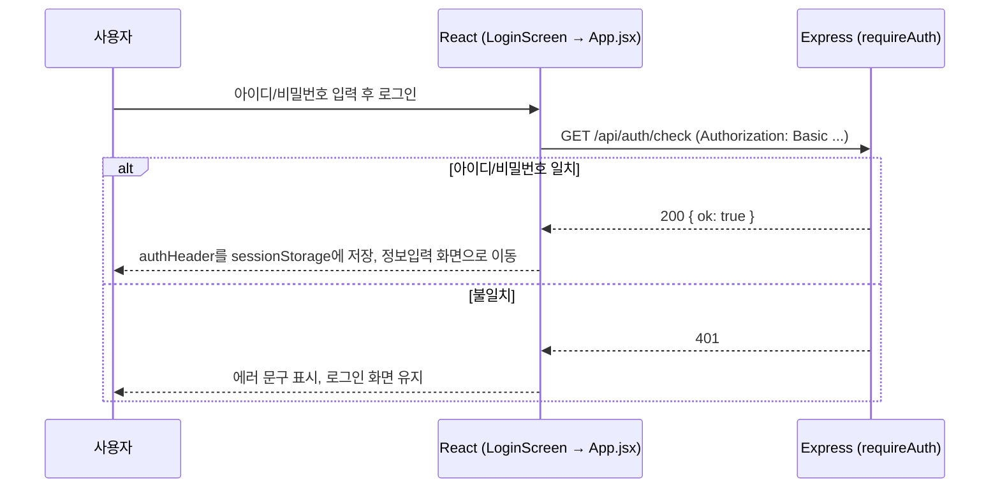
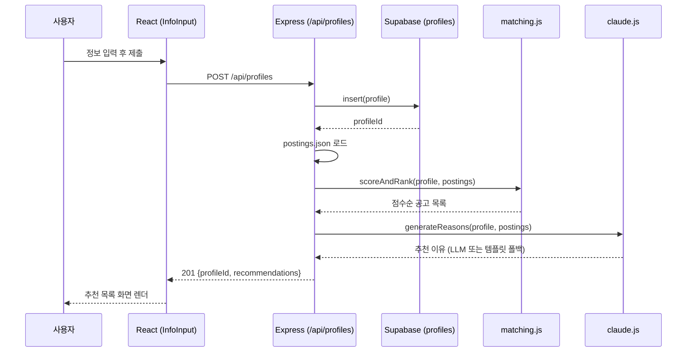
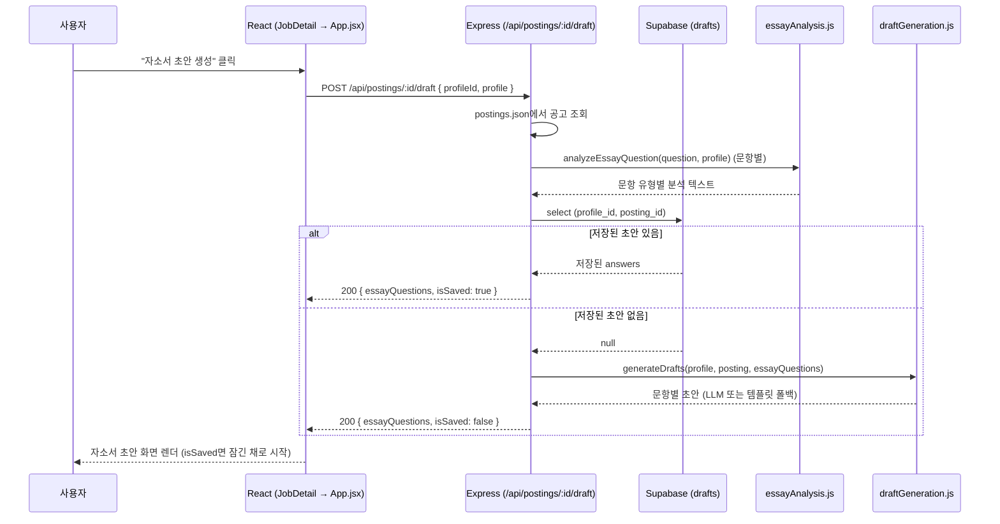
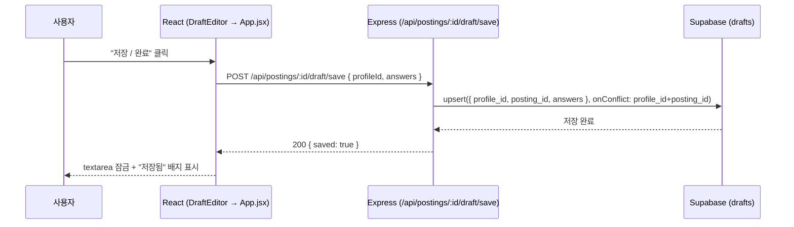

# 진로 에이전트 서비스 (링커리어 공고 추천 & 자소서 초안 Agent)

## 문제 정의

대학생은 신입 공채·인턴십·공모전·대외활동 공고 중 자신에게 맞는 것을 고르기 어렵고, 자기소개서 문항에 맞춰 자기 경험을 정리해 쓰는 데도 어려움을 겪는다.

→ 전공·경험 기반 맞춤 추천 + AI 자소서 초안 생성으로 해결

## 핵심 기능

1. **전공·학점·자격증·경험 기반 맞춤 공고 추천** — 추천 이유와 주요 조건을 함께 제공
2. **선택한 공고의 자소서 문항 분석 → 경험을 반영한 문항별 초안 생성**

기획은 [docs/plan.md](docs/plan.md), 4주 개발 Task는 [docs/checklist.md](docs/checklist.md) 참고.

이번 주 작업 현황은 [GitHub Issues](https://github.com/dohyeon-k/hub/issues)에서 확인할 수 있다(우선순위는 `P0`/`P1`/`P2` 라벨로 표시). 진행 상황은 Project 보드에서도 칸반 형태로 볼 수 있다: [2주차 - 공고 추천 슬라이스](https://github.com/users/dohyeon-k/projects/1), [3주차 - 자소서 초안 생성 슬라이스](https://github.com/users/dohyeon-k/projects/2).

## 기술 스택

| 영역 | 스택 |
|---|---|
| Frontend | Vite 8 + React 19 (순수 CSS, 별도 UI/상태관리 라이브러리 없음) |
| Backend | Node.js + Express |
| DB | Supabase (`profiles`, `drafts` 테이블) |
| AI | Anthropic Claude API (`claude-haiku-4-5`) |
| 공고 데이터 | `backend/data/postings.json` 목업 10건 (실제 크롤링 연동 예정, 이슈 [#23](https://github.com/dohyeon-k/hub/issues/23)) |
| 테스트 | vitest (backend 서비스 로직 + frontend 컴포넌트), Playwright(E2E, 임시 스크립트) |
| 인증 | 단일 계정 HTTP Basic Auth (`requireAuth` 미들웨어) |

## 화면

|정보입력 → 추천목록|자소서 초안 (저장됨)|
|---|---|
|||

## 실행 방법

로컬에서 프론트엔드와 백엔드를 각각 띄워야 한다(별도 패키지, 모노레포 툴 없음).

### 준비물
- Node.js 20 이상
- Supabase 프로젝트 (`profiles`, `drafts` 테이블 — [docs/data-model.md](docs/data-model.md)의 SQL로 생성)
- Anthropic API 키 (선택 — 없으면 추천 이유/자소서 초안이 템플릿 문구로 폴백됨)
- 로그인 게이트용 아이디/비밀번호 (직접 정하면 됨)

### 1. 백엔드

```bash
cd backend
npm install
cp .env.example .env
# .env를 열어 SUPABASE_URL, SUPABASE_SERVICE_KEY, ANTHROPIC_API_KEY, APP_LOGIN_ID, APP_LOGIN_PASSWORD 채우기
npm run dev
```

`http://localhost:4000`에서 대기한다.

### 2. 프론트엔드 (새 터미널)

```bash
npm install
cp .env.example .env   # 기본값(http://localhost:4000)이면 그대로 둬도 됨
npm run dev
```

`http://localhost:5173` 접속 → 로그인 화면(방금 정한 아이디/비밀번호) → 정보입력부터 시작.

### 테스트 실행

```bash
npm test              # 루트: React 컴포넌트 단위 테스트
cd backend && npm test  # 백엔드: 서비스 로직 단위 테스트
```

## 아키텍처

화면(로그인+4개) → Express 라우트 → 서비스 로직 → 데이터(Supabase/목업 JSON)로 이어지는 전체 구조. 로그인 흐름, 추천 흐름(정보입력→추천), 자소서 흐름(공고상세→초안) 세 개의 수직 슬라이스가 있다:



로그인 성공 여부와 이후 모든 화면/데이터 상태(`step`/`profile`/`profileId`/`jobs`/`selectedJob`/`isDraftSaved`/`authHeader`)는 `sessionStorage`에 저장돼, 새로고침해도 로그인부터 다시 할 필요가 없다.

요청 하나가 실제로 어떻게 도는지(수직 슬라이스)는 시퀀스로 보면 더 명확하다. 가장 먼저 로그인:



그 다음 추천 흐름:



그리고 자소서 초안 흐름 — 저장된 초안이 있으면 재생성 없이 그대로 돌려주고, 없을 때만 LLM을 부른다:



저장 자체는 별도 엔드포인트다:



### 인증

회원가입 없이 서버 환경변수(`backend/.env`의 `APP_LOGIN_ID`/`APP_LOGIN_PASSWORD`)로 정한 단일 계정만 통과하는 로그인 게이트가 있다. 아직 배포는 안 했지만, 나중에 배포했을 때 아무나 백엔드를 호출해 Claude API 비용이 나가는 걸 막기 위해 미리 만들어뒀다. 로컬에서 처음 띄울 때도 이 두 값을 채워야 로그인할 수 있다.

### 알려진 제약

- `profile` 자체는 Supabase에 저장은 되지만, 프론트는 그걸 DB에서 다시 조회하지 않고 자소서 초안 요청 시 그대로 재전송한다(T10에서 단순함을 우선해 결정) — 이 구조 자체는 그대로 남아있다(이슈 [#26](https://github.com/dohyeon-k/hub/issues/26)). 다만 새로고침하면 다 날아가던 문제는 별개로 해결했다: `step`/`profile`/`profileId`/`jobs`/`selectedJob`/`isDraftSaved`/`authHeader`를 `sessionStorage`에 저장해뒀다가 마운트 시 복원한다(라우터 라이브러리 없이, URL 변경 없이). 라우터 도입(URL 딥링크, 브라우저 뒤로가기 등)은 여전히 범위 밖 — `CLAUDE.md`에 "라우터 라이브러리는 쓰지 않는다"고 결정돼 있고, 지금 문제(새로고침 복원)엔 필요하지 않다고 판단했다.
- 공고 데이터는 아직 목업(`postings.json`)이다 — 실제 크롤링 연동은 진행 중(이슈 [#23](https://github.com/dohyeon-k/hub/issues/23)).
- 로컬 실행만 가능하고 아직 배포는 안 했다 — 배포 자체는 이슈 [#25](https://github.com/dohyeon-k/hub/issues/25)로 트래킹 중이며, 로그인 게이트는 배포를 염두에 두고 미리 만들어둔 상태다.
