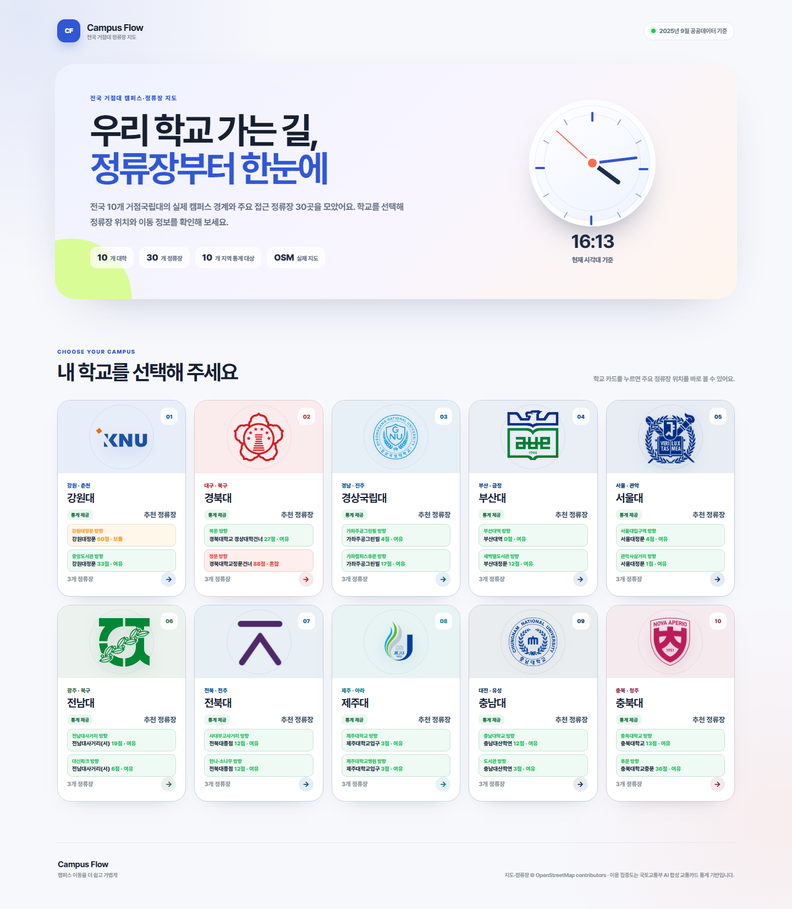
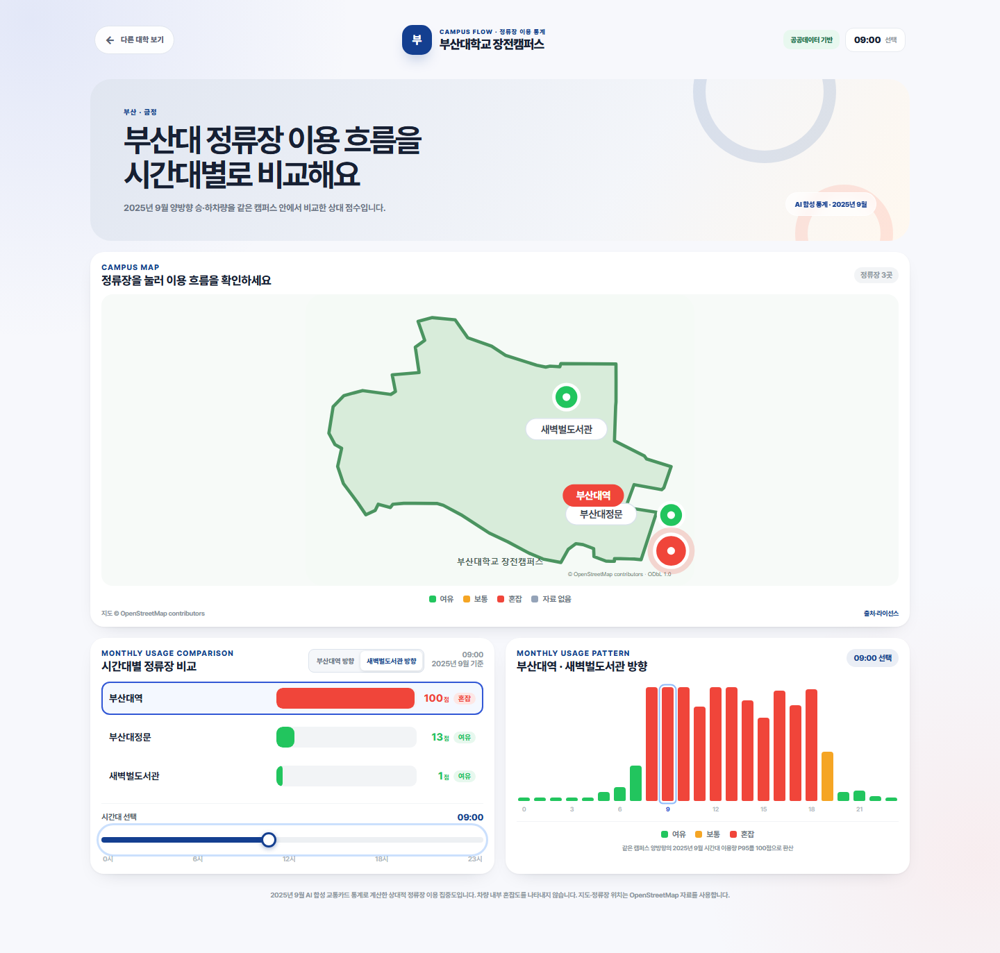
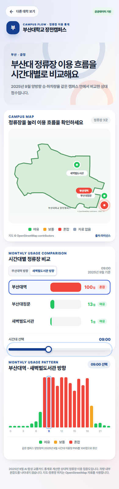

# Campus Flow | 대학 버스 혼잡도 대시보드

전국 거점국립대의 주요 정류장을 탐색하고, 방향별·시간대별 이용 집중도를 비교하는 웹 대시보드입니다.

학생이 이동 전 정류장의 이용 패턴을 살펴볼 수 있도록 캠퍼스 지도, 정류장 비교, 방향 전환, 24시간 패턴을 하나의 화면에 제공합니다.

> 현재 값은 국토교통부의 **2025년 9월 AI 합성 교통카드 승·하차 통계**를 캠퍼스별 P95 기준으로 환산한 상대적 `정류장 이용 집중도`입니다. 실시간 차량 내부 혼잡도가 아닙니다.

## 배포 사이트

[Campus Flow 열기](https://campus-flow-national-live-kr.kjh62879078.chatgpt.site)

사이트는 현재 공유 대상만 접근할 수 있는 비공개 설정입니다.

## 데모 화면

| 대학 선택 | 양방향 이용 집중도 |
| --- | --- |
|  |  |

<p align="center"></p>

## 주요 기능

- **전국 캠퍼스 탐색** — 10개 거점국립대와 주요 정류장 30곳 제공
- **캠퍼스 지도** — 지도 위 정류장을 선택하면 관련 그래프가 즉시 갱신
- **양방향 비교** — A/C 끝점 방향을 전환하면 지도·비교 막대·24시간 그래프가 함께 갱신
- **시간대 비교** — 드래그 슬라이더로 0시부터 23시까지 정류장 이용 집중도를 비교
- **공공데이터 파이프라인** — API 키는 로컬 환경변수에 두고 정적 JSON만 프런트에 전달
- **정직한 결측 처리** — 미매핑·API 0건을 `0점·여유`로 위장하지 않고 자료 없음으로 표시
- **반응형·접근성** — 모바일 터치와 키보드 조작 지원

## 프로젝트 구성

| 경로 | 설명 |
| --- | --- |
| [`campus-bus-congestion-dashboard/`](./campus-bus-congestion-dashboard/) | Campus Flow 웹 애플리케이션 소스 |
| [`campus-bus-congestion-dashboard/src/`](./campus-bus-congestion-dashboard/src/) | 대시보드 UI·데이터·상호작용 코드 |
| [`campus-bus-congestion-dashboard/project/`](./campus-bus-congestion-dashboard/project/) | 초기 디자인 및 기획 참고 자료 |
| [`PROJECT_PLAN.md`](./PROJECT_PLAN.md) | 기존 주간 프로젝트 계획 |

## 실행 방법

```bash
cd campus-bus-congestion-dashboard
npm install
npm run data:refresh -- --month=202509
npm run data:validate
npm run dev
```

## 기술 구성

- React 19 + TypeScript
- vinext + Cloudflare Workers 호환 배포 구성
- CSS Modules
- SVG 기반 캠퍼스 일러스트 지도
- 국토교통부 정류장별 이용량·버스정류장 OpenAPI

## 작성자

N056_김진영
