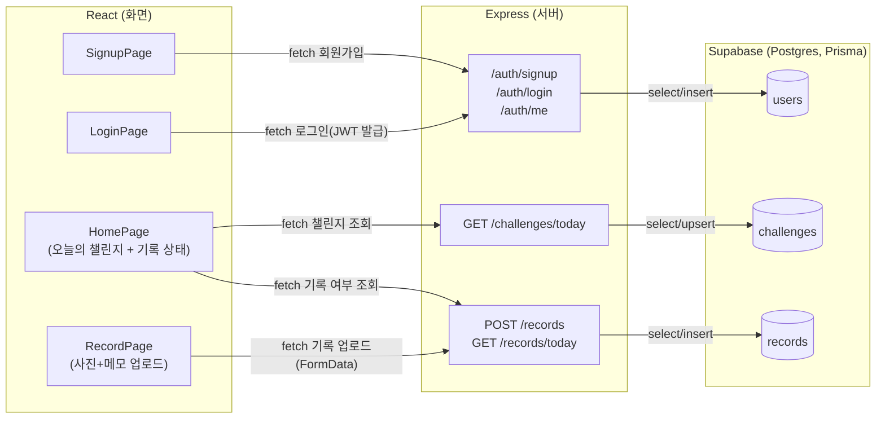

# 챌린지로그 (ChallengeLog)

> 매일의 기록을 분석해 더 나은 내일을 제안하는 AI 기록 에이전트

대학생이 하루 한 장, 랜덤 주제로 부담 없이 기록하는 습관을 만들고, 소규모 친구 방을 통해 함께 꾸준함을 이어가는 **웹 서비스**입니다.

자세한 기획 내용은 [Wiki - 기획서](https://github.com/parkjihyoun/hub/wiki/)를 참고하세요.

---

## 📌 문제 정의

- 혼자 기록하는 습관은 며칠 하다 흐지부지되기 쉬움
- 기존 SNS는 전체 공개라 비교와 피로를 유발함
- → "함께 하되 비교하지 않는" 기록 방식이 필요함

## ✨ 핵심 기능 (MVP)

| 기능 | 설명 |
|---|---|
| 오늘의 랜덤 챌린지 | 매일 오전 7시 새로운 주제 제공 |
| 사진 기록 | 웹 카메라/파일 업로드 + 한 줄 메모, 하루 1회 |
| 캘린더 | 기록한 날짜에 썸네일 표시, 월별 열람 |
| 알림 | 매일 오전 7시 Web Push 알림 |
| 소규모 친구 방 | 3~6명 클로즈드 그룹, 완료 여부만 공유  |
| AI 데일리 케어 | 기록 분위기에 맞춘 응원/제안 메시지 |

## 🏗 아키텍처



## 🛠 기술 스택

**Frontend (웹앱)**: React 19 · Vite 8 · TypeScript · Tailwind CSS v4 · oxlint  
**Backend (예정)**: Java · Spring Boot · Spring Security · Spring Data JPA · JWT · Gradle  
**Database**: PostgreSQL  
**Storage**: AWS S3 / Supabase Storage  
**Push**: Web Push API (Service Worker)  
**Infra**: Docker · GitHub Actions · Swagger/OpenAPI

## 📂 프로젝트 구조

```
hub/
├── src/
│   ├── components/       # 재사용 UI 컴포넌트
│   ├── pages/            # 라우트 단위 화면 (추가 예정)
│   ├── hooks/            # 커스텀 훅 (추가 예정)
│   ├── api/              # API 클라이언트 (추가 예정)
│   ├── App.tsx
│   ├── main.tsx
│   └── index.css          # Tailwind + @theme
├── public/
├── index.html
├── vite.config.ts
├── tsconfig.json
├── plan.md               # 작업 계획·로드맵
├── checklist.md          # 진행·검증 체크리스트
├── CLAUDE.md             # AI·협업자용 개발 규칙
└── README.md
```

## 🚀 실행 방법

```bash
# 의존성 설치
npm install

# 개발 서버 실행 (http://localhost:5173)
npm run dev

# 프로덕션 빌드
npm run build

# 빌드 결과 미리보기
npm run preview

# 타입 검사
npm run typecheck

# 린트 검사
npm run lint
```

백엔드(`server/`)는 아직 미구성입니다. API 연동 작업은 `plan.md` Task 2 이후 진행합니다.

## 📋 문서

| 문서 | 역할 |
|---|---|
| [Wiki - 기획서](https://github.com/parkjihyoun/hub/wiki/) | 서비스 기획·문제 정의·MVP 범위 |
| [CLAUDE.md](./CLAUDE.md) | 절대 원칙, 코딩 컨벤션, 빌드 명령어 |
| [plan.md](./plan.md) | 기능 단위 로드맵과 Task 종속 관계 |
| [checklist.md](./checklist.md) | Task별 완료·검증 체크리스트 |

에이전트에게 작업을 지시할 때 `@plan.md`와 `@checklist.md`를 함께 참조하면 진행 상황을 통제하기 쉽습니다.

## 📄 개발 규칙

Claude Code를 포함한 협업자는 작업 전 [CLAUDE.md](./CLAUDE.md)의 원칙을 먼저 확인합니다.
