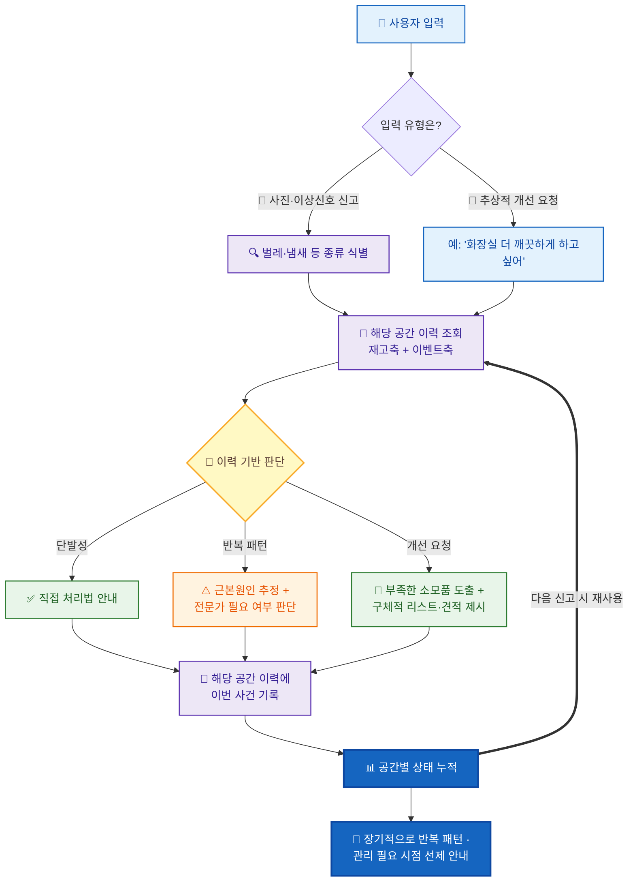

# hub

[기획서 (plan)](https://github.com/imHay0ung/hub/wiki/%EC%9E%90%EC%B7%A8%EB%B0%A9-%EC%B2%AD%EA%B2%B0%EA%B4%80%EB%A6%AC%EC%82%AC-(Cleanliness-Manager-Agent)) — 문제 정의, 리프레임 근거, 통계·경쟁 분석, 구현 아키텍처, 로드맵

[개발 TASK]([https://bony-roadrunner-8f3.notion.site/3995a1c1b4ef804083d2f8a7fe0b77a5](https://bony-roadrunner-8f3.notion.site/39c5a1c1b4ef80c5a997cf909bba10c7?source=copy_link))

# 자취방 청결관리사 (Cleanliness Manager Agent)

## 문제 정의 [누가] [어느 상황에서] [무슨 불편을]

자취생은 부엌과 화장실이라는 두 핵심 공간의 청결 상태를 스스로 추적하기 어렵다. 문제를 두 가지 형태로 나타눠보았다.

첫째, **원인 방치.** 세제, 제습제, 배수구 트랩, 곰팡이 제거제 같은 청결 유지 소모품이 언제 얼마나 남았는지 인지하지 못한 채 살다가, 다 떨어진 뒤에야 문제를 알아차린다. 이때 문제가 발생하고, 불편이 발생한다.

둘째, **결과 판단 불가.** 벌레가 나오거나 냄새가 나는 등 이상 신호가 발생했을 때, 이게 우연한 해프닝인지 반복되는 구조적 문제인지 판단할 근거(과거 이력)가 없어 무조건 방치하거나 무조건 전문가를 부르는 두 극단으로 가게된다.

이 두 문제는 사실 하나의 원인에서 갈라져 나온다고 판단하였다 — **자취방은 상태를 기억해주는 존재가 없다.** 매번 그 순간의 감(感)으로만 판단하기 때문에, 소모품 보충과 위생 이상 대응 모두 사후 대응에 머무른다. 이는 엄마를 부르면 해결되는 문제들 일 수 있으나, 그럴 수 없는 상황을 대비한다.

자취방 청결관리사는 부엌·화장실 두 공간의 청결에 한정해, **재고(원인) 축과 청결 이벤트(결과) 축을 함께 기억하고 추적**하여, 사용자가 묻지 않아도 문제를 먼저 짚어주고, 물으면 그 공간의 현재 상태를 근거로 구체적인 답을 주는 것을 목표로 한다.

## 사용자 시나리오

**시나리오 1 — 이상 신호 대응 (Triage)**

- 사용자가 부엌에서 초파리를 발견하고 사진과 위치를 입력한다.
- 에이전트는 벌레 종류를 식별한 뒤, 해당 공간(부엌)의 과거 이력을 함께 조회한다. 이번이 처음이면 직접 처리 가능한 대응법을 안내하고, 최근 반복된 사례라면 "3주 연속 부엌에서 발생했으므로 배수구가 근본 원인일 가능성이 높다"는 식으로 근거를 들어 심각도를 재평가하고, 필요 시 전문가 방역을 권한다. 이 사건은 해당 공간의 이력에 자동으로 기록된다.

**시나리오 2 — 추상적 요청에 대한 구체적 답변**

- 사용자가 "화장실을 좀 더 깨끗하게 관리하고 싶어"라고 막연하게 요청한다. 
- 에이전트는 화장실 공간에 누적된 재고 현황과 최근 이벤트(예: 곰팡이 냄새 1회 기록)를 함께 검토하여, 현재 부족한 항목(제습제, 곰팡이 방지 스프레이 등)을 짚어내고, 이걸 추가했을 때 기대할 수 있는 개선 방향과 구체적인 물품 리스트를 제시한다.

**시나리오 3 — 지속적인 현황 추적**

- 사용자가 시간이 지나며 부엌·화장실 각각의 이상 신고와 재고 현황을 계속 입력한다.
- 에이전트는 공간별로 쌓인 이력을 근거로, 사용자가 묻지 않아도 "이 공간은 최근 위생 신호가 반복되고 있다" 같은 판단을 계속 업데이트하며, 장기적으로 그 방의 청결 상태를 관리하는 상주형 매니저 역할을 한다.

## 핵심 기능

### 1. 공간별 상태 추적 (State Tracking)

부엌과 화장실을 각각 하나의 관리 단위(Space)로 두고, 아래 두 축의 데이터를 계속 누적한다.

- **재고 축**: 청결 유지에 필요한 소모품(세제, 제습제, 방향제, 곰팡이 제거제, 배수구 트랩 등)의 보유 현황
- **이벤트 축**: 벌레 발견, 냄새, 곰팡이 등 위생 이상 신호의 발생 이력(시점, 종류, 심각도)

두 축이 하나의 공간 단위 안에서 함께 관리되는 것이 이 서비스의 핵심 구조.

### 2. 이력 기반 심각도 판단 (Triage)

이상 신호가 접수되면, 단발성 사건으로 볼지 반복되는 구조적 문제로 볼지를 해당 공간의 과거 이벤트 이력을 근거로 판단한다. 
같은 유형의 문제라도 이력에 따라 결론(직접 처리 vs 전문가 필요)이 달라진다.

### 3. 상태 기반 소모품 제안 (Prescriptive Recommendation)

사용자가 추상적인 개선 요청을 하면, 해당 공간의 현재 재고와 최근 이벤트 이력을 함께 근거로 삼아 부족한 소모품을 짚어내고 구체적인 리스트와 기대 효과를 제시한다.

### 4. 장기 현황 추적 및 선제적 안내

시간이 지남에 따라 누적되는 공간별 이력을 바탕으로, 사용자가 묻지 않아도 반복되는 문제나 관리가 필요한 시점을 짚어주는 방향으로 확장한다.

---

*※ 재고 관리 범위는 부엌, 화장실의 청결 유지 목적 소모품으로 한정하며, 전체 살림 재고 관리나 실제 구매·결제까지는 이번 범위에 포함하지 않는다.*

## 사용자 흐름

