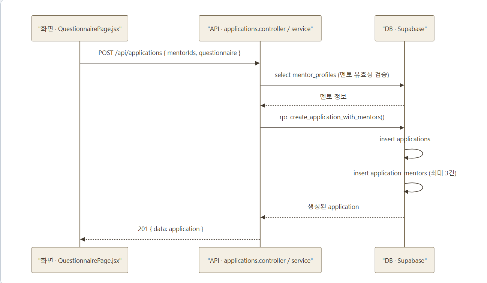
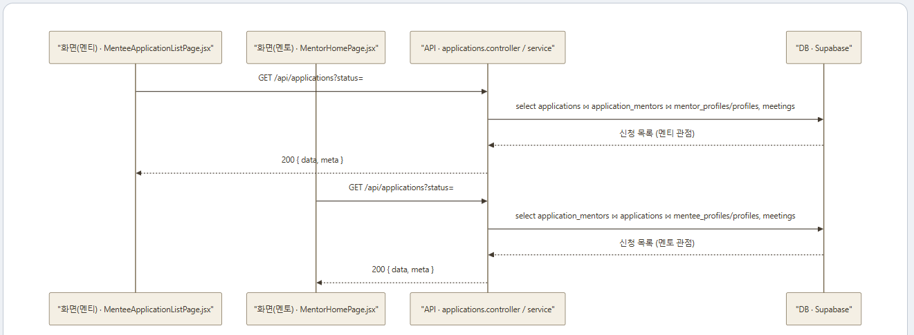
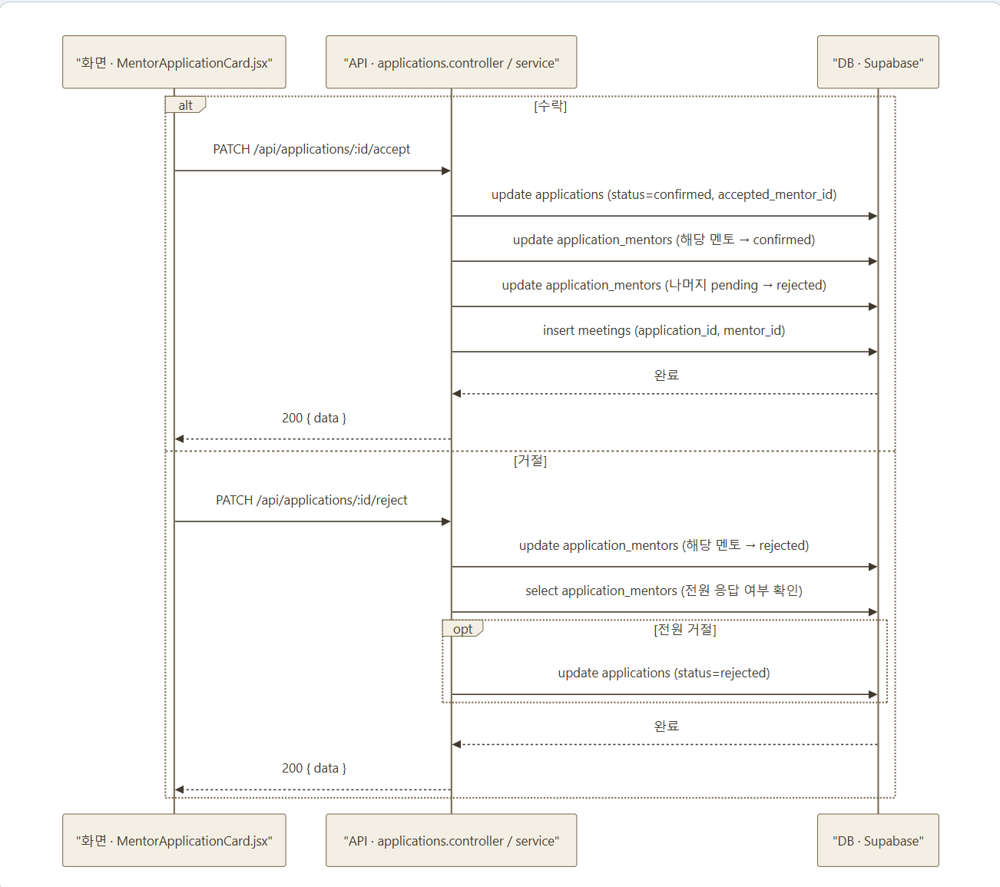

# hub
# 프로젝트 기획서 링크 (https://github.com/meatbest9/hub/wiki/%EC%B0%90-%ED%94%84%EB%A1%9C%EC%A0%9D%ED%8A%B8-%EA%B8%B0%ED%9A%8D%EC%84%9C)

# 개발 백로그 링크 https://github.com/meatbest9/hub/wiki/%EA%B0%9C%EB%B0%9C-%EB%B0%B1%EB%A1%9C%EA%B7%B8(%EC%88%98%EC%A0%95%EB%90%A0-%EC%88%98-%EC%9E%88%EC%9D%8C)

# 2주차 세부 작업 계획 링크 https://github.com/meatbest9/issue-repo/issues

# 시작하기

## 설치 방법
```bash
git clone https://github.com/meatbest9/hub.git
cd hub

cd client && npm install
cd ../server && npm install
```

## 환경변수 설정
`server/.env.example`을 복사해서 `server/.env`를 만들고, 사용할 Supabase 프로젝트의 값을 채운다.
```bash
cd server
cp .env.example .env
```

| 변수 | 설명 |
|---|---|
| `SUPABASE_URL` | Supabase 프로젝트 URL (Project Settings > API) |
| `SUPABASE_ANON_KEY` | anon key — 로그인 등 사용자 자격 증명 기반 흐름에 사용 |
| `SUPABASE_SERVICE_ROLE_KEY` | service_role key — RLS를 우회하는 서버 전용 클라이언트에 사용. 외부에 노출되면 안 됨 |
| `PORT` | 서버 포트 (기본값 4000) |

client는 기본적으로 `http://localhost:4000/api`를 API 서버로 사용한다. 다른 주소를 쓰려면 `client/.env`에 `VITE_API_BASE_URL`을 설정하면 된다 (`client/src/api/httpClient.js` 참고).

## 데이터베이스 마이그레이션 적용
`supabase/migrations/` 아래 SQL 파일들을 Supabase 프로젝트에 **파일명(타임스탬프) 순서대로** 적용해야 한다. Supabase 대시보드의 SQL Editor에서 각 파일 내용을 순서대로 붙여넣어 실행한다.

1. `supabase/migrations/20260720000000_init_schema.sql`
2. `supabase/migrations/20260721000000_indexes_and_updated_at.sql`
3. `supabase/migrations/20260722000000_meetings_nullable_schedule.sql`
4. `supabase/migrations/20260722010000_create_application_with_mentors_rpc.sql`

## 클라이언트·서버 실행 방법
서버 실행 (`http://localhost:4000`):
```bash
cd server
npm start      # 프로덕션 실행
npm run dev    # nodemon으로 파일 변경을 감지하며 실행
```

클라이언트 실행 (`http://localhost:5173`):
```bash
cd client
npm run dev
```

두 서버를 모두 띄운 상태에서 브라우저로 `http://localhost:5173`에 접속하면 된다.

# 주요 기능 아키텍쳐 시각화
1. 사전 질문지 기반 면담 신청 기능


2. 면담 신청 목록 조회 기능


3. 면담 수락/거절 기능
