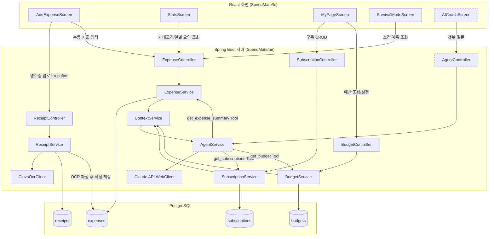

# SpendMate

기록하는 가계부가 아니라, 소비 습관을 바꿔주는 AI 코치입니다.
영수증을 찍으면 자취생 특화 카테고리로 분석하고, 현재 소비 속도로 생활비가 언제 바닥나는지 예측해 알려줍니다.

## 주요 기능
- 영수증 OCR 자동 인식 및 카테고리 분류
- 생활비 소진일 예측 + 월말 생존 모드
- AI 소비 코치 Agent: 실제 지출 데이터를 스스로 조회해 근거 숫자와 함께 코칭 (챗봇 질의응답 + 지출 추가 시 1회 판단)

## 기술 스택
- **Backend**: Spring Boot (Java)
- **Frontend**: React
- **AI**: Claude API (Tool Use)
- **OCR**: 네이버 클로바 OCR
- **DB**: PostgreSQL

## 구조
모노레포로 `SpendMate/be`(백엔드), `SpendMate/fe`(프론트엔드) 두 프로젝트를 함께 관리한다.

## 아키텍처

화면(React) → 서버(Spring Boot) → DB(PostgreSQL)로 이어지는 데이터 흐름. 점선 박스는 아직 손 안 댄 부분(챗봇 질의응답 플로우와 그 화면 연동), 실선 박스는 이미 동작 중인 부분이다.

**말로 설명할 때 핵심 흐름 3개**:
1. **영수증 흐름**: `AddExpenseScreen` → `ReceiptController` → `ReceiptService`가 `ClovaOcrClient`로 OCR 호출 → 파싱해서 `receipts`에 원본, `expenses`에 확정 지출을 저장
2. **통계 흐름**: `StatsScreen`이 `ExpenseController`의 요약 API를 호출하면 `ExpenseService`가 `expenses` 테이블을 집계해서 반환 (저장 시점이 아니라 조회 시점에 계산)
3. **Agent 흐름(3주차 신규)**: `ExpenseService`/`SubscriptionService`/`BudgetService`가 각자 계산한 신호를 `ContextService`가 하나로 합치고, `AgentService`가 그 Context를 Claude API에 넘겨 판단시킨 뒤, 필요하면 `get_expense_summary`/`get_subscriptions`/`get_budget` Tool로 다시 내부 API를 호출해 근거 숫자를 가져온다 — 외부 API는 전혀 안 씀

## 문서
프로젝트 기획·설계 문서는 `docs` 폴더 및 위키에서 확인할 수 있다.

- **기획서** ([plan.md](./docs/plan.md)) — 문제 정의, 경쟁 서비스 분석, 핵심 사용자 시나리오, AI Agent 작동 구조, MVP 범위
- **개발 체크리스트** ([checklist.md](./docs/checklist.md)) — 4주 개발 작업을 주차별로 나눈 단위 체크리스트
- **개발 Task 백로그** ([Notion](https://www.notion.so/d51ee876a0778399965e8125be81487d?source=copy_link)) — 우선순위(P0/P1/P2)별 Task 목록과 주차별 진행 상태
- **실제 작업 단위 이슈 트래킹** ([GitHub Issues](https://github.com/jsoyeonj/hub/issues)) — 3주차부터는 하루 단위 작업을 `P0`/`P1`/`P2` 라벨을 붙인 GitHub Issue로 등록해 관리. `docs/checklist.md`의 각 항목에 해당 이슈 번호(`#13` 등)가 달려있다
- **2주차 계획** ([Notion](https://www.notion.so/2-39cee876a07780158747e107b24433ab?source=copy_link)) — 이번 주 목표, 하루 단위 작업 분해, 요일 배치
- **3주차 계획** ([Notion] (https://app.notion.com/p/3-3a3ee876a07780b49455d9ae49441bdd?source=copy_link)) - 이번주 목표, 하루 단위 작업 분해, 요일 배치
- **디자인 가이드** ([design.md](./docs/design.md)) — 프론트 프로토타입(React)에서 확정된 디자인 토큰·레이아웃·톤앤매너

화면 구성과 프로토타입은 작업 PR에서 확인할 수 있다.

## 커스텀 Agent
`.claude/agents/`에 이 저장소 전용 Claude Code 서브에이전트가 있다. 각각 역할이 겹치지 않게 나눠져 있다.

| Agent | 역할 | 언제 쓰나 |
|---|---|---|
| [feature-planner](./.claude/agents/feature-planner.md) | 기능/요구사항을 하루 단위 작업으로 쪼개고 우선순위(P0/P1/P2)·완료 기준을 표로 정리 | 새 기능 시작 전, 주간 계획 세울 때 |
| [progress-checker](./.claude/agents/progress-checker.md) | 지금까지 한 일(또는 지금 하는 일)이 `docs/plan.md`·`docs/checklist.md`와 실제로 맞는 방향인지 사후 점검 (체크리스트가 정직한지 코드까지 대조) | 기능 하나 끝낸 직후, 하루 마무리 |
| [code-reviewer](./.claude/agents/code-reviewer.md) | 커밋 전 diff를 짧게 훑어 버그·컨벤션 위반·보안 이슈를 Critical/Warning/Nit로 보고 | 커밋하기 전 |
| [code-analyzer](./.claude/agents/code-analyzer.md) | 코드/기능이 여러 파일에 걸쳐 어떻게, 왜 그렇게 동작하는지 설명 (학습용) | 낯선 코드 처음 볼 때, 흐름이 헷갈릴 때 |
| [env-guard](./.claude/agents/env-guard.md) | `.env`/API 키 등 시크릿이 git에 노출됐거나 노출될 위험이 있는지 점검 | 커밋/푸시 직전, 새 API 키 추가 직후 |