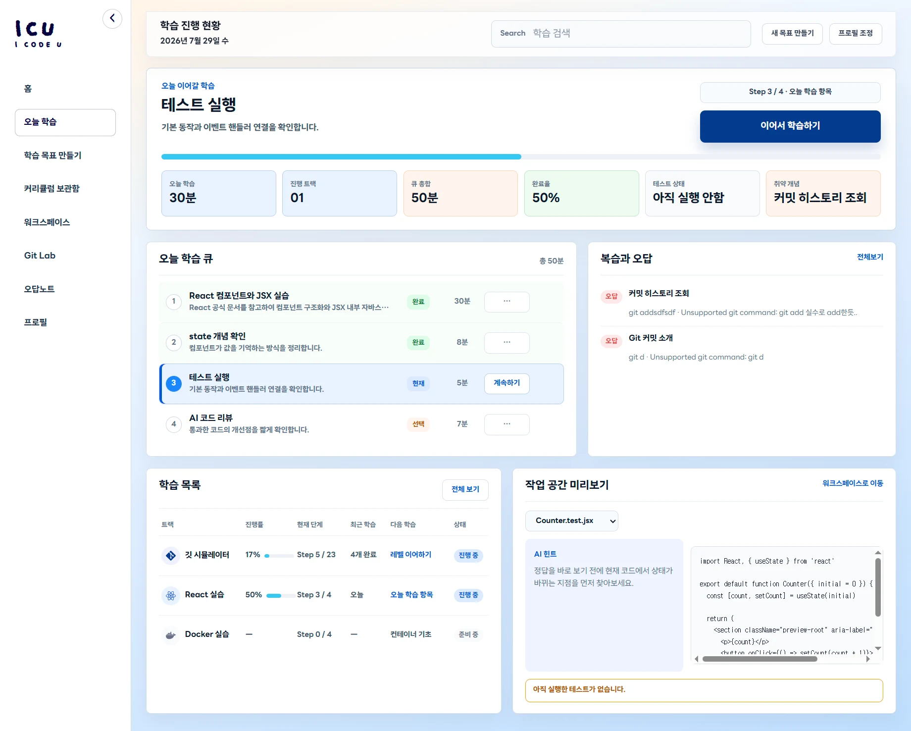
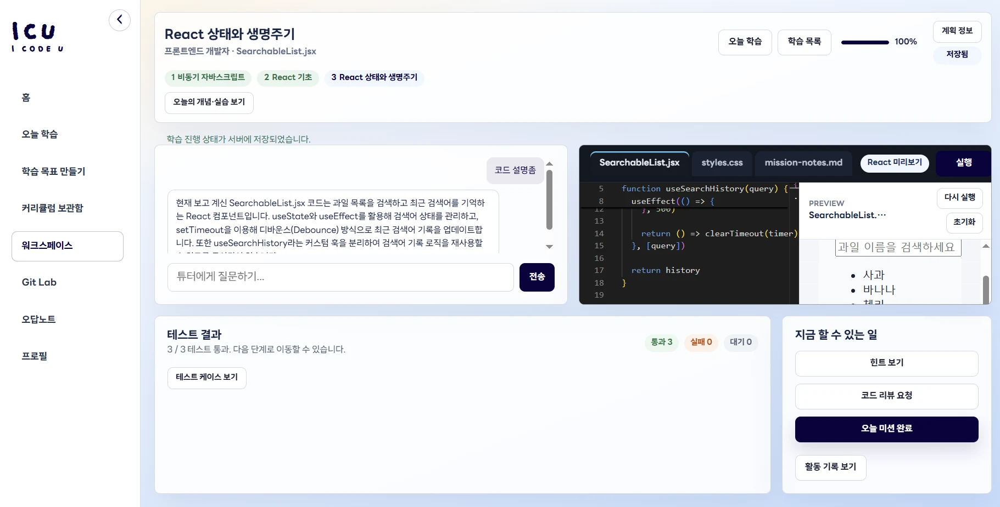
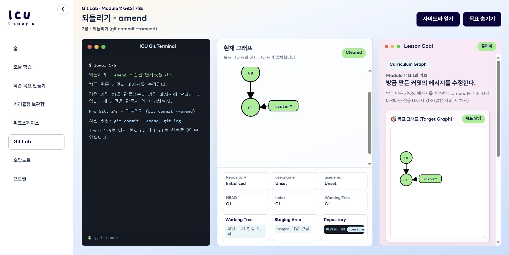

# ICU

> 오늘의 학습 계획부터 코드 실습, 실행 피드백, 진도 관리와 오답 복습까지 하나의 흐름으로 연결하는 AI 코딩 튜터

[서비스 데모](https://icu-app-beta.vercel.app) · [소개 영상](https://www.youtube.com/watch?v=15S2FhgWr8c) · [GitHub Wiki](https://github.com/xxriny/ai-agent-challenge/wiki)


## 해결하려는 문제

개념 문서, 코드 에디터, 실행 환경과 오답 관리가 서로 다른 도구에 흩어져 있으면 학습자는 무엇을 어떤 순서로 공부해야 하는지 판단하기 어렵습니다. ICU는 목표 설정부터 실습과 복습까지 이어지는 학습 흐름을 제공해 학습자가 다음 행동에 집중할 수 있도록 돕습니다.

## 주요 기능

| 기능 | 설명 |
| --- | --- |
| Today Learning Hub | 학습 목표와 진도를 바탕으로 오늘의 미션, 진행 상태와 복습 대상을 보여줍니다. |
| AI 커리큘럼 | Gemini를 이용해 학습 목표에 맞는 커리큘럼을 생성하고 수정 이력과 진행 상태를 관리합니다. |
| Learning Workspace | Monaco Editor에서 코드를 작성하고 실행 결과, React 미리보기와 AI 튜터 피드백을 확인합니다. |
| Git Lab | Git 명령에 따른 branch, commit, remote, tag, stash와 conflict 상태 변화를 시각적으로 학습합니다. |
| 오답노트 | 실패한 코드와 Git 명령을 자동 또는 수동으로 기록하고 복습 상태를 관리합니다. |
| 학습 데이터 저장 | in-memory, SQLite와 Supabase 저장소 adapter를 실행 환경에 맞게 선택합니다. |

### 주요 화면

| Today Learning Hub | Learning Workspace | Git Lab |
| --- | --- | --- |
|  |  |  |

## 학습 흐름

```text
프로필 설정
  → 학습 목표 입력
  → AI 커리큘럼 생성
  → 오늘의 학습 확인
  → Workspace 코드 실습
  → 실행 결과와 AI 피드백
  → 오답노트 또는 Git Lab 복습
```

주요 화면은 다음 경로로 연결됩니다.

```text
/ → /profile → /today
                 ├─ /today/goal
                 ├─ /curriculum/history
                 ├─ /workspace
                 ├─ /mistake-notes
                 └─ /git-lab
```

## 기술 스택

- Frontend: React, TypeScript, Vite, React Router, Zustand, CSS Modules
- Editor: Monaco Editor
- Backend: Node.js, Express
- Persistence: in-memory, SQLite, Supabase
- Deployment: Vercel(App/Preview Runtime), Render(Core API/Judge)
- Test: Vitest, TypeScript, ESLint, Prettier

## 시스템 구성

```text
React App (5173)
  ├─ Core API (8787)
  │    ├─ profile, curriculum, progress, notes, Git Lab, tutor
  │    ├─ Gemini provider
  │    └─ in-memory / SQLite / Supabase repository
  ├─ Judge API (8790)
  │    └─ JavaScript/JSX 실행과 학습용 언어 피드백
  └─ Preview Runtime (5174)
       └─ 별도 iframe에서 React 결과 렌더링
```

Core API와 Judge API를 분리하고, 브라우저에는 Gemini 및 Supabase secret을 전달하지 않습니다. Preview Runtime은 허용된 parent origin과 메시지 source를 확인합니다.

## 빠른 시작

### 사전 요구사항

- Node.js 22
- npm

### 1. 의존성 설치

`package-lock.json`과 동일한 버전을 설치합니다.

```bash
npm ci
```

### 2. 환경 변수 설정

`.env.example`을 `.env`로 복사합니다. 실제 secret 값은 `.env`나 배포 서비스의 secret store에만 두고 `VITE_*` 변수에는 넣지 않습니다.

```env
# Frontend
VITE_CURRICULUM_RECOMMENDATION_MODE=server
VITE_ICU_API_MODE=server
VITE_API_BASE_URL=
VITE_CODE_RUNNER_BASE_URL=
VITE_ICU_PREVIEW_URL=http://127.0.0.1:5174/preview.html
VITE_ICU_APP_ORIGINS=http://127.0.0.1:5173,http://localhost:5173

# Core API / Judge
GEMINI_API_KEY=
GEMINI_MODEL=gemini-flash-latest
CURRICULUM_AGENT_PORT=8787
JUDGE_PORT=8790
ICU_ALLOWED_ORIGIN=

# Repository
ICU_REPOSITORY_MODE=in-memory
ICU_SQLITE_PATH=.icu/icu.sqlite
SUPABASE_URL=
SUPABASE_SECRET_KEY=
```

저장소 모드는 다음 역할을 가집니다.

| 모드 | 용도 | 데이터 유지 |
| --- | --- | --- |
| `in-memory` | 테스트와 일회성 로컬 실행 | 서버 재시작 시 초기화 |
| `sqlite` | 로컬·오프라인 실행 | `.icu/icu.sqlite`에 저장 |
| `supabase` | 배포 환경 | Supabase에 저장 |

### 3. 전체 개발 환경 실행

```bash
npm run dev:server
```

다음 네 프로세스를 함께 실행합니다.

| 구성 | 주소 | 역할 |
| --- | --- | --- |
| App | `http://localhost:5173` | ICU React 앱 |
| Preview Runtime | `http://127.0.0.1:5174/preview.html` | React 결과 미리보기 |
| Core API | `http://127.0.0.1:8787` | 학습 데이터와 AI 튜터 API |
| Judge API | `http://127.0.0.1:8790` | 코드 실행 |

App, Preview Runtime과 Core API를 종료합니다.

```bash
npm run dev:stop
```

현재 `dev:stop`은 Judge 포트 `8790`을 종료하지 않으므로 Judge는 실행 중인 터미널에서 별도로 종료합니다.

## API 엔드포인트

로컬 기본 주소는 Core API `http://127.0.0.1:8787`, Judge API `http://127.0.0.1:8790`입니다.

### Core API

| Method | Path | 설명 |
| --- | --- | --- |
| `GET` | `/api/health` | Core API 상태를 확인합니다. |
| `GET` | `/api/profile` | 학습자 프로필을 조회합니다. |
| `PUT` | `/api/profile` | 학습자 프로필을 저장합니다. |
| `DELETE` | `/api/profile` | 학습자 프로필을 초기화합니다. |
| `POST` | `/api/curriculum/recommend` | 목표와 진행 상태를 바탕으로 커리큘럼을 추천합니다. |
| `GET` | `/api/curriculum/generated` | 최근 생성 커리큘럼을 조회합니다. |
| `POST` | `/api/curriculum/generated` | 생성 커리큘럼 snapshot을 저장합니다. |
| `DELETE` | `/api/curriculum/generated` | 생성 커리큘럼 전체를 초기화합니다. |
| `DELETE` | `/api/curriculum/generated/:id` | 지정한 생성 커리큘럼을 삭제합니다. |
| `GET` | `/api/curriculum/history` | 생성 커리큘럼 이력을 조회합니다. |
| `GET` | `/api/progress/today` | 오늘의 미션 진행 상태를 조회합니다. |
| `POST` | `/api/progress/missions/:missionId` | 미션 진행 상태를 저장합니다. |
| `DELETE` | `/api/progress/missions/:missionId` | 지정한 미션 진행 상태를 초기화합니다. |
| `DELETE` | `/api/progress` | 전체 학습 진행 상태를 초기화합니다. |
| `GET` | `/api/mistake-notes` | 오답노트 목록을 조회합니다. |
| `POST` | `/api/mistake-notes` | 오답노트를 생성합니다. |
| `PATCH` | `/api/mistake-notes/:noteId` | 오답 내용 또는 복습 상태를 수정합니다. |
| `DELETE` | `/api/mistake-notes/:noteId` | 지정한 오답노트를 삭제합니다. |
| `DELETE` | `/api/mistake-notes` | 오답노트 전체를 초기화합니다. |
| `GET` | `/api/git-lab/attempts` | Git Lab 시도 이력을 조회합니다. |
| `POST` | `/api/git-lab/attempts` | Git Lab 시도 결과를 저장합니다. |
| `DELETE` | `/api/git-lab/attempts` | Git Lab 시도 이력을 초기화합니다. |
| `POST` | `/api/tutor/ask` | Workspace의 코드와 실행 결과를 바탕으로 AI 튜터에게 질문합니다. |

### Judge API

| Method | Path | 설명 |
| --- | --- | --- |
| `GET` | `/api/health` | Judge API 상태를 확인합니다. |
| `POST` | `/api/code/run` | JavaScript/JSX 코드를 실행하거나 학습용 언어 피드백을 생성합니다. |

자세한 요청과 응답 형식은 [백엔드 안내](./backend/README.md)에서 확인할 수 있습니다.

## 테스트와 검증

Vitest로 상태 관리, API 요청, 도메인 규칙, 저장소 adapter, React 컴포넌트와 Git 시뮬레이터 상태 전환을 기능 단위로 검증합니다.

```bash
npm run typecheck
npm run lint
npm run format:check
npm test
npm run build
```

`npm run build`는 TypeScript 검사 후 메인 앱과 Preview Runtime을 모두 빌드합니다.

Supabase 설정을 사용한 읽기·쓰기 smoke test:

```bash
npm run smoke:supabase
```

## 프로젝트 구조

```text
hub/
├─ src/
│  ├─ app/                 # router, shell, app-level state
│  ├─ features/            # curriculum, workspace, progress, notes, profile, Git Lab
│  ├─ preview/             # React Preview Runtime
│  ├─ components/          # shared UI
│  └─ styles/              # global reset, typography, tokens
├─ backend/
│  ├─ http/                # Core API와 Judge entrypoints
│  ├─ modules/             # application/domain/adapters
│  └─ shared/              # env, CORS, repository, SQLite/Supabase helpers
├─ shared/curriculum/      # frontend/backend 공용 커리큘럼 catalog
├─ showcase/               # 프로젝트 소개 정보와 스크린샷
├─ docs/                   # 제품, 기능, 아키텍처, 배포 문서
├─ scripts/                # 개발 서버, agent, 검증 스크립트
└─ .github/workflows/      # work 브랜치 검증·배포
```

## 배포

secret이 설정된 저장소의 `work` 브랜치에 push하면 GitHub Actions가 타입 검사, lint, 테스트와 빌드를 수행합니다. 검증 통과 후 App과 Preview Runtime을 Vercel에 배포하고 Render deploy hook으로 Core API와 Judge를 재배포합니다.

필요한 GitHub Actions secret:

```text
VERCEL_TOKEN
VERCEL_ORG_ID
VERCEL_APP_PROJECT_ID
VERCEL_PREVIEW_PROJECT_ID
RENDER_CORE_DEPLOY_HOOK
RENDER_JUDGE_DEPLOY_HOOK
```

Fork에는 원본 저장소의 secret이 복사되지 않습니다. Fork에서 직접 배포하지 않는 경우 제출 브랜치에서는 배포 작업을 실행하지 않고, 원본 저장소의 신뢰된 브랜치에서 배포합니다.

Render 서비스는 `render.yaml`에서 `work` 브랜치를 사용하며 자동 배포는 꺼져 있습니다. 자세한 설정은 [Vercel·Render 배포 안내](./docs/deployment/render-vercel.md)를 참고하세요.

## 현재 한계와 향후 개선점

- Supabase Auth와 RLS를 적용한 사용자별 데이터 분리
- Judge의 컨테이너·프로세스 격리와 CPU, 메모리, 네트워크 제한 강화
- Gemini 요청 timeout, 재시도, 응답 검증과 운영 모니터링
- 브라우저 기반 E2E, 접근성 및 외부 서비스 장애 테스트
- embedding과 vector database를 사용한 full RAG
- Electron 데스크톱 패키징과 안전한 IPC 경계
- Notion 학습 기록 동기화

현재 Judge는 학습 피드백을 위한 최소 실행 환경이며 운영 수준의 보안 sandbox가 아닙니다.

## 문제 해결

### Windows에서 `npm.ps1` 실행이 차단되는 경우

PowerShell 실행 정책으로 `npm` 명령이 차단되면 `npm.cmd`를 사용합니다.

```powershell
npm.cmd ci
npm.cmd run dev:server
```

### 패키지 또는 타입 선언을 찾지 못하는 경우

프로젝트 루트에 의존성이 설치되어 있는지 확인하고 다시 설치합니다.

```bash
npm ci
```

### Vercel CLI에서 `--token` 값이 없다고 표시되는 경우

GitHub Actions의 `VERCEL_TOKEN` secret이 설정되지 않았거나 Fork 워크플로에서 사용할 수 없는 상태입니다. 토큰을 코드에 직접 작성하지 말고, 직접 배포하는 저장소의 Actions secret에 등록합니다.

### `dev:stop` 이후 Judge가 계속 실행되는 경우

Judge는 실행 중인 터미널에서 `Ctrl+C`로 별도 종료합니다.

## 문서

- [GitHub Wiki](https://github.com/xxriny/ai-agent-challenge/wiki)
- [사용자 흐름](./docs/user-flow.md)
- [아키텍처](./docs/architecture.md)
- [백엔드 안내](./backend/README.md)
