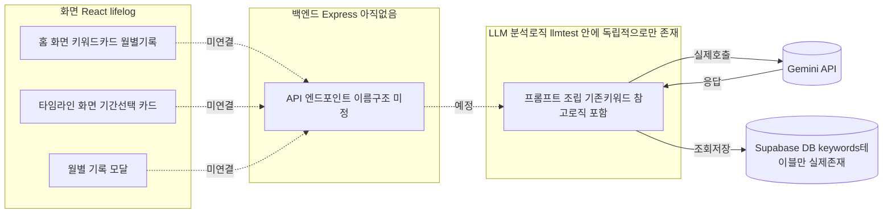

# hub
#배포 완료
https://hub-mu-puce.vercel.app/
#데모발표 자료
https://docs.google.com/presentation/d/17vEP-xWjFfviHcAl_nzCyjVUmIHb9qRV/edit?usp=sharing&ouid=100790024314221882298&rtpof=true&sd=true
#위키링크
https://github.com/dabinnida/hub/wiki
# 3주차 주간 계획
[https://app.notion.com/p/2-39cd247dcc5480258a2ac59d134c8a29](https://app.notion.com/p/1f4d247dcc54809caae6de69d3d37c3f?source=copy_link)


## 아키텍처

> 2026-07-22 기준. 실제로 연결된 부분과, 아직 안 된 부분(점선)을 구분해서 그렸습니다.



## 이 그림을 보고 내 말로 설명해보면

지금 LifeLog는 세 개의 조각이 따로 움직이고 있는 상태입니다.

1. React 화면은 완성되어 있지만, 전부 하드코딩된 더미 데이터로 보여지고 있어서 실제 서버나 DB랑은 아무 연결이 없습니다.
2. LLM 분석 로직(llm-test)은 Gemini API와 Supabase에는 실제로 잘 연결되어 있고, 문장 하나를 넣으면 키워드를 뽑아 DB에 저장하는 것까지 확인했습니다.
3. Express 서버가 아직 존재하지 않아서, 1번(화면)과 2번(LLM 로직)을 이어주는 다리가 없습니다.

## 설명하면서 발견한 어색한 구조 / 빠진 연결

- React ↔ 백엔드 연결이 전혀 없다
- entries, monthly_records 테이블이 실제로 존재하지 않는다
- llm-test가 독립 스크립트로만 존재한다

## 다음 작업에 반영할 것

1. Supabase에 entries 테이블 실제로 생성
2. llm-test의 로직을 Express API 엔드포인트 안으로 옮기기
3. React 화면의 더미 데이터를, 그 API를 호출하는 코드로 교체

# about-me
# AI Life Review - 기획 및 기술 설계

## 📌 프로젝트 방향 구체화

오늘은 서비스의 핵심 컨셉과 전체 시스템 구조를 중심으로 기획을 진행했습니다.

기록의 중요성은 커지고 있지만, 많은 사용자는 일기를 꾸준히 작성하지 못합니다. 반면 ChatGPT와의 대화에는 고민, 목표, 계획, 성취 등 개인의 삶이 자연스럽게 기록됩니다.

이를 바탕으로 **ChatGPT 대화를 분석하여 사용자의 성장 과정을 자동으로 회고해주는 AI 웹 서비스**를 프로젝트 주제로 선정했습니다.

---

## 🎯 서비스 목표

* ChatGPT 대화를 기반으로 개인 성장 리포트 제공
* 사용자의 감정, 목표, 주요 이벤트를 자동 분석
* 월별·분기별 성장 과정 시각화
* 기록을 강요하지 않는 AI 기반 회고 서비스 구현

---

## 💡 핵심 아이디어

단순히 대화를 요약하는 것이 아니라,

사용자의 대화를 **Life Event** 단위로 구조화하여 성장 스토리를 생성하는 서비스를 목표로 합니다.

예시 이벤트

* 프로젝트 시작
* 여행
* 목표 설정
* 목표 달성
* 건강 이슈
* 학습
* 성취

이벤트를 시간순으로 연결하여 사용자의 변화와 성장 과정을 한눈에 확인할 수 있도록 기획했습니다.

---

## 🎨 디자인 방향

### Design Concept

**Digital Growth Journal**

### Reference

* Apple Health
* Spotify Wrapped
* Notion
* Arc Browser

### Keywords

* Minimal
* Storytelling
* Timeline
* Premium
* Calm
* Clean

대시보드 중심의 서비스가 아니라 하나의 성장 기록을 읽는 경험을 제공하는 UI를 목표로 합니다.

---

## 🛠 기술 스택

### Front-End
* React (JavaScript)
* Vite

### Back-End
* Node.js
* Express

### Database
* Supabase (Postgres)

### AI
* Gemini API
* 프롬프트 기반 키워드·감정 추출 (기존 카테고리 재사용 로직 포함)
* JSON 구조 정보 추출

## 📂 활용 데이터

ChatGPT 대화를 기반으로 다음 정보를 추출할 예정입니다.

* 대화 내용
* 날짜 및 시간
* 감정
* 목표
* 고민
* 성취
* 주요 이벤트
* 관심사 변화

---

## ⚙ AI 분석 파이프라인

```text
ChatGPT Conversation

↓

Preprocessing

↓

LLM Analysis

↓

Event Extractor

↓

Memory Database

↓

Insight Generator

↓

Monthly Report

↓

Visualization
```

### 단계별 역할

* **Preprocessing** : 대화 전처리 및 분석 가능한 형태로 변환
* **LLM Analysis** : 대화의 의미와 맥락 분석
* **Event Extractor** : 감정, 목표, 성취, 프로젝트, 여행 등 주요 이벤트 추출
* **Memory Database** : 분석 결과 저장 및 관리
* **Insight Generator** : 성장 패턴 및 변화 분석
* **Monthly Report** : 월간 회고 생성
* **Visualization** : Dashboard 및 Timeline 형태로 시각화

---

## 📅 다음 계획

* User Flow 작성
* Service Flow 설계
* Information Architecture(IA) 작성
* Event 분류 체계 정의
* Database Schema 설계
* Wireframe 제작
* React 프로젝트 초기 환경 구성
