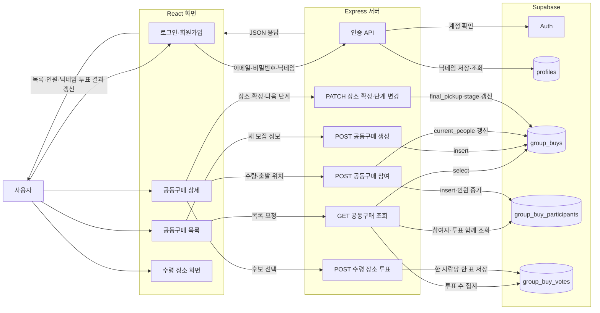

# CampusCart

AI 기반 대학생 공동구매 플랫폼

## 서비스 데이터 흐름

사용자가 화면에서 요청하면 Express가 로그인 정보를 확인하고 Supabase에 데이터를 저장하거나 조회합니다. 화면은 서버가 돌려준 결과를 받아 목록, 참여 인원, 참여자 닉네임과 수령 장소 투표 현황을 갱신합니다.

구조를 정리하며 수령 장소 투표와 진행 단계가 임시 메모리에 남아 있던 연결을 확인했습니다. 현재는 사용자의 투표 선택, 최종 수령 장소와 진행 단계도 Supabase에 저장되며 서버를 다시 실행한 뒤에도 유지됩니다.

## 📄 프로젝트 기획서

- Wiki

https://github.com/lsiwooo/hub/wiki/CampusCart-기획서

# Week 2 Development Plan

## 🎯 Goal

이번 주 목표는 CampusCart의 핵심 기능(MVP)인

> 상품 검색 → AI 공동구매 추천 → 공동구매 참여 → 공동구매 생성

흐름을 구현하는 것입니다.

이번 주에는 Frontend, Backend, Database를 연결하여 하나의 Vertical Slice를 완성하는 것을 목표로 합니다.

---

## 📌 Development Roadmap

| Priority | Issue | Description |
|----------|-------|-------------|
| P1 | #1 | 프로젝트 구조 및 공통 데이터 모델 설계 |
| P1 | #2 | 상품 검색 기능 구현 |
| P1 | #3 | 진행 중인 공동구매 조회 |
| P1 | #4 | AI 공동구매 추천(Mock) |
| P1 | #5 | 공동구매 참여 기능 |
| P2 | #6 | 공동구매 생성 기능 |
| P2 | #7 | AI 수령 장소 추천(Mock) |
| P3 | #8 | UI 개선 및 발표 준비 |

---

## 📌 MVP Flow

상품 검색

↓

AI 공동구매 추천

↓

공동구매 참여

↓

없으면 공동구매 생성

↓

(추가 기능)

AI 수령 장소 추천

---

세부 작업 내용은 GitHub Issues에서 관리합니다.
