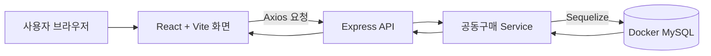
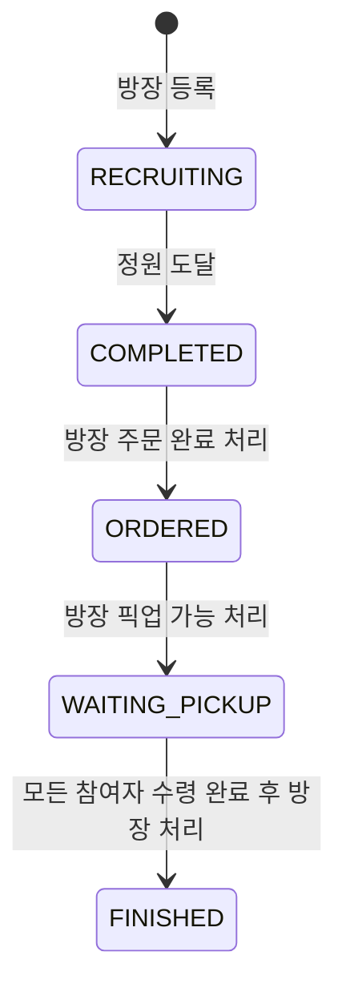

# ThingDong (띵동)

이웃과 식품·생활용품을 함께 구매하고 수령할 수 있는 공동구매 MVP입니다.

## 실제 기술 구성

- Frontend: React 19, Vite, Axios, TanStack Query
- Backend: Node.js, Express, Sequelize
- Database: MySQL 8 (Docker Compose)
- Authentication: 개발용 JWT 로그인

## 주요 기능

- 공동구매 목록·상세 조회 및 카테고리 필터링
- 인증 사용자만 공동구매 글 등록 및 참여
- 트랜잭션 잠금으로 정원 초과 참여 방지
- 모집 완료까지의 5단계 상태 모델

## 실행

```bash
cd Project
docker compose up -d

cd backend
copy .env.example .env
npm install
npm run db:sync
npm run dev

cd ../frontend
copy .env.example .env
npm install
npm run dev
```

프론트엔드는 기본적으로 Vite 프록시를 통해 `http://localhost:4000` 백엔드에 연결합니다. 별도 배포 시 `frontend/.env`의 `VITE_API_BASE_URL`과 `backend/.env`의 `CORS_ORIGINS`를 실제 주소로 설정하세요.

## 품질 확인

```bash
cd Project/frontend && npm run lint && npm run build
cd ../backend && npm run check && npm test
```

백엔드 테스트는 MySQL이 실행 중이어야 합니다.

## 서비스 구조와 데이터 흐름



사용자가 화면에서 참여하거나 상태 버튼을 누르면 React가 Express API를 호출한다. 서버는 권한과 상태 규칙을 확인한 뒤 MySQL에 저장하고, 저장된 결과를 다시 화면으로 돌려준다. 그래서 새로고침해도 공동구매와 참여 기록이 남는다.

## 공동구매 상태 흐름



- 방장은 `주문 완료 처리`, `픽업 가능 처리`, `공구 완료 처리`를 순서대로 실행한다.
- 참여자는 `픽업 대기` 상태가 되면 `수령 완료`를 기록한다.
- 방장은 모든 참여자의 수령 기록이 있어야 공구를 완료할 수 있다.
