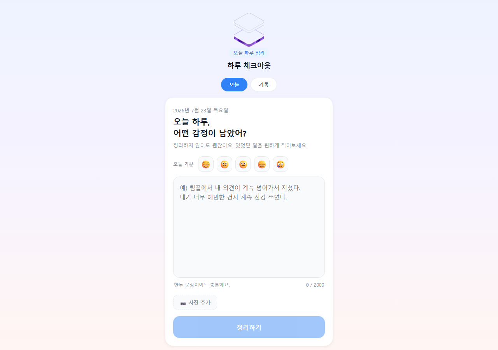
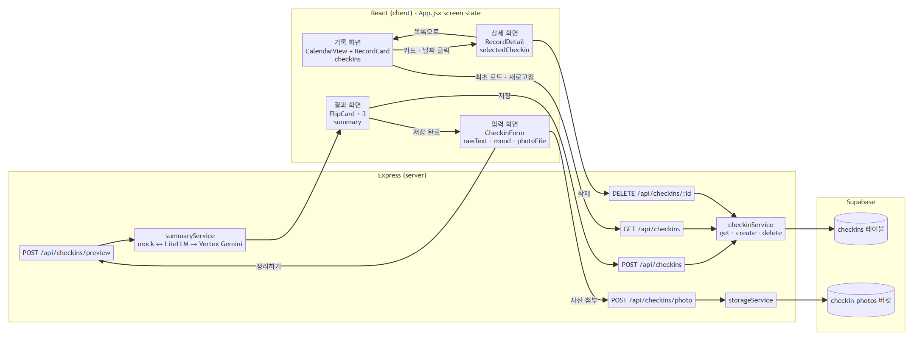

# 하루 체크아웃

정리되지 않은 하루의 감정을 입력하면 감정·원인·다음 행동으로 나누어 보여주고, 기록을 캘린더에 모아보는 학습용 웹 애플리케이션입니다.

> 현재는 4주간 진행 중인 로컬 프로토타입입니다. 의료 상담이나 진단을 제공하지 않으며, AI 결과는 사용자가 직접 수정한 뒤 저장할 수 있습니다.





## 지금 구현된 사용자 흐름

1. 오늘의 기분과 자유 텍스트를 입력합니다.
2. AI 또는 mock fallback이 감정·원인·다음 행동으로 구조화합니다.
3. 사용자가 결과를 직접 수정하고 저장합니다.
4. 저장한 기록을 목록·캘린더에서 확인하고 삭제할 수 있습니다.
5. 선택적으로 사진을 첨부할 수 있습니다.

반복 감정 패턴 표시와 실제 지원 정보 연결은 아직 구현하지 않았으며 [백로그](docs/backlog.md)에서 관리하고 있습니다.

## 3분 실행

### 요구 환경

- Node.js 20.19 이상
- npm

### 비밀키 없이 데모 실행

```bash
git clone --branch N114_유승혁 https://github.com/Yooseunghyeok/hub.git
cd hub
npm install
npm run install:all
npm run dev
```

브라우저에서 <http://localhost:5173>을 엽니다.

Supabase 환경변수가 없으면 서버가 자동으로 데모 모드로 실행됩니다.

- 두 개의 가상 기록이 기본으로 표시됩니다.
- 새 기록의 저장·삭제·사진 첨부가 메모리에서 동작합니다.
- 서버를 재시작하면 데모 기록은 초기화됩니다.
- 로컬 AI 게이트웨이가 없으면 결과 카드에 `기본 문구로 정리됨`이라고 표시됩니다.

## Render 배포 구성

저장소 루트의 `render.yaml`은 React 빌드 결과와 Express API를 하나의 Render Web Service에서 제공하도록 구성합니다.

- `/` 이하: Express가 `client/dist`의 React 화면 제공
- `/api/*`: 기존 Express API 처리
- `DEMO_MODE=true`: Supabase·AI 비밀키 없이 샘플 데이터로 실행
- `/api/health`: Render 상태 확인

배포 데모의 기록은 서버 메모리를 모든 방문자가 함께 사용하며 서버가 재시작되면 초기화됩니다. 민감한 내용은 입력하지 않아야 합니다.

Render 무료 인스턴스는 사용하지 않을 때 잠들 수 있어 첫 접속이 느릴 수 있지만, 배포 URL은 로컬 PC를 꺼도 유지됩니다.

## 실제 연동

1. `server/.env.example`을 `server/.env`로 복사합니다.
2. `DEMO_MODE=false`로 바꿉니다.
3. `SUPABASE_URL`과 `SUPABASE_SERVICE_ROLE_KEY`를 입력합니다.
4. [DB 스키마](server/supabase/schema.sql)를 Supabase에 적용합니다.
5. 실제 AI 응답을 사용하려면 `AI_BASE_URL`, `AI_MODEL` 등 게이트웨이 설정을 입력합니다.

실제 `.env`와 서비스 역할 키는 Git에 포함하지 않습니다.

## 검증

```bash
npm test --prefix client
npm test --prefix server
npm run build
```

- 프런트: 캘린더 월 그리드의 정상·경계·윤년 케이스
- 서버: AI 응답 파싱·재시도·mock fallback
- 서버: 체크인 생성·조회·삭제
- 서버: 비밀키 없는 데모 모드의 생성·조회·삭제

## 기술 구성

| 영역 | 기술 | 역할 |
|---|---|---|
| 화면 | React, Vite | 입력, 결과 수정, 기록 목록·캘린더 |
| API | Express | 입력 검증, 미리보기, 저장, 사진, 삭제 |
| 데이터 | Supabase | 체크인과 사진 저장 |
| AI | LiteLLM, Vertex Gemini | 구조화된 JSON 생성 |
| 테스트 | Vitest, Node test runner | 프런트 순수 함수와 서버 서비스 검증 |

## AI Agent와 작업한 방식

이 저장소의 목표는 웹 기술 자체를 깊게 구현하는 것뿐 아니라, 낯선 기술에서 AI Agent의 결과를 검증하는 작업 절차를 연습하는 것입니다.

- 요구사항을 [기획서](docs/plan.md)와 [백로그](docs/backlog.md)로 먼저 정리
- 화면·서버·DB 경계를 [아키텍처 문서](docs/screen-flow.md)로 확인
- 삭제 기능은 테스트 실패를 먼저 확인한 뒤 구현
- 자동 테스트와 브라우저·API 수동 확인을 함께 사용
- 이해하지 못했거나 아직 검증하지 않은 내용은 완료로 표시하지 않음

## 현재 한계

- 사용자 인증과 사용자별 데이터 분리는 구현하지 않았습니다.
- 실제 AI 게이트웨이는 로컬 실행 환경에 의존합니다.
- 배포된 공개 URL은 아직 없습니다.
- 반복 감정 패턴과 지원 정보 연결은 계획 단계입니다.
- 데모 모드는 검증용이며 데이터가 영구 저장되지 않습니다.

## 문서

- [기획서](docs/plan.md)
- [화면·서버·DB 흐름](docs/screen-flow.md)
- [데이터 모델](docs/data-model.md)
- [개발 백로그](docs/backlog.md)
- [진행 상황](docs/progress.md)
- [삭제 기능 TDD 설계](docs/features/delete-checkin-plan.md)
- [개발 회고](docs/learning/retrospectives.md)
