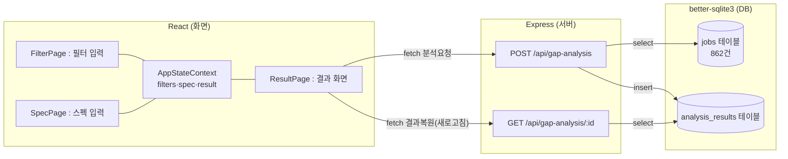
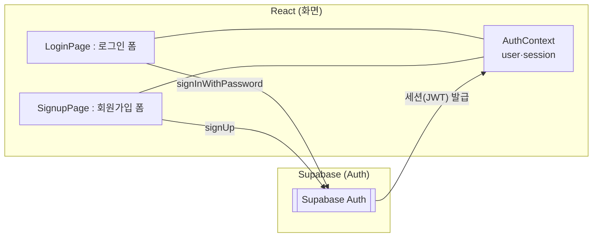
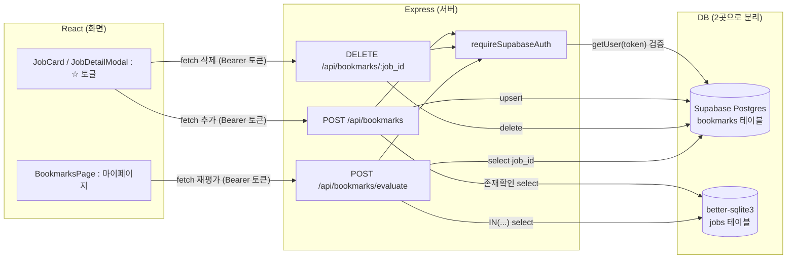

# SpecFit

> 취업 준비생이 자신의 스펙과 채용공고를 비교하여 지원 가능성을 분석하고 부족한 역량을 시각적으로 확인할 수 있는 서비스입니다.

## 📖 프로젝트 소개

기존 취업 플랫폼은 채용공고를 추천하거나 검색하는 기능에 집중되어 있습니다.

SpecFit은 사용자의 학력, 경력, 자격증, 전공, 외국어 등의 정보를 기반으로 채용공고와 비교하여 현재 지원 가능한 공고 비율을 분석하고 어떤 역량을 보완하면 더 많은 공고에 지원할 수 있는지를 시각적으로 제공합니다.

> ⚠️ **데이터 고지**: 채용공고 데이터는 JOB-ALIO에 실제 게시된 862건(회사명/제목/등록일/마감일/상태)을 사용하고, 학력·경력·자격증·전공·외국어·컴퓨터활용능력 등 스펙 관련 필드는 규칙 기반으로 합성한 값입니다. 실제 공고의 자격 요건과 다를 수 있습니다.

---

## 🌐 배포

| | URL |
|---|---|
| 프론트엔드 (Vercel) | https://specfit-six.vercel.app |
| 백엔드 API (Render) | https://specfit-62w2.onrender.com |

Render 무료 인스턴스는 일정 시간 요청이 없으면 슬립 상태가 되어 첫 요청 응답이 몇십 초 걸릴 수 있습니다.

---

## ✨ 주요 기능

- 채용공고 조건 검색 및 필터링
- 사용자 스펙 입력 (학력·경력·자격증·전공/부전공·외국어 성적 복수 입력·컴퓨터활용능력)
- 지원 가능 공고 비율 분석 및 보완 인사이트 팝업
- 부족한 역량 분석 및 시각화 (도넛/막대 차트)
- 공고별 충족/미충족 항목 확인, 미충족 항목별 외부 참고링크 제공
- 로그인/회원가입 및 관심 공고 북마크, 마이페이지에서 현재 스펙 기준 재비교

---

## 🛠️ Tech Stack

### Frontend
- React (Vite)
- React Router
- 커스텀 SVG 차트 (도넛/바 차트, Recharts 등 외부 차트 라이브러리 미사용)
- Vitest + Testing Library (유닛/컴포넌트), Playwright (E2E)

### Backend
- Node.js / Express
- better-sqlite3 (동기 API, ORM 미사용)
- Vitest + Supertest

### Database & Auth
- SQLite (`jobs`, `analysis_results` — 공고 데이터/갭 분석 이력)
- Supabase Postgres (`bookmarks` — 로그인 사용자의 북마크만, RLS 적용)
- Supabase Auth (회원가입/로그인/세션 — 프론트가 직접 호출, Express는 거치지 않음)

### Deployment
- Vercel (프론트엔드)
- Render (백엔드)

---

## 🔄 아키텍처 / 데이터 흐름

기능별로 화면(React) · 서버(Express) · DB의 데이터 흐름을 정리했습니다.

### ① 갭 분석 흐름 (필터 → 스펙 → 결과)

`FilterPage`/`SpecPage`는 직접 fetch하지 않고 중앙 상태(`AppStateContext`)에만 값을 씁니다. 실제 서버 요청은 `ResultPage`가 전담합니다.

### ② 로그인 / 회원가입 흐름

이 기능만 유일하게 Express 서버를 거치지 않습니다 — 프론트가 Supabase Auth에 직접 붙습니다.

### ③ 북마크 흐름

DB가 두 곳(Supabase Postgres의 `bookmarks` + 로컬 SQLite의 `jobs`)으로 쪼개져 있어 진짜 SQL join이 불가능하고, 서버 코드가 두 DB를 순서대로 조회해 조합합니다. `requireSupabaseAuth`는 모든 북마크 요청 앞단에서 토큰을 매번 Supabase에 검증 위임합니다.

---

## 📚 API 문서

엔드포인트별 요청/응답 스키마는 [`docs/api.md`](docs/api.md)에 정리되어 있습니다.

---

## 📄 기획서

프로젝트 기획서는 아래 링크에서 확인할 수 있습니다.

👉 **[기획서 보기](https://github.com/minnnnju/hub/wiki/프로젝트-기획서)**

👉 **[개발 task 보기](https://jazzy-kitten-7a0.notion.site/SpecFit-Task-399ffa5e71548073a69ddecdbd83c1bc?source=copy_link)**

👉 **[주간 계획 보기](https://github.com/users/minnnnju/projects/1/views/1)**
