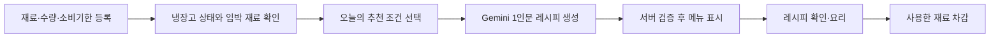
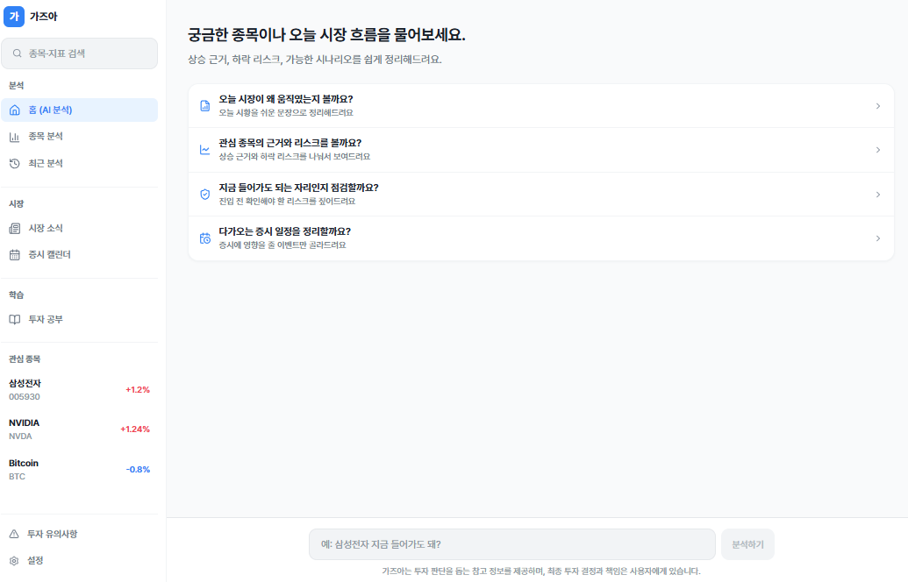
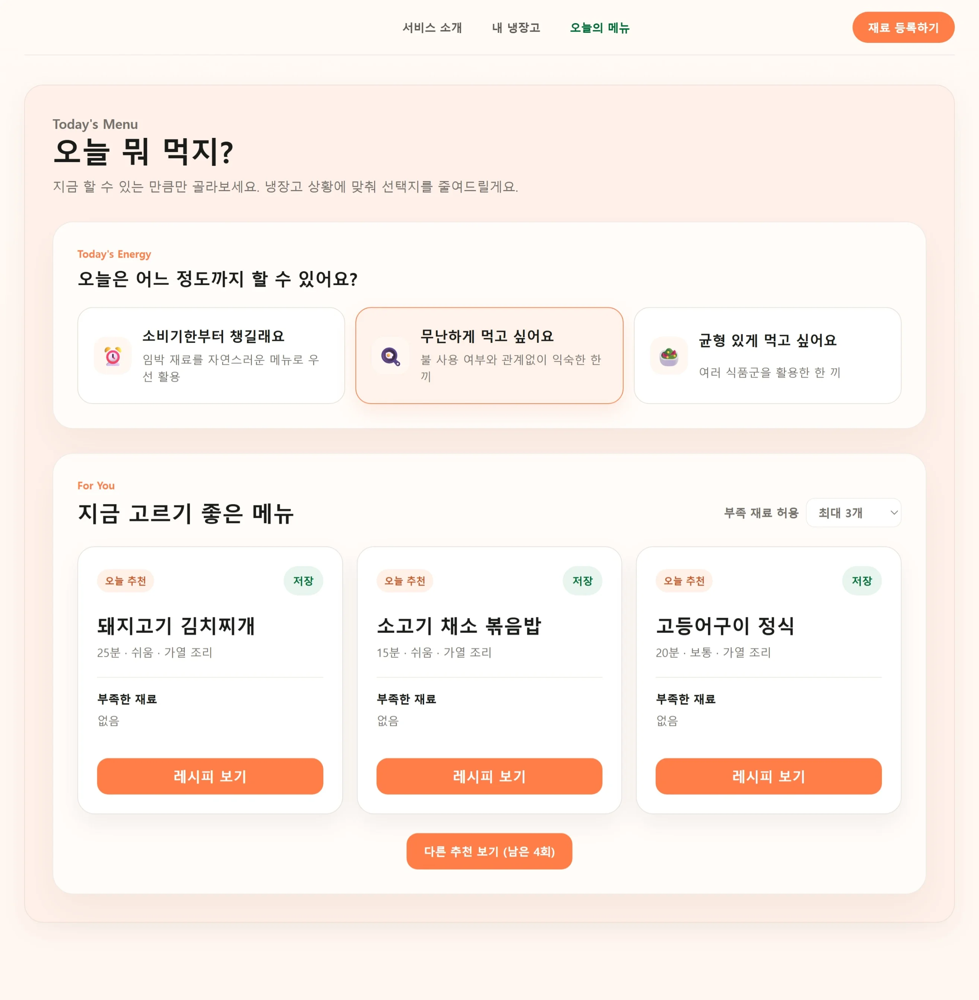
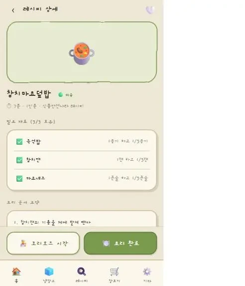
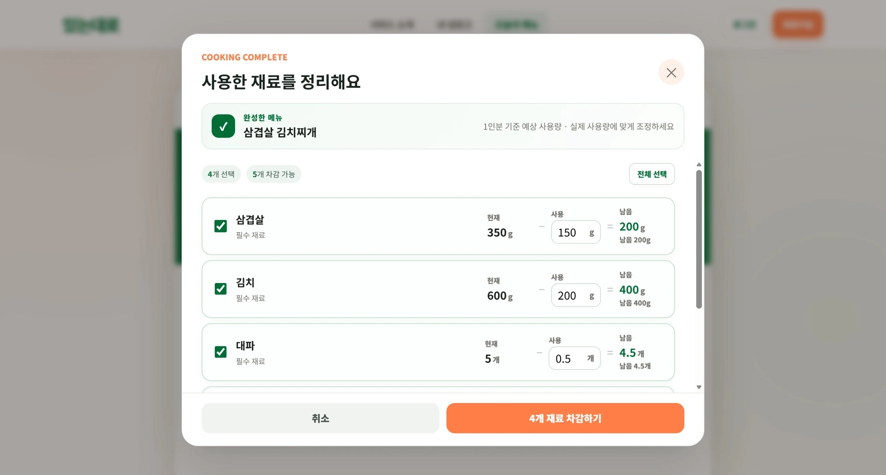
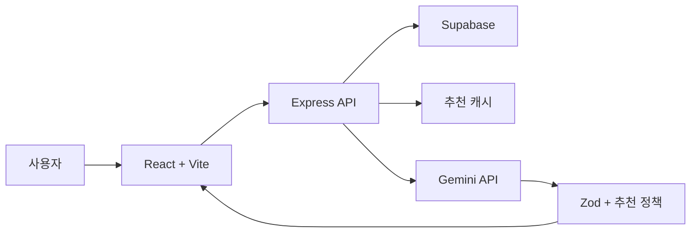
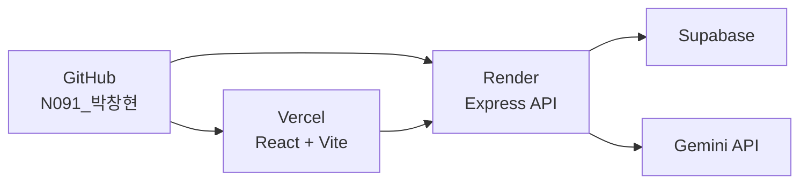
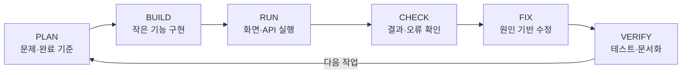

# 있는대로

> 냉장고 속 보유 재료와 소비기한을 바탕으로 지금 만들 수 있는 1인분 레시피를 추천하는 자취생용 식재료 관리 서비스


## 서비스 바로가기

- [웹서비스 실행](https://todays-fridge-n091.vercel.app)
- [프로젝트 소개 영상](project-introduction-video/n091-park-changhyun-project-introduction.mp4)
- [AI Agent 부스 전시 포스터](booth-exhibition-poster/n091-park-changhyun-ai-agent.pdf)
- [프로젝트 소개 부스 전시 포스터](booth-exhibition-poster/n091-park-changhyun-project-introduction.pdf)
- [AI와 함께 개발한 과정](docs/AI_DEVELOPMENT_WORKFLOW.md)
- [개발 환경 및 협업 가이드](docs/DEVELOPMENT_GUIDE.md)

## 해결하려는 문제

자취생은 냉장고에 어떤 재료가 있는지 잊거나 소비기한을 놓치기 쉽습니다. 남은 재료를 확인해도 지금 만들 수 있는 메뉴를 판단하려면 다시 레시피를 검색해야 합니다.

`있는대로`는 재료 관리, 메뉴 결정, 요리 후 재고 정리를 하나의 흐름으로 연결합니다.



## 핵심 사용자 Workflow

1. 냉장고에 보유한 재료, 수량, 보관 위치와 소비기한을 등록합니다.
2. 먼저 사용해야 할 임박 재료를 확인합니다.
3. 소비기한 우선, 간편한 한 끼, 균형 있는 한 끼 중 오늘의 조건을 선택합니다.
4. Gemini가 생성하고 서버 정책을 통과한 1인분 메뉴를 확인합니다.
5. 보유 재료와 부족 재료, 대체 재료, 조리 순서와 안전 안내를 확인합니다.
6. 요리 후 실제 사용량을 입력해 냉장고 재고를 차감합니다.

## 주요 기능

- 보관 위치·수량·소비기한·추천 태그를 포함한 냉장고 재료 관리
- 소비기한과 재료 태그 우선순위를 반영한 Gemini 레시피 추천
- 소비기한 우선·간편한 한 끼·균형 있는 한 끼 등 상황별 추천 조건
- 보유 재료와 부족 재료 자동 구분 및 구매 검색 연결
- 1인분 재료, 대체 재료, 조리 순서, 정성적 영양 구성과 안전 안내
- 레시피 브라우저 저장과 요리 후 보유 재료 자동 차감

## 화면

| 내 냉장고 | 오늘의 메뉴 |
| --- | --- |
|  |  |

| 레시피 상세 | 사용 재료 차감 |
| --- | --- |
|  |  |

## 기술 구성

| 영역 | 기술 | 역할 |
| --- | --- | --- |
| Frontend | React, Vite | 재료 관리, 추천, 레시피와 차감 화면 |
| Backend | Node.js, Express | REST API, 추천 서비스와 정책 검증 |
| Validation | Zod | 환경변수, 요청과 Gemini 응답 검증 |
| Data | Supabase PostgreSQL | 보유 재료와 추천 캐시 저장 |
| Generative AI | Gemini API | 조건에 맞는 구조화 레시피 생성 |
| Quality | Vitest, oxlint | 회귀 테스트와 정적 분석 |
| Logging | Pino, pino-http | 구조화 서버·요청 로그 |
| Deployment | Vercel, Render | 프런트엔드와 API 배포 |



## 배포 구성

| 구성 | 배포 서비스 | 주소·역할 |
| --- | --- | --- |
| Frontend | Vercel | [todays-fridge-n091.vercel.app](https://todays-fridge-n091.vercel.app) |
| API | Render | [API 상태 확인](https://todays-fridge-api-n091.onrender.com/api/health) |
| Database | Supabase | 재료 데이터와 추천 캐시 저장 |
| Generative AI | Gemini API | 검증 가능한 구조의 1인분 레시피 생성 |



- Vercel은 `npm run build`로 생성한 Vite 프로덕션 결과를 배포합니다.
- Render는 Express 서버를 실행하고 `/api/health`로 상태를 확인합니다.
- Supabase Secret Key와 Gemini API Key는 Render 서버 환경변수로만 관리합니다.
- 프런트엔드에는 비밀키를 포함하지 않으며 허용된 API 주소만 사용합니다.
- 자세한 배포 설정과 점검 절차는 [DEPLOYMENT.md](docs/DEPLOYMENT.md)를 참고해 주세요.

## Gemini 추천 검증 Workflow

Gemini가 만든 레시피는 그대로 사용자에게 노출하지 않습니다.

1. Express가 Supabase에서 실제 보유 재료를 조회합니다.
2. 소비기한과 태그를 기준으로 추천 우선순위를 계산합니다.
3. 이름, 수량, 보관 상태 등 허용된 재료 필드만 Gemini에 전달합니다.
4. Gemini에서 구조화 JSON 레시피를 받습니다.
5. Zod로 응답 구조와 필수 필드를 검증합니다.
6. 서버 정책으로 부족 재료 수, 만료 재료, 조리 조건과 중복 레시피를 검증합니다.
7. 검증을 통과한 결과만 화면과 추천 캐시에 저장합니다.

## AI Agent와 함께 개발한 Workflow

Codex를 단순 코드 생성 도구가 아니라 요구사항을 개발 작업으로 바꾸고 결과를 함께 검증하는 페어 프로그래밍 파트너로 활용했습니다.



### 작은 단위로 연결하는 개발

1. 해결하려는 사용자 문제를 기능 요구사항으로 구체화했습니다.
2. GitHub Issue와 완료 기준으로 작업을 나눴습니다.
3. 프런트엔드·백엔드·DB 작업을 구분했습니다.
4. 한 번에 하나의 기능을 구현하고 화면과 API를 확인했습니다.
5. 검증이 끝난 기능만 다음 사용자 흐름에 연결했습니다.

### Mock에서 실제 서비스로 확장

1. mock 데이터로 재료 관리와 추천 화면 흐름을 먼저 검증했습니다.
2. Supabase 조회·등록·수정·삭제 API를 각각 연결했습니다.
3. Gemini 추천 API를 별도로 검증했습니다.
4. 오류·빈 데이터·재시도 상태를 추가했습니다.
5. 재료 등록부터 추천, 레시피 확인과 재료 차감까지 통합했습니다.

### 검증 결과를 코드와 문서에 남기기

- 정상 흐름뿐 아니라 인증 실패, 사용량 제한, 타임아웃, 잘못된 JSON과 DB 오류를 테스트합니다.
- UI 변경은 사용자 흐름 회귀 테스트로 확인합니다.
- `test → lint → build`를 품질 게이트로 사용합니다.
- 결정한 정책은 API 명세, 디자인 가이드와 개발 문서에 함께 기록합니다.

자세한 과정은 [AI와 함께 개발한 과정](docs/AI_DEVELOPMENT_WORKFLOW.md)에서 확인할 수 있습니다.

## 현재 제품 범위

현재 핵심 범위는 냉장고 재료 관리와 검증된 Gemini 레시피 추천입니다.

- 로그인과 회원가입은 UI만 표시하며 인증 기능은 아직 연결하지 않았습니다.
- 식단을 평가하거나 사용자의 선택을 교정하는 코칭 기능은 제공하지 않습니다.
- 숫자형 칼로리·영양소를 추정하지 않고, 레시피 재료를 바탕으로 정성적 영양 구성을 안내합니다.
- 상품 가격 비교, 장바구니와 결제 기능은 포함하지 않습니다.

## 로컬 실행

### 준비 사항

- Git
- Node.js LTS
- npm
- Supabase 프로젝트
- Gemini API 키

### 설치 및 시작

```powershell
git clone https://github.com/pkchanghyun-pixel/hub.git
cd hub
npm.cmd install
Copy-Item .env.example .env
npm.cmd run dev
```

- 웹: `http://localhost:5173/`
- API 상태: `http://localhost:3000/api/health`

환경변수와 실행 방법은 [개발 환경 및 협업 가이드](docs/DEVELOPMENT_GUIDE.md)를 참고해 주세요. 실제 비밀키가 들어 있는 `.env` 파일은 커밋하지 않습니다.

## 품질 확인

```powershell
npm.cmd test
npm.cmd run lint
npm.cmd run build
```

## 프로젝트 문서

| 문서 | 내용 |
| --- | --- |
| [DEMO_DAY_CORE_FLOW.md](docs/DEMO_DAY_CORE_FLOW.md) | 서비스 기획, 대상 사용자와 핵심 시연 흐름 |
| [AI_DEVELOPMENT_WORKFLOW.md](docs/AI_DEVELOPMENT_WORKFLOW.md) | 3주간 AI Agent와 함께 개발한 과정 |
| [DEVELOPMENT_GUIDE.md](docs/DEVELOPMENT_GUIDE.md) | 개발 환경, 명령, API·로그·보안과 커밋 규칙 |
| [recipe-recommendation-api.md](docs/recipe-recommendation-api.md) | Gemini 추천 API와 검증 정책 |
| [QA_REPORT_2026-07-22.md](docs/QA_REPORT_2026-07-22.md) | 기능과 화면 검증 결과 |
| [DEPLOYMENT.md](docs/DEPLOYMENT.md) | Vercel·Render 배포 구조 |
| [GitHub Issues](https://github.com/pkchanghyun-pixel/hub/issues) | 기능별 작업과 완료 기준 기록 |
