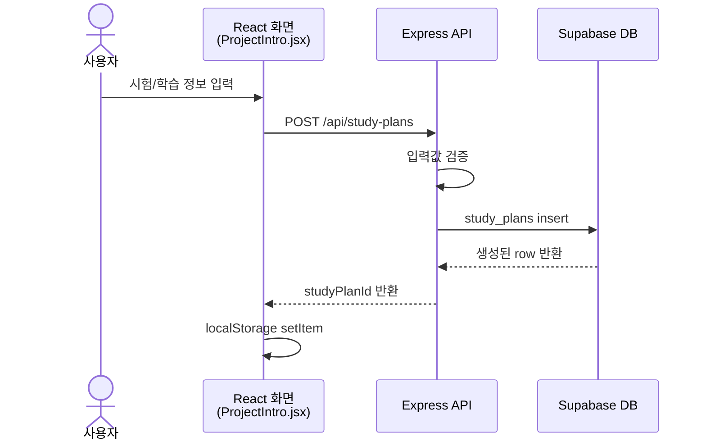
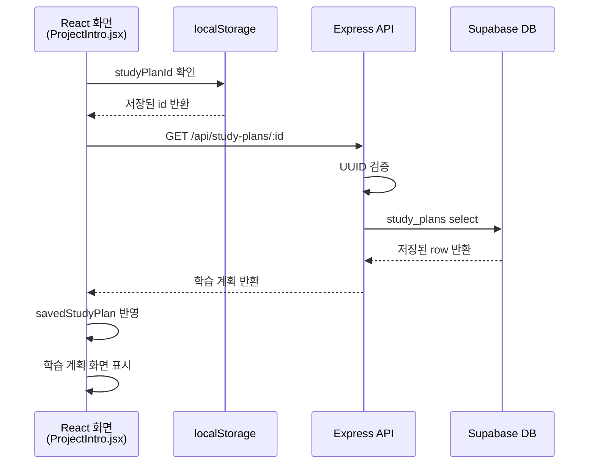

# hub

- [프로젝트 기획서](docs/plan.md)
- [개발 Task 및 백로그](https://app.notion.com/p/AI-Agent-Challenge-Task-399bd5ad252d80f5a73afd5e6443d3fd?source=copy_link)

## 2주차 작업 계획

- [2주차 수직 슬라이스 구현 계획](docs/week2-vertical-slice-plan.md)

## 3주차 작업 계획

- Supabase DB 연동 상태 점검
- 저장된 학습계획의 새로고침 복원 기능 구현
- Vitest를 이용한 테스트 환경 구성 및 TDD 적용
- 서비스 구조와 데이터 흐름을 Mermaid로 시각화
- 테스트코드 생성 Skill 제작
- 코드 검증 Agent 제작
- 개인 개발 Workflow 문서화

## 서비스 아키텍처 및 데이터 흐름

### 1. 학습 계획 저장

사용자가 입력한 학습 계획을 서버 검증 후 Supabase에 저장하고, 생성된 id를 브라우저에 보관합니다.

- `study_plans · insert`: Supabase의 학습 계획 테이블에 새 학습 계획을 저장
- `localStorage · setItem`: 브라우저에 생성된 studyPlanId를 저장

### 2. 새로고침 후 학습 계획 복원

페이지가 다시 열리면 브라우저에 저장된 id로 기존 학습 계획을 조회해 화면에 복원합니다.

조회에 실패하면 잘못된 studyPlanId를 localStorage에서 삭제하고 정보 입력 화면을 유지합니다.

- `localStorage · getItem`: 브라우저에 저장된 studyPlanId를 확인
- `study_plans · select`: 해당 id의 학습 계획을 Supabase에서 조회
- `localStorage · removeItem`: 조회 실패 시 잘못된 studyPlanId를 브라우저에서 삭제

### 구조를 정리하며 확인한 점

#### 현재 구조에서 보완할 수 있는 부분

- `ProjectIntro.jsx`에서 화면 전환, 입력 상태 관리, API 요청, 새로고침 복원 로직을 함께 처리하고 있다.
- 현재 구현 범위에서는 정상적으로 동작하지만, 이후 기능이 추가되면 한 파일이 복잡해질 수 있다.
- 추후 화면, 상태 관리, API 요청과 복원 로직을 역할별로 분리하는 방향을 고려한다.

#### 이후 구현할 확장 기능

- 취약 영역 선택 결과는 현재 React state에만 저장된다.
- 이번 DB 저장 및 새로고침 복원 구현 범위에는 취약 영역 저장이 포함되지 않았다.
- 이후 취약 영역도 학습 계획과 함께 DB에 저장하고 새로고침 후 복원되도록 확장할 예정이다.

### 다음 작업에 반영할 내용

- 화면 전환, 상태 관리, API 요청과 복원 로직을 역할별로 분리하기
- 취약 영역을 학습 계획과 함께 DB에 저장하기
- 저장된 취약 영역도 새로고침 후 복원하기
