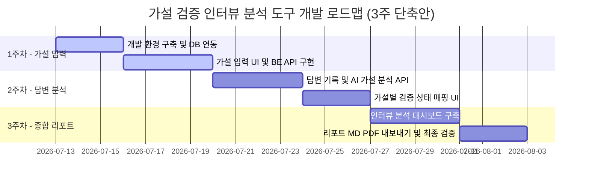

# [가설 검증 인터뷰 분석 도구] 주차별 개발 계획 및 1주차 구현 계획

본 계획서는 **가설 입력 단계 구현**을 포함하여, 전체 3주차 동안 진행될 **가설 검증 인터뷰 분석 도구** 개발 로드맵과 1주차의 상세 WBS(개발 작업 분할 구조)를 정의한 구현 계획서입니다.

---

## 📅 전체 개발 로드맵 (주차별 계획)

기존 계획에서 **인터뷰 질문 설계** 단계를 제외하고, 인터뷰 답변 분석 및 가설 매핑을 2주차로 당겨 **3주 완성 일정**으로 일정을 재조정했습니다.

### 2주차: 가설 입력 및 저장 단계 (현재 주차)
- **목표:** 가설 입력 화면 구현 및 입력 데이터를 DB에 영구 저장하고 마크다운 파일로 추출하는 수직적 연동(FE-BE-DB) 완료.
- **주요 산출물:** `.env` 환경 변수 설정, 프로젝트 생성 API, 가설 입력 UI, Supabase DB 스키마, 추출된 가설 마크다운 파일.

### 3주차: 인터뷰 답변 기록 및 가설 매핑/분석 (AI 분석)
- **목표:** 진행한 인터뷰 답변을 입력하고, LLM을 통해 답변 속 핵심 문장을 가설의 원인/결과와 매핑하여 가설을 지지하는지 여부를 분석.
- **주요 산출물:** 인터뷰 답변 입력 UI, AI 기반 인터뷰 분석 엔진(가설 매핑 및 스코어링 API), 가설 상태('유력함', '근거 부족', '수정 필요') 시각화.

### 4주차: 종합 가설 검증 결과 대시보드 및 리포트 도출
- **목표:** 여러 차례의 인터뷰를 종합한 가설 검증 결과 대시보드를 제공하고, 최종 보고서 양식으로 다운로드할 수 있는 편의 기능 구현.
- **주요 산출물:** 검증 요약 대시보드 UI, 리포트 Export 기능(Markdown/PDF), E2E 전체 정밀 검증.

---

## 🎯 1주차 MVP 핵심 아키텍처 정의 (가설 입력)

- **기술 스택:**
  - Frontend: Vite React + Vanilla CSS
  - Backend: Node.js Express + TypeScript
  - Database: Supabase PostgreSQL (hosted)
- **FE 역할:** 문제 정의 입력란, 원인-결과 기반의 동적 가설 입력 Form (추가/삭제 가능), 분석 시작 트리거 및 데이터 전송.
- **BE 엔드포인트:**
  - `POST /api/projects`: 프로젝트 정보(문제 정의, 추가 컨텍스트) 및 가설 배열을 받아 DB에 저장.
  - `POST /api/projects/:id/analyze`: 분석 요청을 수신하여 가설 데이터를 포맷팅한 마크다운 파일(`analysis_requests/project_<id>.md`)로 프로젝트 루트 디렉토리에 저장.
- **마크다운 파일 저장 경로:**
  - 에이전트와 BE가 함께 접근하기 용이하도록 **프로젝트 루트 디렉토리의 `analysis_requests/` 하위**로 확정합니다.
- **DB 테이블:** `projects` 및 `hypotheses` (1:N 관계).

---
## 1주차 단계별 작업 분할

## 📑 2주차 단계별 작업 분할 및 우선순위 (WBS)

### 🔴 High (최우선 과제: FE-BE-DB 관통 및 연동)

- [ ] **Task 0: [Setup] 로컬 .env 환경 변수 설정**
  - *상세:* 사용자가 제공한 Supabase URL 및 Anon Key 정보를 바탕으로 `backend/.env` 파일을 직접 생성하고 환경 변수를 세팅.
  - *완료 조건:* `backend/.env` 파일이 생성되고 유효한 정보가 채워짐.

- [ ] **Task 1: [DB] Supabase 테이블 스키마 생성 및 커넥션 테스트**
  - *상세:* Supabase 콘솔 또는 마이그레이션 툴을 사용하여 `schema.sql`에 정의된 `projects` 및 `hypotheses` 테이블 생성. BE와 Supabase DB 간의 기본적인 커넥션 및 쿼리 테스트 진행.
  - *완료 조건:* Supabase Database에 테이블이 정상 생성되고, Node.js 클라이언트에서 SELECT/INSERT 쿼리가 에러 없이 실행되는 것이 확인됨.

- [ ] **Task 2: [BE] Express 서버 초기화 및 DB 연동 API 구현**
  - *상세:* `backend` 폴더에서 Express + TS 환경 구성 (`src/server.ts`). DB 클라이언트 인스턴스 초기화. `POST /api/projects` 엔드포인트를 구현하여 프로젝트 생성과 그에 속한 가설 리스트를 일괄 INSERT 방식으로 저장.
  - *완료 조건:* Postman/Curl 등으로 JSON 페이로드를 전송했을 때 DB에 `projects` 1건과 `hypotheses` N건이 올바르게 적재되고 201 Created가 반환됨.

- [ ] **Task 3: [FE] React 가설 입력 화면 UI 구성 및 동적 폼 상태 관리**
  - *상세:* `frontend` React 앱 생성 및 UI 레이아웃 설계. 문제 정의 입력란 및 가설(원인, 결과)을 입력할 수 있는 동적 Form 구현 (가설 행 추가/삭제 기능 포함). `useState`로 Form 상태 통합 관리.
  - *완료 조건:* 화면에 입력 폼이 정상 렌더링되고, '추가' 버튼 클릭 시 새 입력 행이 생성되며, 입력값이 React 상태(State)에 실시간 반영됨.

- [ ] **Task 4: [FE/BE] 분석 시작 요청 및 마크다운 파일 생성 로직 연결**
  - *상세:* 
    - FE: "분석 시작" 버튼 클릭 시 BE `POST /api/projects` 호출 ➡️ 생성된 `project_id` 수신 ➡️ `POST /api/projects/:id/analyze` 연동 호출.
    - BE: `POST /api/projects/:id/analyze` API에서 DB의 프로젝트/가설 데이터를 조회한 후 템플릿 마크다운(MD) 문자열을 생성하여 프로젝트 루트의 `analysis_requests/project_<id>.md` 파일로 기록.
  - *완료 조건:* "분석 시작" 버튼을 클릭하면 네트워크 요청이 차례로 성공하고, 프로젝트 루트의 `analysis_requests` 폴더에 마크다운 파일이 올바르게 저장됨.

- [ ] **Task 5: [검증] E2E 데이터 흐름 테스트**
  - *상세:* 화면에서 문제 정의와 가설 2~3개를 입력하고 "분석 시작" 클릭 ➡️ Supabase DB에 적재된 데이터 검증 ➡️ 생성된 마크다운 파일의 텍스트 구성 및 내용 정합성 검증.
  - *완료 조건:* 수동 E2E 테스트 성공 및 로그 확인 완료.

### 🟡 Medium (예외 처리 및 안전성 강화)

- [ ] **Task 6: [BE/FE] 입력값 유효성 검증(Validation) 및 CORS 설정**
  - *상세:* 
    - FE: 필수 필드(문제 정의, 가설의 원인/결과 최소 1개 이상)가 누락되었을 시 경고 표시 및 전송 차단.
    - BE: CORS 미들웨어 적용하여 FE 도메인 허용. 서버 사이드에서도 입력값 빈 값 체크.
  - *완료 조건:* 유효하지 않은 데이터 전송 시 적절한 에러 핸들링과 경고 메시지 표시 확인.

### 🟢 Low (UI 디테일 및 편의성)

- [ ] **Task 7: [FE] 로딩 상태 처리 및 성공 토스트 알림**
  - *상세:* 분석 시작 중(네트워크 요청 대기 중) 로딩 인디케이터 표시, 저장 완료 후 사용자 안내 토스트/모달 추가.
  - *완료 조건:* 로딩 및 성공 화면 피드백이 자연스럽게 작동하는 것 확인.

---

## 🚀 3. 추천 실행 순서 및 리스크 조언

- **핵심 동선:** Supabase DB 세팅 및 로컬 BE 커넥션 테스트 ➡️ BE API 설계 (`POST /api/projects`, `POST /api/projects/:id/analyze`) ➡️ React UI 연동 ➡️ 최종 마크다운 파일 자동 생성 검증.
- **리스크 요인 (Supabase API 키 노출 방지):** 
  - Supabase Database URL 및 Anon Key는 절대 코드에 하드코딩하지 않고 `.env` 파일로 로컬에서 분리 관리합니다.
  - 프로젝트 저장 시, `projects`가 먼저 저장되고 생성된 UUID를 외래키(`project_id`)로 사용하여 `hypotheses`들을 저장해야 하므로 비동기 트랜잭션/순차 처리가 필요합니다.
