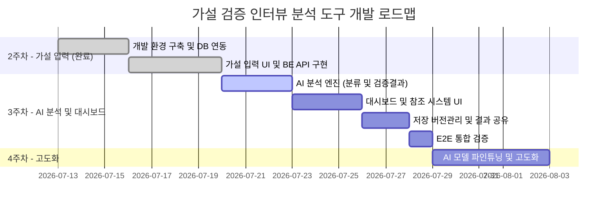

# [가설 검증 인터뷰 분석 도구] 3주차 구현 계획

본 계획서는 2주차(가설 입력 및 저장)가 완료된 시점에서, **AI 분석 엔진 · 가설 검증 대시보드 · 결과 공유**를 구현하는 3주차의 상세 WBS(개발 작업 분할 구조)를 정의한 구현 계획서입니다.

---

## 📅 전체 개발 로드맵 (현재 위치)

### 2주차: 가설 입력 및 저장 단계 (완료)
- 가설 입력 폼(원인/결과 동적 추가) ➡️ Supabase 저장 ➡️ `analysis_requests/project_<id>.md` 생성까지 FE-BE-DB 수직 연동 완료.
- 인터뷰 전사문 붙여넣기 및 파일 업로드/텍스트 추출(`POST /api/extract`) 구현 완료.

### 3주차: AI 분석 엔진 및 가설 검증 대시보드 (현재 주차)
- **목표:** 저장된 전사문을 Gemini API로 분석하여 가설별 근거를 태깅하고 '검증결과'(수정 방향성 · 핵심 근거)를 도출한다. 사용자는 대시보드에서 가설별 상태를 확인하고, 상세 화면에서 근거를 참조하며 반박·수정하고, 최종 결과를 공유한다.
- **주요 산출물:** Gemini 기반 2단계 분석 파이프라인, 가설 검증 대시보드, 참조 시스템 + 사이드 드로어, 반박 프롬프트 리파인, 임시저장/버전 히스토리, 결과 공유(MD/URL/PDF).

> **설계 원칙:** 기획서의 "AI는 발언을 가설에 분류(classification)만 하고, 최종 해석·검증 판단은 사람이 함"을 유지합니다. 3주차의 '검증결과'는 AI가 **초안을 제안**할 뿐이며, 유지/수정/폐기 **확정은 항상 사용자**가 합니다.

---

## 🎯 3주차 핵심 아키텍처 정의

- **기술 스택 (2주차 대비 추가분):**
  - Backend: `@google/genai` (Gemini API 클라이언트) 추가
  - Frontend: `react-router-dom` 추가 (단일 화면 → 다중 화면 전환)
  - Database: Supabase PostgreSQL (기존 유지)
- **AI 분석 파이프라인 (2단계):**
  1. **분류 단계** — 전사문 발언을 가설에 매핑. 사실 추출만 수행, 해석 금지. ➡️ `evidence_tags`
  2. **검증결과 생성 단계** — 1단계 태그를 근거로 가설별 검증결과 초안 작성. ➡️ `verification_results`
- **신규 BE 엔드포인트:**
  - `POST /api/projects/:id/analyze` (기존 확장): MD 파일 생성 + AI 분석 파이프라인 실행
  - `GET /api/projects/:id`: 대시보드용 (project + hypotheses + verification_results)
  - `GET /api/projects/:id/hypotheses/:hid`: 상세 화면용 (검증결과 + citations + 근거 태그 + 전사문 발췌)
  - `PATCH /api/projects/:id/hypotheses/:hid`: 가설 판단(유지/수정/폐기) 및 원인/결과 인라인 수정
  - `POST /api/projects/:id/hypotheses/:hid/refine`: 반박/의견 프롬프트 ➡️ AI 수정 가안
  - `GET /api/projects/:id/hypotheses/:hid/versions`: 버전 히스토리 조회
  - `POST /api/projects/:id/save`: 임시저장 / 저장하기 전환
  - `GET /api/projects/:id/report.md`: 리포트 마크다운 다운로드
  - `GET /api/share/:token`: 공유 링크용 읽기 전용 조회
- **FE 화면 구조 (라우팅):**
  - `/` — 가설 입력 (기존 `App.tsx` 코드 이전)
  - `/projects/:id` — 대시보드 (가설 리스트)
  - `/projects/:id/hypotheses/:hid` — 가설 상세 (검증결과 + 참조 + 드로어 + 리파인)
  - `/share/:token` — 공유 화면 (읽기 전용, PDF 인쇄 대상)
- **DB 스키마 변경분:**
  - `verification_results` **테이블 신규** (검증결과 저장)
  - `projects.save_status` **컬럼 추가** (`draft` / `saved`)
  - `projects.share_token` **컬럼 추가** (공유 URL용 랜덤 토큰)
  - 그 외 `evidence_tags`, `hypothesis_versions`, `refine_chats`는 **이미 스키마에 존재**하므로 그대로 활용

---

## 📑 3주차 단계별 작업 분할 및 우선순위 (WBS)

### 🔴 High — ① AI 분석 엔진

- [ ] **Task 0: [Setup] Gemini API 환경 변수 및 의존성 설정**
  - *상세:* `backend/.env`에 `GEMINI_API_KEY` 추가하고, `backend/.env.example`에는 **키 이름만** 기재. `backend`에 `@google/genai` 의존성 설치. `.env`가 `.gitignore`에 포함되어 있는지 재확인.
  - *완료 조건:* `npm run dev`로 BE 기동 시 환경 변수 로딩 에러가 없고, `.env`가 git 추적 대상에서 제외되어 있음.

- [ ] **Task 1: [BE] Gemini 클라이언트 래퍼 구현**
  - *상세:* `backend/src/lib/geminiClient.ts` 신규 작성. 기존 `lib/supabaseClient.ts`의 환경 변수 로딩 및 싱글턴 패턴을 그대로 따름. 모델은 `gemini-2.5-flash` 기준, `responseSchema`로 JSON 출력 강제하여 파싱 안정성 확보. 온도는 낮게 설정.
  - *완료 조건:* 간단한 테스트 프롬프트 호출 시 스키마에 맞는 JSON이 반환되고, 키 누락 시 명확한 에러 메시지가 출력됨.

- [ ] **Task 2: [AI] 가설 검증용 AI 모델 설계**
  - *상세:* 코드 작성 **전에** 파이프라인 · 프롬프트 · 입출력 스키마를 문서로 확정. 1단계(분류)와 2단계(검증결과 생성) 각각의 시스템 프롬프트, 입력/출력 JSON 스키마, 온도, 응답 실패 시 폴백 전략을 정의. 프롬프트는 라우터에 인라인으로 넣지 않고 `lib/` 모듈에 분리 배치할 것을 전제로 설계.
  - *완료 조건:* 두 단계의 프롬프트와 출력 스키마가 문서로 확정되고, 샘플 전사문 1건으로 수동 검토 시 의도한 형태의 출력이 나오는 것 확인.

- [ ] **Task 3: [BE] 1단계 — 가설별 발언 분류(태깅) 구현**
  - *상세:* `backend/src/lib/hypothesisTagger.ts` 신규. 전사문 + 가설 배열을 입력받아 각 발언을 가설에 분류 ➡️ `{ hypothesis_index, quote, speaker, badge_label }[]` 반환. 결과를 `evidence_tags`에 INSERT. **분류만 수행하며 해석·판단은 하지 않음.**
  - *완료 조건:* 샘플 전사문 분석 시 `evidence_tags`에 가설별 근거가 적재되고, 각 `quote`가 원본 전사문에 실제로 존재하는 문장임이 확인됨.

- [ ] **Task 4: [BE] 2단계 — '검증결과' 생성 구현**
  - *상세:* `backend/src/lib/verificationResult.ts` 신규. 가설 1건 + 해당 `evidence_tags`를 입력받아 아래를 산출:
    - `summary`: 검증결과 문단 (본문에 `[1]`, `[2]` 형태의 **참조 번호 마커** 삽입)
    - `direction`: **수정 방향성** — 가설을 어떻게 고쳐야 하는가
    - `key_evidence`: **핵심 근거** 요약
    - `citations`: `[{ marker: 1, evidence_tag_id: "..." }]` — 참조 번호 ↔ 근거 태그 매핑
    - `suggested_status`: 유력함 / 근거 부족 / 수정 필요 **제안값** (확정 아님)
    - *DB:* `verification_results` 테이블을 `schema.sql`에 신규 정의 (`hypothesis_id` FK, 위 필드, `citations`는 JSONB).
  - *완료 조건:* 가설별 검증결과가 `verification_results`에 저장되고, `summary` 본문의 `[n]` 마커가 `citations` 배열과 일대일로 대응함.

- [ ] **Task 5: [BE] `/analyze` 엔드포인트 확장**
  - *상세:* `backend/src/routes/projects.ts`의 기존 `POST /:id/analyze` 핸들러에 1단계 ➡️ 2단계 파이프라인 연결. 기존 `buildAnalysisMarkdown` 기반 MD 파일 생성은 디버깅/로그용으로 **유지**. 분석 완료 후 `hypotheses.verification_status`를 AI 제안값으로 갱신.
  - *완료 조건:* "분석 시작" 호출 한 번으로 MD 파일 생성 + `evidence_tags` + `verification_results` 적재 + `verification_status` 갱신이 모두 완료됨.

### 🔴 High — ② 화면 및 참조 시스템

- [ ] **Task 6: [BE] 대시보드/상세 화면용 조회 API 구현**
  - *상세:* `GET /api/projects/:id` (project + hypotheses + verification_results 조인), `GET /api/projects/:id/hypotheses/:hid` (검증결과 + citations + evidence_tags + 원본 전사문 발췌).
  - *완료 조건:* Postman/Curl로 두 API 호출 시 화면 렌더에 필요한 데이터가 한 번의 요청으로 모두 반환됨.

- [ ] **Task 7: [FE] 라우팅 도입 및 화면 분리**
  - *상세:* `react-router-dom` 도입. 현재 `App.tsx` 단일 화면 구조를 분리: `/`(입력 — 기존 코드 이전), `/projects/:id`(대시보드), `/projects/:id/hypotheses/:hid`(상세), `/share/:token`(공유). 분석 완료 후 대시보드로 자동 이동.
  - *완료 조건:* 각 경로가 정상 렌더되고, 기존 가설 입력 기능이 회귀 없이 동작하며, 분석 완료 시 대시보드로 이동함.

- [ ] **Task 8: [FE] 대시보드 — 가설 리스트 화면 구현**
  - *상세:* 각 행을 **체크박스 + 검증 상태 배지(검토 전 / 유력함 / 근거 부족 / 수정 필요) + 가설명(원인 ➡️ 결과 요약) + 판단 필요성(유지/수정/폐기 권고)** 4요소로 구성. 판단 필요성은 Task 4의 `direction` / `suggested_status`에서 가져옴. 체크박스는 공유·Export 대상 선택에 사용. 상태 배지 색상은 `design.md` 규칙 확인 후 적용. 행 클릭 시 상세 화면 진입.
  - *완료 조건:* 가설 리스트가 4요소를 모두 표시하고, 체크박스 선택 상태가 유지되며, 행 클릭 시 해당 가설 상세로 이동함.

- [ ] **Task 9: [BE/FE] 가설 유지 / 수정 / 폐기 기능 구현**
  - *상세:* `PATCH /api/projects/:id/hypotheses/:hid`로 `hypotheses.status` 갱신 (컬럼은 스키마에 이미 존재). 대시보드 행과 상세 화면 **양쪽**에서 판단 지정 가능. 기획서 화면 흐름대로 유지/폐기 ➡️ 대시보드 복귀, 수정 ➡️ 버전 히스토리 경로(Task 12)로 연결.
  - *완료 조건:* 판단 지정 시 DB의 `status`가 갱신되고 화면에 즉시 반영되며, 새로고침 후에도 유지됨.

- [ ] **Task 10: [FE] 가설 상세 화면 + 참조 시스템 + 사이드 드로어**
  - *상세:* 검증결과 문단 렌더 시 `[1]` 마커를 **클릭 가능한 참조 링크로 파싱**하여 `citations`의 `evidence_tag_id`와 연결. 참조 번호 클릭 ➡️ 사이드 드로어에 **해당 태그 + 전사문 발췌** 제시. 수정 방향성 · 핵심 근거 블록 표시. 원인/결과 인라인 수정 진입점 포함. 뒤로가기로 대시보드 복귀.
  - *완료 조건:* 검증결과 본문의 참조 번호를 클릭하면 사이드 드로어가 열리며 해당 근거 태그와 전사문 발췌가 정확히 표시됨.

- [ ] **Task 11: [BE/FE] 반박 / 의견 프롬프트 ↔ AI 모델 연동**
  - *상세:* 검증결과 문단에서 동의하지 않는 부분을 하이라이트 + 프롬프트 입력 ➡️ 원 검증결과 · 근거 · 사용자 반박을 함께 Gemini에 전달하여 **수정 가안** 수신. 대화와 가안은 `refine_chats`(스키마 존재 — `role` / `message` / `diff_json`에 `{old_text, new_text}`)에 저장. FE는 가안을 **미리보기로 먼저 제시하고, 사용자가 '적용'을 눌러야 반영**. 엔드포인트: `POST /api/projects/:id/hypotheses/:hid/refine`.
  - *완료 조건:* 반박 프롬프트 입력 시 AI 수정 가안이 미리보기로 표시되고, '적용' 시에만 검증결과가 갱신되며, 대화 이력이 `refine_chats`에 남음.

### 🔴 High — ③ 저장 및 공유

- [ ] **Task 12: [BE/DB] 임시 저장 · 저장하기 (버전 히스토리 관리)**
  - *상세:* `projects`에 `save_status`(`draft` / `saved`) 컬럼 추가 마이그레이션. 가설 인라인 수정 시 **기존 값을 `hypothesis_versions`에 `version`을 증가시켜 append한 뒤** `hypotheses`를 최신값으로 UPDATE — **덮어쓰기 금지, 히스토리 보존**. 엔드포인트: `POST /api/projects/:id/save`(임시저장/저장 전환), `GET /api/projects/:id/hypotheses/:hid/versions`.
  - *완료 조건:* 가설을 2회 수정한 뒤 `hypothesis_versions`에 이전 버전이 모두 남아 있고, 임시저장/저장 상태가 DB에 반영되어 재방문 시 복원됨.

- [ ] **Task 13: [BE/FE] 결과 공유하기 (MD / URL / PDF)**
  - *상세:*
    - **MD:** 기존 `backend/src/lib/analysisMarkdown.ts`의 빌더 패턴을 재사용하여 `buildReportMarkdown`(가설별 상태 · 판단 · 검증결과 · 근거 포함) 신규 작성 ➡️ `GET /api/projects/:id/report.md` 다운로드.
    - **URL:** `projects`에 `share_token` 컬럼 추가, `GET /api/share/:token` 읽기 전용 조회 + FE `/share/:token` 라우트. 추측 불가한 랜덤 토큰 사용.
    - **PDF:** 신규 의존성 없이 공유 화면에 print 전용 CSS(`@media print`) 적용 후 브라우저 인쇄 ➡️ PDF 저장. (Puppeteer는 번들 크기 · 배포 부담이 커서 3주차 범위에서 제외.)
  - *완료 조건:* 세 가지 공유 방식이 모두 동작하고, 공유 URL을 로그아웃/시크릿 창에서 열었을 때 읽기 전용으로 정상 표시됨.

- [ ] **Task 14: [검증] E2E 전체 동선 테스트**
  - *상세:* 입력 ➡️ 분석 ➡️ 대시보드 ➡️ 상세 ➡️ 참조 번호 클릭/드로어 ➡️ 반박 프롬프트 ➡️ 판단 지정 ➡️ 임시저장/저장 ➡️ 공유(MD/URL/PDF) 전체 동선 수동 검증.
  - *완료 조건:* 전체 시나리오가 에러 없이 완주되고, 각 단계의 DB 적재 상태가 화면과 일치함.

### 🟡 Medium (예외 처리 및 안전성 강화)

- [ ] **Task 15: [FE/BE] 분석 진행 상태 처리**
  - *상세:* 2단계 파이프라인 × 가설 N건이면 Gemini 호출이 수 초~수십 초 소요되므로 FE에 진행바 표시(기획서 원칙: **심플 진행바, 사고과정 표시 없음**). BE에는 타임아웃 및 재시도 로직 적용.
  - *완료 조건:* 긴 전사문 분석 시에도 화면이 멈춘 것처럼 보이지 않고, 타임아웃 시 명확한 에러 메시지가 표시됨.

- [ ] **Task 16: [BE] Gemini 응답 검증 (환각 방어)**
  - *상세:* 잘못된 `hypothesis_index`, 전사문에 존재하지 않는 `quote`, `citations`에 없는 참조 번호를 본문에 다는 케이스를 방어. 원문 대조 후 불일치 항목은 저장 전에 폐기. 대응되지 않는 `[n]` 마커는 렌더 시 링크가 아닌 일반 텍스트로 처리.
  - *완료 조건:* 의도적으로 잘못된 응답을 주입했을 때 불일치 항목이 걸러지고 서버가 죽지 않음.

- [ ] **Task 17: [BE] 공유 URL 접근 범위 제한**
  - *상세:* `share_token` 경로는 인증이 없으므로 **읽기 전용만 허용**. `PATCH` / `POST` 계열은 이 경로로 절대 노출하지 않음.
  - *완료 조건:* 공유 토큰으로 쓰기 계열 요청 시도 시 차단됨을 확인.

### 🟢 Low (UI 디테일 및 편의성)

- [ ] **Task 18: [FE] 버전 히스토리 뷰어**
  - *상세:* 상세 화면에서 기존 버전 ↔ 수정 버전을 비교 표시.
  - *완료 조건:* 수정 이력이 있는 가설에서 이전 버전을 확인할 수 있음.

- [ ] **Task 19: [FE] 빈 상태(Empty State) UI 처리**
  - *상세:* 전사문 미입력 / 매칭된 근거 0건인 경우의 안내 화면 처리.
  - *완료 조건:* 빈 상태에서 화면이 깨지지 않고 다음 행동을 안내함.

---

## 🚀 추천 실행 순서 및 리스크 조언

- **핵심 동선:** Gemini 키 세팅 및 클라이언트 래퍼 ➡️ AI 모델(프롬프트/스키마) 설계 확정 ➡️ 분류 + 검증결과 2단계 파이프라인 ➡️ `/analyze` 연결 ➡️ 조회 API ➡️ FE 라우팅 분리 ➡️ 대시보드 ➡️ 상세 + 참조 시스템 ➡️ 반박 리파인 ➡️ 저장/공유 ➡️ E2E.

- **리스크 요인:**
  - **API 키 노출 방지:** `GEMINI_API_KEY`는 절대 FE로 내려보내지 않습니다. Gemini 호출은 **반드시 BE에서만** 수행하며, 키는 `.env`로 분리 관리합니다.
  - **LLM 응답을 신뢰하지 말 것:** `quote`는 반드시 원본 전사문에 실제로 존재하는지 대조 검증한 뒤 저장합니다.
  - **참조 번호는 환각이 가장 잘 나는 지점:** 본문의 `[n]` 마커 집합과 `citations` 배열이 정확히 일대일 대응하는지 저장 전에 검증하고, 대응되지 않는 마커는 링크가 아닌 일반 텍스트로 렌더합니다.
  - **버전 히스토리는 append-only:** 가설 수정 시 `hypotheses` 행을 그냥 UPDATE 하면 기존 버전이 유실됩니다. 반드시 `hypothesis_versions`에 이전 값을 **먼저 INSERT한 뒤** UPDATE 하는 순서를 지킵니다.
  - **FK 순서:** `evidence_tags`는 `hypothesis_id`와 `interview_id` 양쪽 FK를 요구하므로, INSERT 시점에 interviews가 먼저 저장되어 있어야 합니다 (2주차 `POST /api/projects`에서 이미 저장됨).
  - **공유 URL의 개인정보:** `share_token` 링크는 가진 사람 누구나 열 수 있고 인터뷰 전사문 원문이 그대로 노출됩니다. 개인정보가 포함된 전사문을 다룰 때 주의하고, 토큰은 추측 불가능한 랜덤값(UUID 이상)으로 생성합니다.
  - **DB 마이그레이션:** `verification_results` 테이블 신규 + `projects.save_status` / `projects.share_token` 컬럼 추가가 필요합니다. 이미 데이터가 들어있는 Supabase 테이블이므로 `ALTER TABLE ... ADD COLUMN`으로 처리하고 기존 행에 기본값을 채웁니다.
  - **4주차 파인튜닝 대비:** Gemini 호출 지점이 3곳(분류 · 검증결과 · 반박 리파인)으로 늘어납니다. 프롬프트 로직을 라우터에 인라인으로 넣지 말고 `lib/` 모듈로 분리해야 4주차에 프롬프트만 교체할 수 있습니다.

- **범위 경계:** 기획서에서 **정량 데이터 결과 그래프는 v2 후보로 MVP 범위 밖**입니다. 3주차에 포함하지 않습니다.
