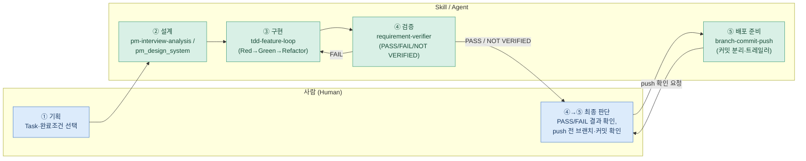

# 개발 워크플로우 — 기획 → 설계 → 구현 → 검증 → 배포

4주간 반복해서 쓴 작업 순서를 하나의 절차로 고정한 문서입니다. 각 단계는 실제로 만든 Skill/Agent 파일(`.claude/skills/`, `.claude/agents/`)에 대응하며, 어떤 단계를 사람이 결정하고 어떤 단계를 AI가 수행했는지 구분합니다.

## 1. 입력

- `README/plan/Week4_Implementation_Plan.md`(또는 해당 주차 계획서)에서 다음 작업 대상 Task와 그 **완료 조건 원문**
- 코드베이스 접근 권한 (구현·검증 단계 공통)

## 2. 단계별 순서

### ① 기획 — 사람이 결정

- 계획서 WBS에서 다음 Task를 고르고 완료 조건을 확인한다.
- **산출물:** 착수할 Task 번호 + 완료 조건 문장.
- **확인 기준:** 완료 조건이 "어떤 입력이면 어떤 결과"로 검증 가능한 문장인가(모호한 형용사면 쪼갠다).

### ② 설계 — Skill: `pm-interview-analysis` / `pm_design_system`

- AI 분석 로직(프롬프트·판정 기준)을 바꾸는 작업이면 [pm-interview-analysis](../.claude/skills/pm-interview-analysis/SKILL.md)의 근거 강도 위계·반증 우선 원칙을 설계 기준으로 삼는다.
- 화면(FE)을 새로 만들거나 바꾸는 작업이면 [pm_design_system](../.claude/skills/pm_design_system/SKILL.md)의 CSS 토큰·컴포넌트 규칙을 기준으로 삼는다.
- **산출물:** 설계 기준에 맞춘 변경 계획, 필요 시 `AI_Pipeline_Design.md`(계약 문서) 갱신.
- **확인 기준:** SKILL.md · `AI_Pipeline_Design.md` · `lib/prompts/*`(실행 코드) 세 곳이 어긋나지 않는가 — 어긋나면 SKILL.md를 정답으로 갱신한다.
- **⚠️ 실사용 공백 (2026-07-30 확인):** 두 Skill 모두 커밋 트레일러(`Skill: pm-interview-analysis` / `Skill: pm_design_system`) 실사용 건수가 **0건**이다. 방법론 자체는 Task 23·24 커밋 본문에 서술돼 있어 설계 기준으로는 실제로 참조됐지만, 트레일러 규약 도입(2026-07-27) 이후 이를 붙인 적이 없다. 다음에 프롬프트 또는 화면을 이 기준으로 바꿀 때 트레일러를 붙여 이 공백을 메운다.

### ③ 구현 — Skill: `tdd-feature-loop`

- Red: 완료 조건을 검증하는 실패 테스트를 먼저 쓰고, 실제로 실패 출력을 확인한다.
- Green: 테스트를 통과시키는 최소 구현.
- Refactor 후 `test:` → `feat:` 커밋으로 분리하고 `Skill: tdd-feature-loop` 트레일러를 붙인다.
- **산출물:** 통과하는 테스트 + 구현, test→feat 커밋 쌍.
- **확인 기준:** `npm test --prefix backend`(또는 `frontend`) 통과, 테스트가 구현보다 먼저 커밋됐는가.
- **실사용 증거:** `git log --grep "^Skill: tdd-feature-loop$"` → 10건 (Task 22·24·26 관련 커밋).

### ④ 검증 — Agent: `requirement-verifier`

- 구현한 세션과 분리된 별도 판정: [requirement-verifier](../.claude/agents/requirement-verifier.md)에게 **완료 조건 원문만** 넘긴다("다 됐다" 같은 결론성 문장은 넘기지 않는다).
- 코드 존재·테스트 실행·git 로그를 직접 확인해 **PASS / FAIL / NOT VERIFIED** 3값으로만 판정한다.
- **산출물:** 조건별 판정 + 근거(`file:line` 또는 실행 명령 출력 또는 커밋 해시).
- **확인 기준:** 판정 결과가 3값 중 하나로만 나오는가(부분 통과 같은 애매한 값이 나오면 장식화된 것).
- **실사용 증거:** `git log --grep "^Agent: requirement-verifier$"` → 1건 (Task 28 판정, 2026-07-30 — 완료 조건 6항목 중 1건만 PASS로 FAIL 판정, 그 결과로 잔여 범위를 `future_plan.md`로 이관).

### ⑤ 배포 준비 — Skill: `branch-commit-push`

- `feature/<slug>` 브랜치 위에서 작업(⁠`main` 직접 커밋 금지 — 자동 머지 워크플로가 조용히 멈춘다).
- 성격이 다른 변경은 커밋을 분리하고, 실제 사용한 Skill/Agent가 있으면 트레일러를 붙인다.
- **로컬 커밋까지는 자율 진행, `git push`는 브랜치명·커밋 목록을 보여주고 반드시 사용자 확인 후에만 실행.**
- **산출물:** 확인받고 push된 브랜치 (PR은 upstream 개인 브랜치를 base로 사람이 직접 생성).
- **확인 기준:** 커밋이 성격별로 분리됐는가, `main`에 직접 커밋되지 않았는가, push 전 확인을 받았는가.
- **실사용 증거:** `git log --grep "^Skill: branch-commit-push$"` → 2건.

### (병행) AI 파이프라인 품질 측정 — Skill: `analysis-quality-eval`

- ③·④ 사이, 프롬프트를 바꾸는 작업이면 [analysis-quality-eval](../.claude/skills/analysis-quality-eval/SKILL.md) 절차로 `npm run eval --prefix backend`를 돌려 baseline 대비 지표를 비교한다.
- **실사용 증거:** `backend/eval/results/2026-07-27_2131.json` 1회 생성 확인. 커밋 트레일러(`Skill: analysis-quality-eval`)는 아직 0건 — 위 ②설계 단계와 같은 공백이다.

## 3. 단계별 확인 기준 요약

| 단계 | 도구 | 확인 기준 | 산출물 |
|---|---|---|---|
| 기획 | 사람 | 완료 조건이 검증 가능한 문장인가 | Task + 완료 조건 |
| 설계 | pm-interview-analysis / pm_design_system | 세 문서(SKILL.md·계약·구현)가 어긋나지 않는가 | 설계 기준 반영 |
| 구현 | tdd-feature-loop | 테스트가 구현보다 먼저 커밋됐는가 | test→feat 커밋 쌍 |
| 검증 | requirement-verifier | 판정이 PASS/FAIL/NOT VERIFIED 3값인가 | 조건별 판정 + 근거 |
| 배포 | branch-commit-push | 커밋 분리, main 미직행, push 전 확인 | 확인된 브랜치 |

## 4. 문제가 생겼을 때 되돌아갈 단계

- **구현 중 테스트가 계속 실패한다** → ③으로 복귀. 완료 조건을 더 잘게 쪼개고 Red를 다시 확인한다(구현을 먼저 고치고 테스트를 맞추지 않는다).
- **`requirement-verifier`가 FAIL을 준다** → 어떤 조건이 FAIL인지 근거를 보고 ③(해당 조건만)으로 복귀한다. 이번 라운드에서 손대지 못할 범위면 임의로 PASS 처리하지 않고 `plan/future_plan.md`로 이관한다(Task 28 사례).
- **`requirement-verifier`가 NOT VERIFIED를 준다** → 자동 확인 수단이 없다는 뜻이지 틀렸다는 뜻이 아니다. 사람이 직접 수동으로 확인하고 그 근거를 계획서에 남긴다. 같은 입력으로 Agent를 다시 부르지 않는다(같은 결과가 반복될 뿐이다).
- **`npm run eval` 지표가 baseline 대비 하락한다** → 변경을 되돌리고(`git revert`) ②설계로 복귀해 SKILL.md의 판정 기준을 다시 검토한다. LLM 출력은 비결정적이므로 동일 프롬프트로 최소 2회 측정한 변동폭보다 큰 차이만 회귀로 인정한다.
- **push 전 `README.md` 병합 충돌이 난다(반복 패턴)** → [branch-commit-push SKILL.md 4절](../.claude/skills/branch-commit-push/SKILL.md)의 `git fetch upstream` → `merge` → `checkout --ours README.md` 절차로 복귀한다.
- **커밋이 `main`에 직접 올라갔다(2026-07-30 실제 발생)** → push 전이면 `git branch <name>`으로 커밋을 보존한 새 브랜치를 만들고 `main`을 이전 커밋으로 되돌린다. 이미 push됐다면 되돌리지 않고 사용자에게 먼저 알린다(원격 히스토리를 되돌리는 건 되돌리기 어려운 동작이다).

## 5. Agent 협업 다이어그램

기획·설계·구현·검증·배포 5단계를 사람이 결정하는 지점과 Skill/Agent가 수행하는 지점으로 나눈 다이어그램입니다.

- **사람이 결정:** 무엇을 할지(Task 선택), 검증 결과를 보고 다음 라운드로 넘길지 이관할지, push 실행 여부.
- **AI가 수행:** 설계 기준 적용, Red→Green 구현, 완료 조건 대비 독립 판정, 커밋 분리·트레일러 부착.
- AI가 만든 초안(구현·판정 모두)은 항상 사람이 최종 확인한다 — 특히 ④에서 FAIL이 나와도 Agent가 자동으로 재작업하지 않고, 사람이 다음 라운드를 결정한다.

## 6. 실사용 커밋 트레일러 현황 (2026-07-30 기준)

| Skill / Agent | 트레일러 건수 | 비고 |
|---|---|---|
| `tdd-feature-loop` | 10건 | Task 22·24·26 관련 test:/feat: 커밋 |
| `branch-commit-push` | 2건 | 문서 갱신 커밋 |
| `requirement-verifier` (Agent) | 1건 | Task 28 판정 (2026-07-30) |
| `pm-interview-analysis` | 0건 | 설계 기준으로는 참조됨(Task 23·24 커밋 본문), 트레일러 미부착 — 공백으로 기록 |
| `pm_design_system` | 0건 | 동일 |
| `analysis-quality-eval` | 0건 | `eval/results/` 산출물은 존재, 트레일러 미부착 — 공백으로 기록 |

`git log --grep "^Skill: <name>$"` / `--grep "^Agent: <name>$"`로 재확인 가능합니다. 0건 항목은 "사용 안 함"이 아니라 "트레일러 규약(2026-07-27) 도입 이후 재사용 기회가 아직 없었음"입니다 — 다음 사용 시 반드시 붙입니다.
