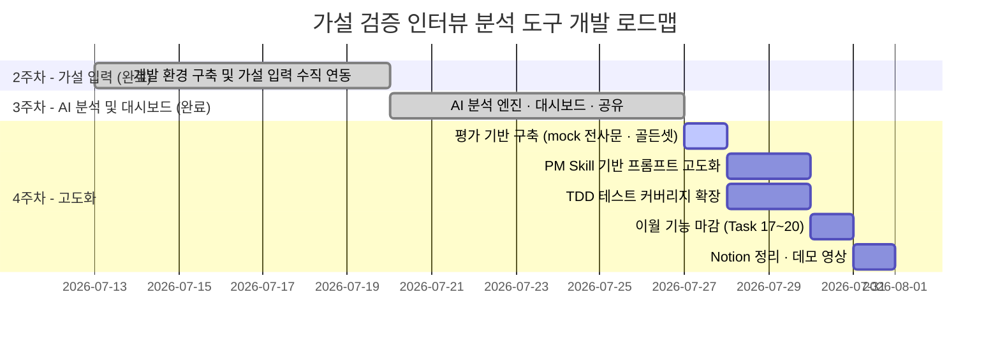

# [가설 검증 인터뷰 분석 도구] 4주차 구현 계획

본 계획서는 3주차(AI 분석 엔진 · 대시보드 · 결과 공유)가 완료된 시점에서, **분석 품질 고도화 · 테스트 기반 검증 · 산출물 정리(Notion/데모 영상)**를 수행하는 4주차의 상세 WBS를 정의한 구현 계획서입니다.

> **Task 번호 체계:** 커밋 메시지가 `feat: 요약 (Task N)` 형태로 WBS를 역참조하므로, 번호 충돌을 피하기 위해 3주차의 마지막 번호(Task 20) 다음인 **Task 21부터 이어서** 매깁니다. 3주차 미완 항목은 새 번호로 이월하고, 원본 체크박스는 이월 Task 완료 시 함께 `[x]` 처리합니다.

---

## 📅 전체 개발 로드맵 (현재 위치)

### 3주차: AI 분석 엔진 및 가설 검증 대시보드 (완료)
- Gemini 2단계 파이프라인(분류 ➡️ 검증결과), 대시보드, 참조 시스템 + 사이드 드로어, 반박 리파인, 버전 히스토리, 결과 공유(MD/URL/PDF), E2E 수동 검증까지 완료 (Task 0~16).
- **미완 이월:** Task 17(공유 URL 쓰기 차단 확정) · Task 18(버전 히스토리 뷰어) · Task 19(빈 상태 UI) · Task 20(비-UTF-8 업로드).

### 4주차: 분석 품질 고도화 및 산출물 정리 (현재 주차)
- **목표:** 3주차에 "동작하게" 만든 AI 파이프라인을 **측정 가능한 품질 기준 위에서 개선**하고, 그 개선이 회귀하지 않도록 테스트로 고정한다. 동시에 4주간의 작업 이력과 완성된 제품을 외부에 설명 가능한 형태(Notion 보드 · 데모 영상)로 정리한다.
- **주요 산출물:** mock 인터뷰 전사문 5건 이상, 분석 품질 회귀 러너(eval), PM 인터뷰 분석 Skill, 프롬프트 모듈(`lib/prompts/`), 근거 강도 기반 판정 로직, BE/FE 테스트 스위트, Notion 통합 Task 보드, 5분 미만 데모 영상.

> **설계 원칙(3주차에서 계승):** AI는 **분류와 초안 제안까지만** 하고 유지/수정/폐기 확정은 항상 사람이 한다. 4주차의 "고도화"는 AI에게 더 많은 판단 권한을 주는 것이 아니라, **같은 권한 안에서 근거의 질을 더 정확히 읽어내는 것**이다.

> **핵심 가치 방어선:** 이 도구의 가치는 "판단 근거가 사슬로 남는다"이다. 4주차의 모든 프롬프트 변경은 근거 사슬(가설 → 검증결과 → 근거 번호 → 원문 발췌)을 **끊지 않는 범위 안에서만** 허용한다. 사슬을 끊는 개선(예: 근거 없이 요약 품질만 올리는 것)은 채택하지 않는다.

---

## 🎯 4주차 핵심 아키텍처 정의

- **기술 스택 (3주차 대비 추가분):**
  - Backend: `jschardet` + `iconv-lite`(Task 33, 인코딩 감지/변환)
  - Test: 기존 `vitest` 유지 — 신규 러너 도입 없음. AI 품질 평가는 유닛 테스트와 **분리된 별도 스크립트**(`npm run eval`)로 둔다
  - Skill: `.claude/skills/pm-interview-analysis/`(신규, 프롬프트 방법론의 단일 원본)
- **"파인튜닝"의 실제 범위 — 모델 가중치 학습이 아니다:**
  기획서의 4주차 키워드는 "AI 모델 파인튜닝 및 고도화"지만, 현재 구조는 Gemini API 호출 기반이며 학습 데이터셋도 없다. 따라서 4주차의 고도화는 **① 프롬프트 엔지니어링 ② 출력 스키마 확장 ③ 후처리 검증 강화** 세 축으로 수행한다. 실제 파인튜닝(모델 학습)은 인터뷰 데이터 축적이 선행되어야 하므로 v2 후보로 명시적으로 미룬다.
- **개선 전에 측정한다:** 프롬프트를 먼저 고치면 좋아졌는지 알 수 없다. **Task 21(mock 전사문) → Task 22(eval 러너)를 반드시 먼저** 끝내고, 이후 모든 프롬프트 변경은 baseline 대비 지표로 판정한다.
- **품질 지표 4종 (Task 22에서 정의):**
  1. `quote_match_rate` — 인용문이 원문에 실제 존재하는 비율 (환각률의 역수)
  2. `hypothesis_id_valid_rate` — 존재하는 가설을 가리키는 비율
  3. `citation_integrity_rate` — 본문 `[n]` 마커 ↔ `citations` 일대일 대응 비율
  4. `status_accuracy` — `suggested_status`가 골든셋 정답과 일치하는 비율
- **프롬프트 3계층 관계 (혼선 방지):**
  - `.claude/skills/pm-interview-analysis/SKILL.md` — **방법론 원본**(왜 그렇게 판정하는가). [`naruv0134/pm-skills`](https://github.com/naruv0134/pm-skills)에서 선별·번역해 만든다 (Task 23)
  - `README/AI_Pipeline_Design.md` — **계약 문서**(입출력 스키마·온도·폴백)
  - `backend/src/lib/prompts/*.ts` — **실행 코드**(위 둘을 문자열로 구현) — **eval 점수를 실제로 결정하는 유일한 계층**
  세 곳이 어긋나면 SKILL.md를 정답으로 본다. 프롬프트 문자열을 라우터·파이프라인에 인라인으로 두는 것은 금지(3주차 리스크 조언에서 예고한 항목).
- **DB 스키마 변경분:**
  - `evidence_tags.evidence_strength` **컬럼 추가** (마이그레이션 007)
  - `verification_results.confidence` + `confidence_reason` **컬럼 추가** (마이그레이션 008)

---

## 📑 4주차 단계별 작업 분할 및 우선순위 (WBS)

### 🔴 High — ① 평가 기반 구축 (선행 필수)

- [ ] **Task 21: [Data] 분석 검증용 mock 인터뷰 전사문 5건 이상 작성**
  - *상세:* `backend/fixtures/interviews/` 에 마크다운 전사문을 작성한다. `AI_Pipeline_Design.md`의 **입력 포맷 계약(`화자명: 발언`, 줄바꿈 구분)**을 반드시 지킨다. 5건은 "많이 만드는 것"이 목적이 아니라 **서로 다른 실패 유형을 하나씩 담당**하는 것이 목적이다:
    1. `01_supportive.md` — 가설을 명확히 지지하는 발언 다수 (happy path, `유력함` 기대)
    2. `02_contradictory.md` — 반박 근거가 지지 근거보다 우세 (`수정 필요` 기대, 확증 편향 방어 검증)
    3. `03_sparse.md` — 가설과 관련된 발언이 거의 없음 (`근거 부족` 기대 + Task 32 빈 상태 UI 재현 데이터)
    4. `04_multi_hypothesis.md` — 한 발언이 2개 이상 가설에 걸침 (1단계 규칙 6 "가설마다 별도 항목" 검증)
    5. `05_noisy.md` — 잡담·주제 이탈·화자 라벨 누락 줄 혼재 (환각 유발 함정, `speaker` 빈 문자열 처리 검증)
    6. `06_long.md` *(선택)* — 긴 전사문 (Task 15 진행바·타임아웃/재시도 실검증용)
  - *가설 세트:* `backend/fixtures/hypotheses.json` 에 각 전사문이 대응할 가설(`{ hypothesis_id, cause, effect }[]`)을 UUID로 고정 정의한다. 전사문과 가설이 짝을 이루지 않으면 평가가 불가능하다.
  - *골든셋 라벨:* 각 md 상단 frontmatter에 기대값을 명시 — `hypothesis_set`, `expected_status`(가설별), `min_tags`/`max_tags`(태깅 수 허용 범위), `trap`(그 파일이 노리는 실패 유형). **정답 라벨은 사람이 직접 판단해 적는다**(AI 출력을 정답으로 삼으면 평가가 자기참조가 된다).
  - *개인정보:* 실제 인터뷰 내용을 쓰지 않는다. 전부 창작 데이터이며, Task 35 데모 영상 촬영도 이 데이터로만 진행한다.
  - *완료 조건:* 5건 이상의 md가 존재하고, 전부 `화자명: 발언` 포맷 계약을 지키며, `hypotheses.json`의 가설 세트와 매칭되고, 각 파일에 사람이 작성한 기대 라벨이 들어 있다.

- [ ] **Task 22: [Test/AI] 분석 품질 회귀 러너(eval) 구축 및 baseline 기록**
  - *상세:* `backend/src/eval/runEval.ts` 신규. Task 21의 fixture를 **실제 Gemini로** 1·2단계에 통과시키고 위 지표 4종을 계산해 표로 출력한다.
    - 결과는 `backend/eval/results/YYYY-MM-DD_HHmm.json` 으로 저장 → 프롬프트 변경 전후를 파일 대 파일로 비교한다.
    - **`npm test`에 넣지 않는다.** 실 API 호출이라 느리고 쿼터를 소모하며 결과가 결정적이지 않다. `backend/package.json`에 `"eval": "ts-node src/eval/runEval.ts"` 별도 스크립트로 분리하고, 유닛 테스트는 항상 고정 mock 응답으로 돌린다.
    - 지표 계산 함수(`scoreQuoteMatch` 등)는 **순수 함수로 분리**해 `runEval.ts`가 아니라 `src/eval/metrics.ts`에 두고, 이건 유닛 테스트 대상으로 삼는다(Task 28).
    - 무료 티어 쿼터를 고려해 `--only 03_sparse` 같은 단일 fixture 실행 옵션을 둔다.
  - *완료 조건:* `npm run eval --prefix backend` 1회 실행으로 fixture별 4개 지표가 출력되고, `eval/results/`에 **baseline 파일이 남으며**, 그 수치가 이후 Task 25~27의 판정 기준으로 계획서에 인용된다.

### 🔴 High — ② PM Skill 기반 분석 고도화

- [ ] **Task 23: [AI/Skill] PM Skill 도입 및 가설검증 프레임으로 번역 (방법론 원본 확정)**
  - *출처 — 백지에서 쓰지 않는다:* 기존 자산인 [`naruv0134/pm-skills`](https://github.com/naruv0134/pm-skills)(9개 플러그인 · 68 스킬 · 42 워크플로)를 도입해 방법론의 출발점으로 삼는다.
    - **선별 원칙 — 전부 설치하지 않는다.** 68개를 통째로 넣으면 세션 컨텍스트만 소모하고 실제 쓰는 건 극소수다. 이 도구의 도메인(가설 검증 인터뷰 분석)에 실제로 걸리는 것만 가져온다:
      - `pm-product-discovery/summarize-interview` — 전사문 ➡️ 구조화 요약 (가장 직접적)
      - `pm-product-discovery/identify-assumptions` · `prioritize-assumptions` — 가설의 질·우선순위 판정 기준
      - `pm-market-research/sentiment-analysis` — 발언의 태도 판정 (근거 강도 판정에 참고)
    - **프레임 번역이 필요하다 — 드롭인이 안 된다.** `summarize-interview`는 **JTBD(Jobs To Be Done)** 축으로 정리하는 스킬이고, 이 도구는 **가설(원인→결과) 검증** 축이다. 산출물 구조가 근본적으로 다르므로 템플릿을 가져오지 말고 **원칙만 추출해 우리 축으로 번역**한다.
    - **그대로 계승할 원칙 2개:**
      - *"정보 공백은 추측하지 말고 `-`로 표시한다"* — 우리 환각 방어 원칙과 동일 계열. 2·3단계 프롬프트에 명시적으로 추가한다.
      - *"초등학생도 이해할 수 있는 문장"* — **이미 3주차 2단계 프롬프트 규칙 6에 반영되어 있다.** baseline에 포함된 상태이므로 4주차의 개선분으로 계산하지 않는다.
  - *⚠️ 스킬 설치만으로는 eval 점수가 1도 움직이지 않는다:* `npm run eval`은 백엔드가 `lib/prompts/`의 문자열을 들고 Gemini를 **직접** 호출하는 경로다. `.claude/skills/`는 **Claude Code 세션(개발 도구)의 행동**을 바꿀 뿐, 실행 중인 백엔드가 보내는 프롬프트를 바꾸지 않는다(백엔드는 `.claude/`를 읽지 않는다). 따라서:
    - Task 22 baseline은 **스킬 설치 여부와 무관하게 현재 프롬프트 상태에서** 측정한다.
    - 점수는 방법론이 `lib/prompts/`로 이식되는 **Task 24~26에서만** 움직인다.
    - 스킬 내용을 프롬프트에 미리 반영한 상태를 baseline으로 삼으면 **도입 효과를 증명할 수단이 사라진다.** 4주차의 핵심 서사("PM 방법론 도입으로 판정 정확도가 개선되었다")가 통째로 날아가므로 금지.
  - *상세:* 위 선별·번역 결과를 `.claude/skills/pm-interview-analysis/SKILL.md` **한 개 문서로 압축**한다. 현재 프롬프트는 "지지/반박/참고"와 "근거 수"만 보는 얕은 기준이라, 근거의 **질**을 구분하지 못한다. 아래를 검증 가능한 문장으로 명문화한다:
    - **근거 강도 위계:** 직접 경험 진술("저는 지난주에 ~해서 껐어요") > 의견·선호("그건 좀 불편할 것 같아요") > 전언·일반화("다들 그렇게 말하던데요"). 강도가 낮은 근거만으로는 `유력함`을 줄 수 없다.
    - **반증 우선 원칙:** 지지 근거를 모으기 전에 반박 근거를 먼저 찾는다. 반박이 1건이라도 있으면 `유력함` 판정에 그 사실을 명시한다.
    - **유도 질문 감쇠:** 질문 자체가 답을 암시한 경우("이 기능 불편하지 않으셨어요?" → "네 불편했어요") 해당 답변의 강도를 한 단계 낮춘다.
    - **가설 수정 방향의 3가지 형태:** 원인 축소(범위를 좁힌다) / 결과 재정의(측정 대상을 바꾼다) / 조건 추가(특정 상황에서만 성립). `direction`은 이 셋 중 하나에 대응해야 하며 막연한 "재검토가 필요합니다"는 금지.
    - **판단 금지선:** AI는 유지/수정/폐기를 **확정하지 않는다**. 이 Skill이 산출하는 것은 항상 초안이다.
  - *역할 분담 명시:* 이 문서가 프롬프트의 단일 원본이며, `AI_Pipeline_Design.md`(계약)와 `lib/prompts/`(구현)는 이 문서를 따른다. 세 곳이 어긋나면 SKILL.md가 정답. pm-skills 원본은 **참조 출처로만 남기고** 우리 SKILL.md가 그것을 대체한다(원본을 계속 따라가면 JTBD 축으로 다시 끌려간다).
  - *완료 조건:* pm-skills에서 선별한 4개 스킬의 출처가 문서에 명시되고, SKILL.md가 존재하며 Claude Code 세션에서 스킬로 인식되고, 위 판정 기준이 **"어떤 입력이면 어떤 판정"**의 형태로(모호한 형용사 없이) 서술되어 Task 25/26의 프롬프트로 그대로 번역 가능하다.

- [ ] **Task 24: [BE] 프롬프트 모듈 분리 (`lib/prompts/`)**
  - *상세:* 3주차 리스크 조언에서 예고한 "프롬프트만 교체할 수 있는 구조"를 실제로 만든다. 현재 system instruction과 `responseSchema`가 `hypothesisTagger.ts` / `verificationResult.ts` / `refineHypothesis.ts` 안에 각각 박혀 있어, 프롬프트 실험 시 로직 파일을 건드려야 한다.
    - `backend/src/lib/prompts/stage1Classify.ts` / `stage2Verify.ts` / `stage3Refine.ts` 로 분리. 각 모듈은 `{ systemInstruction, responseSchema, temperature, buildUserPrompt(input) }` 를 export.
    - 로직 파일은 프롬프트 문자열을 **모르는 상태**가 되어야 한다 — 입력을 넘기고 결과를 받을 뿐.
  - *TDD 대상:* `buildUserPrompt()`는 순수 함수다. 가설 배열이 JSON으로 포함되는지, 전사문이 **한 글자도 변형되지 않고** 삽입되는지(원문 대조 검증의 전제), 빈 evidence 배열에서 2단계가 호출 자체를 막는지 — 테스트를 **먼저** 쓰고 실패를 확인한 뒤 리팩터한다.
  - *완료 조건:* 3개 호출 지점이 전부 `lib/prompts/`를 참조하고, `grep`으로 라우터·파이프라인·태거에서 인라인 프롬프트 문자열이 0건이며, 프롬프트 빌더 단위 테스트가 통과하고, 리팩터 전후 `npm run eval` 지표가 **동일**하다(순수 구조 변경이므로 품질이 달라지면 버그다).

- [ ] **Task 25: [AI/BE] 1단계 고도화 — 근거 강도(evidence_strength) 도입**
  - *상세:* 1단계 출력 스키마에 `evidence_strength` 추가 (`직접 경험` / `의견` / `전언`, Task 23의 위계). `badge_label`(지지/반박/참고)과 **직교하는 축**이다 — "반박 근거인데 전언"이 가능해야 한다.
    - *DB:* `evidence_tags.evidence_strength TEXT` 컬럼 추가 (마이그레이션 007). 기존 행은 `NULL` 허용 후 `'의견'`으로 백필하지 않는다 — 모르는 값을 추측해 채우면 이후 평가가 오염된다.
    - *FE:* 사이드 드로어의 근거 표시에 강도 라벨을 함께 노출(기존 팔레트만 사용, `design.md`에 새 토큰 추가 금지).
    - *환각 방어:* `evidence_strength`도 enum 밖의 값이면 저장 전 폐기 — `responseValidation.ts`에 검증을 추가한다(Task 16 모듈 재사용).
  - *완료 조건:* mock `02_contradictory` / `05_noisy` 에서 강도가 사람 판단과 일치하게 분류되고, `evidence_tags`에 값이 적재되며, `npm run eval`의 `quote_match_rate`가 baseline 대비 **하락하지 않는다**(강도 판정이 인용 정확도를 해치지 않아야 함).

- [ ] **Task 26: [AI/BE] 2단계 고도화 — 반증 우선 판정 + 확신도 캘리브레이션**
  - *상세:* `suggested_status` 판정 규칙을 "근거 **수**"에서 "**강도 가중합 + 반박 존재 여부**"로 교체한다(Task 23 기준). 가중합 계산은 프롬프트에 맡기지 않고 **애플리케이션 코드의 순수 함수**로 구현해 AI에게는 재료만 주는 쪽이 재현성이 높다 — 어느 쪽이 나은지는 Task 22 eval의 `status_accuracy`로 판정하고, 결과를 계획서에 기록한다.
    - `confidence`(높음/보통/낮음) + `confidence_reason`(1문장) 추가 → 마이그레이션 008. 사용자가 "AI가 얼마나 확신하는지"를 보고 검토 우선순위를 정할 수 있게 한다.
    - `direction`은 Task 23의 3형태(원인 축소 / 결과 재정의 / 조건 추가) 중 하나를 명시하도록 강제.
  - *완료 조건:* mock `03_sparse`에서 `유력함`이 나오지 않고, `01_supportive`에서 `근거 부족`이 나오지 않으며, **before/after 지표 표가 계획서 하단에 기록**된다. 개선되지 않았다면 개선되지 않았다고 적고 원인을 남긴다(수치를 좋아 보이게 고르지 않는다).

- [ ] **Task 27: [AI/BE] 3단계(리파인) 고도화 — 근거 없는 반박에 대한 정직한 응답**
  - *상세:* 현재 리파인은 사용자 의견을 **수용하는 쪽으로 기우는** 경향이 있다(3주차 프롬프트 규칙 2가 있지만 약함). 근거 목록에 사용자 주장을 뒷받침할 내용이 없으면:
    - `reply`에서 "요청하신 방향을 뒷받침하는 근거가 전사문에 없습니다"를 **먼저** 말하고,
    - `new_summary`는 원 뉘앙스를 유지한 채 표현만 다듬으며,
    - 사용자가 그럼에도 반영을 원하면 그건 사용자의 판단이므로 가설 인라인 수정(Task 10) 경로로 안내한다.
  - *검증 방법:* `02_contradictory` 근거 위에서 "이 가설은 사실 맞는 것 같은데?"라는 근거 없는 반박을 입력해, `new_summary`가 무비판적으로 뒤집히지 않는지 확인한다.
  - *완료 조건:* 위 시나리오에서 `new_summary`의 결론 방향이 유지되고 `reply`에 근거 부재가 명시되며, `new_citations`가 여전히 입력 evidence 안의 id만 참조한다.

### 🔴 High — ③ TDD 및 테스트 코드로 기능 검증

> **작업 규칙(모든 테스트 Task 공통):** 반드시 **실패하는 테스트를 먼저 작성하고 실패 출력을 눈으로 확인한 뒤에만** 구현으로 넘어간다. 처음부터 통과하는 테스트를 썼다면 그건 검증이 아니라 기록이다. 커밋도 `test: …` → `feat: …` 순서로 나눠 전이를 이력에 남긴다. 스타일은 기존 `responseValidation.test.ts`를 따른다(`import { describe, it, expect } from 'vitest'`, 한글 `it` 설명).

- [ ] **Task 28: [Test/BE] 순수 로직 TDD 확장**
  - *상세:* 현재 BE 테스트는 3개 파일뿐이다(`projectReport` / `responseValidation` / `timeoutRetry`). 4주차에 새로 생기거나 지금까지 미검증인 순수 로직을 Red→Green으로 채운다:
    - `src/eval/metrics.ts` — 지표 4종 계산 (Task 22)
    - 근거 강도 가중합 및 `suggested_status` 결정 함수 (Task 26)
    - `lib/prompts/*` 의 `buildUserPrompt()` (Task 24)
    - `recomputeSaveStatus()` — 전원 판단 완료 시에만 `saved`, 1건이라도 `검토 전`이면 `draft` (Task 12에서 구현했으나 테스트 없음)
    - `sanitizeFilenamePart()` — 금지문자·한글·빈 문자열·초장문 (Task 13)
    - 전사문 포맷 계약 검사기 — `화자명: 발언` 라인 비율이 낮으면 경고 (Task 21 fixture 자체 검증에도 사용)
  - *완료 조건:* `npm test --prefix backend` 전체 통과, 신규 테스트 파일이 **각각 최소 1회 실패 → 통과 전이를 커밋 이력으로 증명**할 수 있음.

- [ ] **Task 29: [Test/FE] 화면 단위 테스트 도입**
  - *상세:* 현재 FE 테스트는 `Dummy.test.tsx` 하나로, 사실상 vitest 설정 확인용이다. React Testing Library로 실제 컴포넌트를 검증한다(설정은 `frontend/vite.config.ts`의 `test` 블록에 이미 있고 globals가 켜져 있어 import 불필요):
    - 대시보드 — 4개 검증 상태 배지가 각각 올바른 라벨로 렌더되는가, 체크박스 클릭이 행 이동을 유발하지 않는가(`stopPropagation`)
    - 상세 화면 — `[1]` 마커 파싱: `citations`에 대응이 있으면 클릭 가능 링크, **없으면 일반 텍스트**(환각 방어의 마지막 방어선이므로 반드시 테스트)
    - 사이드 드로어 — 참조 클릭 시 해당 근거의 quote·speaker·출처 인터뷰명이 표시되는가
    - 진행바 — 분석 중 상태에서 렌더되고 완료 시 사라지는가
    - 빈 상태 — 근거 0건 가설에서 화면이 깨지지 않는가 (Task 32와 연동)
  - *네트워크:* `fetch`는 mock으로 고정한다. 실제 BE를 띄워야 통과하는 테스트는 단위 테스트가 아니다.
  - *완료 조건:* `npm test --prefix frontend` 에서 실제 컴포넌트 테스트 **4개 이상** 통과, `Dummy.test.tsx` 제거.

- [ ] **Task 30: [Test/BE] 공유 라우터 계약 테스트 — Week3 Task 17 마감**
  - *상세:* Task 13에서 `routes/share.ts`를 별도 라우터로 분리해 GET만 존재하게 만들었으므로 Task 17("공유 URL 쓰기 차단")은 구조적으로 이미 해결되어 있다. 다만 **테스트가 없어 나중에 누군가 POST를 추가하면 조용히 뚫린다.** 이를 회귀 테스트로 고정한다.
    - `POST` / `PATCH` / `DELETE` `/api/share/:token` 이 2xx를 반환하지 않음
    - 공유 응답 본문에 `share_token` 이외의 내부 식별자나 쓰기 경로가 노출되지 않음
  - *완료 조건:* 테스트 통과 및 **Week3 계획서의 Task 17 체크박스를 `[x]`로 전환**(근거 커밋 해시를 함께 기록).

### 🟡 Medium — ④ 3주차 이월 기능 마감

- [ ] **Task 31: [BE] 비-UTF-8 전사문 업로드 인코딩 대응 (Week3 Task 20 이월)**
  - *상세:* `transcriptExtractor.ts`의 `buffer.toString('utf-8')` 고정을 `jschardet`로 인코딩 감지 → `iconv-lite`로 UTF-8 변환하도록 보강. EUC-KR로 저장된 한글 `.txt` 업로드 시 깨지는 문제(3주차에 실제 재현 확인됨).
  - *TDD:* 변환 함수는 순수 함수다. EUC-KR/UTF-8/UTF-8 BOM/빈 버퍼 4케이스를 테스트로 먼저 고정한다. 테스트 픽스처는 Task 21의 mock 전사문 1건을 EUC-KR로 재저장해 사용.
  - *완료 조건:* EUC-KR 한글 `.txt` 업로드 후 전사문이 깨지지 않고 추출되며, 기존 UTF-8 경로에 회귀가 없다.

- [ ] **Task 32: [FE] 빈 상태(Empty State) UI 처리 (Week3 Task 19 이월)**
  - *상세:* 전사문 미입력 / 매칭된 근거 0건 / 검증결과가 폴백 고정값(`"관련 근거가 수집되지 않았습니다."`)인 경우의 안내 화면. 단순히 "데이터 없음"이 아니라 **다음 행동**을 제시한다 — "이 가설과 관련된 발언이 전사문에서 발견되지 않았습니다. 가설을 좁히거나 전사문을 추가해 보세요."
  - *재현 데이터:* Task 21의 `03_sparse.md`로 실제 빈 상태를 만들어 확인한다(더미 데이터 조작 금지).
  - *완료 조건:* 세 가지 빈 상태에서 화면이 깨지지 않고 다음 행동을 안내하며, Task 29의 빈 상태 테스트가 통과한다.

- [ ] **Task 33: [FE] 버전 히스토리 뷰어 (Week3 Task 18 이월)**
  - *상세:* 상세 화면에서 `GET /api/projects/:id/hypotheses/:hid/versions`(Task 12에서 이미 구현됨)를 호출해 기존 버전 ↔ 현재 버전을 비교 표시. 서버 API가 이미 있으므로 **FE 작업만** 남아 있다. 버전이 0건이면 진입점 자체를 숨긴다.
  - *완료 조건:* 원인/결과를 2회 수정한 가설에서 이전 버전 2건이 시간순으로 표시되고, 각 버전의 원인/결과가 현재 값과 나란히 비교된다.

### 🟡 Medium — ⑤ 기록 및 산출물 정리

- [ ] **Task 34: [Docs] 주차별 구현 계획(Week2/3/4) ↔ Notion 연동 정리**
  - *상세:* 지금 작업 이력은 3개의 마크다운 계획서와 git log에 흩어져 있어, 외부에 "무엇을 언제 어떻게 했는지" 한 번에 보여줄 수 없다. **원본은 로컬 마크다운으로 유지하고(git 추적), Notion은 조회용 미러**로 둔다(원본을 Notion으로 옮기면 코드 리뷰에서 계획이 사라진다).
    - `backend/scripts/exportTasks.ts` — `README/plan/Week*_Implementation_Plan.md`를 파싱해 Task 레코드 배열 생성. 파싱 대상은 `- [x|  ] **Task N: [구분] 제목**` + `*상세:*` + `*완료 조건:*` + 섹션 헤더의 우선순위(🔴/🟡/🟢).
    - 커밋 역참조: `git log --grep "(Task N)"`으로 각 Task의 커밋 해시를 붙인다 — 이게 있어야 Notion 보드에서 코드로 되짚을 수 있다(도구의 "근거 사슬" 원칙을 개발 프로세스에도 그대로 적용).
    - **Notion DB 스키마:** `Week`(select) / `Task No`(number) / `구분`(select: BE·FE·AI·Setup·Test·Data·Docs·Demo) / `제목`(title) / `우선순위`(select) / `상태`(select: 완료·진행중·미착수) / `완료 조건`(text) / `커밋`(text).
    - **Notion MCP 미연결이 실패가 되면 안 된다:** MCP가 붙어 있으면 페이지를 upsert하고, 없으면 `README/Notion_Task_Board.md`에 **붙여넣기용 표**를 생성하고 조용히 넘어간다. 어느 경로든 산출물은 남는다.
  - *TDD:* 마크다운 파서는 순수 함수다. Week3 문서를 넣으면 Task 21건이 나오고 체크박스 상태가 실제와 일치하는지 테스트로 고정(Task 28에 포함).
  - *완료 조건:* Week2/3/4 전 Task가 하나의 표로 정리되고, 각 행의 상태가 계획서 체크박스와 일치하며, 완료 Task에는 커밋 해시가 붙어 있다.

- [ ] **Task 35: [Demo] 데모 영상 기획 — 5분 미만 시나리오 확정**
  - *상세:* `README/Demo_Script.md` 신규. 장면별로 **화면 / 나레이션 / 자막 / 소요시간**을 표로 확정한다. 목표 러닝타임 **4분 30초**(5분 제한에 30초 버퍼):
    | # | 장면 | 내용 | 시간 |
    |---|---|---|---|
    | 1 | 문제 | PM이 인터뷰 전사문을 일일이 훑는 상황 | 0:20 |
    | 2 | 핵심 가치 | "판단 근거가 사슬로 남는다" — 범용 AI 대비 차별점 | 0:25 |
    | 3 | 가설 입력 | 문제정의 + 원인/결과 가설 2건 + 전사문 업로드 | 0:40 |
    | 4 | 분석 진행 | 진행바 (실제 대기시간은 편집에서 배속) | 0:15 |
    | 5 | 대시보드 | 가설별 상태 배지 · AI 권고 vs 내 판단 분리 | 0:40 |
    | 6 | 상세 + 근거 사슬 | `[1]` 마커 클릭 → 드로어에 원문 발췌 (**이 영상의 핵심 장면**) | 0:55 |
    | 7 | 반박 리파인 | 하이라이트 → 의견 → 가안 미리보기 → 적용 | 0:50 |
    | 8 | 판단 & 공유 | 유지/수정/폐기 확정 → MD·공유 URL | 0:35 |
    | 9 | 마무리 | 4주간 구조 요약 + 한계·다음 단계 | 0:20 |
  - *원칙:* **실제로 구현된 화면만 촬영한다.** 미구현 기능을 목업으로 연출하지 않는다. 촬영 데이터는 Task 21의 mock 전사문만 사용(개인정보 노출 방지).
  - *완료 조건:* 장면별 시간 합계가 5분 미만이고, 모든 장면이 현재 코드로 실제 재현 가능하며, 6번 장면(근거 사슬)이 가장 긴 분량을 차지한다.

- [ ] **Task 36: [Demo] 데모 영상 녹화 및 편집**
  - *상세:* Task 35 스크립트대로 촬영·편집.
    - 해상도 1280×800 고정(공유 시 텍스트 가독성), 브라우저 확대 125%.
    - 분석 대기 구간은 잘라내지 말고 **배속 처리**(실제 소요시간을 속이지 않되 지루하지 않게).
    - **자막 필수** — 소리 없이 재생해도 이해되어야 한다.
    - 산출물 `showcase/demo.mp4`, 이후 `showcase/showcase.json`의 `demoUrl`을 실제 URL로 갱신(현재 `https://example.com` 플레이스홀더).
  - *완료 조건:* 5분 미만 완성본이 존재하고, 무음 재생으로도 전체 흐름이 이해되며, `showcase.json`의 `demoUrl`이 더 이상 플레이스홀더가 아니다.

### 🟢 Low — ⑥ 마감 정리

- [ ] **Task 37: [Docs] 4주차 회고 및 고도화 결과 기록**
  - *상세:* Task 22의 baseline과 Task 25~27 이후 지표를 **before/after 표**로 본 계획서 하단에 기록한다. 개선되지 않은 지표는 개선되지 않았다고 적고 가설을 남긴다. 더불어 v2로 미룬 항목(실제 모델 파인튜닝, 정량 데이터 그래프, 질문 생성 기능)을 한 곳에 정리한다.
  - *완료 조건:* 지표 표가 채워지고, 4주차에 내린 설계 결정과 미해결 항목이 문서로 남는다.

- [ ] **Task 38: [Docs] `README/README.md` 교체**
  - *상세:* 현재 프로젝트 루트 README 계열 문서에 Vite 템플릿 기본 문구가 그대로 남아 있다. 프로젝트 소개 · 실행 방법(`npm run install-all`, `npm run dev`, `npm test --prefix backend|frontend`, `npm run eval`) · 문서 지도(기획서/파이프라인 설계/주차별 계획)로 교체한다.
  - *완료 조건:* README만 읽고 처음 보는 사람이 프로젝트를 실행하고 문서를 찾아갈 수 있다.

### 🔴 High — ⑦ 개발 워크플로 Agent/Skill 실체화

> **배경 — 현재 `showcase/showcase.json`의 `agent` 섹션은 실체가 없다.** 실측 결과 커스텀 Agent 0개, 커스텀 Skill 0개, 커스텀 Command 0개이며(`.claude/agents/`·`.claude/commands/` 디렉터리 자체가 존재하지 않음), 유일하게 설치된 caveman 계열 4개 스킬조차 **개발이 모두 끝난 뒤(2026-07-24 17:42)** 설치되어 2~3주차 개발에 사용된 적이 없다. 즉 showcase에 적힌 "설계·구현 계획 Agent" · "라이브 E2E 검증 Skill" · "TDD 유틸리티 작성 Skill"은 대화에서 일어난 작업에 **사후에 이름을 붙인 것**이며 파일로 존재하지 않는다. 이 대회는 AI **Agent** Challenge이므로 이 섹션이 곧 심사 대상이다. 4주차에 실제로 만들고 실제로 사용한다.

- [ ] **Task 39: [Agent] 개발 워크플로 Skill / Agent 구축 및 4주차 실사용**
  - *실행 시점이 중요하다 — 4주차 **맨 앞**에서 만든다.* 제출 직전에 만들어 놓고 "4주간 이것으로 개발했다"고 쓰면 지금과 똑같은 문제가 형태만 바뀐 것이다. **Task 21 착수 전에 만들어, Task 21~38을 실제로 이 스킬들로 수행**해야 서술이 사실이 된다.
  - *상세:* 새로 발명하지 않는다. 4주차 계획에 **이미 들어 있는 작업을 스킬 파일로 포장**하는 것이므로 추가 비용이 거의 없다:
    | 아티팩트 | 위치 | 대응하는 4주차 작업 |
    |---|---|---|
    | `pm-interview-analysis` **Skill** | `.claude/skills/` | Task 23 (PM 방법론 원본) |
    | `analysis-quality-eval` **Skill** | `.claude/skills/` | Task 21·22 (골든셋 + eval 러너 실행·해석 절차) |
    | `tdd-feature-loop` **Skill** | `.claude/skills/` | Task 24·28~31 (Red→Green→Refactor + 커밋 분리 규약) |
    | `requirement-verifier` **Agent** | `.claude/agents/` | 완료 조건 대비 독립 판정 (구현자와 분리, PASS/FAIL/NOT VERIFIED 3값) |
  - *`requirement-verifier` Agent 설계 원칙:* 메인 세션은 판정에 참여하지 않는다. 프롬프트에 **완료 조건 원문만** 넘기고 구현 요약·"다 됐다"는 맥락은 넘기지 않는다. 증거로 인정하는 것은 코드 위치(`file:line`)와 **실제 테스트 실행 출력**뿐이며, 자동 확인이 불가능한 항목(외부 Gemini API, 수동 E2E)은 추측으로 PASS를 주지 않고 **NOT VERIFIED**로 표기한다. 이 값이 없으면 검증기는 항상 PASS만 뱉는 장식이 된다.
  - *과하게 만들지 않는다:* 참고 사례들도 Skill 2~4개 + Agent 1개 규모다. 쓰지 않을 스킬을 개수 채우려고 만들면 "실사용" 서술이 다시 거짓이 된다. **위 4개까지만.**
  - *완료 조건:* 4개 아티팩트가 레포에 파일로 존재하고, 4주차 커밋 이력에서 각 아티팩트가 **실제로 사용된 Task를 최소 1건씩** 지목할 수 있다(예: `tdd-feature-loop` → Task 28의 `test:` → `feat:` 커밋 쌍).

- [ ] **Task 40: [Docs] `showcase.json` `agent` 섹션 실제 아티팩트 기준으로 재작성**
  - *상세:* Task 39의 결과물만 기재한다. 존재하지 않는 것은 쓰지 않는다.
    - `agentTools` — Skill 3개 + Agent 1개를 **실제 파일명 그대로** 기재.
    - `workflows` — 현재 항목("설계 우선 태스크 구현 Workflow" 등)은 **서비스 개발 순서 설명**이지 Agent 활용이 아니다. 참고 사례처럼 **아티팩트를 이름으로 호출하는 절차**로 다시 쓴다. 예: `1. 계획서에서 Task의 완료 조건 확인 → 2. tdd-feature-loop Skill로 실패 테스트 작성(Red) → 3. 최소 구현(Green) → 4. requirement-verifier Agent로 완료 조건 대비 독립 판정 → 5. FAIL 항목 재작업 후 커밋`
    - `developmentWithAI` / `agent.summary` — **2~3주차와 4주차를 구분해 정직하게 서술한다.** *"초기에는 대화 기반으로 진행했고, 반복적으로 나타난 패턴(설계 선확정 · 라이브 검증 · TDD)을 4주차에 Skill과 Agent로 고정해 고도화 작업에 적용했습니다."* — 처음부터 완비된 도구가 있었다고 쓰는 것보다 이쪽이 사실이고, 패턴을 발견해 도구화한 과정 자체가 더 설득력 있다.
    - `demoUrl` 플레이스홀더(`https://example.com`) 갱신은 Task 36에서 처리.
  - *완료 조건:* `agentTools`의 모든 항목이 레포에 **실재하는 파일과 1:1로 대응**하고, `workflows`의 각 단계가 그 아티팩트를 이름으로 호출하며, 4주차 이전/이후 작업 방식의 차이가 문장으로 구분되어 있다.

---

## 🚀 추천 실행 순서 및 리스크 조언

- **핵심 동선:** **워크플로 Agent/Skill 구축(39 — 반드시 맨 앞)** ➡️ mock 전사문 작성(21) ➡️ eval 러너 + baseline(22) ➡️ PM Skill 방법론 확정(23) ➡️ 프롬프트 모듈 분리(24) ➡️ 1·2·3단계 고도화(25→26→27, 각 단계마다 eval 재측정) ➡️ 테스트 확장(28~30) ➡️ 이월 마감(31~33) ➡️ Notion 정리(34) ➡️ 데모 기획·촬영(35→36) ➡️ 회고 및 showcase 재작성(37~38, 40).

- **Task 39는 번호가 마지막이지만 실행은 첫 번째다.** 4주차의 나머지 Task를 실제로 그 스킬로 수행해야 showcase 서술이 사실이 되기 때문이다. 번호는 커밋 역참조를 위해 이어 붙였을 뿐 실행 순서가 아니다.

- **병렬 가능 구간:** Task 28~30(테스트)은 Task 25~27(프롬프트)과 **대상이 겹치지 않는 범위에서만** 병렬로 진행한다. 단, Task 24(프롬프트 모듈 분리)는 다른 Task들이 건드릴 파일을 대거 이동시키므로 **혼자 먼저 끝낸다** — 병렬로 돌리면 충돌한다.

- **리스크 요인:**
  - **측정 없는 고도화가 가장 큰 리스크:** Task 21·22를 건너뛰고 프롬프트부터 손대면 "좋아진 것 같다"는 인상만 남고 회귀를 감지할 수 없다. **21·22는 타협 대상이 아니다.** 시간이 부족하면 Task 27·33·38을 먼저 버린다.
  - **골든셋의 정답을 AI가 만들면 평가가 무의미해진다:** Task 21의 `expected_status`는 반드시 사람이 전사문을 읽고 직접 정한다. AI 출력을 정답으로 복사하는 순간 지표는 항상 100%가 되고 아무것도 측정하지 못한다.
  - **Gemini 무료 티어 쿼터:** eval 1회 실행 = fixture 5건 × (1단계 1회 + 가설수 × 2단계)이므로 호출량이 빠르게 는다. Task 1에서 만든 폴백 체인(`GEMINI_FALLBACK_MODELS`)이 있지만, `--only` 옵션으로 단일 fixture만 돌리는 습관을 들이고, eval을 `npm test`나 CI에 절대 넣지 않는다.
  - **LLM 출력은 결정적이지 않다:** 같은 프롬프트라도 실행마다 결과가 달라져, 지표 1~2%p 차이는 개선의 증거가 아니다. **동일 프롬프트로 최소 2회 측정**하고, 그 변동폭보다 큰 차이만 개선으로 인정한다.
  - **스키마 확장이 환각 방어를 뚫는 통로가 된다:** `evidence_strength`·`confidence`처럼 필드를 늘리면 검증되지 않은 값이 그만큼 늘어난다. 신규 필드는 예외 없이 `responseValidation.ts`의 enum 검증을 통과해야 저장한다(Task 16 모듈 재사용, 새 검증 코드를 따로 만들지 않는다).
  - **프롬프트가 세 곳에 존재하는 문제:** SKILL.md · `AI_Pipeline_Design.md` · `lib/prompts/`가 어긋나면 어느 것이 실제로 도는지 알 수 없게 된다. Task 25~27로 프롬프트를 고칠 때마다 **세 문서를 같은 커밋에서** 갱신한다.
  - **TDD 규칙이 형식으로 전락하는 것:** 구현을 먼저 하고 테스트를 나중에 맞춰 쓰면 "통과하는 테스트"만 남는다. 커밋을 `test:` → `feat:` 로 분리하는 것이 이 규칙을 지켰다는 유일한 증거다.
  - **Agent/Skill을 "제출용"으로 만들면 같은 문제가 반복된다:** Task 39를 4주차 끝에 몰아서 만들고 "이걸로 개발했다"고 쓰면, 지금 showcase의 문제(실체 없는 아티팩트를 사후 명명)가 형태만 바꿔 되돌아온다. **4주차 맨 앞에서 만들어 실제로 사용하고, 사용한 Task를 커밋으로 지목할 수 있어야** 한다. 지목할 수 없는 아티팩트는 showcase에서 뺀다.
  - **2~3주차를 미화하지 않는다:** 그 기간에 커스텀 Agent/Skill은 실제로 0개였다. "대화 기반으로 진행했고 반복 패턴을 4주차에 도구로 고정했다"가 사실이며, 패턴을 발견해 도구화한 과정 자체가 심사에서 더 설득력 있다. 없던 도구를 있었다고 쓰는 순간 코드·커밋 이력과 대조하면 바로 드러난다.
  - **데모 영상은 마지막에 몰리면 못 만든다:** Task 35(기획)는 촬영보다 훨씬 앞당겨 진행할 수 있고, 스크립트를 짜는 과정에서 **아직 어색한 화면이 드러나** Task 32(빈 상태) 같은 항목의 우선순위를 알려준다. 4주차 중반에 기획을 끝내 둔다.
  - **Notion MCP 의존성:** 현재 미연결이다. Task 34는 MCP가 없어도 `Notion_Task_Board.md`까지는 반드시 산출되도록 설계했다. MCP 연결을 선행 조건으로 삼지 않는다.

- **범위 경계 (v2 후보로 미룸):**
  - **실제 모델 파인튜닝** — 학습 데이터(인터뷰 + 사람의 판정 라벨)가 충분히 축적된 뒤에 검토. 4주차 산출물인 골든셋이 그 출발점이 된다.
  - 정량 데이터 교차 분석 및 그래프 (기획서에서 이미 MVP 범위 밖)
  - 인터뷰 질문 생성 기능 (기획서 6절, 시점이 다름)
  - 다중 사용자 / 인증 / 권한 (공유는 여전히 토큰 기반 읽기 전용)

---

## 📊 고도화 결과 기록 (Task 37에서 채움)

| 지표 | Baseline (Task 22) | 1단계 고도화 후 (Task 25) | 2단계 고도화 후 (Task 26) | 판정 |
|---|---|---|---|---|
| `quote_match_rate` | — | — | — | — |
| `hypothesis_id_valid_rate` | — | — | — | — |
| `citation_integrity_rate` | — | — | — | — |
| `status_accuracy` | — | — | — | — |

> 측정 조건(모델명·온도·fixture 세트·측정 횟수)을 함께 기록한다. 조건이 다르면 비교가 성립하지 않는다.
