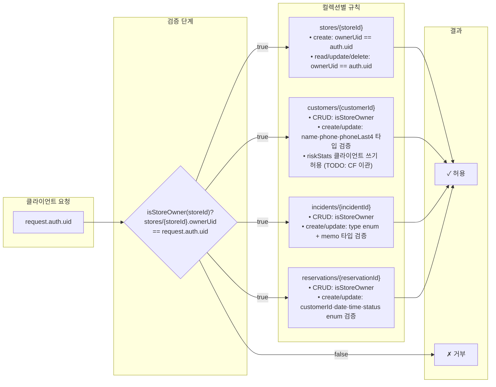

# ShowUp 전체 아키텍처 — 화면 → 서비스 → Firestore 데이터 흐름

## 전체 데이터 흐름 다이어그램

```mermaid
flowchart TB
    subgraph Auth["Firebase Auth"]
        AUTH["Auth Service\n(email/password)"]
    end

    subgraph Pages["화면 (Pages)"]
        LANDING["Landing (/)"]
        LOGIN["Login (/login)"]
        REGISTER["Register (/register)"]
        DASHBOARD["Dashboard (/app/dashboard)"]
        CUSTOMERS["Customers (/app/customers)"]
        NEWCUSTOMER["NewCustomer (/app/customers/new)"]
        DETAIL["CustomerDetail (/app/customers/:id)"]
        RESERVATIONS["Reservations (/app/reservations)"]
        NEWRESERV["NewReservation (/app/reservations/new)"]
        PRIVACY["Privacy (/privacy)"]
        TERMS["Terms (/terms)"]
        NOTFOUND["NotFound (*)"]
        SERVERERR["ServerError (/500)"]
    end

    subgraph Hooks["Hooks"]
        USEAUTH["useAuthState\n(onAuthStateChanged 구독)"]
        PROTECTED["ProtectedRoute\n(user 없으면 /login 리다이렉트)"]
    end

    subgraph Services["서비스 레이어 (src/services)"]
        AUTH_SVC["auth.ts\nsignIn / signUp / signOutUser / subscribeToAuth"]
        STORES_SVC["stores.ts\ncreateStore / getStore / updateStore"]
        CUSTOMERS_SVC["customers.ts\ngetCustomer / searchCustomers / createCustomer\nupdateCustomer / refreshCustomerRiskStats / getTopRiskyCustomers"]
        RESERV_SVC["reservations.ts\nlistReservations / listTodayReservations\ncreateReservation / transitionReservationStatus"]
        INCIDENT_SVC["incidents.ts\nlistIncidents / createIncident\nupdateIncident / deleteIncident"]
        DASHBOARD_SVC["dashboard.ts\ngetDashboardData (조합 서비스)"]
        RISKREFRESH["riskRefresh.ts\ncreateReservationAndRefresh\ntransitionReservationStatusAndRefresh\ncreateIncidentAndRefresh / refreshRiskStats"]
    end

    subgraph Risk["위험도 계산 (src/utils/risk.ts)"]
        CALC["calculateRiskStats\n(score, level, alert 계산 순수 함수)"]
    end

    subgraph Firestore["Firestore 컬렉션 구조"]
        direction LR
        STORES_DOC["stores/{storeId}\n(ownerUid, name, category)"]
        CUSTOMERS_DOC["stores/{storeId}/customers/{customerId}\n(name, phone, phoneLast4, riskStats)"]
        INCIDENTS_DOC["stores/{storeId}/customers/{customerId}/incidents/{incidentId}\n(type, memo, occurredAt)"]
        RESERV_DOC["stores/{storeId}/reservations/{reservationId}\n(customerId, date, time, status, cancelledSameDay)"]
    end

    subgraph Rules["Firestore Security Rules"]
        RULE_OWNER["isStoreOwner(storeId)\n→ stores/{storeId}.ownerUid == auth.uid"]
        RULE_CUST["customers: create/update/delete\n→ isStoreOwner + 필드 타입 검증\n(riskStats 클라이언트 쓰기 허용 — TODO: CF 이관)"]
        RULE_INC["incidents: create/update\n→ isStoreOwner + type enum 검증"]
        RULE_RES["reservations: create/update\n→ isStoreOwner + status enum 검증"]
    end

    %% ── Auth Flow ──
    AUTH <-->|"onAuthStateChanged"| USEAUTH
    USEAUTH -->|"user.uid 검사"| PROTECTED
    PROTECTED -->|"인증 필요 라우트 보호"| DASHBOARD
    PROTECTED --> CUSTOMERS
    PROTECTED --> DETAIL
    PROTECTED --> RESERVATIONS
    PROTECTED --> NEWCUSTOMER
    PROTECTED --> NEWRESERV

    %% ── Login / Register ──
    LOGIN -->|"signIn()"| AUTH_SVC
    REGISTER -->|"signUp()"| AUTH_SVC
    AUTH_SVC -->|"createUserWithEmailAndPassword"| AUTH
    AUTH_SVC -->|"signInWithEmailAndPassword"| AUTH
    AUTH_SVC -->|"회원가입 후 createStore()"| STORES_SVC
    STORES_SVC -->|"setDoc"| STORES_DOC

    %% ── Dashboard ──
    DASHBOARD -->|"listTodayReservations(uid)"| RESERV_SVC
    DASHBOARD -->|"listReservations(uid)"| RESERV_SVC
    DASHBOARD -->|"getTopRiskyCustomers(uid, 5)"| CUSTOMERS_SVC
    DASHBOARD -.->|"미사용 (직접 호출함)"| DASHBOARD_SVC
    DASHBOARD_SVC -.->|"내부적으로 listReservations + getTopRiskyCustomers"| RESERV_SVC
    DASHBOARD_SVC -.-> CUSTOMERS_SVC

    %% ── Customers ──
    CUSTOMERS -->|"searchCustomers(uid, query)"| CUSTOMERS_SVC
    NEWCUSTOMER -->|"searchCustomers (중복 확인)"| CUSTOMERS_SVC
    NEWCUSTOMER -->|"createCustomer"| CUSTOMERS_SVC
    CUSTOMERS_SVC -->|"getDoc / getDocs"| CUSTOMERS_DOC

    %% ── CustomerDetail ──
    DETAIL -->|"getCustomer(uid, id)"| CUSTOMERS_SVC
    DETAIL -->|"listIncidents(uid, customerId)"| INCIDENT_SVC
    DETAIL -->|"listReservations(uid, customerId)"| RESERV_SVC
    DETAIL -->|"createIncidentAndRefresh"| RISKREFRESH
    DETAIL -->|"transitionReservationStatusAndRefresh"| RISKREFRESH

    %% ── Reservations ──
    RESERVATIONS -->|"listReservations(uid)"| RESERV_SVC
    RESERVATIONS -->|"getCustomer (고객명 enrichment)"| CUSTOMERS_SVC
    RESERVATIONS -->|"transitionReservationStatusAndRefresh"| RISKREFRESH
    NEWRESERV -->|"searchCustomers"| CUSTOMERS_SVC
    NEWRESERV -->|"createReservation"| RESERV_SVC

    %% ── Firestore reads ──
    RESERV_SVC -->|"getDoc / getDocs / setDoc / updateDoc"| RESERV_DOC
    INCIDENT_SVC -->|"getDoc / getDocs / setDoc / updateDoc / deleteDoc"| INCIDENTS_DOC

    %% ── riskStats Refresh Flow ──
    RISKREFRESH -->|"1. 액션 실행"| RESERV_SVC
    RISKREFRESH -->|"1. 액션 실행"| INCIDENT_SVC
    RISKREFRESH -->|"2. listReservations + listIncidents\n(전체 이력 조회)"| RESERV_SVC
    RISKREFRESH -->|"2. listIncidents"| INCIDENT_SVC
    RISKREFRESH -->|"3. refreshCustomerRiskStats"| CUSTOMERS_SVC
    CUSTOMERS_SVC -->|"calculateRiskStats(reservations, incidents)"| CALC
    CALC -->|"RiskStats 객체 반환"| CUSTOMERS_SVC
    CUSTOMERS_SVC -->|"4. updateDoc: riskStats 갱신"| CUSTOMERS_DOC

    %% ── Security Rules 적용 ──
    RULE_OWNER -.->|"모든 컬렉션 접근 시 검증"| STORES_DOC
    RULE_OWNER -.-> CUSTOMERS_DOC
    RULE_OWNER -.-> INCIDENTS_DOC
    RULE_OWNER -.-> RESERV_DOC
    RULE_CUST -.-> CUSTOMERS_DOC
    RULE_INC -.-> INCIDENTS_DOC
    RULE_RES -.-> RESERV_DOC

    %% ── 정적 페이지 (서비스 호출 없음) ──
    LANDING -.->|"서비스 호출 없음"| AUTH
    PRIVACY -.->|"정적 콘텐츠"| None1[" "]
    TERMS -.->|"정적 콘텐츠"| None2[" "]
    NOTFOUND -.->|"정적 콘텐츠"| None3[" "]
    SERVERERR -.->|"정적 콘텐츠"| None4[" "]

    %% 스타일링
    classDef authNode fill:#e3f2fd,stroke:#1565c0,stroke-width:2px
    classDef pageNode fill:#f3e5f5,stroke:#7b1fa2,stroke-width:1px
    classDef serviceNode fill:#e8f5e9,stroke:#2e7d32,stroke-width:1px
    classDef firestoreNode fill:#fff3e0,stroke:#e65100,stroke-width:2px
    classDef ruleNode fill:#ffebee,stroke:#c62828,stroke-width:1px,stroke-dasharray: 5 5
    classDef riskNode fill:#fffde7,stroke:#f57f17,stroke-width:1px

    class AUTH,AUTH_SVC,USEAUTH,PROTECTED authNode
    class LANDING,LOGIN,REGISTER,DASHBOARD,CUSTOMERS,NEWCUSTOMER,DETAIL,RESERVATIONS,NEWRESERV,PRIVACY,TERMS,NOTFOUND,SERVERERR pageNode
    class STORES_SVC,CUSTOMERS_SVC,RESERV_SVC,INCIDENT_SVC,DASHBOARD_SVC,RISKREFRESH serviceNode
    class STORES_DOC,CUSTOMERS_DOC,INCIDENTS_DOC,RESERV_DOC firestoreNode
    class RULE_OWNER,RULE_CUST,RULE_INC,RULE_RES ruleNode
    class CALC riskNode
```



## 아키텍처 설명

### 1. 화면(페이지) 목록과 호출 서비스 함수

| 페이지 | 경로 | 인증 | 호출 서비스 함수 | 접근 컬렉션 |
|--------|------|------|-----------------|------------|
| **Landing** | `/` | ✗ | 없음 (정적) | — |
| **Login** | `/login` | ✗ | `auth.signIn()` | Firebase Auth |
| **Register** | `/register` | ✗ | `auth.signUp()` → `stores.createStore()` | Auth → `stores` |
| **Privacy** | `/privacy` | ✗ | 없음 (정적) | — |
| **Terms** | `/terms` | ✗ | 없음 (정적) | — |
| **Dashboard** | `/app/dashboard` | ✓ | `reservations.listTodayReservations()`, `reservations.listReservations()`, `customers.getTopRiskyCustomers()` | `reservations`, `customers` |
| **Customers** | `/app/customers` | ✓ | `customers.searchCustomers()` | `customers` |
| **NewCustomer** | `/app/customers/new` | ✓ | `customers.searchCustomers()` (중복 확인), `customers.createCustomer()` | `customers` |
| **CustomerDetail** | `/app/customers/:id` | ✓ | `customers.getCustomer()`, `incidents.listIncidents()`, `reservations.listReservations()`, `riskRefresh.createIncidentAndRefresh()`, `riskRefresh.transitionReservationStatusAndRefresh()` | `customers`, `incidents`, `reservations` |
| **Reservations** | `/app/reservations` | ✓ | `reservations.listReservations()`, `customers.getCustomer()`, `riskRefresh.transitionReservationStatusAndRefresh()` | `reservations`, `customers` |
| **NewReservation** | `/app/reservations/new` | ✓ | `customers.searchCustomers()`, `reservations.createReservation()` | `customers`, `reservations` |
| **NotFound** | `*` | ✗ | 없음 (정적) | — |
| **ServerError** | `/500` | ✗ | 없음 (정적) | — |

> `dashboard.ts`의 `getDashboardData()` 서비스 함수가 존재하지만, Dashboard 페이지는 현재 개별 서비스 함수를 직접 호출하고 있음.

### 2. 서비스 함수 → Firestore 컬렉션 매핑

```
stores/{storeId}                              ← stores.ts
stores/{storeId}/customers/{customerId}       ← customers.ts
stores/{storeId}/customers/{customerId}/incidents/{incidentId}  ← incidents.ts
stores/{storeId}/reservations/{reservationId} ← reservations.ts
```

**storeId = `user.uid`** (Firebase Auth UID). 회원가입 시 `createUserWithEmailAndPassword` 후 `stores/{uid}` 문서를 생성하여 ownerUid로 등록.

### 3. Firebase Auth 연동 흐름

```
firebase.ts → initializeApp() → getAuth(), getFirestore()
     ↓
auth.ts → signIn() / signUp() / signOutUser() / subscribeToAuth()
     ↓
useAuth.ts → useAuthState() → onAuthStateChanged 구독 → user/loading 상태 관리
     ↓
App.tsx → ProtectedRoute → useAuthState().user 검사
     ↓ 미인증 시 /login 리다이렉트
모든 보호 라우트는 user.uid를 storeId로 사용하여 서비스 호출
```

- **회원가입**: `createUserWithEmailAndPassword` → `updateProfile(displayName=storeName)` → `createStore(uid, {ownerUid, name, category})`
- **로그인**: `signInWithEmailAndPassword` → `/app/dashboard` 이동
- **인증 상태**: `onAuthStateChanged` 구독 기반 실시간 반영, 새로고침 시에도 유지

### 4. riskStats 갱신 흐름 (riskRefresh.ts)

```
[사용자 액션]
  ├── 예약 생성 → createReservationAndRefresh()
  ├── 예약 상태 변경 → transitionReservationStatusAndRefresh()
  ├── 사건 생성 → createIncidentAndRefresh()
  ├── 사건 수정 → updateIncidentAndRefresh()
  └── 사건 삭제 → deleteIncidentAndRefresh()
         │
         ▼
  ① 액션 실행 (reservation 또는 incident 문서 쓰기)
         │
         ▼
  ② refreshRiskStats() 호출
     ├── listReservations(storeId, customerId)  ← 전체 예약 조회
     └── listIncidents(storeId, customerId)      ← 전체 사건 조회
         │
         ▼
  ③ refreshCustomerRiskStats()
     └── calculateRiskStats({ reservations, incidents })
         ├── 예약 점수: noShow×8 + lateCancel×4 + visited×(-1)
         ├── 사건 점수: abuse×10 + dispute×6 + late×2 + unreasonable×4
         ├── 최근 30일 노쇼 보너스: +5
         └── score = max(0, 총합)
         │
         ▼
  ④ updateDoc(customerRef, { riskStats, updatedAt })
     → customer 문서의 riskStats 필드 갱신
         │
         ▼
  ⑤ 페이지에서 getCustomer() 재호출 → 갱신된 riskStats 표시
     (RiskBadge, RiskAlertBanner 컴포넌트로 시각화)
```

> **현재 상태**: Spark 요금제로 Cloud Functions 미배포 → 클라이언트에서 직접 riskStats 쓰기. Security Rules에서 허용 중. Blaze 업그레이드 시 Cloud Functions 트리거로 이관 예정.

### 5. Firestore Security Rules 적용 지점



**핵심 보안 모델:**
- **Owner UID 기반 스토어 격리**: `storeId == ownerUid == auth.uid`. 모든 데이터 접근은 `isStoreOwner(storeId)` 검증을 통과해야 함.
- **필드 검증**: `customers`는 name/phone/phoneLast4 타입, `incidents`는 type enum (`abuse`, `dispute`, `late`, `unreasonable`), `reservations`는 status enum (`pending`, `confirmed`, `visited`, `noShow`, `cancelled`) 검증.
- **riskStats 쓰기**: 현재 Security Rules에서 허용 (Spark 요금제). `customers.ts`의 주석에는 "Cloud Function 전용. 클라이언트에서는 직접 호출할 수 없다 (Security Rules 차단)"라고 되어 있으나, 실제 rules에서는 `update`를 허용하고 있어 클라이언트 riskRefresh가 동작함.
- **phoneLast4 동시 변경 규칙**: `phoneLast4`는 `phone`과 함께만 변경 가능 (단독 변경 차단).