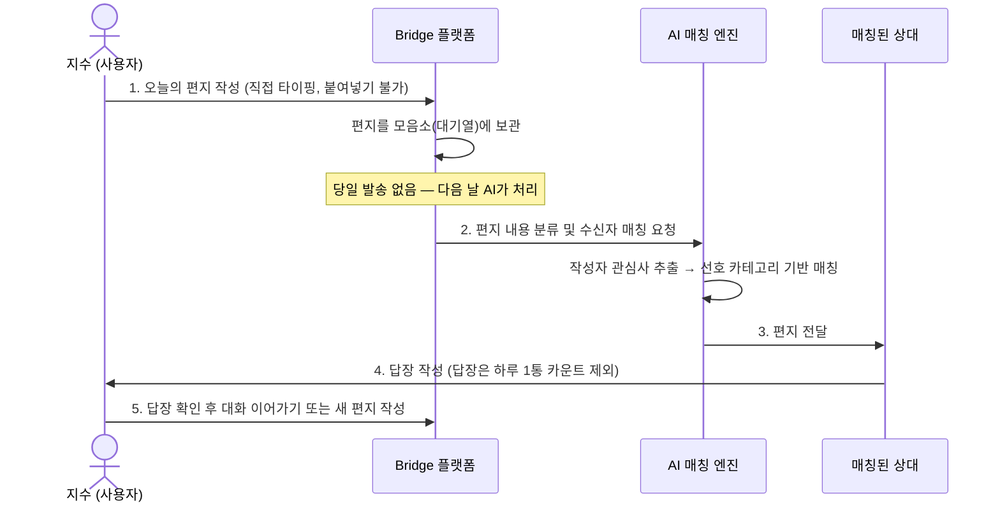

# Bridge 서비스 기획안

> 편지를 매개로 사람과 연결되는 플랫폼

---

## 1. 문제 발견 (Problem Discovery)

**현상:** SNS·메신저 중심의 디지털 소통이 일상화되며 관계의 양은 늘었지만 깊이는 얕아지고 있습니다.

**사용자 관찰 (Pain Points):**

- **피상적 연결의 피로감:** 좋아요·팔로우·짧은 댓글로 이루어진 상호작용은 관계가 깊어지지 않아 외로움을 해소하지 못합니다.
- **즉각적 반응 강박:** 메시지를 보내면 바로 읽음 처리·답장이 기대되고, 이 압박이 소통을 부담스럽게 만듭니다.
- **알고리즘 기반 노출:** 내가 선택한 것이 아닌 알고리즘이 보여주는 콘텐츠 위주로 관계가 형성되어, 진짜 나를 이해하는 사람과 연결되기 어렵습니다.

---

## 2. 문제 정의 (Problem Definition)

> **"빠르게 소비되는 SNS에 지친 대학생이, 자신과 관심사가 맞는 낯선 사람과 천천히·진지한 방식으로 연결되지 못하고 있다."**

---

## 3. 사용자·시나리오 (User Scenario)

**페르소나:** 대학교 2학년 김지수 (22세)

- SNS는 하루 2시간 이상 사용하지만 진심을 나누는 대화가 없다고 느낌
- 낯선 사람과 깊은 이야기를 나눠보고 싶지만 DM은 어색하고 부담스러움

**서비스 이용 시나리오 흐름:**



---

## 4. 핵심 기능 (Core Features)

> 선정 기준: "이게 없으면 서비스가 안 돌아가나?" + "문제 정의를 정확히 해결하나?"

### 기능 1. 하루 1통 편지 작성 + 모음소 대기

- 하루에 편지 1통만 작성 가능 (답장은 카운트 제외)
- 붙여넣기 비활성화 — 직접 타이핑만 허용해 신중한 글쓰기 유도
- 작성 즉시 전달되지 않고 모음소(대기열)에 보관

**필요한 이유:** 즉각 반응 강박을 없애고, 한 통의 편지에 진심을 담는 감성을 만든다.

### 기능 2. AI 기반 관심사 매칭 + 다음 날 배달

- 편지 내용을 AI가 분류하여 카테고리 태깅
- 작성자의 선호 카테고리 기반으로 수신자 매칭
- 기다림이 서비스의 일부 — 다음 날 배달

**필요한 이유:** 알고리즘 피드가 아닌 '내 글'을 통해 나와 맞는 사람을 연결해 피상적 관계 문제를 해결한다.

---

## 5. 화면 흐름 (Screen Flow)

```
[홈] → [편지 작성] → [모음소] → [받은 편지함] → [답장 작성]
```

| 화면 | 주요 내용 |
|------|-----------|
| 홈 | 오늘 편지 작성 가능 여부 + 도착한 편지 알림 |
| 편지 작성 | 텍스트 에디터 (붙여넣기 비활성화) |
| 모음소 | 발송 대기 중인 내 편지 목록 |
| 받은 편지함 | 매칭되어 도착한 편지 목록 |
| 답장 | 대화 이어가기 |

---

## 6. 진행 계획

| 단계 | 내용 | 상태 |
|------|------|------|
| 기획 | 문제 정의, 시나리오, 핵심 기능 정리 | ✅ 완료 |
| UI 설계 | 화면 흐름, 컴포넌트 구조 설계 | ⬜ 예정 |
| 핵심 기능 구현 | 편지 작성 + 모음소 | ⬜ 예정 |
| AI 매칭 연동 | 편지 분류 + 수신자 매칭 API | ⬜ 예정 |
| 통합 테스트 | E2E 흐름 검증 | ⬜ 예정 |
