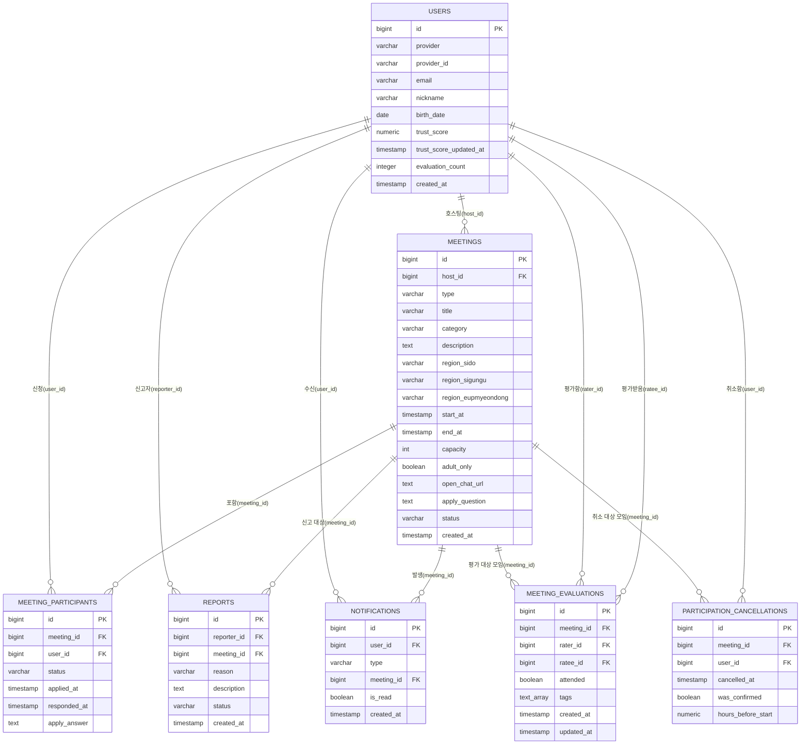

# 번개모임 & 소모임 — DB 스키마 설계서

기획서(`번개모임_소모임_프로젝트_기획서.md`)에서 확정된 내용을 기준으로 작성했습니다. PostgreSQL 기준입니다.

---

## 1. ERD 개요



테이블 7개(`users`, `meetings`, `meeting_participants`, `reports`, `notifications`, `meeting_evaluations`, `participation_cancellations`)로 MVP 범위(6.1) + 3단계 신뢰도 평가(2026-07-29)를 커버합니다. 차단 기능(2차 개발)은 11번에 별도로 정리했습니다.

---

## 2. users (사용자)

| 컬럼 | 타입 | 제약 | 설명 |
|---|---|---|---|
| id | bigserial | PK | |
| provider | varchar(20) | NOT NULL | `google` \| `kakao` |
| provider_id | varchar(100) | NOT NULL | 소셜 로그인 제공자의 고유 사용자 ID |
| email | varchar(255) | NOT NULL | |
| nickname | varchar(50) | NOT NULL | |
| birth_date | date | NULL 허용 | 최초 로그인 이후 추가 입력 (입력 전까지는 NULL) |
| trust_score | numeric(4,1) | NOT NULL, DEFAULT 50.0 | **계산 결과 캐시(원본은 이력)**. 전 사용자에게 공개됨 (기획서 11번) |
| trust_score_updated_at | timestamp | NULL 허용 | 2026-07-29 추가. `trust_score`가 마지막으로 재계산된 시각. 평가·취소가 재계산을 트리거할 때만 갱신되고, 활동이 없는 사용자는 갱신되지 않는다(최근성 감쇠는 다음 재계산 시점에 한꺼번에 반영됨). 신규 사용자는 NULL |
| evaluation_count | integer | NOT NULL, DEFAULT 0 | 2026-07-29 추가. `trust_score` 계산에 **실제로 반영된**(진술 대조를 통과한) 평가 수. 무효 처리된 평가는 세지 않는다 |
| created_at | timestamp | NOT NULL, DEFAULT now() | |

- **UNIQUE (provider, provider_id)** — 동일 소셜 계정으로 중복 가입 방지 (기획서 11번 "평점 조작" 행). 서로 다른 provider 간 중복은 이 제약으로 못 막음 — 기획서 9번에 한계로 명시된 부분과 동일.
- `is_adult`(성인 여부)는 별도 컬럼으로 저장하지 않고, `birth_date` 기준으로 조회 시점에 계산합니다. 매일 바뀌는 값이 아니라 저장할 이유가 없어서입니다.
- `trust_score` 기본값 50.0은 임의로 잡은 값입니다 — 노쇼 등으로 감점되는 폭과 함께 나중에 조정하면 됩니다.
- **`trust_score`의 의미가 2026-07-29에 바뀌었습니다.** 원래는 "취소 시 −3"을 직접 적용받는 원본 값이었지만, 지금은 `meeting_evaluations`·`participation_cancellations`(5번) 이력에서 계산되는 **파생 캐시**입니다. 공식을 바꾸면 이력에서 전체 재계산할 수 있다는 게 이 전환의 핵심 이점입니다 — 설계는 `docs/superpowers/specs/2026-07-22-신뢰도-알고리즘-design.md` 참고.

---

## 3. meetings (모임)

| 컬럼 | 타입 | 제약 | 설명 |
|---|---|---|---|
| id | bigserial | PK | |
| host_id | bigint | FK → users.id, NOT NULL | 모임장 |
| type | varchar(10) | NOT NULL | `flash`(번개모임) \| `small`(소모임) |
| title | varchar(100) | NOT NULL | |
| category | varchar(30) | NOT NULL | |
| description | text | NULL 허용 | |
| region_sido | varchar(20) | NOT NULL | 시/도 |
| region_sigungu | varchar(20) | NOT NULL | 시/군/구 |
| region_eupmyeondong | varchar(20) | NULL 허용 | 읍/면/동 (선택 입력) |
| start_at | timestamp | NOT NULL | 번개모임: 모임 일시 / 소모임: 시작일 |
| end_at | timestamp | NULL 허용 | 소모임 종료일. 번개모임은 항상 NULL |
| capacity | int | NULL 허용 | 번개모임은 필수, 소모임은 NULL(무제한) — 기획서 6.1 |
| adult_only | boolean | NOT NULL, DEFAULT false | "성인만 참여 가능" 옵션 |
| open_chat_url | text | NOT NULL | 등록 시 `open.kakao.com` 패턴만 형식 검증 (기획서 11번) |
| apply_question | text | NULL 허용 | 신청 시 한마디(B) 가입 질문. **소모임만** 의미가 있고 번개모임은 항상 NULL. 길이 상한(200자)은 앱(`validators.js`)에서만 강제 |
| status | varchar(15) | NOT NULL, DEFAULT 'recruiting' | `recruiting`(모집중) \| `closed`(마감) \| `finished`(종료) \| `cancelled`(취소) |
| created_at | timestamp | NOT NULL, DEFAULT now() | |

- **CHECK**: `type = 'flash'` 이면 `capacity IS NOT NULL AND end_at IS NULL`, `type = 'small'` 이면 `capacity IS NULL` — 타입별 규칙을 DB 제약으로도 강제합니다.
- 번개모임/소모임을 한 테이블에 합친 이유: 필드 대부분이 동일하고 차이는 `capacity`/`end_at` 두 개뿐이라, 테이블을 나누면 조회(목록/검색)마다 UNION이 필요해져 오히려 복잡해집니다.
- `status = 'finished'` 전환(지난 모임 자동 제외, 기획서 11번)은 별도 배치 없이 **조회 시점에 `start_at`/`end_at`이 지났으면 애플리케이션에서 필터링**하는 방식을 권장합니다. 사용자 수가 적은 MVP 단계에서 스케줄러를 따로 두는 건 과합니다.
- `status = 'closed'`는 번개모임이 정원을 채웠을 때 애플리케이션 로직으로 갱신합니다 (참가자 취소 시 다시 `recruiting`으로 되돌림 — 기획서 11번 "정원 초과" 행).

---

## 4. meeting_participants (참여 신청)

| 컬럼 | 타입 | 제약 | 설명 |
|---|---|---|---|
| id | bigserial | PK | |
| meeting_id | bigint | FK → meetings.id, NOT NULL | |
| user_id | bigint | FK → users.id, NOT NULL | |
| status | varchar(15) | NOT NULL | `confirmed`(확정) \| `pending`(대기) \| `approved`(승인) \| `rejected`(거절) \| `cancelled`(취소) |
| applied_at | timestamp | NOT NULL, DEFAULT now() | |
| responded_at | timestamp | NULL 허용 | 모임장이 승인/거절한 시각 |
| apply_answer | text | NULL 허용 | 신청 시 한마디(B) 답변. `meetings.apply_question`이 설정된 모임에서만 값이 들어가며, 질문이 없으면 NULL. 길이 상한(500자)은 앱에서만 강제 |

- **UNIQUE (meeting_id, user_id)** — 같은 모임에 중복 신청 방지. (서로 다른 모임에 동시 신청하는 건 기획서 11번 "중복 신청" 결정대로 허용하므로 이 제약에 안 걸림)
- 번개모임 신청: `status = 'confirmed'`로 즉시 insert (기획서 5번 참여 방식)
- 소모임 신청: `status = 'pending'`으로 insert → 모임장이 `approved`/`rejected`로 변경
- 모임 취소 시: 해당 모임의 참여 레코드를 일괄 `cancelled`로 갱신 (기획서 11번 "모임 취소" 행 — 마이페이지에 "취소됨"으로 노출)
- ~~노쇼/불참 처리(신뢰도 하락)는 이 테이블의 상태 변화를 트리거로 애플리케이션에서 `users.trust_score`를 갱신하는 방식이면 충분합니다.~~ **2026-07-29부로 낡은 설명입니다.** 이 테이블의 `status` 변화만으로는 "몇 번 취소했는지", "노쇼였는지 진짜 참석이었는지"가 남지 않습니다(재신청이 같은 행의 `applied_at`/`responded_at`을 덮어씀). 그래서 취소는 6번 `participation_cancellations`에, 노쇼/참석 판정은 5번 `meeting_evaluations`에 **별도 이력**으로 쌓고, `users.trust_score`는 그 이력에서 계산됩니다.

---

## 5. meeting_evaluations (모임 후 상호 평가 이력, 2026-07-29 추가)

모임 종료 후 모임장↔확정 참여자가 서로를 평가한 원본 이력입니다. `users.trust_score`는 이 테이블(+6번)에서 계산되는 파생값입니다 — 공식을 바꿔도 이 이력에서 전체 재계산할 수 있습니다. 설계: `docs/superpowers/specs/2026-07-22-신뢰도-알고리즘-design.md` 3.1·5장·6장.

| 컬럼 | 타입 | 제약 | 설명 |
|---|---|---|---|
| id | bigserial | PK | |
| meeting_id | bigint | FK → meetings.id, NOT NULL | |
| rater_id | bigint | FK → users.id, NOT NULL | 평가한 사람 |
| ratee_id | bigint | FK → users.id, NOT NULL | 평가받은 사람 |
| attended | boolean | NOT NULL | 평가 대상이 실제로 왔는가(소모임은 "성실히 참여했는가") |
| tags | text[] | NOT NULL, DEFAULT `'{}'` | 선택한 태그 코드(긍정 4종·부정 3종 중, 최대 각 3개). 태그 문구·가중치는 DB가 아니라 코드 상수(`src/constants/evaluationTags.js`)에 둡니다 — 비공개가 목적이라 노출 경로를 늘리지 않기 위해서입니다 |
| created_at | timestamp | NOT NULL, DEFAULT now() | 최초 제출 시각. 최근성 가중치·수정 가능 기간(24시간) 판정의 기준 |
| updated_at | timestamp | NOT NULL, DEFAULT now() | 마지막 수정 시각. `updated_at <> created_at`이면 "이미 1회 수정함"으로 판정 |

- **UNIQUE (meeting_id, rater_id, ratee_id)** — 한 모임에서 같은 사람을 두 번 평가할 수 없습니다. 수정은 이 행을 UPDATE하는 것이지 새 행을 만드는 게 아닙니다.
- **INDEX (ratee_id)** — 재계산은 항상 "이 사람이 **받은** 평가 전부"를 읽습니다.
- **INDEX (meeting_id, rater_id)** — 진술 대조가 "같은 모임에서 상대가 나를 어떻게 평가했는지"(반대 방향 행)를 찾을 때 씁니다.
- 평가 자격은 확정(`approved`/`confirmed`)이었던 사람만입니다(거절당한 신청자의 보복 평가 차단). 제출·수정은 앱(`evaluationService.js`)에서 검증하며, DB 제약으로는 강제하지 않습니다.
- 진술 대조(같은 모임에서 두 사람 사이 평가가 엇갈리면 양쪽 무효)는 저장 시점이 아니라 **재계산 시점에** 매번 판정합니다. 그래서 한쪽이 나중에 반대 진술을 제출하면 이미 반영된 판정도 뒤집힐 수 있습니다 — 이 테이블 자체는 진술을 그대로 저장할 뿐, "유효/무효" 상태를 컬럼으로 갖지 않습니다.

---

## 6. participation_cancellations (참여 취소 이력, 2026-07-29 추가)

append-only 취소 이력입니다. `meeting_participants`는 (모임, 사용자)당 한 행뿐이고 재신청이 그 행을 덮어써서 "몇 번 취소했는지"가 남지 않으므로, 취소 가중치를 계산할 데이터를 이 테이블에 따로 쌓습니다.

| 컬럼 | 타입 | 제약 | 설명 |
|---|---|---|---|
| id | bigserial | PK | |
| meeting_id | bigint | FK → meetings.id, NOT NULL | |
| user_id | bigint | FK → users.id, NOT NULL | 취소한 사람 |
| cancelled_at | timestamp | NOT NULL, DEFAULT now() | |
| was_confirmed | boolean | NOT NULL | 확정(`confirmed`/`approved`) 상태에서 취소했는가. `pending` 상태였던 취소는 `false` |
| hours_before_start | numeric | NOT NULL | 취소 시점 기준 "모임 시작까지 남은 시간"의 **스냅샷**. 모임 시작 시각이 나중에 수정(E4)돼도 취소 당시의 판단이 맞으므로 스냅샷으로 굳혀 저장합니다. `is_past` 가드(2026-07-22, `0e459a5b`) 덕분에 종료된 모임은 애초에 취소할 수 없어 이 값은 항상 양수입니다 |

- **INDEX (user_id)** — 재계산은 항상 "이 사람의 취소 이력 전부"를 읽습니다.
- 감점 여부는 재계산 시점에 `was_confirmed`·`hours_before_start`로 판정합니다: 확정 상태에서 **시작 24시간 이내** 취소만 감점, 그보다 이르거나 `pending` 취소는 0점입니다("못 가면 일찍 취소하는 게 이득"이 되도록 하는 인센티브 설계입니다).
- 이 테이블에 INSERT만 있고 UPDATE/DELETE는 없습니다 — 취소는 되돌릴 수 없는 사실이므로 이력을 고칠 이유가 없습니다.

---

## 7. reports (신고)

| 컬럼 | 타입 | 제약 | 설명 |
|---|---|---|---|
| id | bigserial | PK | |
| reporter_id | bigint | FK → users.id, NOT NULL | 신고자 |
| meeting_id | bigint | FK → meetings.id, NOT NULL | 신고 대상 모임 |
| reason | varchar(30) | NOT NULL | `inappropriate_content`(부적절한 게시글) \| `minor_violation`(미성년자 위법행위) \| `broken_chat_link`(오픈채팅 링크 오류) \| `other` |
| description | text | NULL 허용 | |
| status | varchar(15) | NOT NULL, DEFAULT 'received' | `received`(접수) \| `reviewed`(검토완료) |
| created_at | timestamp | NOT NULL, DEFAULT now() | |

- 자동 삭제/자동 조치 로직이 없으므로(기획서 11번) `reports` 테이블은 순수하게 "접수함" 역할만 합니다. 실제 조치(모임 삭제, 계정 정지)는 개발자가 DB를 직접 조회해 수동으로 처리 (기획서 12.1).
- 신고 대상을 지금은 "모임" 단위로만 뒀습니다. 특정 유저를 직접 신고하는 기능은 기획서에 없어서 뺐습니다 — 필요해지면 `reported_user_id` 컬럼을 nullable로 추가하면 됩니다.

---

## 8. notifications (알림)

| 컬럼 | 타입 | 제약 | 설명 |
|---|---|---|---|
| id | bigserial | PK | |
| user_id | bigint | FK → users.id, NOT NULL | 수신자 |
| type | varchar(30) | NOT NULL | `new_application`(소모임 새 신청) \| `application_approved`(승인) \| `application_rejected`(거절) \| `meeting_cancelled`(모임 취소) \| `evaluation_requested`(평가 요청, 2026-07-29 추가). 값 목록은 앱(`notificationService.js`)에서만 관리 |
| meeting_id | bigint | FK → meetings.id, NOT NULL | 알림이 발생한 모임 |
| is_read | boolean | NOT NULL, DEFAULT false | |
| created_at | timestamp | NOT NULL, DEFAULT now() | |

- **INDEX (user_id, created_at)** — 조회가 항상 "내 알림을 최신순으로"라서 이 순서의 복합 인덱스 하나면 됩니다.
- **부분 UNIQUE INDEX `notifications_evaluation_requested_unique` (user_id, meeting_id) WHERE type = 'evaluation_requested'** — 2026-07-29 추가. `evaluation_requested`는 행위 시점이 아니라 **알림 조회 시점에 lazy 생성**되므로(아래 참고) 같은 사용자·모임에 대해 중복 INSERT가 시도될 수 있는데, 이 부분 유니크 인덱스가 DB 레벨에서 멱등성을 보장합니다(`ON CONFLICT DO NOTHING`과 짝). 다른 4종 타입은 애초에 중복이 정상이라(예: 같은 소모임에 여러 번 신청 이력이 있으면 `new_application`도 여러 건) 이 제약을 받지 않습니다.
- 수신자 1명당 1행입니다. 같은 알림을 여러 명에게 보낼 때(E5 모임 취소 시 활성 참여자 전원)도 각자 별도 행으로 insert합니다.
- 모임 제목·문구는 이 테이블에 저장하지 않습니다. `meeting_id`로만 가리키고, 조회 시 `meetings`를 JOIN해 제목을 가져옵니다 — 모임 제목이 나중에 바뀌면 과거 알림도 최신 제목으로 보입니다.
- **알림 INSERT는 원인이 된 행위(신청 생성·승인/거절·모임 취소)와 같은 트랜잭션 안에서 이루어지는 것이 원칙입니다.** 행위는 커밋됐는데 알림만 유실되면 사용자가 승인·거절·취소를 영영 모르게 되기 때문입니다. **`evaluation_requested`만 예외**입니다 — "모임 종료"를 감지할 크론이 없어서, `GET /api/notifications` 조회 시점에 호출자 본인에 대해서만 lazy 생성됩니다(대상 판정은 `evaluationService.listPendingEvaluations`를 그대로 재사용). 이 생성은 별도 트랜잭션 없이 실행되고, 실패해도 격리되어 있어 알림 목록 조회 자체는 막지 않습니다.
- 항목별 읽음 처리는 없습니다. `is_read`는 목록을 여는 시점에 그 사용자의 미읽음 전체를 한 번에 갱신합니다.

---

## 9. 계정 정지 처리 방식 (별도 테이블 없음)

미성년자 위법행위 적발 시 "일정 기간 계정 정지, 재범 시 영구정지"(기획서 11번)를 위해 `users`에 컬럼 2개만 추가하는 걸 권장합니다:

| 컬럼 | 타입 | 설명 |
|---|---|---|
| suspended_until | timestamp | NULL이면 정상, 값이 있으면 해당 시점까지 정지. 값이 먼 미래(예: 9999-12-31)면 영구정지로 취급 |
| suspension_count | int | DEFAULT 0. 정지 처리될 때마다 +1 — 재범 판단 기준 |

별도 `suspensions` 이력 테이블을 만들 수도 있지만, 개발자가 수동으로 처리하는 1인 운영 단계에서는 사용자 테이블에 상태 컬럼만 두는 게 훨씬 단순합니다.

---

## 10. 인덱스 권장

| 테이블 | 인덱스 | 목적 |
|---|---|---|
| meetings | (region_sido, region_sigungu, status, start_at) | 지역 필터 + 모집중 목록 조회 |
| meetings | (category) | 카테고리 검색 |
| meeting_participants | (meeting_id) | 모임 상세에서 참가자 목록 조회 |
| meeting_participants | (user_id) | 마이페이지 "참여한 모임" 조회 |
| reports | (status) | 개발자가 미검토 신고만 조회 |
| notifications | (user_id, created_at) | 내 알림을 최신순으로 조회 (8번에서 이미 생성됨) |
| notifications | (user_id, meeting_id) UNIQUE WHERE type='evaluation_requested' | 평가 요청 알림 lazy 생성의 멱등성 보장 (8번에서 이미 생성됨) |
| meeting_evaluations | (meeting_id, rater_id, ratee_id) UNIQUE | 한 모임에서 같은 사람 중복 평가 방지 (5번에서 이미 생성됨) |
| meeting_evaluations | (ratee_id) | 재계산이 "받은 평가 전부"를 조회 (5번에서 이미 생성됨) |
| meeting_evaluations | (meeting_id, rater_id) | 진술 대조가 반대 방향 평가를 조회 (5번에서 이미 생성됨) |
| participation_cancellations | (user_id) | 재계산이 "내 취소 이력 전부"를 조회 (6번에서 이미 생성됨) |

이 표 아래쪽 5개 행(notifications 2번째~participation_cancellations)은 2026-07-29 마이그레이션에서 이미 생성됐습니다 — "권장"이 아니라 실제로 존재합니다. 위쪽 5개 행(meetings 2개·meeting_participants 2개·reports 1개)은 여전히 **미생성 상태의 권장 사항**입니다(기존 백로그, B5).

---

## 11. 2차 개발 예정 테이블 (참고용, 지금 구현 안 함)

```
blocks
  id            bigserial PK
  blocker_id    bigint FK -> users.id
  blocked_id    bigint FK -> users.id
  created_at    timestamp
  UNIQUE (blocker_id, blocked_id)
```

기획서 6.2의 "개인 간 차단 기능"용입니다. 1차 개발 범위 밖이라 실제 마이그레이션에는 포함하지 마세요.

---

## 12. 설계하면서 판단한 사항

- ~~`trust_score` 초기값~~ → **50.0으로 확정**.
- ~~모임 상태 명칭~~ → **`recruiting/closed/finished/cancelled` 4단계로 확정**.
- ~~노쇼 시 신뢰도 감점 폭~~ → **2026-07-29 확정**. 직접 감점이 아니라 5·6번 이력에서 계산되는 산식(`docs/superpowers/specs/2026-07-22-신뢰도-알고리즘-design.md` 5장)으로 바뀌었습니다.
- 신고 사유(`reason`) 세분화 여부는 **개발 진행하면서 결정** — 지금 단계에서 확정하지 않음.
