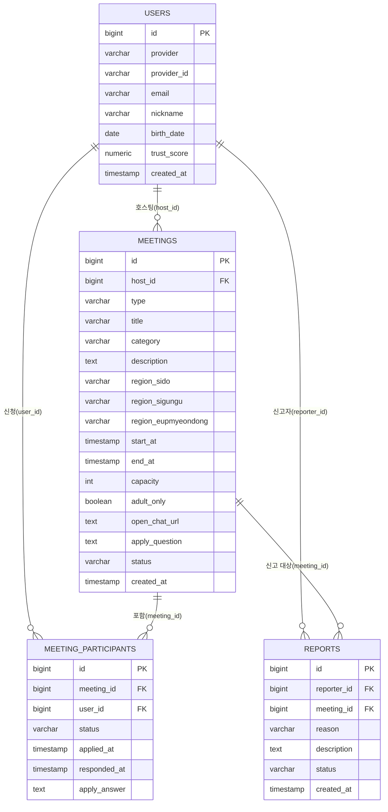

# 번개모임 & 소모임 — DB 스키마 설계서

기획서(`번개모임_소모임_프로젝트_기획서.md`)에서 확정된 내용을 기준으로 작성했습니다. PostgreSQL 기준입니다.

---

## 1. ERD 개요



테이블 4개(`users`, `meetings`, `meeting_participants`, `reports`)로 MVP 범위(6.1)를 전부 커버합니다. 차단 기능(2차 개발)은 8번에 별도로 정리했습니다.

---

## 2. users (사용자)

| 컬럼 | 타입 | 제약 | 설명 |
|---|---|---|---|
| id | bigserial | PK | |
| provider | varchar(20) | NOT NULL | `google` \| `kakao` |
| provider_id | varchar(100) | NOT NULL | 소셜 로그인 제공자의 고유 사용자 ID |
| email | varchar(255) | NOT NULL | |
| nickname | varchar(50) | NOT NULL | |
| birth_date | date | NULL 허용 | 최초 로그인 이후 추가 입력 (입력 전까지는 NULL) |
| trust_score | numeric(4,1) | NOT NULL, DEFAULT 50.0 | 신뢰도 점수. 전 사용자에게 공개됨 (기획서 11번) |
| created_at | timestamp | NOT NULL, DEFAULT now() | |

- **UNIQUE (provider, provider_id)** — 동일 소셜 계정으로 중복 가입 방지 (기획서 11번 "평점 조작" 행). 서로 다른 provider 간 중복은 이 제약으로 못 막음 — 기획서 9번에 한계로 명시된 부분과 동일.
- `is_adult`(성인 여부)는 별도 컬럼으로 저장하지 않고, `birth_date` 기준으로 조회 시점에 계산합니다. 매일 바뀌는 값이 아니라 저장할 이유가 없어서입니다.
- `trust_score` 기본값 50.0은 임의로 잡은 값입니다 — 노쇼 등으로 감점되는 폭과 함께 나중에 조정하면 됩니다.

---

## 3. meetings (모임)

| 컬럼 | 타입 | 제약 | 설명 |
|---|---|---|---|
| id | bigserial | PK | |
| host_id | bigint | FK → users.id, NOT NULL | 모임장 |
| type | varchar(10) | NOT NULL | `flash`(번개모임) \| `small`(소모임) |
| title | varchar(100) | NOT NULL | |
| category | varchar(30) | NOT NULL | |
| description | text | NULL 허용 | |
| region_sido | varchar(20) | NOT NULL | 시/도 |
| region_sigungu | varchar(20) | NOT NULL | 시/군/구 |
| region_eupmyeondong | varchar(20) | NULL 허용 | 읍/면/동 (선택 입력) |
| start_at | timestamp | NOT NULL | 번개모임: 모임 일시 / 소모임: 시작일 |
| end_at | timestamp | NULL 허용 | 소모임 종료일. 번개모임은 항상 NULL |
| capacity | int | NULL 허용 | 번개모임은 필수, 소모임은 NULL(무제한) — 기획서 6.1 |
| adult_only | boolean | NOT NULL, DEFAULT false | "성인만 참여 가능" 옵션 |
| open_chat_url | text | NOT NULL | 등록 시 `open.kakao.com` 패턴만 형식 검증 (기획서 11번) |
| apply_question | text | NULL 허용 | 신청 시 한마디(B) 가입 질문. **소모임만** 의미가 있고 번개모임은 항상 NULL. 길이 상한(200자)은 앱(`validators.js`)에서만 강제 |
| status | varchar(15) | NOT NULL, DEFAULT 'recruiting' | `recruiting`(모집중) \| `closed`(마감) \| `finished`(종료) \| `cancelled`(취소) |
| created_at | timestamp | NOT NULL, DEFAULT now() | |

- **CHECK**: `type = 'flash'` 이면 `capacity IS NOT NULL AND end_at IS NULL`, `type = 'small'` 이면 `capacity IS NULL` — 타입별 규칙을 DB 제약으로도 강제합니다.
- 번개모임/소모임을 한 테이블에 합친 이유: 필드 대부분이 동일하고 차이는 `capacity`/`end_at` 두 개뿐이라, 테이블을 나누면 조회(목록/검색)마다 UNION이 필요해져 오히려 복잡해집니다.
- `status = 'finished'` 전환(지난 모임 자동 제외, 기획서 11번)은 별도 배치 없이 **조회 시점에 `start_at`/`end_at`이 지났으면 애플리케이션에서 필터링**하는 방식을 권장합니다. 사용자 수가 적은 MVP 단계에서 스케줄러를 따로 두는 건 과합니다.
- `status = 'closed'`는 번개모임이 정원을 채웠을 때 애플리케이션 로직으로 갱신합니다 (참가자 취소 시 다시 `recruiting`으로 되돌림 — 기획서 11번 "정원 초과" 행).

---

## 4. meeting_participants (참여 신청)

| 컬럼 | 타입 | 제약 | 설명 |
|---|---|---|---|
| id | bigserial | PK | |
| meeting_id | bigint | FK → meetings.id, NOT NULL | |
| user_id | bigint | FK → users.id, NOT NULL | |
| status | varchar(15) | NOT NULL | `confirmed`(확정) \| `pending`(대기) \| `approved`(승인) \| `rejected`(거절) \| `cancelled`(취소) |
| applied_at | timestamp | NOT NULL, DEFAULT now() | |
| responded_at | timestamp | NULL 허용 | 모임장이 승인/거절한 시각 |
| apply_answer | text | NULL 허용 | 신청 시 한마디(B) 답변. `meetings.apply_question`이 설정된 모임에서만 값이 들어가며, 질문이 없으면 NULL. 길이 상한(500자)은 앱에서만 강제 |

- **UNIQUE (meeting_id, user_id)** — 같은 모임에 중복 신청 방지. (서로 다른 모임에 동시 신청하는 건 기획서 11번 "중복 신청" 결정대로 허용하므로 이 제약에 안 걸림)
- 번개모임 신청: `status = 'confirmed'`로 즉시 insert (기획서 5번 참여 방식)
- 소모임 신청: `status = 'pending'`으로 insert → 모임장이 `approved`/`rejected`로 변경
- 모임 취소 시: 해당 모임의 참여 레코드를 일괄 `cancelled`로 갱신 (기획서 11번 "모임 취소" 행 — 마이페이지에 "취소됨"으로 노출)
- 노쇼/불참 처리(신뢰도 하락)는 이 테이블의 상태 변화를 트리거로 애플리케이션에서 `users.trust_score`를 갱신하는 방식이면 충분합니다. 변경 이력을 별도 로그 테이블로 남기는 건 지금 단계에서는 불필요한 확장이라 뺐습니다.

---

## 5. reports (신고)

| 컬럼 | 타입 | 제약 | 설명 |
|---|---|---|---|
| id | bigserial | PK | |
| reporter_id | bigint | FK → users.id, NOT NULL | 신고자 |
| meeting_id | bigint | FK → meetings.id, NOT NULL | 신고 대상 모임 |
| reason | varchar(30) | NOT NULL | `inappropriate_content`(부적절한 게시글) \| `minor_violation`(미성년자 위법행위) \| `broken_chat_link`(오픈채팅 링크 오류) \| `other` |
| description | text | NULL 허용 | |
| status | varchar(15) | NOT NULL, DEFAULT 'received' | `received`(접수) \| `reviewed`(검토완료) |
| created_at | timestamp | NOT NULL, DEFAULT now() | |

- 자동 삭제/자동 조치 로직이 없으므로(기획서 11번) `reports` 테이블은 순수하게 "접수함" 역할만 합니다. 실제 조치(모임 삭제, 계정 정지)는 개발자가 DB를 직접 조회해 수동으로 처리 (기획서 12.1).
- 신고 대상을 지금은 "모임" 단위로만 뒀습니다. 특정 유저를 직접 신고하는 기능은 기획서에 없어서 뺐습니다 — 필요해지면 `reported_user_id` 컬럼을 nullable로 추가하면 됩니다.

---

## 6. 계정 정지 처리 방식 (별도 테이블 없음)

미성년자 위법행위 적발 시 "일정 기간 계정 정지, 재범 시 영구정지"(기획서 11번)를 위해 `users`에 컬럼 2개만 추가하는 걸 권장합니다:

| 컬럼 | 타입 | 설명 |
|---|---|---|
| suspended_until | timestamp | NULL이면 정상, 값이 있으면 해당 시점까지 정지. 값이 먼 미래(예: 9999-12-31)면 영구정지로 취급 |
| suspension_count | int | DEFAULT 0. 정지 처리될 때마다 +1 — 재범 판단 기준 |

별도 `suspensions` 이력 테이블을 만들 수도 있지만, 개발자가 수동으로 처리하는 1인 운영 단계에서는 사용자 테이블에 상태 컬럼만 두는 게 훨씬 단순합니다.

---

## 7. 인덱스 권장

| 테이블 | 인덱스 | 목적 |
|---|---|---|
| meetings | (region_sido, region_sigungu, status, start_at) | 지역 필터 + 모집중 목록 조회 |
| meetings | (category) | 카테고리 검색 |
| meeting_participants | (meeting_id) | 모임 상세에서 참가자 목록 조회 |
| meeting_participants | (user_id) | 마이페이지 "참여한 모임" 조회 |
| reports | (status) | 개발자가 미검토 신고만 조회 |

---

## 8. 2차 개발 예정 테이블 (참고용, 지금 구현 안 함)

```
blocks
  id            bigserial PK
  blocker_id    bigint FK -> users.id
  blocked_id    bigint FK -> users.id
  created_at    timestamp
  UNIQUE (blocker_id, blocked_id)
```

기획서 6.2의 "개인 간 차단 기능"용입니다. 1차 개발 범위 밖이라 실제 마이그레이션에는 포함하지 마세요.

---

## 9. 설계하면서 판단한 사항

- ~~`trust_score` 초기값~~ → **50.0으로 확정**.
- ~~모임 상태 명칭~~ → **`recruiting/closed/finished/cancelled` 4단계로 확정**.
- 노쇼 시 신뢰도 감점 폭, 신고 사유(`reason`) 세분화 여부는 **개발 진행하면서 결정** — 지금 단계에서 확정하지 않음.
