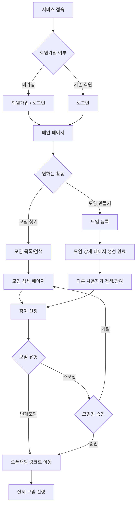

# 번개모임 & 소모임 플랫폼 프로젝트 기획서

## 1. 프로젝트 개요

**서비스명(가칭)**: 번개모임

**한 줄 소개**: 즉흥적인 번개모임부터 기간을 정한 소모임까지, 같이할 사람을 쉽게 찾을 수 있는 플랫폼

**기획 배경**:
- 갑자기 저녁에 운동(풍사, 농구 등)을 하고 싶은데 같이 할 사람이 없는 경우
- 방학 동안 스터디(토익 등)를 하고 싶은데 혼자서는 집중이 어려운 경우
- 위와 같이 "지금 당장" 또는 "일정 기간 동안" 함께할 사람을 구하기 어려운 문제를 해결하기 위한 서비스

---

## 2. 문제 정의 (프로젝트 시작 배경)

혼자서는 할 수 없는 활동을 갑자기 하고 싶을 때가 종종 있다. 대표적으로 풋살처럼 여러 명이 모여야 가능한 운동이 그렇다. 하지만 막상 이런 순간이 찾아왔을 때, 당장 같이할 사람을 모으는 것은 생각보다 쉽지 않다.

- 주변 지인에게 일일이 연락을 돌려야 하고, 그마저도 일정이 맞지 않으면 무산되기 일쑤다.
- 기존 SNS나 단체 채팅방은 "지금 당장" 사람을 모으기에는 정보가 분산되어 있고 비효율적이다.
- 단발성 모임(번개모임)뿐 아니라, 스터디처럼 일정 기간 꾸준히 함께할 사람을 구하는 것 역시 마땅한 창구가 없다.

**결론적으로, "지금 당장" 혹은 "일정 기간 동안" 함께할 사람을 빠르고 쉽게 모을 수 있는 창구가 필요하다는 문제의식에서 이 프로젝트를 기획하게 되었다.**

---

## 3. 사용자 시나리오

### 시나리오 1. 번개모임 (즉흥적 모임)

> A는 저녁 7시, 문득 풋살이 하고 싶어졌다. 하지만 혼자서는 할 수 없는 운동이라 같이 뛸 사람이 필요하다. 평소라면 지인들에게 일일이 연락을 돌려야 했겠지만, A는 '번개모임' 앱을 열어 "오늘 저녁 8시, OO풋살장, 4명 모집"이라는 글을 올린다. 잠시 후 근처에 있던 B, C, D가 모임을 발견하고 참여 신청을 누른다. 인원이 모이자 A는 오픈채팅 링크를 공유해 만날 장소와 시간을 조율하고, 그날 저녁 넷은 함께 풋살을 즐긴다.

### 시나리오 2. 소모임 (기간제 모임)

> 방학을 앞둔 대학생 E는 토익 점수를 올리고 싶지만, 혼자 공부하면 금방 나태해질 것 같아 걱정이다. E는 '번개모임' 앱에서 "방학 2개월, 토익 스터디원 모집"이라는 소모임을 등록한다. 비슷한 목표를 가진 F, G가 모임을 검색해서 발견하고 참여 신청을 한다. 이후 세 사람은 오픈채팅방에서 스터디 일정과 규칙을 정하고, 2개월 동안 정기적으로 만나 함께 공부한다.

---

## 4. 타겟 사용자

- **전 연령대** 일반 사용자
- 특정 지역/카테고리에 국한되지 않고 누구나 이용 가능

---

## 5. 핵심 서비스 정의

| 구분 | 설명 | 예시 |
|---|---|---|
| 번개모임 | 당일치기, 즉흥적인 소규모 모임 | 오늘 저녁 7시 풋살 4명 모집 |
| 소모임 | 기간을 정해 꾸준히 함께하는 스터디/취미 모임 | 방학 2개월 토익 스터디 모집 |

- **카테고리 제한 없음**: 운동, 스터디, 취미, 식사 등 모든 주제 허용
- **참여 방식**: 번개모임은 승인 없이 즉시 참여 확정, 소모임은 참여 신청 후 모임장이 승인/거절

---

## 6. MVP(최소 기능 제품) 범위

### 6.1 포함 기능
- 회원가입 / 로그인 — **구글, 카카오 소셜 로그인 연동**으로 별도 가입 절차 없이 1초 만에 시작 가능 (생년월일은 최초 로그인 시 추가 입력받아 성인/미성년 여부 판별에 활용)
- 모임 등록 (제목, 카테고리, 일시, 인원 — **번개모임은 정원으로 사용, 소모임은 정원 없이 모임장이 승인하는 인원 모두 참여 가능**, **지역(시/도 · 시/군/구 · 읍/면/동 단계별 선택)**, **오픈채팅 링크(등록 시 URL 형식만 간단히 검증)**, 설명, **"성인만 참여 가능" 옵션** 등)
- 모임 목록 조회 및 검색 (**카테고리/키워드 + 지역 필터(시/도 · 시/군/구 · 읍/면/동 단계별 선택)**)
- 모임 참여 신청 — **번개모임은 즉시 참여 확정, 소모임은 모임장 승인/거절 필요** (성인 전용 모임은 미성년자 계정의 신청 자체를 제한)

### 6.2 이후 확장 기능 (2차 개발)
- 지도 기반 근처 모임 조회
- 후기/리뷰 기능
- 개인 간 차단 기능 (불편한 사용자와 재만남 방지)
- **배너 광고 수익 모델** (아래 6.5 참고)

### 6.3 제외 기능
- 자체 실시간 채팅 → **외부 오픈채팅(카카오톡 등) 링크 연결로 대체**
- 모바일 앱 → **1차는 웹사이트로만 개발**, 추후 앱 전환 고려
- 알림 기능 → **웹사이트 기반 서비스 특성상 우선순위 낮음**, 마이페이지에서 신청/승인 상태를 직접 확인하는 방식으로 대체 (모바일 앱 전환 시 푸시 알림 재검토)

> **참고**: 좌표 기반 지도 기능은 2차 개발로 유지하되, **텍스트/드롭다운 기반 지역 필터(예: 시/구 선택)는 MVP에 포함**하기로 변경함 — 번개모임은 근접성이 핵심 가치이기 때문

### 6.4 핵심 기능 우선순위 (Top 2)

기획서에 담긴 여러 기능 중, 서비스의 본질적 가치를 이루는 핵심 기능 2가지를 선정했습니다.

| 순위 | 핵심 기능 | 선정 이유 |
|---|---|---|
| 1 | **모임 등록** | 이 프로젝트의 문제 정의는 "갑자기 사람을 모으기 어렵다"는 것이며, 이를 해결하는 시작점은 결국 원하는 모임을 빠르고 쉽게 세상에 알릴 수 있는가에 있음. 이 기능이 없으면 플랫폼에 콘텐츠(모임) 자체가 존재하지 않으므로, 다른 모든 기능이 의미를 잃게 됨 |
| 2 | **모임 검색 및 참여 신청** | 모임이 아무리 많이 등록되어도, 사용자가 원하는 모임을 찾고 실제로 합류하지 못하면 서비스는 성립하지 않음. "등록"과 "검색·참여"가 합쳐져야 번개모임/소모임을 통해 사람을 모은다는 핵심 가치가 완성됨 |

**나머지 기능(신뢰도 시스템, 지도, 오픈채팅 연동, 신고/차단 등)은 위 두 핵심 기능을 더 안전하고 편리하게 만들어주는 보조 장치로, 이 두 기능만으로도 서비스의 본질적 가치는 이미 성립함.**

### 6.5 수익 모델 — 네이티브 배너 광고

당근마켓, 유튜브 쇼츠와 유사하게, **모임 목록/피드 사이에 자연스럽게 광고를 노출하는 방식**을 채택합니다.

- **노출 방식**: 모임 목록을 스크롤하다가 일정 개수(예: 모임 3~5개당 1개)마다 광고성 콘텐츠 1개가 자연스럽게 삽입됨
- **형태**: 일반 모임 카드와 유사한 디자인의 "스폰서 모임" 또는 배너 형태로, 이질감을 최소화
- **장점**: 사용자에게 별도 결제를 요구하지 않아 무료 서비스 이용 경험을 해치지 않음
- **참고**: 1차 개발(MVP) 단계에서는 우선순위에서 제외하고, 트래픽이 어느 정도 확보된 이후 2차 개발 단계에서 도입 예정

> **구현 아이디어(추후 검토)**: 프론트엔드에서 모임 목록을 렌더링할 때 N개마다 광고 컴포넌트를 끼워 넣는 방식으로 구현 가능 (예: `index % 4 === 0`일 때 광고 카드 렌더링)

---

## 7. 기술 스택

| 영역 | 기술 |
|---|---|
| 프론트엔드 | React (Vite) |
| 백엔드 | Node.js + Express |
| 데이터베이스 | PostgreSQL |
| 버전 관리 | Git / GitHub |

---

## 8. 주요 화면 구성 (초안)

1. **메인 페이지**: 서비스 소개 + 최근 등록된 모임 목록
2. **모임 목록/검색 페이지**: 카테고리, 키워드로 검색
3. **모임 상세 페이지**: 모임 정보, 참여 신청 버튼 (번개모임은 신청 즉시 오픈채팅 링크 노출 / 소모임은 모임장에게 신청자 목록·승인·거절 UI 노출, 승인된 참여자에게만 오픈채팅 링크 표시)
4. **모임 등록 페이지**: 제목/카테고리/일시/인원/지역/오픈채팅 링크/설명 입력 폼
5. **회원가입/로그인 페이지**
6. **마이페이지**: 내가 등록한 모임(신청자 승인 관리 포함), 참여한 모임 이력 및 신청 상태(대기/승인/거절/취소됨)

---

## 9. 아직 미정/추가 논의가 필요한 사항

- 배포 방식 (Vercel, Render 등 구체적 서비스 선정)
- 1인 1계정 정책의 한계 — 현재는 구글/카카오 등 동일 제공자 내 중복 가입만 막고 있어, 서로 다른 소셜 계정으로 2개 이상 계정을 만드는 것까지는 막지 못함 (평점 조작에 완전히 안전하지는 않음)
- 개인정보/미성년자 관련 법적 요건 — 만 14세 미만 이용자의 개인정보 수집 시 법정대리인 동의 등 법적 요건이 있으나, 학습/포트폴리오 단계에서는 미반영. 실제로 외부 사용자를 대상으로 배포할 경우 검토 필요

---

## 10. 사용자 흐름 시각화

### 10.1 전체 사용자 흐름도

### 10.2 시나리오별 흐름 비교

| 단계 | 번개모임 (즉흥) | 소모임 (기간제) |
|---|---|---|
| 1. 계기 | 갑자기 활동하고 싶어짐 (예: 풋살) | 기간을 두고 목표를 세움 (예: 토익) |
| 2. 등록 | 오늘/내일 등 임박한 일시로 모임 등록 | 시작일~종료일 기간을 정해 모임 등록 |
| 3. 모집 | 빠른 시간 내 소수 인원 모집 | 비교적 여유 있게 인원 모집 |
| 4. 참여 | 승인 없이 즉시 참여 신청 확정 | 참여 신청 → 모임장 승인 후 확정 |
| 5. 소통 | 오픈채팅으로 장소/시간 즉석 조율 | 오픈채팅으로 정기 일정/규칙 조율 |
| 6. 진행 | 단발성 (1회성 만남) | 반복성 (기간 동안 지속) |

> **참고**: `mermaid` 코드 블록은 GitHub, VS Code(확장 설치 시), 일부 마크다운 뷰어에서 자동으로 순서도 이미지로 렌더링됩니다. 렌더링이 안 되는 환경에서는 코드 형태로 보일 수 있어요.

---

## 11. 엣지케이스 및 예외 처리

기획 단계에서 놓치기 쉬운 예외 상황들을 미리 정의해두었습니다.

| 구분 | 상황 | 처리 방안 |
|---|---|---|
| 모임 취소 | 모임장이 개인 사정 등으로 모임을 취소하고 싶은 경우 | 모임장이 직접 취소 가능. 참여자의 마이페이지 신청 상태는 "취소됨"으로 표시 |
| 정원 초과 | 번개모임에서 정원이 다 찬 이후에도 신청이 몰리는 경우 | 참여 인원이 정원에 도달하면 자동 마감, 취소 시 즉시 재오픈 (소모임은 정원 제한이 없어 해당 없음) |
| 지난 모임 노출 | 번개모임 일시가 지났거나 소모임 기간이 끝난 경우 | 모임 목록/검색 결과에서 자동으로 제외 처리 (모임 상세 페이지에서는 "종료된 모임"으로 표시) |
| 노쇼/불참 | 참여자가 신청 후 갑자기 나오지 않거나 취소하는 경우 | 취소 시 신뢰도(평점) 하락 |
| 중복 신청 | 동일 시간대에 같은 사용자가 여러 모임에 참여 신청하는 경우 | 별도로 제한하지 않고 허용. 실제로 노쇼가 발생하면 기존 신뢰도 하락 정책이 자연스럽게 페널티로 적용됨 |
| 신뢰도 시스템 | 노쇼/사기성 모임 등 신뢰 문제 | 당근마켓 온도와 유사한 개인별 평점(신뢰도) 시스템 도입. 시스템적으로 강제 제재(개설 제한 등)하지 않고, 모든 사용자에게 점수를 공개하여 소모임 모임장의 승인 판단 등에 자연스럽게 참고 요소로 작용하도록 함 |
| 평점 조작 | 동일인이 여러 계정을 만들어 평점을 조작하는 경우 | 구글/카카오 각각 1계정만 허용 (동일 소셜 계정으로 중복 가입 불가). 단, 서로 다른 소셜 계정으로 2개 이상 만드는 것까지는 막지 못하는 한계가 있음 (9번 참고) |
| 부적절한 게시글 | 음주, 도박 등 부적절한 목적의 모임 게시 | 사용자 신고 → 개발자가 신고 1건부터 수동 검수 후 삭제. 자동 삭제는 두지 않음 (악의적으로 신고를 몰아 정상 모임을 지우는 어뷰징 방지) |
| 미성년자 이용 | 미성년자의 서비스 가입 및 참여 | 가입 자체는 연령 제한 없이 누구나 가능. 단, 모임 등록 시 모임장이 **"성인만 참여 가능"** 옵션을 체크할 수 있으며, 이 옵션이 켜진 모임은 미성년자 계정이 참여 신청을 할 수 없도록 처리 |
| 성인·미성년자 혼합 모임 | 성인 전용 옵션을 켜지 않아 성인과 미성년자가 함께 참여하는 모임인 경우 | 모임 상세 페이지에 **"이 모임에는 미성년자가 포함되어 있을 수 있습니다"** 등 경고 문구를 노출하고, 음주·유해행위 금지 등 기본 이용 가이드라인을 함께 안내 |
| 미성년자 대상 위법행위 적발 | 미성년자가 포함된 모임에서 음주 등 미성년자에게 허용되지 않는 행위가 발생한 것이 신고/적발된 경우 | 신고 1건부터 개발자가 즉시 확인 → 사실 확인 시 해당 모임 즉시 폭파(강제 종료) + 관련자 계정 일정 기간 정지, 재범 시 영구정지 |
| 오픈채팅 링크 오류 | 모임에 등록된 오픈채팅 링크가 만료되었거나 잘못 등록된 경우 | 별도 대응 정책 없음 (MVP 우선순위 밖). 단, 모임 등록 시점에 URL 형식(`open.kakao.com` 패턴)만 간단히 검증 |
| 소모임 승인 지연 | 소모임 모임장이 참여 신청에 오래 응답하지 않는 경우 | 별도 처리 없음 — 모임장이 직접 확인할 때까지 신청은 대기 상태로 유지됨 |
| 위치정보 노출 | 모임 장소 공개로 인한 개인정보/안전 문제 | 대략적인 지역(동/구)까지만 공개, 상세 장소는 참여자 확정 후 오픈채팅에서 개별 공유 |
| 본인 인증 | 가입 시 신원 확인 수준 | 구글/카카오 소셜 로그인 기반 간편 가입 (1차 버전 기준, 정교한 본인인증은 추후 검토) |
| 불편한 사용자 대응 | 특정 사용자와 다시 마주치고 싶지 않은 경우 | 개인 간 차단 기능 도입 — 차단 시 서로의 모임이 검색/노출되지 않도록 처리 |

---

## 12. 개발 준비 및 운영 계획

### 12.1 관리자(어드민) 기능

- **1차 버전 방침**: 별도의 관리자 페이지 없이, 신고 검수·계정 정지 등은 개발자(본인)가 DB에 직접 접근하여 수동으로 처리
- **추후 검토 사항**: 사용자/신고 건수가 늘어날 경우, 신고 목록 조회 및 처리를 위한 최소한의 관리자 페이지 도입 검토

### 12.2 개발 전 준비 문서

본격적인 코딩에 앞서 아래 두 문서를 별도로 작성하고 진행합니다.

- **[DB 스키마 설계서](./번개모임_소모임_DB_스키마_설계서.md)**: 사용자, 모임, 참여신청, 신뢰도, 신고 등 테이블 구조와 관계(ERD) 정의
- **[API 명세서](./번개모임_소모임_API_명세서.md)**: 프론트엔드-백엔드 간 주고받을 요청/응답 형식 정리 (회원가입, 로그인, 모임 등록/조회/검색, 참여 신청 등 엔드포인트)

### 12.3 지원 환경 (반응형 범위)

- **1차 버전**: 데스크톱(PC) 화면 기준으로만 개발
- **모바일 브라우저 대응(반응형)**: 2차 개발 단계에서 진행

### 12.4 배포 계획

- **백엔드/DB**: Vercel, Render 등 무료 또는 저비용 클라우드 호스팅 서비스 활용 예정
- **프론트엔드**: Vercel 등을 통한 정적 배포 (기존에 학습한 배포 흐름과 동일)
- 구체적인 서비스 선정은 개발 진행 중 확정

### 12.5 테스트 계획

- 별도의 자동화 테스트 도구 없이, **개발자 본인이 직접 화면을 클릭해보며 기능을 확인하는 수동 테스트** 방식으로 진행
- 회원가입 → 모임 등록 → 검색 → 참여 신청 등 핵심 흐름 위주로 확인