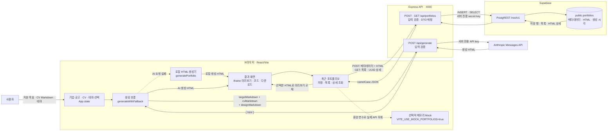
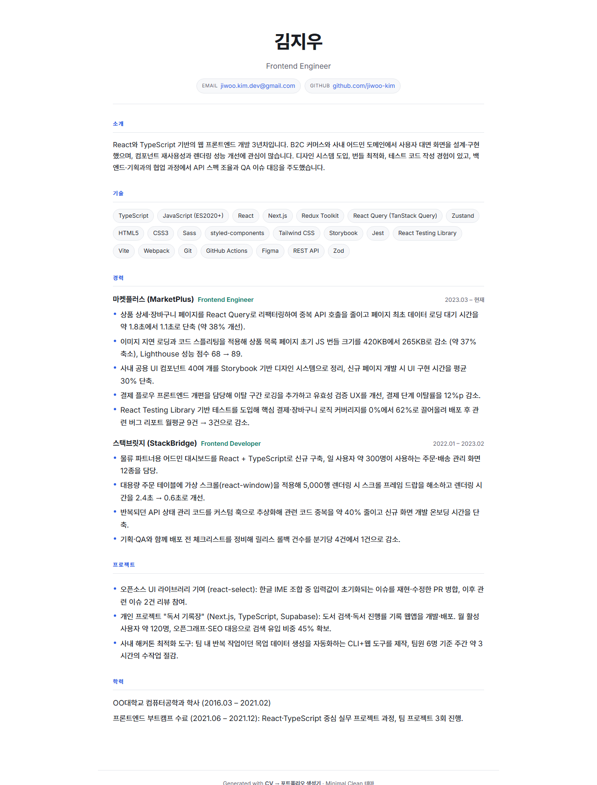
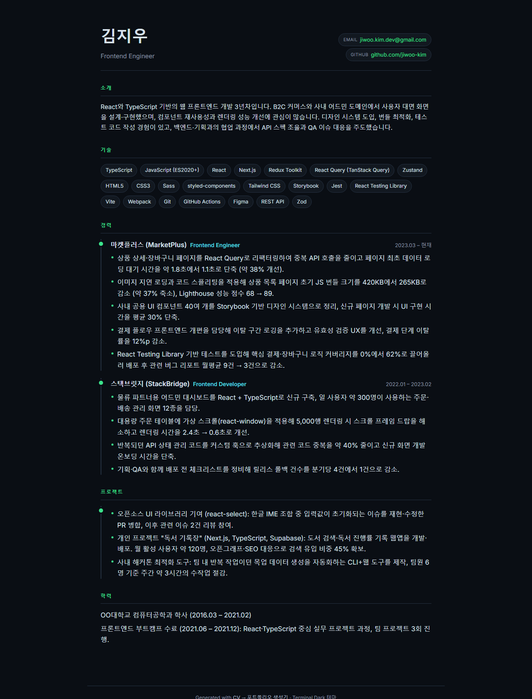
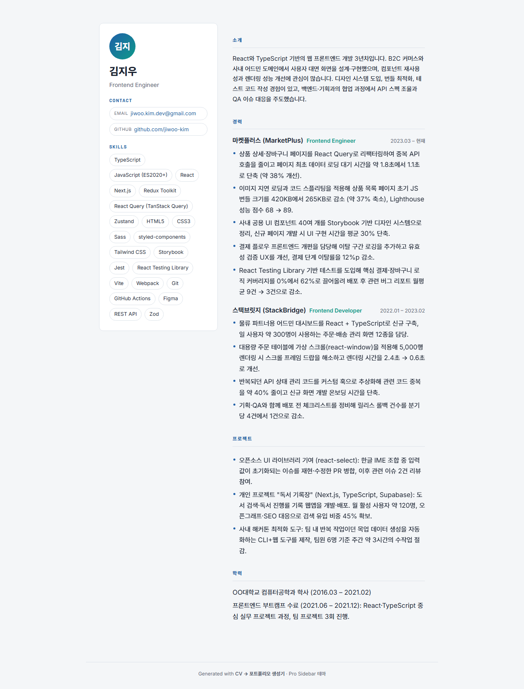
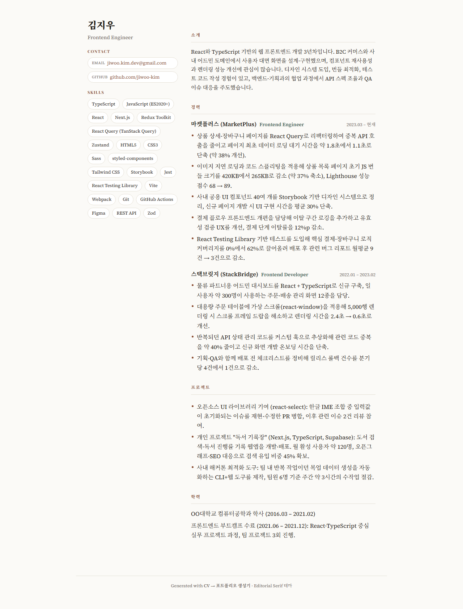
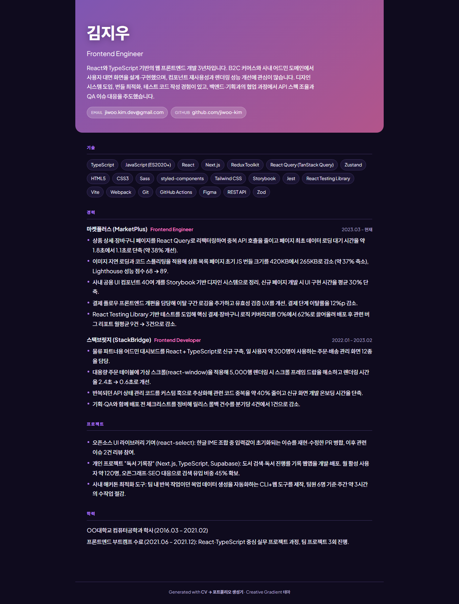
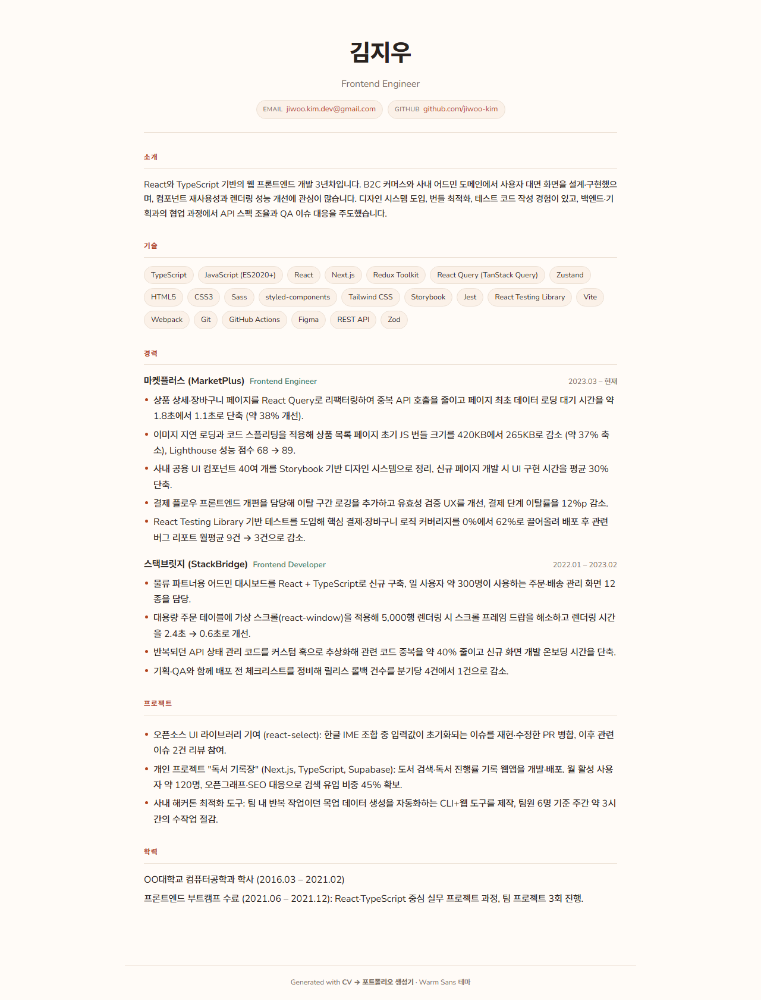

# CV → 포트폴리오 생성기 (CV2PF)

지원할 기업·채용 공고를 고르고 이력서(CV)와 원하는 **DESIGN.md** 테마를 입력하면,
기업 인재상과 JD에 맞춰 실제 경험의 강조 순서를 조정한
**독립 실행형 포트폴리오 HTML**을 만들어 주는 웹앱입니다.
프론트(React/Vite)와 백엔드(Express)를 **npm workspaces 모노레포**로 관리합니다.
완성한 결과는 Express API를 통해 Supabase에 저장하고 최근 기록에서 다시 불러올 수 있습니다.

## 아키텍처와 데이터 흐름



사용자는 React 화면에서 지원 기업·공고, CV와 디자인을 고릅니다. React는 Express에 생성을 요청하고,
Express만 보관하는 API 키로 Anthropic에서 HTML을 받아옵니다. AI 요청이 실패하면 브라우저의
로컬 생성기가 대신 HTML을 만듭니다. 저장 버튼을 누르면 Express가 결과와 메타데이터를
Supabase에 저장합니다. 목록에서는 가벼운 메타데이터만 받고, 항목을 열 때 UUID로 HTML을
조회해 미리보기를 바꿉니다.

자세한 코드 근거와 구조 점검 결과는 [데이터 흐름·아키텍처 설명 자료](docs/architecture-and-data-flow-2026-07-22.md)에 정리했습니다.

## 문서

- 🎯 [월요일 데모 핵심 흐름·완료 기준·실제 검증 결과](docs/monday-demo-core-flow-2026-07-27.md) · [Showcase](showcase/showcase.json)
- 🎤 [10분 발표 PPT](docs/CV2PF_기업_JD_맞춤_발표.pptx) · [슬라이드 설계서](docs/ten-minute-presentation-outline-2026-07-24.md) · [발표 대본과 예상 Q&A](docs/ten-minute-presentation-script-2026-07-24.md)
- 🏢 [기업·채용 공고 예시 5개와 선정 근거](docs/company-job-examples-2026-07-24.md)
- 🧪 [즐겨찾기 토글 TDD · Skill · 검증 Agent 기록](docs/tdd-favorite-2026-07-23.md)
- 🗺️ [데이터 흐름·아키텍처 설명 자료](docs/architecture-and-data-flow-2026-07-22.md)
- 🗓️ **[3주차 주간 계획](docs/WEEK3_PLAN.md)** · [GitHub Project 보드](https://github.com/users/dolphin1404/projects/2)
- 🗄️ [Supabase 서버 재시작 영속성 검증](docs/supabase-persistence-verification-2026-07-21.md)
- ⭐ [다음 기능 설계 — 저장 포트폴리오 즐겨찾기](docs/favorite-portfolio-design-2026-07-21.md)
- 🗓️ **[2주차 주간 계획](docs/WEEK2_PLAN.md)** · [GitHub Project 보드](https://github.com/users/dolphin1404/projects/2)
- ✅ [수직 슬라이스 기능 검증 결과](docs/vertical-slice-verification-2026-07-14.md)
- 🧩 [mock 화면 흐름·state/props·데이터 모델 설계](docs/mock-flow-and-data-model-2026-07-15.md)
- 🎬 [2주차 발표·실제 DB 데모·Task 마감](docs/week2-demo-and-review-2026-07-16.md)
- 🖥️ [2주차 발표용 HTML 슬라이드](docs/week2-demo-slides.html)
- 🎤 [2주차 HTML 발표 대본](docs/week2-demo-presentation-script.md)
- 🎨 [Canva 편집용 2주차 발표 PPTX](docs/CV2PF-week2-demo-canva-editable.pptx)
- 📄 **[기획서 (Wiki)](https://github.com/dolphin1404/NaverConnect_wm/wiki/기획서)** — 문제 정의 · 사용자 시나리오 · 화면 구조 · 핵심 기능 (스크린샷 포함 최신본)
- 📄 [기획서 (repo 사본)](docs/기획서.md)
- 🗂️ **[개발 백로그 — 4주 계획](docs/BACKLOG.md)** — Task · 우선순위(P0~P2) · 주차별 목표 · 2주차 Must-Finish
- 📊 [1주차 발표 자료](docs/CV2PF_발표.pptx)
- 🧭 [개발 컨텍스트 (CLAUDE.md)](CLAUDE.md) — 아키텍처 · 구조 · 라이브러리 · 컨벤션 · 커밋/PR 규칙
- 🎨 [디자인 명세 (DESIGN.md 6종)](client/designs) · [디자인 리뷰](docs/design-review-2026-07-09.md)
- 🖼️ [예시 결과 + 스크린샷](examples)

## 미리보기

샘플 개발자 CV(`client/samples/kim-jiwoo-frontend.md`)를 각 테마로 생성한 실제 결과입니다.
전체 HTML은 [`examples/`](examples) 폴더에서 열어볼 수 있습니다.

|                 Minimal Clean · 기본                 |                  Terminal Dark                   |
| :--------------------------------------------------: | :----------------------------------------------: |
|          |      |
|                   **Pro Sidebar**                    |               **Editorial Serif**                |
|              |  |
|                **Creative Gradient**                 |         **Warm Sans** (비개발 직군 친화)         |
|  |              |

## 사용자 흐름

```
① 기업·공고 선택  →  ② CV 업로드/붙여넣기  →  ③ DESIGN.md 테마 선택  →  ④ AI 생성  →  ⑤ 미리보기 & 다운로드
```

1. **기업·공고 선택** — 공식 공고 예시 5개에서 지원 목표를 고르고 인재상·JD·포트폴리오 강조점을 확인합니다.
2. **CV 업로드** — 마크다운 이력서를 붙여넣거나 `.md/.txt` 파일 업로드 (샘플 4종: 개발자·디자이너·마케터·기획자). 실시간으로 이름·직함·연락처·스킬·경력·프로젝트·학력으로 파싱됩니다.
3. **디자인 선택** — 6개 테마의 미리보기 카드에서 하나를 고르면 해당 `DESIGN.md` 원문이 표시됩니다.
4. **생성** — 지원 목표, CV, 디자인 명세를 Express에 보내 JD에 맞는 HTML 페이지를 생성합니다. CV에 없는 사실은 추가하지 않습니다.
5. **결과·저장** — iframe 미리보기, HTML 코드, 다운로드를 제공하고 Supabase에 저장한 결과를 다시 조회합니다.

## 실행

```bash
npm install            # 저장소 루트(cv-to-portfolio/)에서 워크스페이스 일괄 설치

npm run dev            # client(:5173) + server(:4000) 동시 실행
# 또는 개별로
npm run dev:client     # http://localhost:5173  (프로토타입은 이것만으로 완결)
npm run dev:server     # http://localhost:4000  (server/.env 에 ANTHROPIC_API_KEY 필요)
```

Supabase 없이 화면 흐름만 먼저 확인하려면 `client/.env`에
`VITE_USE_MOCK_PORTFOLIOS=true`를 설정합니다. 실제 저장은
[`server/README.md`](server/README.md)의 migration·환경 설정을 따릅니다.

> 프로토타입(결정적 렌더러)은 **클라이언트만으로 동작**합니다. 서버는 실서비스용 AI 생성
> 경로(`/api/generate`)로, 2주차에 본격 개발합니다.

## 프로젝트 구조

```
package.json                 # 워크스페이스 루트 (dev/build/lint 오케스트레이션)
CLAUDE.md                    # 개발 컨텍스트 (아키텍처·컨벤션·커밋 규칙)
client/                      # @cv2pf/client — React + Vite
├─ designs/                  # 사람이 읽는 디자인 명세 (DESIGN.md 6종)
├─ samples/                  # 샘플 CV 4종 (개발자·디자이너·마케터·기획자)
└─ src/
   ├─ App.jsx                # 5단계 흐름 오케스트레이터
   ├─ components/Stepper.jsx # 진행 표시기
   └─ features/              # jobTarget · cvUpload · designSelect · generate · result
server/                      # @cv2pf/server — Express API
└─ src/                      # index·app / config·routes·controllers·services·middlewares
```

## 디자인 테마 6종

| 테마                     | 결                                  | 레이아웃               |
| ------------------------ | ----------------------------------- | ---------------------- |
| **Minimal Clean** ⭐기본 | 여백 중심 미니멀, 채용담당자 친화   | single-column          |
| Terminal Dark            | 모노스페이스·고대비 다크            | timeline               |
| Creative Gradient        | 그라디언트 배너, 컬러풀             | single-column (banner) |
| Editorial Serif          | 매거진 세리프, 에디토리얼           | two-column             |
| Pro Sidebar              | 좌측 프로필 사이드바                | sidebar                |
| Warm Sans                | 따뜻한 아이보리·산세리프, 직군 무관 | single-column          |

> 기본 테마(minimal-clean)는 큐레이션 결과 본문 대비(약 15.8:1)가 가장 높고 범용적이라 선정.

## "AI 생성"에 대하여 (프로토타입 vs 실서비스)

- **프로토타입**: `generatePortfolio()`가 CV + 디자인 토큰으로 HTML을 **렌더링**합니다. 백엔드·API 키 없이 브라우저만으로 동작합니다.
- **실서비스(seam)**: 자유도 높은 결과를 원하면 이 함수를 `generateWithAI.js`의 **Claude API 호출**로 교체합니다. CV 원문 + 선택한 `DESIGN.md`를 그대로 LLM에 넘겨 HTML을 생성합니다.

## 한계 / TODO

- PDF·DOCX 업로드는 미지원(현재는 마크다운/텍스트). 실서비스에선 파싱 단계에 문서 변환기 추가 필요.
- 파서는 흔한 마크다운 구조를 관대하게? 휴리스틱하게 처리하는 수준.
- 실제 LLM 생성 경로(`generateWithAI.js`)는 seam만 있고 호출되지 않음 → 백엔드 붙이면 활성화.
