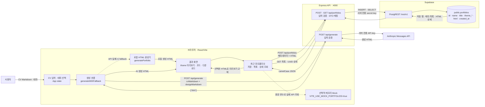

# CV2PF 데이터 흐름과 아키텍처

작성일: 2026-07-22

## 시각화 도구 선택

README 안에서 바로 확인할 수 있고, 코드처럼 변경 이력을 검토할 수 있는 **Mermaid**를
선택했다. 현재 구조는 화면·서버·외부 API·DB 사이의 정적인 연결과 요청 방향을 보여주는
것이 핵심이므로 별도의 이미지 편집 도구보다 flowchart가 적합하다.

- [GitHub 공식 문서 — Markdown에서 Mermaid 다이어그램 만들기](https://docs.github.com/en/get-started/writing-on-github/working-with-advanced-formatting/creating-diagrams)
- [Mermaid 공식 문서 — Flowchart 문법](https://mermaid.js.org/syntax/flowchart.html)

## 전체 구조

실선은 실제 서비스 경로이고, 점선은 실패 또는 개발 환경에서 선택되는 대체 경로다.
Vite 개발 서버는 브라우저의 `/api` 요청을 Express의 `:4000`으로 프록시한다.

## 내 말로 설명하기

사용자가 React 화면에서 CV를 입력하고 디자인을 고르면 브라우저가 두 Markdown을 Express의
생성 API로 보낸다. Express만 Anthropic API 키를 가지고 외부 AI에 요청하고, 생성된 HTML을
React에 돌려준다. AI 요청이 실패하면 브라우저의 로컬 생성기가 HTML을 대신 만든다. 결과는
iframe에서 확인하고 파일로 내려받을 수 있다.

사용자가 저장 버튼을 누르면 React가 이름, 직함, 테마 정보와 HTML을 Express에 보낸다.
Express는 값을 검증한 뒤 서버 전용 Supabase 키로 `portfolios` 테이블에 `INSERT`한다.
최근 목록은 HTML을 제외한 메타데이터만 `SELECT`해서 가볍게 가져오고, 사용자가 한 항목을
열 때만 UUID로 HTML까지 상세 조회해 현재 미리보기를 교체한다. 그래서 서버를 재시작해도
Supabase에 저장된 결과는 유지된다.

## 코드에서 확인한 근거

| 영역 | 코드 | 역할 |
| --- | --- | --- |
| 화면 상태·단계 전환 | `client/src/App.jsx` | CV, 테마, 생성 결과와 현재 단계를 관리 |
| AI 요청·fallback | `client/src/features/generate/generateApi.js`, `generateWithFallback.js` | Express 생성 요청, 실패 시 로컬 생성 |
| 결과 표시 | `client/src/features/result/ResultView.jsx` | iframe 미리보기, 다운로드, 저장 기록 연결 |
| 저장·조회 UI | `client/src/features/portfolio/PortfolioLibrary.jsx` | 저장, 목록 로드, 상세 선택 후 화면 갱신 |
| API 또는 Mock 선택 | `client/src/features/portfolio/portfolioApi.js` | `/api/portfolios` 요청 또는 메모리 Mock 사용 |
| 개발 프록시 | `client/vite.config.js` | `/api` 요청을 Express로 전달 |
| Express 진입점 | `server/src/app.js`, `server/src/routes/index.js` | CORS·JSON 처리와 API 라우팅 |
| 요청 검증 | `server/src/controllers/*.controller.js` | 입력값 검증과 HTTP 응답 구성 |
| 외부 서비스 연결 | `server/src/services/anthropic.service.js`, `portfolios.service.js` | Anthropic 호출과 Supabase REST 쿼리 |
| DB 스키마·권한 | `supabase/migrations/202607140001_create_portfolios.sql` | 테이블, 인덱스, RLS와 service role 권한 정의 |

## 설명하며 발견한 점

| 우선순위 | 발견한 점 | 다음 작업 |
| --- | --- | --- |
| P0 | AI 또는 DB에서 받은 HTML을 `iframe srcDoc`에 표시하지만 `sandbox`가 없다. 스크립트가 포함되면 앱과 같은 origin의 권한으로 실행될 가능성이 있다. | iframe sandbox 정책을 정하고, 필요한 기능만 허용한 뒤 생성 HTML 검증 테스트를 추가한다. |
| P1 | 인증과 소유권이 없고 Express가 server secret으로 전체 행을 읽고 쓴다. 현재 단일 사용자 데모에는 맞지만 다중 사용자 구조는 아니다. | 사용자 기능을 시작하기 전에 `user_id`, Supabase Auth/JWT, 사용자 단위 RLS를 설계한다. |
| P1 | `VITE_USE_MOCK_PORTFOLIOS=true`이면 Express와 Supabase를 완전히 우회한다. | 데모 전 값을 `false`로 확인하고 실제 저장·서버 재시작·재조회 체크리스트를 실행한다. |
| P1 | AI 실패가 로컬 fallback으로 이어져 기능은 계속되지만 실패 원인을 운영 관점에서 추적하기 어렵다. | 화면의 생성 출처 표시를 유지하고 서버 로그·실패 메트릭을 설계한다. |
| P2 | 사용되지 않는 `generateWithAI.js`가 브라우저 직접 호출용 seam으로 남아 현재 서버 경로와 혼동된다. | 참조 여부를 다시 확인한 뒤 삭제하거나 폐기된 실험 코드임을 명시한다. |
| P2 | 저장 데이터에 원본 CV, 디자인 버전, 생성 source/model이 없어 결과 재현이 어렵다. | 재현성이 필요해지는 시점에 생성 이력 컬럼 또는 별도 테이블을 설계한다. |
| P2 | 개발 환경은 Vite proxy를 사용하지만 운영 배포의 웹 호스팅·API base·CORS 구성이 정해지지 않았다. | 배포 전에 운영 요청 경로와 환경 변수 구성을 문서화한다. |

현재 가장 먼저 반영할 작업은 **iframe 격리**다. 목록에서 HTML을 제외하고 상세 조회 때만
가져오는 구조와, Supabase secret이 브라우저에 노출되지 않는 구조는 그대로 유지한다.

## 그룹 세션 1분 설명 순서

1. 왼쪽의 React에서 사용자가 CV와 디자인을 입력한다고 설명한다.
2. 위쪽 생성 경로를 따라 Express와 Anthropic을 왕복하고, 실패 시 점선 fallback을 설명한다.
3. 아래쪽 저장 경로를 따라 Express와 Supabase의 `INSERT`·`SELECT`를 설명한다.
4. 목록은 메타데이터만, 상세는 HTML까지 조회하는 이유를 설명한다.
5. 점검 중 발견한 iframe 격리 문제와 다음 P0 작업을 마무리로 말한다.
