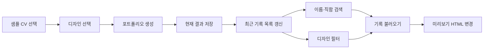
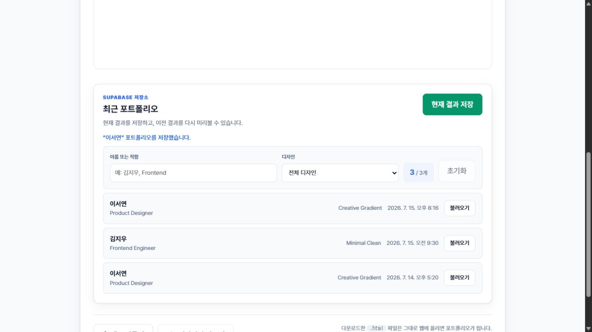

# 화면 흐름(mock)과 데이터 모델 설계

> 작성일: 2026-07-15
>
> 목표: 같은 컴포넌트·state 패턴을 반복하고, mock으로 전체 화면 흐름을 확인한 뒤 Supabase 한 테이블의 저장 구조를 설명한다.

## 1. 오늘 완성한 mock 화면 흐름

mock 모드에서는 `createMockPortfolioApi()`가 실제 API와 같은 `save`, `list`, `get`
인터페이스를 제공한다. 따라서 Express와 Supabase가 없어도 다음 상태를 확인할 수 있다.

- 최초 목록 로딩과 초기 mock 기록 2개
- 현재 생성 결과 저장과 목록 즉시 갱신
- 이름·직함 검색, 디자인 필터, 필터 초기화
- 검색 결과 없음 안내
- 기록 상세 불러오기와 미리보기 변경
- 저장·조회 오류 메시지 영역

브라우저에서 샘플 CV 선택 → 디자인 선택 → 생성 → `이서연` 검색 → 기록 불러오기 →
필터 초기화 → `Minimal Clean` 선택 → 현재 결과 저장 순서로 클릭했다. 미리보기 이름과 테마가
`이서연`·`Creative Gradient`로 바뀌고, 저장 후 목록 개수가 2개에서 3개로 갱신되는 것을
확인했다.

## 2. state와 props 차이

### state

컴포넌트 안에서 바뀌며 화면을 다시 그리게 하는 값이다. `PortfolioLibrary`가 아래 state의
주인이다.

| state | 역할 | 바뀌는 시점 |
| --- | --- | --- |
| `portfolios` | 저장 기록 원본 목록 | 최초 조회, 새 결과 저장 |
| `loading` | 최초 목록 로딩 여부 | 목록 요청 시작·종료 |
| `action` | 저장 중 또는 불러오는 기록 ID | 버튼 동작 시작·종료 |
| `message` | 성공·실패 안내 | API 결과 수신 |
| `query` | 이름·직함 검색어 | 검색 입력 변경 |
| `themeSlug` | 선택한 디자인 필터 | select 변경 |

### props

부모가 자식에게 전달하는 읽기 전용 입력이다. `PortfolioFilters`는 state를 직접 소유하지
않고 아래 props를 받아 표시하거나 이벤트를 부모에게 전달한다.

| props | 부모가 전달하는 값 또는 함수 |
| --- | --- |
| `query`, `themeSlug` | 현재 필터 state 값 |
| `themes` | 목록에서 계산한 디자인 선택지 |
| `totalCount`, `resultCount` | 전체·필터 결과 개수 |
| `onQueryChange` | 검색어를 부모 state에 반영하는 함수 |
| `onThemeChange` | 디자인을 부모 state에 반영하는 함수 |
| `onReset` | 두 필터 state를 초기화하는 함수 |

정리하면 **state는 값의 주인**, **props는 부모와 자식 사이의 전달 통로**다. 자식에서 입력이
발생하면 callback props를 호출하고, 부모의 state가 바뀌면 새 props가 내려와 화면이 갱신된다.

## 3. 데이터 모델 범위

이번 주 요구사항은 인증·협업·버전 관리가 아니라 **생성 결과 한 건을 저장하고 다시 조회하는
수직 슬라이스**다. 따라서 MVP는 `portfolios` 한 테이블만 사용한다.

### `public.portfolios`

| 컬럼 | PostgreSQL 타입 | 필수 | 저장 내용 | 제약·이유 |
| --- | --- | :---: | --- | --- |
| `id` | `uuid` | O | 포트폴리오 식별자 | PK, `gen_random_uuid()` |
| `name` | `text` | O | CV의 이름 | 1~120자 |
| `title` | `text` | O | CV의 직함 | 기본값 `''`, 최대 160자 |
| `theme_slug` | `text` | O | 코드에서 사용하는 디자인 키 | 1~80자 |
| `theme_name` | `text` | O | 화면에 표시하는 디자인명 | 1~120자 |
| `html` | `text` | O | 다시 미리볼 완성 HTML | 1~300,000자 |
| `created_at` | `timestamptz` | O | 저장 시각 | 기본값 `now()`, 최신순 정렬 |

최신 기록 조회가 가장 자주 일어나므로 `created_at desc` 인덱스를 둔다. 브라우저는 Supabase에
직접 접근하지 않고 Express만 호출하며, `anon`과 `authenticated` 역할은 테이블에 직접 접근할
수 없게 한다.

스키마의 실행 가능한 원본은
[`supabase/migrations/202607140001_create_portfolios.sql`](../supabase/migrations/202607140001_create_portfolios.sql)이다.

## 4. FE · API · DB 필드 매핑

| React/API JSON | DB 컬럼 | 목록 응답 | 상세 응답 |
| --- | --- | :---: | :---: |
| `id` | `id` | O | O |
| `name` | `name` | O | O |
| `title` | `title` | O | O |
| `themeSlug` | `theme_slug` | O | O |
| `themeName` | `theme_name` | O | O |
| `html` | `html` | X | O |
| `createdAt` | `created_at` | O | O |

목록에서 큰 `html`을 제외해 응답 크기를 줄이고, 사용자가 `불러오기`를 누른 기록만 상세
API로 조회한다.

## 5. 내일 Supabase 점검 체크리스트

- [ ] migration을 새 프로젝트에서도 실행할 수 있는지 확인한다.
- [ ] `portfolios_created_at_idx`가 생성됐는지 확인한다.
- [ ] RLS가 켜져 있고 `anon`, `authenticated` 직접 권한이 없는지 확인한다.
- [ ] Express 환경변수에 `SUPABASE_URL`, `SUPABASE_SECRET_KEY`를 설정한다.
- [ ] 고유한 이름으로 저장한 뒤 반환 ID로 상세 조회한다.
- [ ] 목록 응답에는 `html`이 없고 상세 응답에는 있는지 확인한다.
- [ ] 실제 secret key가 Git이나 브라우저 번들에 포함되지 않았는지 확인한다.

## 6. 범위 밖 확장

로그인을 추가할 때는 `user_id`, 원본 CV 재사용이 필요할 때는 `cv_documents`, 생성 이력을 여러
버전으로 보존할 때는 `portfolio_versions`를 검토한다. 현재 핵심 시나리오에는 필요하지 않으므로
이번 데이터 모델에는 넣지 않는다.

## 7. `cv2pf-design` 검토 결과

| 점검 항목 | 증거 | 판정 |
| --- | --- | :---: |
| 색상 역할 | 필터 강조는 Corporate Blue, 저장 버튼만 Success Green | PASS |
| 컴포넌트 규격 | 입력·select·버튼 8px, 카드 12px 반경 토큰 사용 | PASS |
| 상태 전달 | 검색 결과 개수는 숫자와 텍스트로, 성공·실패는 `role="status"`로 표시 | PASS |
| 키보드 접근성 | label 연결, focus outline, native search·select 사용 | PASS |
| 반응형 | 375px에서 필터 4개 요소가 각각 다른 행에 1열 배치 | PASS |
